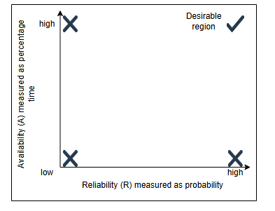

**Надежность(Reliability)**

Узнайте о надежности, способах ее измерения и ее важности.

**Что такое надежность?**

Надежность — это вероятность того, что сервис будет выполнять свои функции в течение определенного времени. Она измеряет, как сервис
работает в различных условиях эксплуатации.

Для измерения надежности мы часто используем такие метрики, как среднее время наработки на отказ (MTBF) и среднее время до восстановления (
MTTR).

MTBF = (Общее время работы − Суммарное время простоя) / Общее количество отказов

MTTR = (Общее время на восстановление) / Общее количество восстановлений

(Мы стремимся к более высокому значению MTBF и более низкому значению MTTR.)

Надежность и доступность часто путают, но они измеряют разные аспекты производительности системы. В то время как надежность фокусируется на
том, насколько стабильно сервис работает без сбоев, доступность учитывает, как часто он доступен, когда это необходимо. Понимание обоих
понятий крайне важно, поскольку даже очень надежная система может иметь низкую доступность, если время простоя или ремонт занимают слишком
много времени. Давайте рассмотрим, как эти два понятия взаимосвязаны:

**Надежность и доступность**

Надежность и доступность — две важные метрики для измерения соответствия сервиса согласованным целям уровня обслуживания (SLO).

Измерение доступности определяется потерей времени, в то время как измерение надежности определяется частотой и влиянием сбоев. Доступность
и надежность важны, поскольку они позволяют заинтересованным сторонам оценивать «здоровье» сервиса.

Надежность (R) и доступность (A) — это два разных, но взаимосвязанных понятия. Математически A является функцией от R. Это означает, что
значение R может изменяться независимо, а значение A зависит от R. Поэтому возможны следующие ситуации:

* низкая A, низкая R
* низкая A, высокая R
* высокая A, низкая R
* высокая A, высокая R (желательный вариант)

**Доступность как функция надежности**

Примечание: Существует много вариаций метрики MTBF, например, среднее время до отказа (MTTF). Обычно MTTF используется вместо MTBF в тех
случаях, когда вышедший из строя компонент заменяется из-за невозможности ремонта. Неисправный диск или перегоревшая лампочка — примеры
неисправимых поломок, требующих замены.

 **В чем разница между надежностью и доступностью?**

   Надежность(Reliability) измеряет, насколько хорошо система выполняет свои предполагаемые операции (функциональные требования). Для этого мы используем
   средние значения (среднее время до отказа, среднее время до восстановления и т. д.).

   Доступность(Availability) измеряет процент времени, в течение которого система принимает запросы и отвечает клиентам.

   **Пример 1:** Некоторая система может быть доступна 90% времени, но при этом быть надежной только в 80% случаев.

   **Пример 2:** Предположим, что под «системой» мы понимаем все, что находится внутри дата-центра (аппаратное и программное обеспечение).
   Допустим, в этом дата-центре произошел сбой сети, в результате которого ни входящий, ни исходящий трафик не проходит. В этом случае
   мгновенная доступность может быть равна нулю (поскольку клиенты не могут получить доступ к сервису), даже если внутри дата-центра все
   системы прекрасно функционируют (мгновенная надежность 100%).

   Мы используем оба показателя (надежность и доступность) в разных контекстах. Например, производители систем хранения данных часто
   указывают MTTF для своих дисков. Большинство онлайн-сервисов используют время безотказной работы (как меру доступности) в своих
   соглашениях об уровне обслуживания (SLA). Например, время безотказной работы виртуальных машин EC2 составляет 99,95%.