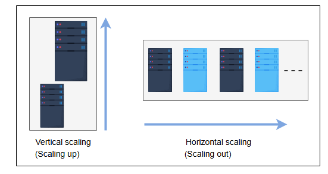

**Масштабируемость(Scaleability)**

Узнайте о масштабируемости и ее важности при проектировании систем.

**Что такое масштабируемость?**

Масштабируемость — это способность системы справляться с растущей нагрузкой без снижения производительности. Поисковая система, например,
должна справляться как с растущим числом пользователей, так и с увеличением объема индексируемых ею данных.

Нагрузка может быть разных типов, включая следующие:

* **Нагрузка по запросам:** Это количество запросов, обслуживаемых системой.
* **Нагрузка на данные/хранилище:** Это объем данных, хранимых системой.

**Измерения (аспекты) масштабируемости**

Вот различные аспекты масштабируемости:

* **Масштабируемость по размеру:** Система считается масштабируемой по размеру, если мы можем просто добавлять в нее дополнительных
  пользователей и ресурсы.
* **Административная масштабируемость:** Это способность растущего числа организаций или пользователей с легкостью совместно использовать
  единую распределенную систему.
* **Географическая масштабируемость:** Относится к тому, насколько легко программа может обслуживать другие регионы, сохраняя при этом
  приемлемую производительность. Другими словами, система может без труда обслуживать как обширный географический регион, так и небольшой.

**Различные подходы к масштабируемости**

Вот различные способы реализации масштабируемости.

**Вертикальная масштабируемость (scaling up, увеличение мощности)**

Вертикальное масштабирование, также известное как «scaling up», означает масштабирование путем добавления дополнительных мощностей (
например, процессоров или оперативной памяти) к существующему устройству. Вертикальное масштабирование позволяет нам расширить текущую
емкость аппаратного или программного обеспечения, но мы можем наращивать ее только до пределов нашего сервера. Стоимость вертикального
масштабирования обычно высока, поскольку для увеличения мощности могут потребоваться специализированные (и дорогие) компоненты.

**Горизонтальная масштабируемость (scaling out, расширение вширь)**

Горизонтальное масштабирование, также известное как «scaling out», означает увеличение количества машин в сети. Для этой цели мы используем
стандартные, общедоступные узлы (commodity nodes) из-за их привлекательной стоимости. Сложность здесь в том, что нам необходимо построить
систему таким образом, чтобы множество узлов могли работать сообща, как если бы у нас был один огромный сервер.

