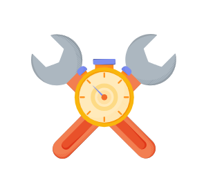

**Сопровождаемость (Maintainability)**

Узнайте о сопровождаемости, способах ее измерения и ее связи с надежностью.

**Что такое сопровождаемость?**

Помимо создания системы, одной из основных последующих задач является поддержание ее в рабочем состоянии путем поиска и исправления ошибок,
добавления новых функций, обновления платформы системы и обеспечения бесперебойной работы. Одной из ключевых характеристик, определяющих
такие требования к качественному проектированию системы, является сопровождаемость. Понятие сопровождаемости можно разделить на три основных
аспекта:

* **Operability (простота эксплуатации):** Это простота, с которой мы можем обеспечить бесперебойную работу системы в штатном режиме и
  восстановить нормальные условия при сбое.
* **Ясность (Lucidity):** Это относится к простоте кода. Чем проще кодовая база, тем легче ее понимать и сопровождать, и наоборот.
* **Модифицируемость:** Это способность системы без затруднений интегрировать измененные, новые и непредвиденные функции.

**Измерение сопровождаемости**

Сопровождаемость (M) — это вероятность того, что сервис восстановит свои функции в течение определенного времени после возникновения сбоя. M
измеряет, насколько легко и быстро сервис возвращается к нормальным условиям работы.

Например, если для компонента определена сопровождаемость 95% в течение получаса, это означает, что вероятность восстановления компонента до
полностью рабочего состояния за полчаса составляет 0,95.

**Примечание:** Сопровождаемость дает нам представление о способности системы подвергаться ремонту и модификациям во время ее эксплуатации.

Для измерения M мы используем метрику MTTR (среднее время до восстановления).

MTTR = (Общее время на восстановление) / (Общее количество восстановлений)

Другими словами, MTTR — это среднее количество времени, необходимое для ремонта и восстановления вышедшего из строя компонента. Наша цель —
иметь как можно более низкое значение MTTR.

**Сопровождаемость и надежность**

Сопровождаемость можно более четко определить в тесной связи с надежностью. Единственное различие между ними — это рассматриваемый параметр.
Сопровождаемость (Maintainability) относится ко времени до восстановления(time-to-repair), в то время как надежность (reliability) относится как ко времени до восстановления (time-to-repair), так и ко
времени до отказа(time-to-failure). Сочетание анализа сопровождаемости и надежности может помочь нам получить полное представление о доступности, времени
простоя и времени безотказной работы.