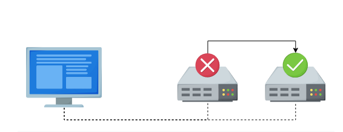
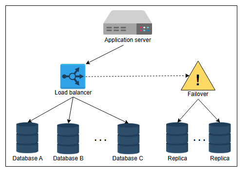
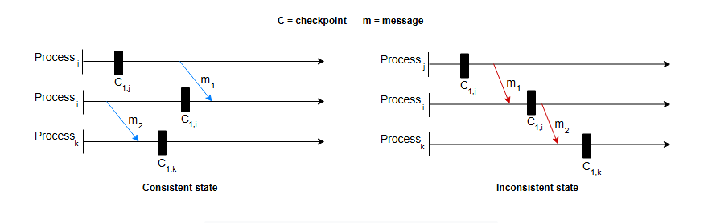

**Отказоустойчивость (Fault Tolerance)**

Узнайте об отказоустойчивости, способах ее измерения и ее важности.

**Что такое отказоустойчивость?**

В реальном мире крупномасштабные приложения используют сотни серверов и баз данных для обработки миллиардов запросов пользователей и
хранения значительных объемов данных. Этим приложениям необходим механизм, который обеспечивает безопасность данных и позволяет избежать
пересчета ресурсоемких задач за счет устранения единой точки отказа.

Отказоустойчивость — это способность системы продолжать работать без сбоев, даже если один или несколько ее компонентов выходят из строя.
Здесь под компонентами могут пониматься как программные, так и аппаратные средства. Создать систему, которая была бы на сто процентов
отказоустойчивой, на практике очень сложно.

**Отказоустойчивость в действии: когда один сервер выходит из строя, другой плавно берет на себя его функции**

Два ключевых качества делают отказоустойчивость необходимой: доступность(availability) и надежность(reliability). Доступность гарантирует,
что система остается доступной и может принимать запросы клиентов в любое время. Надежность, в свою очередь, гарантирует, что система
стабильно обрабатывает эти запросы и каждый раз выполняет правильные действия.

Понимая это, давайте теперь рассмотрим некоторые распространенные методы, используемые для достижения отказоустойчивости.

**Методы обеспечения отказоустойчивости**

Сбои происходят на аппаратном или программном уровне, что в конечном итоге влияет на данные. Отказоустойчивости можно достичь различными
способами, учитывая структуру системы. Давайте обсудим методы, которые являются значимыми и подходят для большинства архитектур.

**Репликация**

Один из наиболее широко используемых методов — это отказоустойчивость на основе репликации. С помощью этого метода мы можем реплицировать
как сервисы, так и данные. Мы можем заменять вышедшие из строя узлы работоспособными, а отказавшее хранилище данных — его репликой. Крупный
сервис может произвести переключение прозрачно для конечных пользователей, не влияя на них.

Мы создаем несколько копий наших данных в отдельных хранилищах. Все копии должны регулярно обновляться для обеспечения согласованности (Sconsistency) при любом обновлении данных. Обновление данных в репликах — сложная задача. Когда системе требуется строгая
согласованность, мы можем синхронно обновлять данные в репликах. Однако это снижает доступность системы. Мы также можем асинхронно обновлять
данные в репликах, если нас устраивает согласованность в конечном счете (eventual consistency), что приводит к чтению устаревших данных до
тех пор, пока все реплики не сойдутся. Таким образом, существует компромисс между этими двумя подходами к согласованности. При сбоях мы
жертвуем либо доступностью, либо согласованностью — реальность, которая описана в CAP-теореме.

**Сохранение контрольных точек (Checkpointing)**

Сохранение контрольных точек (checkpointing) — это метод, при котором состояние системы сохраняется в стабильном хранилище для последующего
восстановления в случае сбоев или нарушений в работе сервиса. Создание контрольных точек — это метод отказоустойчивости, выполняемый в
несколько этапов через разные промежутки времени. Когда распределенная система выходит из строя, мы можем получить последние вычисленные
данные из предыдущей контрольной точки и продолжить работу с этого момента.

Сохранение контрольных точек выполняется для различных отдельных процессов в системе таким образом, чтобы они представляли собой глобальное
состояние фактического выполнения системы. В зависимости от состояния, мы можем разделить этот процесс на два типа:

* **Согласованное состояние:** Состояние является согласованным, если все отдельные процессы системы имеют непротиворечивое представление об
  общем состоянии или о последовательности событий, произошедших в системе. Снимки, сделанные в согласованных состояниях, содержат данные в
  целостном состоянии, представляя собой возможную ситуацию в системе. Чтобы контрольная точка была согласованной, обычно выполняются
  следующие критерии:
    * Все обновления данных, завершенные до создания контрольной точки, сохраняются. Любые обновления данных, находившиеся в процессе
      выполнения, откатываются так, как будто они не начинались.
    * Контрольные точки включают все сообщения, которые были отправлены или получены до момента их создания. Никакие сообщения не находятся
      в процессе передачи (in-flight), чтобы избежать случаев их потери.
    * Взаимосвязи и зависимости между компонентами системы и их состояниями соответствуют тому, что ожидается при нормальной работе.

* **Несогласованное состояние:** Это состояние, в котором существуют расхождения в сохраненном состоянии различных процессов системы.
  Другими словами, контрольные точки разных процессов не являются целостными и скоординированными.

Давайте рассмотрим пример, чтобы лучше понять согласованные и несогласованные состояния. Представим три процесса, обозначенные как `i`, `j`
и `k`. Между процессами происходит обмен двумя сообщениями, `m1` и `m2`. Кроме того, для каждого процесса сохраняется один
снимок/контрольная точка, обозначенные как `C1,i`, `C1,j` и `C1,k`, где 1 — это номер снимка для процесса, а строчная буква — сам процесс.

На иллюстрации слева первые контрольные точки в процессах `j` и `i` являются согласованными, поскольку сообщение `m1` отправляется и
принимается *после* создания этих точек. Напротив, на иллюстрации справа первая контрольная точка в процессе `j` ничего не знает о
сообщении `m1`, в то время как первая контрольная точка в процессе `i` зафиксировала получение сообщения `m1`. Следовательно, это
несогласованное состояние.

Иллюстрация слева также представляет согласованное состояние, поскольку в момент создания контрольных точек между процессами не происходит
обмена данными. Справа мы видим, что процессы обмениваются сообщениями, когда система создает контрольные точки.