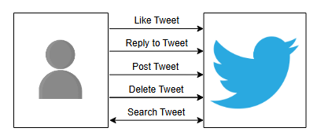
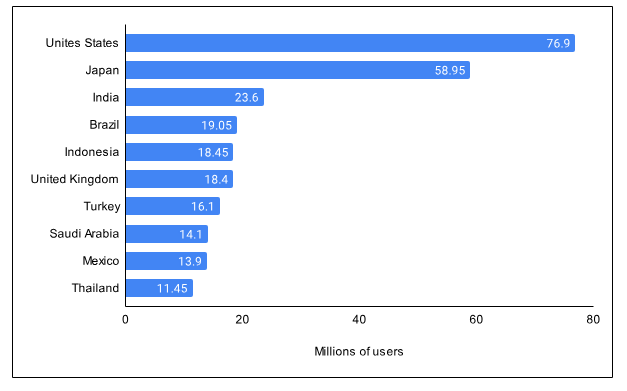

# Проектирование систем: Twitter

Получите общее представление о Twitter и краткое описание того, что мы изучим в этой главе.

## Twitter

Twitter — это бесплатная социальная сеть для микроблогов, где зарегистрированные пользователи публикуют сообщения, называемые «твитами». Пользователи также могут ставить лайки, отвечать на публичные твиты и ретвитить их. По состоянию на 2021 год у Twitter около 397 миллионов пользователей, и это число быстро растет со временем. Одной из главных причин его популярности является широкое распространение последних новостей на платформе. Другая важная причина заключается в том, что Twitter позволяет нам общаться с людьми из разных сообществ и культур и учиться у них.

На иллюстрации ниже показана база пользователей Twitter по странам на январь 2022 года (источник: Statista), где лидируют США. Такая статистика важна при проектировании нашей инфраструктуры, поскольку она позволяет нам выделять больше мощностей для пользователей определенного региона и обслуживать трафик из мест, близких к конкретным пользователям.

## Как мы будем проектировать Twitter?

Мы разделим проектирование Twitter на четыре раздела:

1.  **Требования**: В этом уроке описываются функциональные и нефункциональные требования Twitter. Мы также оценим различные аспекты Twitter, такие как хранилище, пропускная способность и вычислительные ресурсы.
2.  **Проектирование**: В этом уроке мы обсудим высокоуровневое проектирование Twitter. Мы также кратко объясним дизайн API и определим значимые компоненты архитектуры Twitter. Кроме того, мы обсудим, как решать проблему Top-k, например, для твитов, которые лайкнули или просмотрели миллионы пользователей в Twitter.
3.  **Балансировщики нагрузки на стороне клиента**: В этом уроке обсуждается, как Twitter выполняет балансировку нагрузки для своей системы микросервисов, чтобы управлять миллиардами запросов между экземплярами различных сервисов. Кроме того, мы также рассмотрим, почему Twitter использует кастомизированную технику балансировки нагрузки вместо других широко используемых подходов.
4.  **Викторина**: Наконец, мы закрепим основные концепции проектирования Twitter с помощью викторины.

Давайте начнем с определения требований Twitter.
