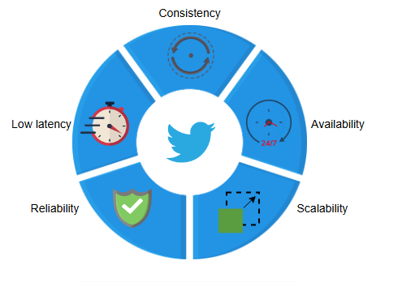
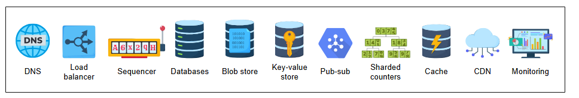

# Требования к дизайну Twitter

Поймите требования и оценку для дизайна Twitter.

## Требования

Давайте рассмотрим функциональные и нефункциональные требования ниже:

### Функциональные требования

Ниже приведены функциональные требования Twitter:

* **Публикация твитов**: Зарегистрированные пользователи могут публиковать один или несколько твитов в Twitter.
* **Удаление твитов**: Зарегистрированные пользователи могут удалять один или несколько своих твитов в Twitter.
* **Лайк или дизлайк твитов**: Зарегистрированные пользователи могут ставить лайки и дизлайки публичным и своим собственным твитам в
  Twitter.
* **Ответ на твиты**: Зарегистрированные пользователи могут отвечать на публичные твиты в Twitter.
* **Поиск твитов**: Зарегистрированные пользователи могут искать твиты, вводя ключевые слова, хэштеги или имена пользователей в строке
  поиска в Twitter.
* **Просмотр ленты пользователя или домашней ленты**: Зарегистрированные пользователи могут просматривать свою ленту, которая содержит их
  собственные твиты. Они также могут просматривать домашнюю ленту, которая содержит твиты тех, на кого они подписаны.
* **Подписка или отписка от аккаунта**: Зарегистрированные пользователи могут подписываться или отписываться от других пользователей в
  Twitter.
* **Ретвит твита**: Зарегистрированные пользователи могут ретвитить публичные твиты других пользователей в Twitter.

### Нефункциональные требования

* **Доступность (Availability)**: Многие люди и организации используют Twitter для передачи срочной информации (например, сообщения о сбоях
  в работе сервисов). Поэтому наш сервис должен быть высокодоступным и иметь высокий процент времени безотказной работы.
* **Задержка (Latency)**: Задержка для отображения последних топовых твитов в домашней ленте может быть немного выше. Однако сервисы,
  работающие почти в реальном времени, такие как распространение твитов подписчикам, должны иметь низкую задержку.
* **Масштабируемость (Scalability)**: Нагрузка на Twitter в основном связана с чтением, где у нас много читателей и относительно мало
  писателей, что в конечном итоге требует масштабируемости вычислительных ресурсов. По некоторым оценкам, соотношение записи к чтению в
  Twitter составляет 1:1000. Хотя твит ограничен 280 символами, а видеоклип по умолчанию — 140 секундами, нам необходима большая емкость
  хранилища для хранения и доставки твитов, опубликованных известными личностями, их миллионам подписчиков.
* **Надежность (Reliability)**: Все твиты остаются в Twitter. Это означает, что Twitter никогда не удаляет свой контент. Поэтому должна быть
  надежная стратегия для предотвращения потери или повреждения загруженного контента.
* **Согласованность (Consistency)**: Существует вероятность, что пользователь на восточном побережье США не получит немедленного обновления
  статуса (лайк, ответ и т.д.) твита, который был лайкнут или ретвитнут пользователем на западном побережье США. Однако пользователю на
  западном побережье необходимо немедленное обновление статуса его лайка или ответа. Необходима эффективная методика для предоставления
  быстрой обратной связи пользователю (который лайкнул чей-то пост), затем другим указанным пользователям в том же регионе и, наконец, всем
  пользователям по всему миру, связанным с этим твитом.

Кроме того, мы должны определить, какие основные ресурсы необходимо оценить в дизайне Twitter. Мы использовали Twitter в качестве примера в
нашей главе Приблизительные расчеты (Back-of-the-Envelope),
поэтому мы не будем повторять здесь упражнение по оценке ресурсов.

* **DNS** — это сервис, который сопоставляет понятные человеку доменные имена Twitter с машиночитаемыми IP-адресами.
* **Балансировщики нагрузки** распределяют запросы на чтение/запись между соответствующими сервисами.
* **Секвенсоры (Sequencers)** генерируют уникальные ID для твитов.
* **Базы данных** хранят метаданные твитов и пользователей.
* **Хранилища больших двоичных объектов (Blob stores)** хранят изображения и видеоклипы, прикрепленные к твитам.
* **Хранилища "ключ-значение" (Key-value stores)** используются для различных целей, таких как индексация, определение указанного счетчика
  для обновления его значения, идентификация твитов конкретного пользователя и многое другое.
* **Pub-sub (Издатель-подписчик)** используется для обработки в реальном времени, такой как устранение избыточных данных, организация данных
  и многое другое.
* **Шардированные счетчики (Sharded counters)** помогают обрабатывать подсчет различных показателей, таких как просмотры, лайки, ретвиты и
  т.д., для аккаунтов с миллионами подписчиков.
* **Кэш** используется для хранения наиболее запрашиваемых и свежих данных в оперативной памяти, чтобы обеспечить пользователям быстрый
  отклик.
* **CDN (Сеть доставки контента)** помогает конечным пользователям получать доступ к данным с низкой задержкой.
* **Мониторинг** анализирует весь исходящий и входящий трафик, выявляет избыточность в системе хранения, обнаруживает вышедшие из строя узлы
  и так далее.

В следующем уроке мы обсудим дизайн системы Twitter.