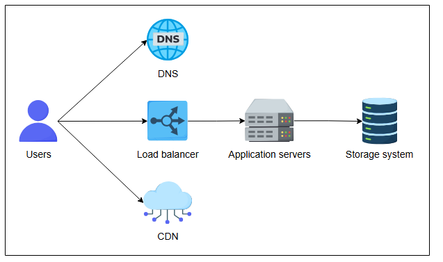

# Высокоуровневое проектирование Twitter

Поймите высокоуровневое проектирование сервиса Twitter.

## Взаимодействие пользователя с системой

Давайте начнем с высокоуровневого проектирования нашей системы Twitter. Сначала мы кратко выделим и обсудим строительные блоки, а также
другие компоненты в контексте проблемы Twitter. Позже в этой главе мы углубимся в некоторые компоненты.



* **Пользователи** публикуют твиты, которые доставляются на сервер через балансировщик нагрузки. Затем система сохраняет их в постоянном
  хранилище.
* **DNS** предоставляет указанный IP-адрес конечному пользователю для начала обмена данными с запрошенным сервисом.
* **CDN** располагается рядом с пользователями для предоставления запрашиваемых данных с низкой задержкой. Когда пользователи ищут
  определенный термин или тег, система сначала ищет на прокси-серверах CDN, содержащих наиболее часто запрашиваемый контент.
* **Балансировщик нагрузки** выбирает работающий сервер приложений на основе нагрузки трафика на доступных серверах и запросов
  пользователей.
* **Система хранения** представляет различные типы хранилищ (на основе SQL и NoSQL) на приведенной выше иллюстрации. Мы обсудим значимые
  системы хранения позже в этой главе.
* **Серверы приложений** предоставляют различные услуги и содержат бизнес-логику для координации между различными компонентами для
  выполнения наших функциональных требований.

У нас есть подробные главы о DNS, CDN, указанных системах хранения Базы данных, Хранилище ключ-значение, Хранилище больших двоичных объектов
и балансировщиках нагрузки в нашем разделе строительных блоков. Мы сосредоточимся на дальнейших деталях, специфичных для сервиса Twitter, в
следующих уроках. Давайте сначала разберемся с API сервиса.

## Проектирование API

В этом разделе мы сосредоточимся на проектировании различных API в соответствии с предоставляемыми нами функциями. Мы узнаем, как
пользователи запрашивают различные услуги через API. Мы сосредоточимся только на значимых параметрах API, которые имеют отношение к нашему
дизайну. Хотя фронтенд-сервер может вызывать другой API или добавлять больше параметров в API, полученный от конечных пользователей, для
выполнения данного запроса, мы рассматриваем все релевантные аргументы, указанные для конкретного запроса в одном API. Давайте разработаем
API для каждой из следующих функций:

* Опубликовать твит
* Лайкнуть или дизлайкнуть твит
* Ответить на твит
* Поиск твита
* Просмотр ленты пользователя или домашней ленты
* Подписаться или отписаться от аккаунта
* Ретвитнуть твит

### Опубликовать твит

Метод POST используется для отправки твита на сервер от пользователя через API `/postTweet`.

```
postTweet(user_id, access_type, tweet_type, content, tweet_length, media_field, post_time, tweet_location, list_of_used_hashtags, list_of_tagged_people)
```

Давайте обсудим некоторые из параметров:

| Параметр       | Описание                                                                                              |
|----------------|-------------------------------------------------------------------------------------------------------|
| `user_id`      | Указывает уникальный ID пользователя, опубликовавшего твит.                                           |
| `access_type`  | Указывает, является ли твит защищенным (т.е. видимым только для подписчиков) или публичным.           |
| `tweet_type`   | Указывает, является ли твит текстовым, на основе видеоклипа, изображений или состоит из разных типов. |
| `content`      | Указывает фактическое содержание твита (текст).                                                       |
| `tweet_length` | Представляет длину текста в твите. В случае видео указывает продолжительность и размер видео.         |
| `media_field`  | Указывает тип медиа (изображение, видео, GIF и т.д.), доставленного в каждом твите.                   |

Остальные параметры понятны из названия.

> **Примечание:** Twitter использует сервис **Snowflake** для генерации уникальных ID для твитов. У нас есть подробная
> глава (Секвенсор), в которой объясняется
> этот сервис.

---

**Вопрос 1 :** Сколько максимум хэштегов может быть в твите?
 <details>
  <summary><b>Показать ответ</b></summary>

Максимальное количество текста в твите - 280 символов. Таким образом, пользователи могут использовать хэштеги таким образом, чтобы длина
текста (включая обычный текст, любые ссылки и хэштеги) не превышала 280 символов.

</details>

**Вопрос 2 :** Зачем нужен list_of_tagged_people в API /postTweet?
 <details>
  <summary><b>Показать ответ</b></summary>

Система должна уведомлять людей, отмеченных в твите.
</details>

---

### Лайкнуть или дизлайкнуть твит

API `/likeTweet` используется, когда пользователи лайкают публичные твиты.

```
likeTweet(user_id, tweet_id, tweeted_user_id, user_location)
```

| Параметр          | Описание                                                      |
|-------------------|---------------------------------------------------------------|
| `user_id`         | Указывает уникальный ID пользователя, который лайкнул твит.   |
| `tweet_id`        | Указывает уникальный ID твита.                                |
| `tweeted_user_id` | Это уникальный ID пользователя, который опубликовал твит.     |
| `user_location`   | Обозначает местоположение пользователя, который лайкнул твит. |

Вышеуказанные параметры также используются в API `/dislikeTweet`, когда пользователи ставят дизлайк твитам других.

### Ответить на твит

API `/replyTweet` используется, когда пользователи отвечают на публичные твиты.

```
replyTweet(user_id, tweet_id, tweeted_user_id, reply_type, reply_content, reply_length)
```

Параметры `reply_type`, `reply_content` и `reply_length` аналогичны `tweet_type`, `content` и `tweet_length` соответственно.

### Поиск твита

Когда пользователь ищет какое-либо ключевое слово в домашней ленте, используется метод GET. Ниже приведен API `/searchTweet`:

```
searchTweet(user_id, search_term, max_result, exclude, media_field, expansions, sort_order, next_token, user_location)
```

Некоторые новые параметры, представленные в этом случае:

| Параметр      | Описание                                                                                                                                                                                                                                                                     |
|---------------|------------------------------------------------------------------------------------------------------------------------------------------------------------------------------------------------------------------------------------------------------------------------------|
| `search_term` | Строка, содержащая ключевое слово или фразу для поиска.                                                                                                                                                                                                                      |
| `max_result`  | Количество твитов, возвращаемых на одной странице ответа. По умолчанию — 10 твитов.                                                                                                                                                                                          |
| `exclude`     | Указывает, что исключить из возвращаемых твитов, то есть ответы и ретвиты. Максимальный лимит возвращаемых твитов — 3200, но при исключении ответов лимит сокращается до 800.                                                                                                |
| `media_field` | Указывает медиа (изображение, видео, GIF), доставленные в каждом возвращенном твите.                                                                                                                                                                                         |
| `expansions`  | Позволяет запрашивать дополнительные объекты данных в возвращаемых твитах, такие как упомянутый пользователь, цитируемый твит, прикрепленные медиа, места и т.д.                                                                                                             |
| `sort_order`  | Указывает порядок, в котором возвращаются твиты. По умолчанию возвращаются самые свежие.                                                                                                                                                                                     |
| `next_token`  | Используется для получения следующей страницы результатов. Например, если `max_result` установлен на 100, а набор результатов содержит 200 твитов, значение `next_token` берется прямо из ответа для запроса следующей страницы. У последней страницы `next_token` не будет. |

#### Ответ

Давайте посмотрим на пример ответа в формате JSON. **id** — это уникальный ID пользователя, опубликовавшего твит, а **text** — его
содержание. **result_count** — это количество возвращенных твитов, которое мы установили в `max_result` в запросе. Здесь мы отображаем
только поля по умолчанию.

```json
{
  "data": [
    {
      "id": "7300333948034441183",
      "text": "This is a most matched Tweet"
    },
    {
      "id": "6498431343154916376",
      "text": "This is next to most matched Tweet"
    },
    :
    :
    :
    {
      "id": "6427456107642019844",
      "text": "This is the last matched Tweet in the current page of the result."
    }
  ],
  "meta": {
    "newest_id": "7300333948034441183",
    "oldest_id": "6427456107642019844",
    "result_count": 10
  }
}
```

> **Примечание:** Twitter выполняет различные типы поиска. Вот два из них:
> * Один тип поиска возвращает результаты за последние семь дней, который обычно используют все зарегистрированные пользователи.
> * Другой тип возвращает все совпадающие результаты по всем когда-либо опубликованным твитам (напомним, что сервис не удаляет
    опубликованные твиты). Этот поиск обычно используется для академических исследований.

### Просмотр домашней ленты

Метод GET подходит, когда пользователи просматривают свою домашнюю ленту через API `/viewHome_timeline`.

```
viewHome_timeline(user_id, tweets_count, max_result, exclude, next_token, user_location)
```

В API `/viewHome_timeline` мы исключим `user_location`, чтобы получить ленту пользователя.
Параметр `max_result` определяет количество твитов, которое клиентское приложение может показать пользователю. Сервер отправляет количество
твитов, равное `max_result`, в каждом ответе. Кроме того, сервер отправит `list_of_followers` с разбивкой на страницы, чтобы уменьшить
задержку на стороне клиента.

---


> Какой параметр в методе `viewHome_timeline` наиболее важен при решении, какие рекламные объявления (твиты) возвращать в ответе?
> <details>
>  <summary><b>Показать ответ</b></summary>
>
>    Решение о рассылке указанных рекламных объявлений принимается на основе параметра user_location. Например, пользователь живет в городе
> Нью-Йорк, поэтому, скорее всего, рекламные объявления будут связаны с этим регионом или созданы в этом регионе.
></details>

---

### Подписаться на аккаунт

API `/followAccount` используется, когда пользователи подписываются на чей-то аккаунт в Twitter.

```
followAccount(account_id, followed_account_id)
```

| Параметр              | Описание                                                       |
|-----------------------|----------------------------------------------------------------|
| `account_id`          | Уникальный ID пользователя, который подписывается на аккаунт.  |
| `followed_account_id` | Уникальный ID аккаунта, на который подписывается пользователь. |

Те же параметры будут использоваться в API `/unfollowAccount`, когда пользователь отписывается от чьего-то аккаунта.

### Ретвитнуть твит

Когда зарегистрированный пользователь ретвитит (повторно публикует) чей-то твит в Twitter, вызывается следующий API `/retweet`:

```
retweet(user_id, tweet_id, retweet_user_id)
```

Те же параметры потребуются в API `/undoRetweet`, когда пользователи отменяют ретвит чьего-то твита.

---

> **Вопрос:** Канун Нового года, и Twitter ожидает огромного всплеска трафика. Как инженер по проектированию систем, какие изменения вы бы
> внесли в высокоуровневый дизайн, чтобы система была готова к этому трафику и не столкнулась с простоями?
>
> <details>
>  <summary><b>Показать ответ</b></summary>
>
>    Это решение будет приниматься на основе нескольких факторов, таких как расстояние, тип транспортного средства, рейтинг водителя и так далее. Тем не менее, если два водителя идентичны, мы можем случайным образом выбрать одного и отправить запрос этому водителю. Если один водитель не принимает поездку в течение нескольких секунд, мы отзываем предложение у этого водителя и предлагаем его новому.
> </details>
