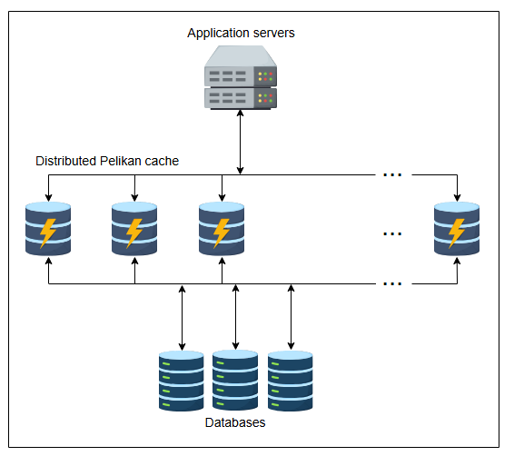
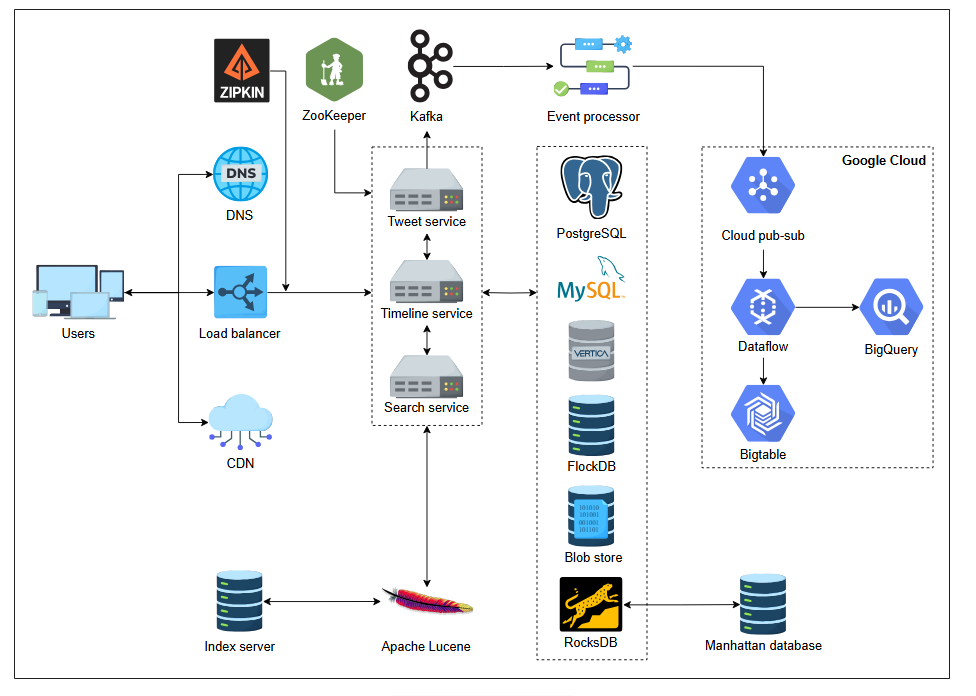

# Детальное проектирование Twitter

Погрузитесь в детальное проектирование Twitter.

## Система хранения

**Хранилище** — один из ключевых компонентов в любой системе реального времени. Хотя у нас есть подробная глава о системах хранения, здесь
мы сосредоточимся конкретно на системе хранения, используемой Twitter. Twitter использует различные **модели хранения** для разных сервисов,
чтобы в полной мере использовать преимущества каждой модели. Мы обсудим каждую модель хранения и посмотрим, как Twitter переходил от
различных баз данных, платформ и инструментов к другим, и какую выгоду он из этого извлек.

Содержание этого урока в основном основано на технических блогах Twitter, хотя анализ наш.

* **Google Cloud**: В Twitter HDFS (Hadoop Distributed File System) состоит из десятков тысяч серверов для размещения более 300 ПБ данных.
  Данные, хранящиеся в HDFS, в основном сжаты с помощью алгоритма сжатия данных LZO, поскольку LZO эффективно работает в Hadoop. Эти данные
  включают журналы (события клиентов, события твитов и события ленты), резервные копии MySQL и Manhattan (обсудим позже), таргетинг и
  аналитику рекламы, прогнозы вовлеченности пользователей, анализ социального графа и так далее. В 2018 году Twitter решил перенести данные
  из кластеров Hadoop в Google Cloud для лучшего анализа и управления данными. Этот переход получил название стратегии **"частично в
  облаке" (partly cloudy)**. Изначально они перенесли Ad-hoc кластеры (для эпизодического анализа) и кластеры холодного хранения (менее
  доступные и реже используемые данные), в то время как кластеры Hadoop для реального времени и продакшена остались на месте. Большие данные
  хранятся в BigQuery (сервис Google Cloud), полностью управляемом и высокомасштабируемом бессерверном хранилище данных. Twitter использует
  Presto (распределенный движок SQL-запросов) для доступа к данным из Google Cloud (BigQuery, Ad-hoc кластеры, Google Cloud Storage и т.д.).

* **Manhattan**: В Twitter число пользователей быстро росло, и требовалось масштабируемое решение для увеличения пропускной способности.
  Примерно в 2010 году Twitter использовал **Cassandra** (распределенное хранилище с широкими колонками) для замены MySQL, но не смог
  полностью заменить его из-за некоторых недостатков в хранилище Cassandra. В апреле 2014 года Twitter запустил собственное распределенное
  хранилище ключ-значение общего назначения в реальном времени под названием Manhattan и отказался от Cassandra. Manhattan хранит бэкенд для
  твитов, аккаунтов Twitter, личных сообщений и т.д. Twitter использует несколько кластеров в зависимости от сценариев использования,
  например, меньшие кластеры для нечастых или только для чтения операций и более крупные для интенсивного трафика чтения/записи (миллионы
  QPS). Изначально Manhattan также предоставлял сервис счетчиков временных рядов (просмотры, лайки и т.д.), который теперь предоставляет
  MetricsDB. Manhattan использует RocksDB в качестве движка хранения, отвечающего за хранение и извлечение данных на конкретном узле.

* **Blobstore**: Примерно в 2012 году Twitter создал систему хранения Blobstore для хранения фотографий, прикрепленных к твитам. Сейчас она
  также хранит видео, бинарные файлы и другие объекты. Через определенный период времени сервер делает контрольную точку данных из памяти в
  Blobstore в качестве долговременного хранилища. У нас есть подробная глава
  о Хранилище больших двоичных объектов (Blob Store),
  которая поможет вам понять, что это такое и как это работает.

* **Базы данных на основе SQL**: Twitter использует MySQL и PostgreSQL там, где требуется строгая согласованность, для рекламного обмена и
  управления рекламными кампаниями. Twitter также использует Vertica для запросов к часто агрегируемым наборам данных и для дашбордов
  Tableau. Примерно в 2012 году Twitter также создал фреймворк Gizzard поверх MySQL для шардирования, которое осуществляется путем
  партиционирования и репликации. Подробное обсуждение реляционных хранилищ есть в нашей
  главе Базы данных.

* **Kafka и Cloud Dataflow**: Twitter оценивает около 400 миллиардов событий в реальном времени и генерирует петабайты данных каждый день.
  Для этого он обрабатывает события с помощью Kafka локально и использует задания Google Dataflow для обработки дедупликации и агрегации в
  реальном времени в Google Cloud. После агрегации результаты сохраняются для ad-hoc анализа в BigQuery (хранилище данных) и в систему
  обслуживания в Bigtable (NoSQL база данных). Twitter преобразует топики Kafka в топики Cloud Pub-sub с помощью процессора событий, что
  помогает избежать потери данных и обеспечивает большую масштабируемость. См.
  главу Pub-sub для глубокого
  погружения в эту тему.

* **FlockDB**: Отношения — это подписчики пользователя, те, на кого он подписан, от кого он должен получать уведомления и т.д. Twitter
  хранит эти отношения в виде графа. Twitter использовал FlockDB, графовую базу данных, настроенную для огромных списков смежности, быстрых
  чтений и записей, а также для операций обхода графа. У нас есть главы
  о Базах данных
  и Новостной ленте, где подробно
  обсуждается хранение графов.

* **Apache Lucene**: Twitter создал поисковый сервис, который индексирует около триллиона записей и отвечает на запросы в течение 100
  миллисекунд. Примерно в 2019 году задержка индексации поисковой системы Twitter (время для индексации новых твитов) составляла около 15
  секунд. Twitter использует Apache Lucene для поиска в реальном времени, который использует **обратный индекс (inverted index)**. Twitter
  хранит индекс реального времени (последние твиты за последнюю неделю) в оперативной памяти для низкой задержки и быстрых обновлений.
  Полный индекс в сто раз больше, чем индекс реального времени. Однако Twitter выполняет пакетную обработку для полных индексов. См.
  главу Распределенный поиск,
  чтобы глубже понять, как работает индексация.

Решение, основанное на подходе «один размер для всех», редко бывает эффективным. Приложения реального времени всегда фокусируются на
предоставлении правильного инструмента для работы, что требует понимания всех возможных сценариев использования. Наконец, у всего есть свои
плюсы и минусы, и это следует применять с чувством реальности.

## Кэш

Как мы знаем, кэши помогают уменьшить задержку и увеличить пропускную способность. Кэширование в основном используется для хранения (
интенсивный трафик чтения), вычислений (потоковая обработка в реальном времени и машинное обучение) и временных данных (ограничители
скорости). Twitter использовал многопользовательские (multi-tenant) кластеры Twitter Memcached (Twemcache) и Redis (Nighthawk) для
кэширования. Из-за некоторых проблем, таких как неожиданная производительность, трудности с отладкой и другие операционные сложности в
существующей системе кэширования (Twemcache и Nighthawk), Twitter начал использовать кэш **Pelikan**. Этот кэш обеспечивает высокую
пропускную способность и низкую задержку. Pelikan использует много типов бэкенд-серверов, таких как `peliken_twemcache` в качестве замены
сервера Twemcache от Twitter, `peliken_slimcache` в качестве замены сервера Memcached/Redis от Twitter и т.д. Чтобы углубиться, у нас есть
подробная глава
о Кэше в памяти. Давайте
посмотрим на иллюстрацию ниже, представляющую взаимосвязь серверов приложений с распределенным кэшем Pelikan.

> **Примечание:** Pelikan также представил другой бэкенд-сервер под названием **Segcache**, который чрезвычайно масштабируем и эффективен по
> памяти для небольших объектов. Как правило, медианный размер небольшого объекта в кэше крупномасштабного приложения составляет от 200 до 300
> байт. Большинство решений (Memcache и Redis) имеют большой размер метаданных (56 байт) для каждого объекта. Это означает, что метаданные
> занимают более трети памяти. Pelikan уменьшил размер метаданных на объект до 38 байт. Segcache также получил награду NSDI Community Award и
> используется в качестве экспериментального сервера с 2021 года.

## Наблюдаемость (Observability)

Приложения реального времени используют тысячи серверов, предоставляющих множество услуг. Мониторинг ресурсов и их взаимодействия внутри или
вне системы сложен. Мы можем использовать различные инструменты для мониторинга состояния сервисов, такие как предоставление оповещений и
поддержка по различным вопросам. Наша система оповещений уведомляет о неработающих или деградировавших сервисах на основе установленных
метрик. Мы также можем использовать библиотеку динамической конфигурации, которая развертывает и обновляет конфигурацию для нескольких
сервисов без их перезапуска. Эта библиотека использует ZooKeeper (обсудим позже) для конфигурации как источника истины. Twitter использовал
сервис Loglens, который обеспечивает визуализацию и аналитику журналов сервисов. Позже он был заменен на Splunk Enterprise, централизованную
систему ведения журналов.

Отслеживание миллиардов запросов является сложной задачей в крупномасштабных приложениях реального времени. Twitter использует Zipkin,
распределенную систему трассировки, для отслеживания каждого запроса (потраченное время и количество запросов) для нескольких сервисов.
Zipkin выбирает часть всех запросов и прикрепляет к ним легковесный идентификатор трассировки. Это сэмплирование также снижает накладные
расходы на трассировку. Zipkin получает данные через сервер **Scribe** (агрегация данных журналов в реальном времени) и хранит их в
хранилищах ключ-значение с несколькими индексами.

Большинство приложений реального времени используют ZooKeeper для хранения критически важных данных. Он также может предоставлять множество
услуг, таких как распределенная блокировка и выборы лидера в распределенной системе. Twitter использует ZooKeeper для хранения реестра
сервисов, информации о топологии кластеров Manhattan, метаданных и т.д. Twitter также использует его для выборов лидера в различных
системах.

## Сложные проблемы реального мира

У Twitter миллионы аккаунтов, а у некоторых (известные личности) — миллионы подписчиков. Когда эти аккаунты публикуют твиты, миллионы
подписчиков соответствующего аккаунта взаимодействуют с их твитами за короткое время. Проблема становится большой, когда система
обрабатывает миллиарды взаимодействий (таких как просмотры и лайки) с этими твитами. Эта проблема также известна как проблема *
*тяжеловесов (heavy hitter)**. Для этого нам нужны миллионы счетчиков для подсчета различных операций с твитами.

Более того, одного счетчика для каждой конкретной операции с конкретным твитом недостаточно. Сложно обрабатывать миллионы запросов на
увеличение или уменьшение счетчика для конкретного твита в одном счетчике. Поэтому нам нужны несколько распределенных счетчиков для
управления всплесками запросов на запись (инкременты или декременты) для различных взаимодействий с твитами знаменитостей. Каждый счетчик
имеет несколько шардов, работающих на разных вычислительных единицах. Эти распределенные счетчики известны как **шардированные счетчики**.
Эти счетчики также помогают в другой проблеме реального времени, называемой проблемой **Top-k**. Давайте обсудим примеры проблем Top-k в
Twitter: тренды и лента.

**Тренды**: Twitter показывает Top-k тренды (хэштеги или ключевые слова) локально и глобально. Здесь «локально» означает, когда тема или
хэштег используется в том же месте, где активен запрашивающий пользователь. В свою очередь, «глобально» означает, когда конкретный хэштег
используется по всему миру. Существует вероятность, что пользователи из некоторых регионов не используют определенный хэштег в своих твитах,
но получают этот хэштег в своей ленте трендов. Хэштеги с максимальной частотой (количеством) становятся трендами как локально, так и
глобально. Кроме того, Twitter показывает различные продвигаемые тренды (известные как «платные тренды») в указанных регионах в разделе
трендов. Слайды ниже представляют хэштеги в скользящем окне, выбранные как Top-k тренды с течением времени.

1.  Top-k тренды в указанном временном интервале.
    

2.  Хэштег #life исключен, показаны следующие top-k тренды в указанном временном интервале.
    

3.  Хэштеги #life и #art исключены, показаны следующие top-k тренды в указанном временном интервале.
    

4.  Хэштеги #life, #art и #food исключены, показаны следующие top-k тренды в указанном временном интервале.
    

5.  Хэштеги #life, #art, #food и #science исключены, показаны следующие top-k тренды в указанном временном интервале.
    

**Лента (Timeline)**: Twitter показывает два типа лент: домашнюю и пользовательскую. Здесь мы обсудим домашнюю ленту, которая отображает
поток твитов, опубликованных аккаунтами, на которые подписан пользователь. Решение о показе Top-k твитов в ленте включает твиты
отслеживаемых аккаунтов, а также твиты, которые были лайкнуты или ретвитнуты отслеживаемыми аккаунтами. Существует также другая категория
продвигаемых твитов, отображаемых в домашней ленте.

Шардированные счетчики эффективно решают обсуждаемые проблемы. Мы также можем размещать шарды указанного счетчика рядом с пользователем для
уменьшения задержки и повышения общей производительности, подобно **CDN**. Еще одно преимущество, которое мы можем получить, — это частый
отклик пользователям, когда они взаимодействуют (лайкают или просматривают) с твитом. Ближайшие серверы, управляющие различными шардами
соответствующих счетчиков, постоянно обновляют количество лайков или просмотров с короткими интервалами обновления. Однако следует отметить,
что почти в реальном времени счетчики будут обновляться на твитах с большим интервалом обновления. Причина в том, что сервер приложений ждет
несколько подсчетов, представленных различными серверами, расположенными в разных регионах. У нас есть подробная глава
о шардированных счетчикD,
объясняющая, как это работает в приложениях реального времени.

## Полный обзор дизайна

В этом разделе мы обсудим, что происходит в бэкенд-системе, когда конечные пользователи генерируют множество запросов. Ниже приведены шаги:

* Сначала конечные пользователи получают адрес ближайшего балансировщика нагрузки от локального DNS.
* Балансировщик нагрузки направляет запросы конечных пользователей на соответствующие серверы в соответствии с запрашиваемыми услугами.
  Здесь мы обсудим сервисы твитов, ленты и поиска.
    * **Сервис твитов**: Когда конечные пользователи выполняют какую-либо операцию, например, публикуют твит или лайкают другие твиты,
      балансировщики нагрузки перенаправляют эти запросы на сервер, обрабатывающий сервис твитов. Рассмотрим пример, когда пользователи
      публикуют твиты в Twitter с помощью API `/postTweet`. Сервер (сервис твитов) получает запросы и выполняет несколько операций. Он
      идентифицирует вложения (изображение, видео) в твите и сохраняет их в Blobstore. Текст в твитах, информация о пользователе и все
      метаданные хранятся в различных базах данных (Manhattan, MySQL, PostgreSQL, Vertica). Между тем, обработка в реальном времени, такая
      как извлечение твитов, данных о взаимодействии пользователей и многих других метрик из потоков реального времени и журналов клиентов,
      осуществляется в Apache Kafka.
      Позже данные перемещаются в облачный pub-sub через процессор событий. Затем данные передаются для **дедупликации** и агрегации в
      BigQuery через Cloud Dataflow. Наконец, данные хранятся в Google Cloud Bigtable, который является полностью управляемым, легко
      масштабируемым и имеет отсортированные ключи.
    * **Сервис ленты**: Предположим, пользователь отправляет запрос на домашнюю ленту с помощью API `/viewHome_timeline`. В этом случае
      запрос перенаправляется на ближайший CDN, содержащий статические данные. Если запрашиваемые данные не найдены, они отправляются на
      сервер, предоставляющий услуги ленты. Этот сервис извлекает данные из различных баз данных или хранилищ и возвращает Top-k твитов.
      Этот сервис собирает различные счетчики взаимодействий с твитами из разных шардированных счетчиков, чтобы определить Top-k твитов.
      Аналогичным образом мы получим Top-k тренды, прикрепленные к ответу на запрос ленты.
    * **Сервис поиска**: Когда пользователи вводят какое-либо ключевое слово(а) в строке поиска в Twitter, поисковый запрос перенаправляется
      на соответствующий сервер с помощью API `/searchTweet`. Сначала он просматривает оперативную память в Apache Lucene, чтобы получить
      твиты в реальном времени (недавно опубликованные твиты). Затем этот сервер обращается к серверу индексации и находит все твиты,
      содержащие запрашиваемое ключевое слово(а). Далее он учитывает несколько факторов, таких как время или местоположение, для
      ранжирования найденных твитов. В конце он возвращает лучшие твиты.
* Мы можем использовать систему трассировки Zipkin, которая выполняет сэмплирование запросов. Кроме того, мы можем использовать ZooKeeper
  для хранения различных данных, включая информацию о конфигурации, распределенную синхронизацию, реестр имен и т.д.

