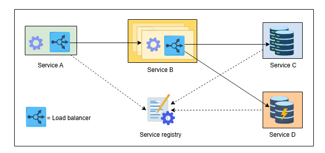
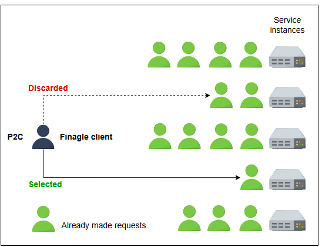
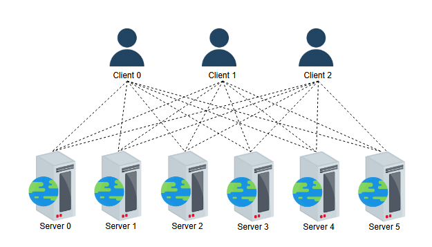
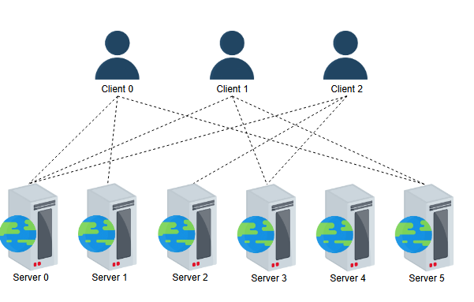
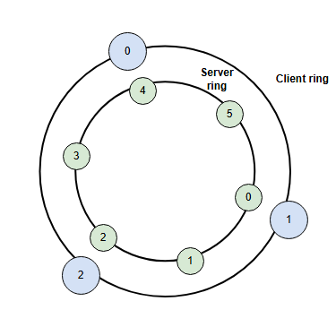
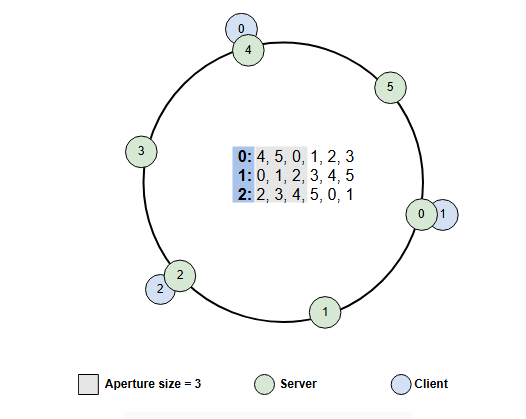
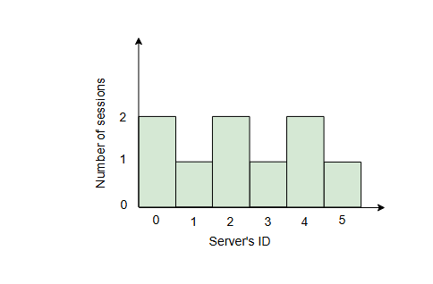
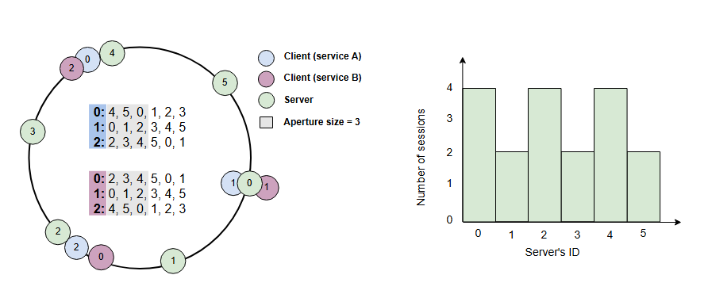
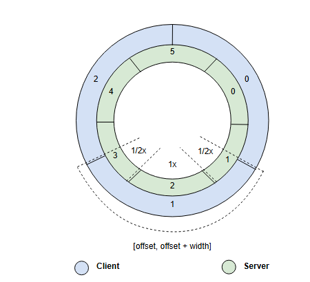

# Балансировщик нагрузки на стороне клиента для Twitter

Давайте разберемся, как Twitter осуществляет балансировку нагрузки на стороне клиента.

## Введение

В предыдущем уроке мы рассматривали дизайн Twitter с использованием выделенного балансировщика нагрузки. Хотя этот метод работает, и мы применяли его в других проектах, он может быть не оптимальным выбором для Twitter. Это связано с тем, что Twitter предлагает множество сервисов в большом масштабе, используя многочисленные экземпляры, и выделенные балансировщики нагрузки не являются подходящим выбором для таких систем. Чтобы лучше понять концепцию, давайте рассмотрим историю проектирования Twitter.

### История проектирования Twitter

Изначальный дизайн Twitter включал в себя монолитное приложение (на Ruby on Rails) с базой данных MySQL. По мере масштабирования Twitter количество сервисов увеличивалось, а база данных MySQL была шардирована. Дизайн монолитного приложения, подобный этому, является катастрофой по следующим причинам:

*   Большое количество разработчиков работает над одной и той же кодовой базой, что затрудняет обновление отдельных сервисов.
*   Процесс обновления одного сервиса может привести к поломке другого.
*   Затраты на оборудование растут, поскольку одна машина выполняет множество сервисов.
*   Восстановление после сбоев является трудоемким и сложным процессом.

С учетом эволюции Twitter, единственным выходом было создание множества микросервисов, где каждый сервис может обслуживаться сотнями или тысячами экземпляров.

### Балансировка нагрузки на стороне клиента

В технике балансировки нагрузки на стороне клиента нет выделенной промежуточной инфраструктуры балансировки нагрузки между любыми двумя сервисами с большим количеством экземпляров. Узел, запрашивающий набор узлов для сервиса, имеет встроенный балансировщик нагрузки. Мы называем запрашивающий узел или сервис клиентом. Клиент может использовать различные техники для выбора подходящего экземпляра для запроса сервиса. Иллюстрация ниже изображает концепцию балансировки нагрузки на стороне клиента. Каждый новый появляющийся сервис или экземпляр регистрирует себя в реестре сервисов, чтобы другие сервисы знали о его существовании.

На диаграмме выше Сервис A должен выбрать относительно менее загруженный экземпляр Сервиса B. Поэтому он будет использовать встроенный в него компонент балансировщика нагрузки для выбора наиболее подходящего экземпляра Сервиса B. Используя тот же метод балансировки нагрузки на стороне клиента, Сервис B будет взаимодействовать с другими сервисами. Очевидно, что Сервис A является клиентом, когда он вызывает Сервис B, в то время как Сервис B является клиентом, когда он взаимодействует с Сервисами C и D. В результате не будет центрального объекта, выполняющего балансировку нагрузки. Вместо этого каждый узел будет выполнять свою собственную балансировку нагрузки.

**Преимущества**: Использование балансировки нагрузки на стороне клиента имеет следующие преимущества:
*   Требуется меньше аппаратной инфраструктуры/уровней для выполнения балансировки нагрузки.
*   Сетевая задержка будет снижена из-за отсутствия промежуточного перехода.
*   Балансировщики нагрузки на стороне клиента устраняют узкие места в пропускной способности. С другой стороны, в выделенном слое балансировки нагрузки все запросы проходят через одну машину, которая может "задохнуться" при многократном увеличении трафика.
*   Меньше точек отказа в общей системе.
*   Нет очереди конечных пользователей, ожидающих ресурс (сервер) для конкретных услуг, поскольку множество балансировщиков маршрутизируют трафик. В конечном итоге это повышает качество восприятия (QoE).

Многие реальные приложения, такие как Twitter, Yelp, Netflix и другие, используют балансировку нагрузки на стороне клиента. В следующем разделе мы обсудим техники балансировки нагрузки на стороне клиента, используемые Twitter.

## Балансировка нагрузки на стороне клиента в Twitter

Twitter использует балансировщик нагрузки на стороне клиента, называемый **детерминированной апертурой (deterministic aperture)**, который является частью более крупного RPC-фреймворка под названием Finagle. **Finagle** — это **независимая от протокола**, с открытым исходным кодом и асинхронная RPC-библиотека.

> **Примечание:** Задумайтесь над следующим вопросом. По каким параметрам балансировщик нагрузки на стороне клиента Twitter осуществляет балансировку? То есть, какие параметры используются для справедливого распределения нагрузки между различными серверами?

Twitter в основном использует два распределения для измерения эффективности балансировщика нагрузки:
1.  Распределение запросов (уровень 7 OSI)
2.  Распределение сессий (уровень 5 OSI)

Хотя запросы являются ключевой метрикой, сессии являются важным атрибутом для достижения справедливого распределения. Поэтому мы разработаем методы для справедливого распределения как запросов, так и сессий. Давайте начнем с простой техники "Сила двух случайных выборов" (P2C) для распределения запросов.

### Распределение запросов с помощью P2C

Техника **P2C** для распределения запросов дает равномерное распределение запросов, пока сессии распределены равномерно. В P2C система случайным образом выбирает два уникальных экземпляра (сервера) для каждого запроса и выбирает тот, у которого наименьшая нагрузка. Давайте посмотрим на иллюстрацию ниже, чтобы понять P2C.

P2C основана на **простой идее**, что сравнение между двумя случайно выбранными узлами обеспечивает распределение нагрузки, которое экспоненциально лучше, чем случайный выбор.

Теперь, когда мы определили, как справедливо распределять запросы, давайте рассмотрим различные техники распределения сессий.

### Распределение сессий

**Решение 1**: Мы начнем наше обсуждение с **топологии "сетка" (Mesh topology)**. При таком подходе каждый клиент (балансировщик нагрузки) устанавливает сессию со всеми предоставленными экземплярами сервиса. Иллюстрация ниже представляет концепцию топологии "сетка".

Очевидно, что этот метод является справедливым, поскольку сессии распределены равномерно. Однако равномерное распределение сессий достигается очень высокой ценой, особенно при масштабировании до тысяч серверов. Кроме того, некоторые нездоровые или устаревшие сессии могут приводить к сбоям.

**Решение 2**: Чтобы решить проблему масштабируемости из решения 1, Twitter разработал другое решение под названием **случайная апертура (random aperture)**. Эта техника случайным образом выбирает подмножество серверов для установления сессий.

Конечно, случайный выбор уменьшит количество установленных сессий, как мы видим на диаграмме выше. Однако вопрос в том, сколько серверов будет выбрано случайным образом? На этот вопрос нелегко ответить, и ответ варьируется в зависимости от конкурентности запросов клиента.

Чтобы ответить на этот вопрос, Twitter установил **контроллер обратной связи (feedback controller)** внутри случайной апертуры, который определяет размер подмножества на основе нагрузки клиента. В результате мы можем уменьшить нагрузку на сессии и обеспечить масштабируемость. Однако это решение несправедливо. Мы видим дисбаланс на иллюстрации выше, так что **Сервер 4** не имеет сессий, в то время как **Сервер 0** имеет три сессии.

Этот дисбаланс создает проблемы, такие как простаивающие серверы, высокая нагрузка на несколько серверов и так далее. Поэтому нам нужно решение, которое будет одновременно справедливым и масштабируемым.

**Решение 3**: Из решения 2 мы узнали, что можем масштабироваться, выбирая подмножество для установления сессий. Однако нам не удалось справедливо распределить сессии. Для решения этой проблемы Twitter предложил решение с **детерминированной апертурой (deterministic aperture)**. Ключевые преимущества этого подхода:

*   Требуется небольшая координация между клиентами и серверами для схождения к решению.
*   Минимальные нарушения происходят при любых изменениях в количестве клиентов или экземпляров серверов по любой причине.

Для этого решения мы представляем клиентов и серверы в виде кольца с равноотстоящими интервалами, где каждый объект на кольце представляет узел или сервер, помеченный числом. Иллюстрация ниже показывает то, что Twitter называет дискретными координатами кольца (то есть определенной точкой на кольце).

Теперь мы объединяем кольца клиентов и серверов, чтобы получить взаимосвязь между ними. Мы также определили размер апертуры равным 3. Каждый клиент создаст сессию с тремя серверами на кольце. Клиенты выбирают сервер, двигаясь по часовой стрелке на кольце. Этот подход похож на согласованное хэширование, за исключением того, что здесь мы гарантируем равное распределение серверов по кольцу. Давайте посмотрим на иллюстрацию ниже, где клиенты имеют сессии с серверами, выбранными из предоставленного списка серверов соответственно.

На диаграмме выше клиент 0 устанавливает сессии с серверами 4, 5 и 0. Клиент 1 устанавливает сессии с серверами 0, 1 и 2, в то время как Клиент 2 устанавливает сессии с серверами 2, 3 и 4. Когда апертура вращается или перемещается в заданном подмножестве массивов одного размера, у каждого сервиса клиента появляются новые серверы для создания сессий. Количество установленных сессий на сервер показано на рисунке ниже.

Мы видим, что на гистограмме выше нет простаивающих серверов или серверов с высокой нагрузкой. Таким образом, мы достигли справедливого распределения для клиентов, принадлежащих к одному и тому же сервису. Очевидно, что мы наполовину решили проблему, улучшив распределение сессий между серверами по сравнению со случайной апертурой (решение 2). Однако проблема несправедливого распределения может усугубиться по мере роста числа клиентов. В этом случае некоторые серверы будут перегружены, когда более одного клиента (сервиса) будут обращаться к бэкенд-серверам. Давайте посмотрим на иллюстрацию ниже, чтобы понять проблему.

Иллюстрация выше показывает, что проблема усугубилась с увеличением числа клиентов (сервисов). Решение — непрерывные координаты кольца, где мы выводим отношения между клиентами и серверами, используя перекрывающиеся срезы кольца, а не конкретные точки на кольцах. Важно то, что перекрытие колец может быть частичным, поскольку на кольце может не быть достаточного количества экземпляров серверов для равномерного распределения между клиентами. Давайте посмотрим на иллюстрацию ниже.

Иллюстрация выше показывает, что клиенты 0 и 1 (симметрично) используют один и тот же сервер (сервер 1). Это означает, что существует частичное перекрытие в отношении координат кольца. Однако это перекрытие может привести и к асимметричному использованию. Симметрично или асимметрично, балансировка нагрузки может быть выполнена с помощью P2C. Например, на диаграмме выше серверы 1 и 3 получат половину нагрузки, которую получает сервер 2. Это означает, что сервер может получать большую или меньшую нагрузку в зависимости от размера его перекрывающегося среза с клиентом.

Теперь мы знаем, как сопоставлять клиентов с подмножеством серверов. Мы будем использовать P2C с непрерывными координатами кольца. Клиент будет выбирать точки (координаты) в своем диапазоне вместо выбора экземпляра сервера. Процесс выбора клиентами серверов для создания сессий выглядит следующим образом:

1.  Выбрать две координаты (смещение, смещение + ширина) в своем диапазоне и сопоставить эти координаты с дискретными экземплярами (серверами).
2.  Выбрать один экземпляр с наименьшей нагрузкой из двух выбранных экземпляров (P2C) по степени их пересечения.

> **Примечание:** Непрерывная апертура является масштабируемой и справедливой ценой дополнительной сессии на граничном узле из-за частичного перекрытия. Она также способна достичь небольшой координации и минимальных нарушений.

Давайте посмотрим на таблицу ниже, чтобы получить обзор обсуждаемых подходов.

**Сводка решений для распределения сессий**

| Подход                                            | Масштабируемость | Справедливое распределение | Экономичность |
|---------------------------------------------------|------------------|---------------------------|---------------|
| **Топология "сетка"**                             | ✖️               | ✔️                        | ✖️            |
| **Случайная апертура**                            | ✔️               | ✖️                        | ✔️            |
| **Детерминированная апертура (дискретное кольцо)** | ✔️               | слабое                    | ✔️            |
| **Детерминированная апертура (непрерывное кольцо)** | ✔️               | ✔️                        | ✔️            |

---
> Можете ли вы описать реальный сценарий, в котором подход балансировки нагрузки на стороне клиента предложит значительные преимущества по сравнению с другими методами балансировки нагрузки? Обоснуйте свой ответ.
>
> 

>  
<b>Показать ответ</b>

>
>    Например, в глобальной электронной коммерческой платформе клиентский балансировщик помогает пользователю автоматически подключаться к ближайшему или наименее загруженному серверу, что снижает задержки и повышает скорость ответа. Такой подход обеспечивает быструю отдачу контента и лучшее пользовательское впечатление.
> 

---

## Заключение

Эта задача проектирования подчеркивает, что для реальных сервисов необходима тонкая настройка производительности общих строительных блоков и использование правильной (богатой) их комбинации. Наши потребности от одного сервиса к другому будут диктовать, какую точку проектирования мы выберем в нашем пространстве решений. В этой главе мы увидели примеры того, как Twitter использует комбинацию хранилищ данных и пользовательских алгоритмов для балансировки нагрузки.
