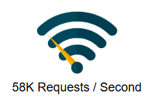
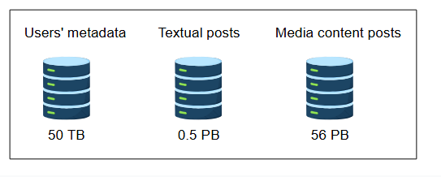
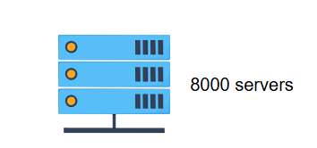
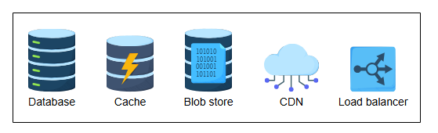

# Требования к проектированию системы новостной ленты

Ознакомьтесь с требованиями и оценками для проектирования системы новостной ленты.

## Требования

Чтобы ограничить рамки задачи, мы сосредоточимся на следующих функциональных и нефункциональных требованиях:

### Функциональные требования

*   **Генерация новостной ленты:** Система будет генерировать новостные ленты на основе страниц, групп и подписчиков, на которых подписан пользователь. У пользователя может быть много друзей и подписчиков. Поэтому система должна быть способна генерировать ленты от всех друзей и подписчиков. Сложность здесь заключается в том, что потенциально существует огромное количество контента. Наша система должна решать, какой контент выбрать для пользователя, и далее ранжировать его, чтобы решить, что показать в первую очередь.
*   **Содержимое новостной ленты:** Новостная лента может содержать текст, изображения и видео.
*   **Отображение новостной ленты:** Система должна добавлять новые поступающие посты в новостную ленту для всех активных пользователей на основе некоторого механизма ранжирования. После ранжирования мы показываем пользователю контент с более высоким рейтингом в первую очередь.

### Нефункциональные требования

*   **Масштабируемость (Scalability):** Наша предлагаемая система должна быть высокомасштабируемой для поддержки постоянно растущего числа пользователей на любой платформе, такой как Twitter, Facebook и Instagram.
*   **Отказоустойчивость (Fault tolerance):** Поскольку система должна обрабатывать большой объем данных, необходима устойчивость к разделению (доступность системы в случае сбоя сети между компонентами системы).
*   **Доступность (Availability):** Сервис должен быть высокодоступным, чтобы поддерживать вовлеченность пользователей в платформу. Система может пожертвовать строгой согласованностью ради доступности и отказоустойчивости, согласно теореме PACELC.
*   **Низкая задержка (Low latency):** Система должна предоставлять новостные ленты в режиме реального времени. Следовательно, максимальная задержка не должна превышать 2 секунд.

> Теорема PACELC является продолжением теоремы CAP, которая гласит, что в случае разделения сети следует выбирать между доступностью или согласованностью; в противном случае, выбирайте между задержкой и согласованностью.

## Оценка ресурсов

Предположим, что платформа, для которой проектируется система новостной ленты, имеет 1 миллиард пользователей, из которых в среднем 500 миллионов являются ежедневно активными пользователями. Также каждый пользователь имеет в среднем 300 друзей и подписан на 250 страниц. Основываясь на этих предположениях, давайте рассмотрим оценку трафика, хранилища и серверов.

### Оценка трафика

Предположим, что каждый ежедневно активный пользователь открывает приложение (или страницу в социальной сети) 10 раз в день. Общее количество запросов в день составит:

500 млн × 10 = 5 миллиардов запросов в день ≈ 58 тыс. запросов в секунду.

### Оценка хранилища

Предположим, что лента будет генерироваться офлайн и отображаться по запросу. Также мы предварительно рассчитаем топ-200 постов для каждого пользователя. Давайте рассчитаем оценку хранилища для метаданных пользователей, постов с текстом и медиаконтента.

1.  **Оценка хранилища метаданных пользователей:** Предположим, что для метаданных одного пользователя требуется 50 КБ. Для 1 миллиарда пользователей нам понадобится 1 млрд × 50 КБ = 50 ТБ.

2.  **Оценка хранилища для текстовых постов:** Все посты могут содержать текст, мы предполагаем, что его объем в среднем составляет 5 КБ. Оценка хранилища для топ-200 постов для 500 миллионов пользователей составит:
    200 × 500 млн × 5 КБ = 0.5 ПБ

3.  **Оценка хранилища для медиаконтента:** Наряду с текстом, пост может содержать и медиаконтент. Поэтому мы предполагаем, что 1/5 постов содержит видео, а 4/5 — изображения. Предполагаемый средний размер изображения — 200 КБ, а размер видео — 2 МБ.

    Оценка хранилища для 200 постов одного пользователя: (200 × 2МБ × 1/5) + (200 × 200КБ × 4/5) = 80МБ + 32МБ = 112МБ

    Общий требуемый объем хранилища для постов 500 миллионов пользователей: 112МБ × 500 млн = 56 ПБ

    Таким образом, нам понадобится не менее 56 ПБ блочного хранилища для хранения медиаконтента.

### Оценка количества серверов

Учитывая вышеуказанный трафик, давайте оценим необходимое количество серверов во время пиковой нагрузки. Напомним, что типичный сервер может обслуживать 64 000 запросов в секунду (RPS). Учитывая наше допущение об использовании ежедневно активных пользователей в качестве прокси для количества запросов в секунду во время пиковой нагрузки, мы получаем 500 миллионов запросов в секунду. Затем мы используем следующую формулу для расчета количества серверов:

*Количество серверов при пиковой нагрузке = (Количество запросов/секунду) / (RPS сервера)*

*Количество серверов при пиковой нагрузке = 500 миллионов / 64,000 = 7812.5 ≈ 8 тыс. серверов*

## Строительные блоки, которые мы будем использовать

При проектировании системы новостной ленты используются следующие строительные блоки:

*   **База(ы) данных** необходима для хранения постов от различных сущностей и сгенерированной персонализированной новостной ленты. Она также используется для хранения метаданных пользователей и их связей с другими сущностями, такими как друзья и подписчики.
*   **Кэш** — важный строительный блок для хранения часто запрашиваемых данных, будь то посты и новостные ленты или метаданные пользователей.
*   **Blob-хранилище (хранилище больших двоичных объектов)** необходимо для хранения медиаконтента, например, изображений и видео.
*   **CDN (сеть доставки контента)** эффективно доставляет контент конечным пользователям, уменьшая задержку и нагрузку на бэкенд-серверы.
*   **Балансировщики нагрузки** необходимы для распределения миллионов входящих запросов клиентов на получение новостной ленты между пулом доступных серверов.

