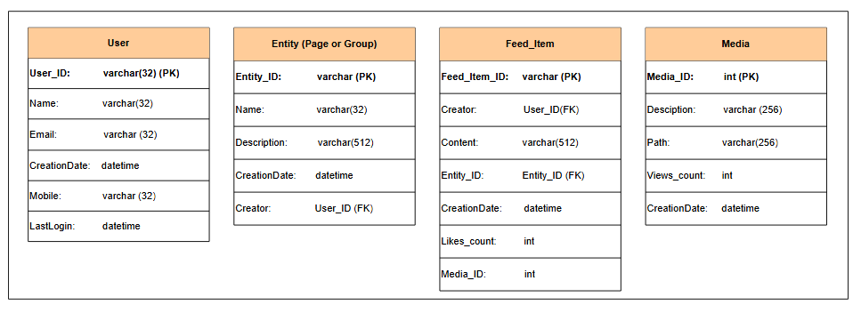

# Проектирование системы новостной ленты

Узнайте, как спроектировать систему новостной ленты.

Давайте обсудим высокоуровневое и детальное проектирование системы новостной ленты, основываясь на требованиях, обсужденных в предыдущем уроке.

## Высокоуровневое проектирование системы новостной ленты

В первую очередь, система новостной ленты отвечает за две основные задачи:

1.  **Генерация ленты:** Новостная лента генерируется путем агрегации постов друзей и подписчиков (или элементов ленты) на основе некоторого механизма ранжирования.
2.  **Публикация ленты:** Когда лента публикуется, соответствующие данные записываются в кэш и базу данных. Эти данные могут быть текстовыми или любым медиаконтентом. Пост, содержащий данные от друзей и подписчиков, добавляется в новостную ленту пользователя.

Перейдем к высокоуровневому проектированию нашей системы новостной ленты. Она состоит из двух вышеупомянутых важных частей, показанных на следующем рисунке:

Давайте обсудим основные компоненты, показанные в высокоуровневом проектировании:

1.  **Пользователь(и):** Пользователи могут создавать посты с некоторым контентом или запрашивать свою новостную ленту.
2.  **Балансировщик нагрузки:** Он перенаправляет трафик на один из веб-серверов.
3.  **Веб-серверы:** Веб-серверы инкапсулируют бэкенд-сервисы и работают как промежуточный слой между пользователями и различными сервисами. Помимо аутентификации и ограничения скорости запросов, веб-серверы отвечают за перенаправление трафика на другие бэкенд-сервисы.
4.  **Сервис уведомлений:** Он информирует сервис генерации новостной ленты о появлении нового поста от друзей или подписчиков пользователя и отправляет push-уведомление.
5.  **Сервис генерации новостной ленты:** Этот сервис генерирует новостные ленты из постов подписчиков/друзей пользователя и хранит их в кэше новостной ленты.
6.  **Сервис публикации новостной ленты:** Этот сервис отвечает за публикацию новостных лент в ленту пользователя из кэша новостной ленты. Он также добавляет миниатюру медиаконтента из blob-хранилища и ссылку на него в новостную ленту, предназначенную для пользователя.
7.  **Сервис постов:** Когда пользователь запрашивает создание поста, вызывается сервис постов, и созданный пост сохраняется в базе данных постов и соответствующем кэше. Медиаконтент в посте хранится в blob-хранилище.

---

>Новостные ленты часто сталкиваются с проблемой распространения дезинформации. Какие два вмешательства на уровне проектирования вы могли бы реализовать, чтобы помочь смягчить эту проблему?
> 

>  
<b>Показать ответ</b>

>
>    Два вмешательства на уровне проектирования для смягчения дезинформации в новостных лентах: во-первых, пометка или понижение в рейтинге контента с подозрительным происхождением или отсутствием проверки; во-вторых, сотрудничество с организациями по проверке фактов для валидации информации.
>

---

### Дизайн API

API — это основные способы взаимодействия клиентов с серверами. Обычно API новостных лент основаны на HTTP и позволяют клиентам выполнять действия, включая публикацию статуса, получение новостных лент, добавление друзей и так далее. Наша цель — генерировать и получать новостную ленту пользователя; поэтому важны следующие API:

#### Генерация новостной ленты пользователя

Следующий API используется для генерации новостной ленты пользователя:
`generateNewsfeed(user_id)`

Этот API принимает идентификаторы пользователей и определяет их друзей и подписчиков. Он генерирует новостные ленты, состоящие из нескольких постов. Поскольку этот API используется внутренними компонентами системы, его можно вызывать офлайн для предварительной генерации новостных лент. Предварительно сгенерированные ленты хранятся в постоянном хранилище и соответствующем кэше.

В этом вызове API используется следующий параметр:

| Параметр  | Описание                                                      |
| :-------- | :------------------------------------------------------------ |
| `user_id` | Уникальный идентификатор пользователя, для которого генерируется лента. |

#### Получение новостной ленты пользователя

Следующий API используется для получения новостной ленты пользователя:
`getNewsfeed(user_id, count)`

Вызов API `getNewsfeed(.)` возвращает JSON-объект, состоящий из списка постов.

В этом API используются следующие параметры:

| Параметр  | Описание                                                        |
| :-------- | :-------------------------------------------------------------- |
| `user_id` | Уникальный идентификатор пользователя, для которого система получит ленту. |
| `count`   | Количество элементов ленты (постов), которые будут извлечены за один запрос. |

---

## Схема хранения

Отношения в базе данных для системы новостной ленты следующие:

*   **User:** Это отношение содержит данные о пользователе. Пользователь также может быть подписчиком или другом других пользователей.
*   **Entity:** Это отношение хранит данные, связанные с любой сущностью, такой как страницы, группы и т.д.
*   **Feed_item:** Данные о постах, созданных пользователями, хранятся в этом отношении.
*   **Media:** Информация о медиаконтенте хранится в этом отношении.

Данные о пользователях и постах структурированы, поэтому для их хранения мы будем использовать SQL-базы данных.
Мы используем графовую базу данных для хранения отношений между пользователями, друзьями и подписчиками. Для этой цели мы следуем **модели графа свойств**. Можно представить графовую базу данных как состоящую из двух реляционных таблиц:

1.  Для вершин, представляющих пользователей.
2.  Для ребер, обозначающих отношения между ними.

Поэтому мы придерживаемся реляционной схемы для графового хранилища, как показано на следующем рисунке. Схема использует тип данных JSON в PostgreSQL для хранения свойств каждой вершины (пользователя) или ребра (отношения).

Альтернативное представление **Пользователя** может быть показано в графовой базе данных ниже. Где `Users_ID` остается тем же, а атрибуты хранятся в формате JSON.

*(Подпись к изображению)*: Схема графовой базы данных для хранения отношений между пользователями.

*(Подпись к изображению)*: Граф между двумя пользователями, состоящий из двух вершин и одного ребра.

---

## Детальное проектирование

Давайте подробно рассмотрим проектирование системы новостной ленты.

Как обсуждалось ранее, система новостной ленты состоит из двух частей: публикация новостной ленты и генерация новостной ленты. Поэтому мы обсудим обе части, начиная с сервиса генерации новостной ленты.

### Сервис генерации новостной ленты

Новостная лента генерируется из агрегированных постов (или элементов ленты) от друзей, подписчиков и других сущностей (страниц и групп) пользователя.

В нашем предлагаемом проекте за генерацию новостной ленты отвечает **сервис генерации новостной ленты**. Когда запрос от пользователя (скажем, Алисы) на получение новостной ленты поступает на веб-серверы, веб-сервер либо:

*   Вызывает сервис генерации новостной ленты для создания ленты, потому что некоторые пользователи не часто посещают платформу, поэтому их ленты генерируются по их запросу.
*   Извлекает предварительно сгенерированную новостную ленту для активных пользователей, которые часто посещают платформу.

Для генерации новостной ленты для Алисы последовательно выполняются следующие шаги:

1.  Сервис генерации новостной ленты извлекает ID всех пользователей и сущностей, на которых подписана Алиса, из графовой базы данных.
2.  Когда ID извлечены, следующий шаг — получение информации об их друзьях (подписчиках и сущностях) из кэша пользователей, который регулярно обновляется при изменении **базы данных пользователей**.
3.  На этом шаге сервис извлекает последние, самые популярные и релевантные посты для этих ID из кэша постов. Это те посты, которые мы можем отобразить в новостной ленте Алисы.
4.  **Сервис ранжирования** ранжирует посты на основе их релевантности для Алисы. Это представляет текущую новостную ленту Алисы.
5.  Новостная лента сохраняется в кэше новостной ленты, откуда топ-N постов публикуются в ленту Алисы. (Процесс публикации подробно обсуждается в следующем разделе).
6.  В конце, когда Алиса доходит до конца своей ленты, следующие топ-N постов извлекаются на ее экран из кэша новостной ленты.

Процесс иллюстрирован на следующем рисунке:

---

> **Вопрос:** Создание и хранение новостных лент для каждого пользователя в кэше требует огромного объема памяти (шаг 5 в вышеприведенном разделе). Есть ли способ уменьшить это потребление памяти?
> 

>  
<b>Показать ответ</b>

>
>    Более эффективным с точки зрения памяти было бы хранить только сопоставление между пользователями и их соответствующими постами в таблице в кэше, то есть `<Post_ID, User_ID>`. На этапе публикации ленты система будет извлекать посты из базы данных постов и генерировать новостную ленту для пользователя, который подписан на другого пользователя с `User_ID`.
>

---

### Сервис публикации новостной ленты

На этом этапе новостные ленты для пользователей сгенерированы от их друзей, подписчиков и сущностей и хранятся в виде `<Post_ID, User_ID>` в кэше новостной ленты.

Теперь вопрос: как новостные ленты, сгенерированные для Алисы, будут опубликованы в ее ленту?

**Сервис публикации новостной ленты** извлекает список ID постов из кэша новостной ленты. Данные, извлеченные из кэша, представляют собой кортеж из ID поста и пользователя, то есть `<Post_ID, User_ID>`. Поэтому полные данные о постах и пользователях извлекаются из кэшей пользователей и постов для создания полностью сконструированной новостной ленты.

На последнем шаге полностью сконструированная новостная лента отправляется клиенту (Алисе) с использованием одного из **подходов веерной рассылки (fan-out)**. Популярные новостные ленты и медиаконтент также хранятся в CDN для быстрого извлечения.

Предположим, наш сервис получает миллиарды запросов одновременно, и система начинает генерировать новостные ленты в реальном времени. Эта ситуация заставит огромное количество пользователей ждать и может привести к сбою серверов. Чтобы избежать этого, мы можем выделить специальные серверы, которые будут непрерывно ранжировать и генерировать новостные ленты и хранить их в базе данных и памяти новостной ленты. Таким образом, по запросу новых постов от пользователя наша система будет предоставлять предварительно сгенерированные ленты.

*(Подпись к изображению)*: Сервис публикации новостной ленты в действии

---
>
> **Вопрос:** Как обновляется новостная лента друзей и подписчиков, когда пользователь создает новый пост?
> 

>  
<b>Показать ответ</b>

>
>    Когда пользователь, скажем, Боб, создает новый пост, он сохраняется в базе данных постов и кэше. На следующем шаге **сервис генерации новостной ленты** создает ленту для друзей и подписчиков Боба, и кэш новостной ленты обновляется. Обновленная новостная лента доставляется соответствующим пользователям при следующем обновлении страницы/экрана.
>

---

### Сервис ранжирования новостной ленты

Часто мы видим релевантные и важные посты вверху нашей новостной ленты, когда входим в свои аккаунты в социальных сетях. Это ранжирование включает в себя множество продвинутых алгоритмов ранжирования и рекомендаций.

В нашем проекте **сервис ранжирования новостной ленты** состоит из этих алгоритмов, работающих с различными признаками, такими как история просмотров пользователя, лайки, дизлайки, комментарии, клики и многое другое. Эти алгоритмы также выполняют следующие функции:

*   Выбирают «кандидатские» посты для показа в новостной ленте.
*   Устраняют посты, содержащие дезинформацию или кликбейт, из кандидатских постов.
*   Создают список друзей, с которыми пользователь часто взаимодействует.
*   Выбирают темы, на которые пользователь потратил больше времени.

Система ранжирования учитывает все вышеперечисленные пункты для прогнозирования релевантных и важных постов для пользователя.

### Ранжирование постов и построение новостной ленты

База данных постов содержит посты, опубликованные разными пользователями. Предположим, что в базе данных есть 10 постов от 5 разных пользователей. Наша цель — ранжировать только 4 поста из 10 для пользователя (скажем, Боба), который подписан на этих пятерых пользователей. Мы выполняем следующее для ранжирования каждого поста и создания новостной ленты для Боба:

1.  Из каждого поста извлекаются различные признаки, такие как лайки, комментарии, репосты, категория, продолжительность и так далее.
2.  На основе предыдущей истории Боба, хранящейся в **базе данных пользователей**, вычисляется релевантность для каждого поста с помощью различных алгоритмов ранжирования и машинного обучения.
3.  Присваивается оценка релевантности, скажем, от 1 до 5, где 1 означает наименее релевантный пост, а 5 — очень релевантный.
4.  На основе присвоенных оценок выбираются 4 лучших поста из 10.
5.  Топ-4 поста объединяются и представляются в ленте Боба в порядке убывания присвоенной оценки.

Следующий рисунок показывает топ-4 поста, опубликованных в ленте Боба:

Ранжирование новостной ленты с помощью различных алгоритмов машинного обучения и ранжирования — это вычислительно интенсивная задача. В нашем проекте **сервис ранжирования** ранжирует посты и конструирует новостные ленты. Этот сервис состоит из систем обработки больших данных, которые могут использовать специализированное оборудование, такое как графические процессоры (GPU) и тензорные процессоры (TPU).

> **Примечание: По словам Facebook:**
> “Для каждого человека в Facebook нам нужно оценить тысячи признаков, чтобы определить, что этот человек может счесть наиболее релевантным, чтобы предсказать, что каждый из этих людей хочет видеть в своей ленте.”
> Это означает, что нам нужна огромная вычислительная мощность и сложные алгоритмы обучения, чтобы учесть все признаки и получить качественную ленту за разумно короткое время.

## Собираем всё вместе

Следующий рисунок объединяет все сервисы, связанные с детальным проектированием системы новостной ленты:

В этом уроке мы обсудили проектирование системы новостной ленты, ее схему базы данных и систему ранжирования. В следующем уроке мы оценим требования нашей системы.

