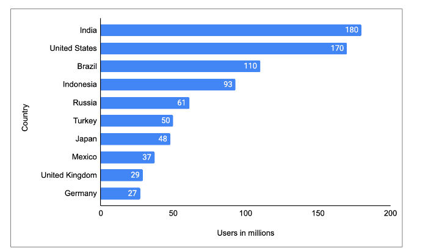

# Проектирование системы: Instagram

Познакомьтесь с Instagram, чтобы начать его проектирование.

## Что такое Instagram?

**Instagram** — это бесплатное приложение для социальной сети, которое позволяет пользователям загружать фотографии и короткие видео.
Пользователи могут добавлять подписи к каждому посту и использовать хэштеги или геотеги (метки местоположения), чтобы индексировать их и
делать доступными для поиска внутри приложения.

Посты появляются в новостных лентах подписчиков пользователя, а контент, отмеченный хэштегами или геотегами, может быть доступен широкой
публике, что помогает пользователям охватить большую аудиторию. Пользователи также могут сделать свой профиль приватным, что ограничивает
доступ к нему только для тех, кто решил на них подписаться.

> **Примечание:** По мере роста пользовательской базы Instagram по всему миру, растет и спрос на ресурсы, такие как серверы, базы данных и
> сети доставки контента (CDN). Instagram должен постоянно оптимизировать свою бэкенд-архитектуру, чтобы соответствовать растущим требованиям
> миллионов активных пользователей ежедневно. Эффективное управление ростом пользователей, прогнозирование будущих потребностей в ресурсах и
> обеспечение масштабируемости необходимы для обработки огромных объемов пользовательского контента в реальном времени.

Расширение числа пользователей со временем требует больше ресурсов (серверов, баз данных и т.д.). Знание темпов роста пользователей помогает
нам прогнозировать ресурсы для соответствующего масштабирования нашей системы. Следующая иллюстрация показывает пользовательскую базу
Instagram в разных странах по состоянию на январь 2022 года (источник: Statista).

> **Знаете ли вы?**
>
> Бесперебойный пользовательский опыт Instagram — мгновенные уведомления, персонализированные ленты и высокая доступность — обеспечивается
> мощной архитектурой системы, использующей Redis, Cassandra и передовые системы хранения файлов. Узнайте, как эти технологии питают гиганта
> социальных сетей и вдохновляют на главные вопросы на собеседованиях для инженеров!

## Как мы будем проектировать Instagram?

Этот раздел предназначен для начинающих инженеров-программистов или тех, кто готовится к собеседованиям по проектированию систем. Мы
разделили проектирование Instagram на четыре урока:

1. **Требования**: В этом уроке будут изложены функциональные и нефункциональные требования к Instagram. Также будет произведена оценка
   ресурсов, необходимых для выполнения этих требований.
2. **Проектирование**: Этот урок объяснит рабочий процесс и использование каждого компонента, его высокоуровневую архитектуру, дизайн API и
   схему базы данных.
3. **Детальное проектирование**: В этом уроке мы подробно рассмотрим компоненты нашего дизайна Instagram, обсудим различные подходы к
   генерации лент новостей и оценим предложенный нами дизайн.

**Ключевые вопросы:**

* Как Instagram может обрабатывать генерацию ленты и обмен сообщениями, чтобы предоставлять персонализированные ленты пользователей,
  интегрировать уведомления и обеспечивать надежное хранение и извлечение данных ленты для оптимальной функциональности обмена фотографиями?
* Как балансировщики нагрузки, ограничители скорости и Kafka помогают обеспечить производительность Instagram во время пиковой активности,
  оптимизируя обмен сообщениями и обрабатывая миллионы запросов пользователей с низкой задержкой и оптимальным пользовательским опытом?
* Почему выбор правильного хранилища данных (NoSQL против реляционных баз данных) имеет решающее значение для управления пользовательскими
  данными, данными ленты и большими объемами запросов при сохранении масштабируемости и надежности?
* Какие соображения должен учитывать Instagram при внедрении файлового и объектного хранилища (например, Amazon S3) и как шардирование и
  репликация влияют на крупномасштабный обмен фотографиями?

Давайте начнем с понимания требований к проектированию нашей системы Instagram, используя практические знания о распределенных системах и
оптимизации API. В следующем уроке мы предоставим оценку ресурсов.