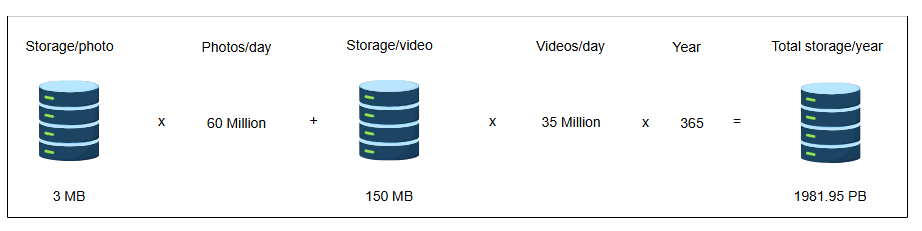
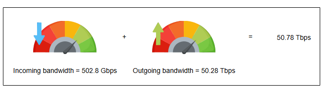
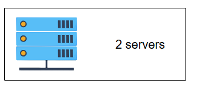
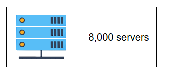
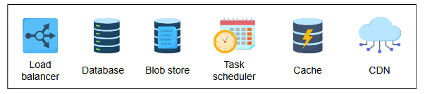

# Требования к дизайну Instagram

Узнайте о требованиях и вычислительных потребностях сервиса Instagram.

## Требования

Для упрощения нашего дизайна мы сосредоточимся на некоторых важных функциях Instagram. Давайте перечислим требования к нашей системе:

### Функциональные требования

*   **Публикация фото и видео**: Пользователи могут публиковать фото и видео в Instagram.
*   **Подписка и отписка от пользователей**: Пользователи могут подписываться и отписываться от других пользователей в Instagram.
*   **Лайки и дизлайки постов**: Пользователи могут ставить лайки или дизлайки постам аккаунтов, на которые они подписаны.
*   **Поиск фото и видео**: Пользователи могут искать фото и видео по подписям и местоположению.
*   **Генерация новостной ленты**: Пользователи могут просматривать новостную ленту, состоящую из фото и видео (в хронологическом порядке) от всех пользователей, на которых они подписаны. Пользователи также могут видеть предложенные и рекламные фото в своей ленте.

### Нефункциональные требования

*   **Масштабируемость (Scalability)**: Система должна быть масштабируемой для обработки миллионов пользователей с точки зрения вычислительных ресурсов и хранилища.
*   **Задержка (Latency)**: Задержка при генерации новостной ленты должна быть низкой.
*   **Доступность (Availability)**: Система должна быть высокодоступной.
*   **Надежность хранения данных (Durability)**: Любой загруженный контент (фото и видео) никогда не должен быть утерян.
*   **Согласованность (Consistency)**: Мы можем пойти на небольшие уступки в согласованности. Допустимо, если контент (фото или видео) появляется в лентах подписчиков, находящихся в отдаленном регионе, с некоторой задержкой.
*   **Надежность (Reliability)**: Система должна быть устойчива к сбоям оборудования и программного обеспечения.

> **Вопрос для размышления**: Представьте, что мы хотим реализовать функцию истечения срока действия контента в Instagram (как в Snapchat). Какие функциональные требования нам нужно было бы добавить или удалить, чтобы отразить эту функцию?
>
> 

>  
<b>Показать ответ</b>

>
>    Для реализации функции истечения срока действия контента в Instagram нужно добавить следующие требования:
>
> Возможность пользователям устанавливать время истечения для постов и историй.
> 
> Автоматический мониторинг и удаление или скрытие контента по истечении времени.
>
> Уведомление пользователей перед истечением срока (опционально).
>
> Исключение истекшего контента из поиска, рекомендаций и уведомлений.
>
> Также нужно убрать требования, связанные с долговременным хранением всего контента и предположениями о его постоянной доступности.
> 
>

## Оценка ресурсов

Наша система ориентирована на чтение (read-heavy), поскольку пользователи сервиса тратят значительно больше времени на просмотр лент других пользователей, чем на создание и публикацию нового контента. Нашей основной задачей будет проектирование системы, которая сможет своевременно доставлять фото и видео. Ограничений на количество загружаемых фото или видео нет, что означает, что эффективное управление хранилищем должно быть главным приоритетом при проектировании этой системы. Instagram поддерживает около миллиарда пользователей по всему миру, которые делятся 95 миллионами фото и видео в день. Мы рассчитаем ресурсы и спроектируем нашу систему на основе этих требований.

Давайте примем следующие допущения:

*   У нас 1 миллиард пользователей, из них 500 миллионов — ежедневно активные пользователи.
*   Предположим, что в день в Instagram публикуется 60 миллионов фото и 35 миллионов видео.
*   Мы можем считать максимальный размер каждого фото 3 МБ, а максимальный размер каждого видео — 150 МБ.
*   В среднем каждый пользователь отправляет нашему сервису 20 запросов (любого типа) в день.

### Оценка хранилища

Нам нужно оценить емкость хранилища, пропускную способность и количество серверов для поддержки такого огромного числа пользователей и контента.

Объем хранилища в день составит:

*   60 миллионов фото/день * 3 МБ = 180 Терабайт / день
*   35 миллионов видео/день * 150 МБ = 5250 ТБ / день
*   Общий размер контента = 180 + 5250 = 5430 ТБ

Общий объем, необходимый за год:

*   5430 ТБ/день * 365 (дней в году) = 1 981 950 ТБ = 1981,95 Петабайт

Помимо фото и видео, мы проигнорировали данные комментариев, статусов и т.д. Кроме того, нам также нужно хранить информацию о пользователях и метаданные постов, например, userID, фото и т.д. Так что, если быть точным, нам нужно более 5430 ТБ/день, но для простоты нашего дизайна давайте остановимся на 5430 ТБ/день.

### Оценка пропускной способности

Согласно нашей оценке емкости хранилища, наш сервис будет получать 5430 ТБ данных каждый день, что дает нам:

*   5430 ТБ / (24 * 60 * 60) = 5430 ТБ / 86400 сек ~= 62.84 ГБ/с ~= 502.8 Гбит/с

Поскольку каждое входящее фото и видео должно дойти до подписчиков пользователя, предположим, что соотношение читателей к писателям составляет 100:1. В результате нам потребуется в 100 раз большая исходящая пропускная способность, чем входящая.

Предположим следующее:

*   Входящая пропускная способность ~= 502.8 Гбит/с
*   Требуемая исходящая пропускная способность ~= 100 * 502.8 Гбит/с ~= 50.28 Тбит/с

Исходящая пропускная способность довольно высока. Мы можем использовать сжатие, чтобы значительно уменьшить размер медиафайлов. Кроме того, мы разместим контент ближе к пользователям через CDN и другие кэши в точках обмена трафиком (IXP) и у интернет-провайдеров (ISP), чтобы доставлять контент с высокой скоростью и низкой задержкой.

### Количество серверов

Мы оценим количество серверов двумя способами — при равномерном распределении запросов и при пиковой нагрузке.

#### Количество серверов при равномерном распределении запросов

Нам нужно обрабатывать одновременные запросы от 500 миллионов ежедневно активных пользователей, которые равномерно распределены на 24 часа. Предположим, что типичный сервер Instagram обрабатывает 64 000 запросов в секунду (RPS).

*   Запросов от каждого пользователя в день = 20
*   Всего запросов в день = 500 миллионов * 20
*   Запросов в секунду = (500 миллионов * 20) / (24 * 60 * 60) ≈ 116 000

Требуемое количество серверов = (Количество запросов/сек) / (RPS сервера) = 116 000 / 64 000 ≈ 2 сервера.

Этот расчет показывает, что нам нужно всего 2 сервера для обработки запросов в нашей системе Instagram, если нагрузка распределена равномерно.

#### Количество серверов при пиковой нагрузке

Принимая наше допущение об использовании числа ежедневно активных пользователей в качестве прокси для количества запросов в секунду для определения количества серверов в пиковые моменты, мы получаем 500 миллионов запросов в секунду.

Требуемое количество серверов при пиковой нагрузке = (Количество запросов/сек) / (RPS сервера) = 500 000 000 / 64 000 = 7812.5 ≈ 8 000 серверов.

> **Примечание:** Одновременные запросы значительно влияют на количество требуемых серверов по сравнению с запросами, распределенными во времени. Для более глубокого изучения уточнения предположений о пиковой нагрузке обратитесь к главе «Приблизительные расчеты».

### Компоненты, которые мы будем использовать

В следующем уроке мы сосредоточимся на высокоуровневом дизайне Instagram. В дизайне будут использоваться многие компоненты, которые также обсуждались в начальных главах. Мы будем использовать следующие компоненты в нашем дизайне:

*   **Балансировщик нагрузки** на разных уровнях обеспечит плавное распределение запросов между доступными серверами.
*   **База данных** используется для хранения метаданных пользователей и аккаунтов, а также связей между ними.
*   **Хранилище BLOB-объектов** необходимо для хранения различных типов контента, таких как фото, видео и т.д.
*   **Планировщик задач** планирует события в базе данных, такие как удаление записей, чей срок жизни истек.
*   **Кэш** хранит наиболее часто запрашиваемый контент.
*   **CDN** используется для эффективной доставки контента конечным пользователям, что уменьшает задержку и нагрузку на конечные серверы.

В следующем уроке мы обсудим высокоуровневый дизайн системы Instagram.