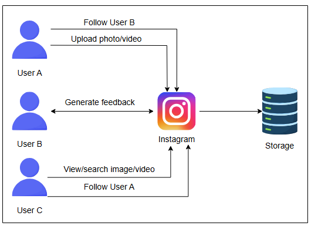
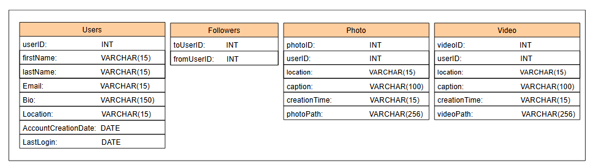

# Проектирование Instagram

Изучите высокоуровневый дизайн Instagram и поймите его модель данных.

## Высокоуровневый дизайн

На высоком уровне наша система должна позволять загружать, просматривать и искать изображения и видео. Для загрузки изображений и видео нам нужно их где-то хранить, а при запросе — извлекать данные из этого хранилища. Кроме того, пользователи должны иметь возможность подписываться друг на друга.



## Проектирование API

В этом разделе описываются API, вызываемые пользователями для выполнения различных действий (загрузка, лайки и просмотр фото/видео) в Instagram. Мы реализуем REST API для этих задач. Давайте разработаем API для каждой из следующих функций:

*   Публикация фото и видео
*   Подписка и отписка от пользователей
*   Лайки или дизлайки постов
*   Поиск фото и видео
*   Генерация новостной ленты

Все последующие вызовы будут содержать `userID`, который уникально определяет пользователя, выполняющего действие. Мы будем обсуждать только новые параметры в вызовах.

### Публикация фото или видео

Метод POST используется для публикации фото/видео с устройства пользователя на сервер через API `/postMedia`. API `/postMedia` выглядит следующим образом:

```
postMedia(userID, media_type, media_file, list_of_hashtags, caption)
```

| Параметр | Описание |
| :--- | :--- |
| `media_type` | Указывает тип медиа (фото или видео) в посте. |
| `media_file` | Содержит медиафайл (фото или видео) поста. |
| `list_of_hashtags` | Представляет все хэштеги (максимум 30) в посте. |
| `caption` | Текст (максимум 2200 символов) в посте пользователя. |

### Подписка и отписка от пользователей

API `/followUser` используется, когда пользователь подписывается на других пользователей в Instagram. API `/followUser` выглядит следующим образом:

```
followUser(userID, target_userID)
```

| Параметр | Описание |
| :--- | :--- |
| `target_userID` | Указывает пользователя, на которого нужно подписаться. |

API `/unfollowUser` использует те же параметры, когда пользователь отписывается от кого-то в Instagram.

### Лайки или дизлайки постов

API `/likePost` используется, когда пользователи ставят лайк чьему-либо посту в Instagram.

```
likePost(userID, post_id)
```

| Параметр | Описание |
| :--- | :--- |
| `post_id` | Указывает уникальный ID поста. |

API `/dislikePost` использует те же параметры, когда пользователь ставит дизлайк чьему-либо посту в Instagram.

### Поиск фото или видео

Метод GET используется, когда пользователь ищет фото или видео по ключевому слову или хэштегу. API `/searchPhotos` выглядит следующим образом:

```
searchPhotos(userID, keyword)
```

| Параметр | Описание |
| :--- | :--- |
| `keyword` | Указывает строку (имя пользователя, хэштег, места), введенную пользователем в строку поиска. |

> **Примечание:** Instagram показывает посты с наибольшим охватом (те, у которых больше лайков и просмотров) при поиске по определенному ключу. Например, если пользователь выполняет поиск по местоположению «Лондон, Великобритания», Instagram покажет посты в порядке от максимального к минимальному охвату. Вместо того чтобы показывать все посты, данные будут подгружаться по мере прокрутки.

### Генерация новостной ленты

Метод GET используется, когда пользователи просматривают свою новостную ленту через API `/viewNewsfeed`. API `/viewNewsfeed` выглядит следующим образом:

```
viewNewsfeed(userID, generate_timeline)
```

| Параметр | Описание |
| :--- | :--- |
| `generate_timeline` | Указывает время, когда пользователь запрашивает генерацию новостной ленты. Instagram показывает посты, которые пользователь не видел между последним запросом ленты и текущим. |

## Схема хранения

Давайте теперь определим нашу модель данных:

### Реляционная или нереляционная база данных

Крайне важно выбрать правильный тип базы данных для нашей системы Instagram, но что выбрать — SQL или NoSQL? Наши данные по своей сути реляционны, и нам нужен порядок для данных (посты должны появляться в хронологическом порядке) и отсутствие потерь данных даже в случае сбоев (надежность хранения данных). Более того, в нашем случае нам будут полезны реляционные запросы, такие как получение подписчиков или изображений по ID пользователя. Следовательно, SQL-базы данных отвечают этим требованиям.

Поэтому мы выберем реляционную базу данных и будем хранить наши релевантные данные в ней.

### Определение таблиц

На базовом уровне нам понадобятся следующие таблицы:

*   **Users (Пользователи)**: Хранит все данные, связанные с пользователями, такие как ID, имя, email, био, местоположение, дата создания аккаунта, время последнего входа и т.д.
*   **Followers (Подписчики)**: Хранит отношения между пользователями. В Instagram у нас однонаправленные отношения, например, если пользователь A принимает запрос на подписку от пользователя B, пользователь B может видеть посты пользователя A, но не наоборот.
*   **Photos (Фотографии)**: Хранит всю информацию, связанную с фото, такую как ID, местоположение, подпись, время создания и т.д. Нам также нужно хранить ID пользователя, чтобы определить, какое фото какому пользователю принадлежит. ID пользователя — это внешний ключ из таблицы пользователей.
*   **Videos (Видео)**: Хранит всю информацию, связанную с видео, такую как ID, местоположение, подпись, время создания и т.д. Нам также нужно хранить ID пользователя, чтобы определить, какое видео какому пользователю принадлежит. ID пользователя — это внешний ключ из таблицы пользователей.

> **Вопрос на размышление**
>
> 1.  Где нам следует хранить фото и видео?
> <details>
>  <summary><b>Показать ответ</b></summary>
>
>    Мы сохраним фотографии и видео в хранилище больших двоичных объектов (например, S3) и сохраним путь к фотографии или видео в таблице, поскольку в распределенном хранилище эффективно сохранять большие объемы данных.
></details>




### Оценка данных

Давайте определим, сколько данных будет хранить каждая таблица. В приведенном ниже калькуляторе столбец «Размер строки (в байтах)» показывает данные на одну строку каждой таблицы. Он также рассчитывает необходимое хранилище для указанного количества записей. Например, для 500 миллионов пользователей требуется 111 000 МБ, для 125 000 миллионов подписчиков — 1 000 000 МБ, для 60 миллионов фото — 23 640 МБ, и для 35 миллионов видео — 13 790 МБ.

Вы можете изменять значения в калькуляторе, чтобы наблюдать за изменением требуемого объема хранилища. Это дает нам оценку того, как быстро будут расти данные в наших таблицах.

| Имя таблицы | Размер строки (в байтах) | Количество (в миллионах) | Требуемый объем (в МБ) |
| :--- | :--- | :--- | :--- |
| Users | 222 | 500 | 111 000 |
| Followers | 8 | 125 000 | 1 000 000 |
| Photos | 394 | 60 | 23 640 |
| Videos | 394 | 35 | 13 790 |

> **Примечание:** Большинство современных сервисов используют как SQL, так и NoSQL хранилища. Instagram официально использует комбинацию SQL (PostgreSQL) и NoSQL (Cassandra) баз данных. Слабоструктурированные данные, такие как генерация ленты, обычно хранятся в NoSQL, в то время как реляционные данные сохраняются в хранилищах на основе SQL.

В следующем уроке мы определим больше компонентов, чтобы доработать наш дизайн.