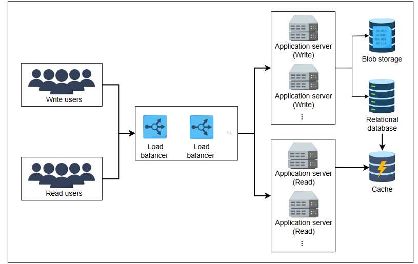
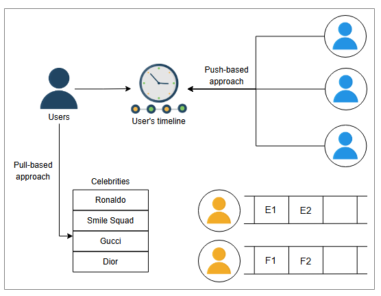

# Детальное проектирование Instagram

Изучите детальное проектирование Instagram и поймите взаимодействие различных компонентов.

## Добавление дополнительных компонентов

Давайте добавим еще несколько компонентов в наш дизайн:

* **Балансировщик нагрузки**: для распределения нагрузки от запросов конечных пользователей.
* **Серверы приложений**: для хостинга нашего сервиса для конечных пользователей.
* **Реляционная база данных**: для хранения наших данных.
* **Хранилище BLOB-объектов**: для хранения фотографий и видео, загруженных пользователями.

## Загрузка, просмотр и поиск фотографий

Клиент запрашивает загрузку фотографии, балансировщик нагрузки передает запрос одному из серверов приложений, который добавляет запись в
базу данных. Пользователю отправляется уведомление о том, что фотография успешно сохранена. В случае ошибки пользователь также получает
соответствующее сообщение.

Процесс просмотра фотографий схож с описанным выше. Клиент запрашивает просмотр фотографии, и соответствующая фотография, отвечающая
запросу, извлекается из базы данных и показывается пользователю. Клиент также может ввести ключевое слово для поиска определенного
изображения.

Запросов на чтение больше, чем запросов на запись, и загрузка контента в систему занимает время. Эффективно будет разделить сервисы записи (
загрузки) и чтения. Множество серверов, управляемых несколькими сервисами, будут обрабатывать соответствующие запросы. Сервис чтения
выполняет задачи по извлечению необходимого контента для пользователя, в то время как сервис записи помогает загружать контент в систему.

Нам также необходимо кэшировать данные для обработки миллионов запросов на чтение. Это улучшает пользовательский опыт, делая процесс
извлечения быстрым. Мы также будем использовать **ленивую загрузку (lazy loading)**, которая минимизирует время ожидания для клиента. Это
позволяет нам загружать контент по мере прокрутки пользователем, экономя пропускную способность и сосредотачиваясь на загрузке контента,
который пользователь просматривает в данный момент. Это улучшает задержку при просмотре или поиске определенной фотографии или видео в
Instagram.

Обновленный дизайн выглядит следующим образом:

## Генерация ленты новостей

Теперь наша задача — сгенерировать ленту новостей для конкретного пользователя. Давайте рассмотрим различные подходы, их преимущества и
недостатки, чтобы выбрать подходящую стратегию.

### Pull-подход (метод вытягивания)

Когда пользователь открывает свой Instagram, мы отправляем запрос на генерацию ленты. Сначала мы извлекаем список людей, на которых подписан
пользователь, получаем фотографии, которые они недавно опубликовали, сохраняем их в очередях и отображаем пользователю. Но этот подход
медленно реагирует, так как мы генерируем ленту каждый раз, когда пользователь открывает Instagram.

Мы можем значительно уменьшить воспринимаемую пользователем задержку, генерируя ленту в оффлайн-режиме. Например, мы определяем сервис,
который заранее извлекает релевантные данные для пользователя, и как только человек открывает Instagram, ему отображается лента. Это снижает
задержку при показе ленты.

1) Пользователь открывает Instagram
   

2) Запрос на генерацию ленты отправляется в сервис ленты новостей.
   

3) Сервис ленты извлекает список подписок пользователя из хранилища.
   

4) Сервис ленты извлекает последние посты этих подписок.
   

5) Извлеченные фото отображаются в ленте пользователя.
   

> **Вопрос на размышление:** В чем недостатки pull-подхода?
> 

>  
<b>Показать ответ</b>

>
>   Instagram — это система с высокой нагрузкой на чтение. Многие люди не публикуют фотографии, а просто просматривают посты
> других. Таким образом, наши вызовы для извлечения последних постов от каждого подписчика часто будут возвращать пустой результат.
> Следовательно, мы должны помнить, что это не система с высокой нагрузкой на запись, и разработать возможное решение, чтобы учесть это.
>
>

### Push-подход (метод проталкивания)

При **push-подходе** каждый пользователь сам отвечает за отправку опубликованного им контента в ленты новостей людей, которые на него
подписаны. В предыдущем подходе мы "вытягивали" (pull) посты от каждого подписчика, а в текущем подходе мы "проталкиваем" (push) пост
каждому подписчику.

Теперь для генерации ленты нам нужно только извлечь данные, которые были "протолкнуты" конкретному пользователю. Push-подход избавляет от
множества запросов, которые возвращают пустые результаты, когда у подписок нет постов за указанное время.

> **Вопрос на размышление:** В чем недостатки push-подхода?
> 

>  
<b>Показать ответ</b>

>
>    Рассмотрим аккаунт знаменитости, например, Криштиану Роналду, у которого более 400 миллионов подписчиков. Если он опубликует
> фото или видео, нам придется "протолкнуть" ссылки на фото/видео 400+ миллионам пользователей, что неэффективно.
>

### Гибридный подход

Давайте разделим наших пользователей на две категории:

* **Push-пользователи**: пользователи, у которых количество подписчиков исчисляется сотнями или тысячами.
* **Pull-пользователи**: знаменитости, у которых количество подписчиков исчисляется сотнями тысяч или миллионами.

Сервис ленты новостей "вытягивает" (pull) данные от pull-пользователей и добавляет их в ленту пользователя. Push-пользователи "
проталкивают" (push) свои посты в сервис ленты новостей своих подписчиков, чтобы сервис мог добавить их в ленту.

Мы использовали метод, который генерирует ленту, но где мы ее храним? Мы храним ленту пользователя в хранилище типа "ключ-значение"
по `userID`. По запросу мы извлекаем данные из этого хранилища и показываем их пользователю. Ключом является `userID`, а значением — контент
ленты (ссылки на фото и видео). Поскольку размер значения часто ограничен несколькими мегабайтами, мы можем хранить данные ленты в
BLOB-хранилище и помещать ссылку на BLOB в значение ключа, когда приближаемся к пределу размера.

Мы можем добавить новую функцию "историй" (stories) в наш Instagram. В этой функции пользователи могут добавлять фото, которое доступно для
просмотра другим только в течение 24 часов. Мы можем реализовать это, поддерживая опцию в таблице, где мы можем хранить продолжительность
жизни истории. Мы можем установить ее на 24 часа, а **планировщик задач** будет удалять записи, время которых превышает 24-часовой лимит.

## Итоговый дизайн

Мы также будем использовать **CDN (сеть доставки контента)** в нашем дизайне. Мы можем хранить изображения и видео знаменитостей в CDN, что
облегчит их получение подписчиками. Балансировщик нагрузки сначала направляет запрос на чтение в ближайший CDN, и если запрошенный контент
там недоступен, то он перенаправляет запрос на соответствующий сервер приложений для чтения. CDN помогает нашей системе быть доступной для
миллионов одновременных пользователей и минимизирует задержку.

Итоговый дизайн представлен ниже:

> **Вопрос на размышление:** Как мы можем посчитать миллионы взаимодействий (лайков или просмотров) с постом знаменитости?
>
> 

>  
<b>Показать ответ</b>

>
>    Мы можем использовать **шардированные счетчики (sharded counters)** для подсчета множества взаимодействий для конкретного
> пользователя. Каждый счетчик имеет несколько шардов, распределенных по различным пограничным (edge) серверам, чтобы уменьшить нагрузку на
> сервер приложений и задержку. Пользователи, находящиеся ближе всего к пограничному серверу, будут чаще получать обновленный счетчик для
> конкретного поста по сравнению с теми, кто находится в отдаленных регионах.
>

## Обеспечение нефункциональных требований

Мы оцениваем дизайн Instagram на соответствие его нефункциональным требованиям:

* **Масштабируемость**: Мы можем добавлять больше серверов на уровень сервисов приложений, чтобы улучшить масштабируемость и обрабатывать
  многочисленные запросы от клиентов. Мы также можем увеличить количество баз данных для хранения растущих данных пользователей.
* **Задержка**: Использование кэша и CDN сократило время получения контента.
* **Доступность**: Мы сделали систему доступной для пользователей, используя хранилища и базы данных, которые реплицируются по всему миру.
* **Надежность хранения данных**: У нас есть постоянное хранилище, которое поддерживает резервное копирование данных, поэтому любой
  загруженный контент (фото и видео) никогда не будет утерян.
* **Согласованность**: Мы использовали хранилища, такие как BLOB-хранилища и базы данных, для поддержания согласованности наших данных в
  глобальном масштабе.
* **Надежность**: Наши базы данных обеспечивают репликацию и избыточность, поэтому наша система остается надежной, и данные не теряются.
  Уровень балансировки нагрузки перенаправляет запросы в обход вышедших из строя серверов.

## Заключение

Эта задача по проектированию показывает, что мы можем предоставлять основные сервисы, правильно соединяя наши строительные блоки.
Масштабируемые и отказоустойчивые строительные блоки позволяют нам сосредоточиться на специфических для конкретного случая использования
проблемах (таких как эффективное формирование ленты новостей).