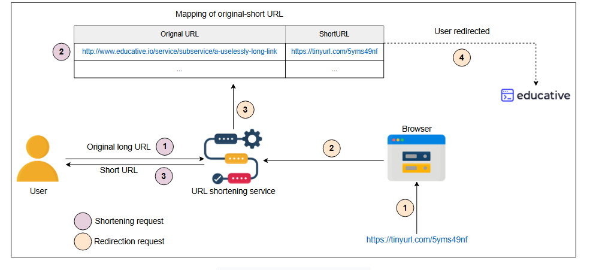

# Проектирование системы: TinyURL

Давайте спроектируем сервис, подобный TinyURL, для сокращения унифицированных указателей ресурсов (URL).

## Введение

**Сокращение URL** — это сервис, который создает короткие псевдонимы (алиасы) для длинных URL, обычно называемые **короткими ссылками**. При нажатии на такие короткие ссылки происходит перенаправление на исходный URL. Следующая иллюстрация показывает, как работает этот процесс:

### Преимущества

Ключевые преимущества сервиса сокращения URL:

*   Сокращенные URL удобны в использовании: они оптимизируют использование ссылок на различных устройствах благодаря повышенной доступности и устойчивости к разрывам.
*   Они выглядят профессионально, привлекательно и обеспечивают больше возможностей для обмена.
*   Они менее подвержены ошибкам при ручном вводе.
*   Они требуют меньше места для хранения на стороне пользователя.

### Недостатки

Сервис сокращения URL также имеет некоторые недостатки. Вот некоторые из них:

*   Мы теряем оригинальность нашего бренда, используя короткий URL, сгенерированный сторонним сервисом. Многие разные бренды, использующие один и тот же сервис, получают короткие URL, содержащие один и тот же домен.
*   Поскольку мы используем сторонний сервис для сокращения URL, всегда будет существовать вероятность его закрытия и удаления всех наших сокращенных URL.
*   Имидж нашего бренда зависит от надежности сервиса сокращения URL. Неправильное бизнес-решение может негативно повлиять на наш бизнес.
*   Конкуренция за получение востребованных кастомных коротких URL огромна, поэтому возможно, что лучшие кастомные URL уже будут заняты к тому времени, как мы начнем генерировать короткие URL.

---

> Для проектирования системы TinyURL можно рассмотреть несколько строительных блоков. Определите эти блоки на основе следующих требуемых функций в дизайне и предоставьте свой ответ в виджете ИИ ниже:
>
> *   **Необходимо:**
      >     *   Хранить сокращенные URL.
>     *   Предоставлять уникальные ID для каждого URL.
>     *   Хранить часто запрашиваемые URL для их эффективной обработки.
>     *   Ограничивать количество входящих запросов.
> 

>  
<b>Показать ответ</b>

>
>
> a) **База данных**: Хранит сопоставление между длинными URL и соответствующими им короткими URL.
>
> b) **Секвенсор (Sequencer)**: Предоставляет уникальные ID для уникальной генерации коротких URL.
>
> c) **Кэш**: Хранит часто используемые сопоставления URL для ускорения их получения.
>
> d) **Ограничители скорости (Rate limiters)**: Предотвращают злоупотребление системой, ограничивая количество запросов от пользователей.
>
> >

## Как мы будем проектировать сервис сокращения URL?

Мы разделили проектирование сервиса сокращения URL на следующие пять уроков:

1.  **Требования**: В этом уроке обсуждаются функциональные и нефункциональные требования к сервису сокращения URL, а также оцениваются ресурсы, необходимые для их выполнения. Кроме того, в нем перечисляются основные строительные блоки, необходимые для создания такого сервиса.
2.  **Проектирование и развертывание**: Здесь объясняется работа и использование каждого компонента, связь между ними и общий механизм их совместной работы.
3.  **Кодировщик (Encoder)**: Этот урок раскрывает внутренний механизм кодировщика, используемого в дизайне, объясняя причину его использования вместе с математическим обоснованием.
4.  **Оценка**: Наконец, мы тестируем наш дизайн, рассматривая различные аспекты наших требований к дизайну, и включаем возможность его улучшения.
