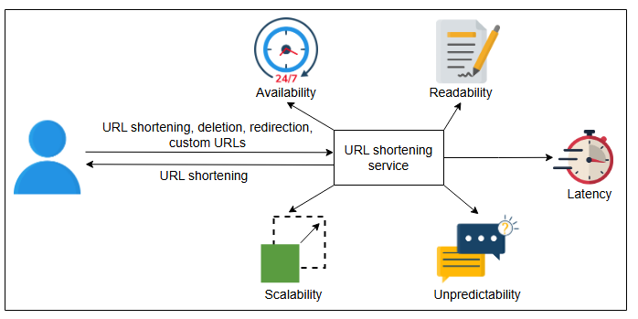
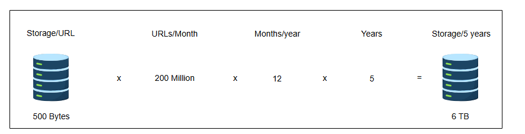
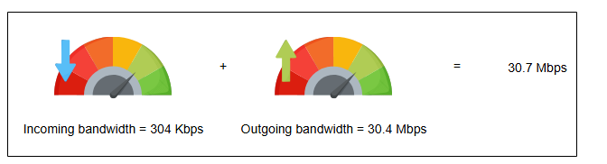
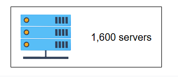
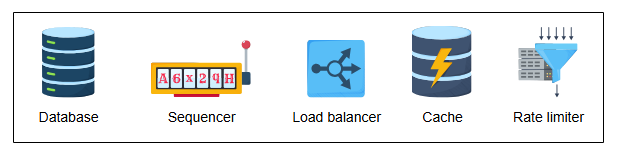
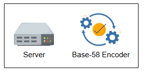

# Требования к дизайну TinyURL

Поймите требования и оценки для проектирования сервиса сокращения URL.

## Требования к дизайну сокращения URL

Давайте рассмотрим функциональные и нефункциональные требования к сервису, который мы будем проектировать:

### Функциональные требования

*   **Генерация коротких URL**: Наш сервис должен уметь генерировать уникальный короткий псевдоним для данного URL.
*   **Перенаправление**: Получив короткую ссылку, наша система должна уметь перенаправлять пользователя на исходный URL.
*   **Кастомные короткие ссылки**: Пользователи должны иметь возможность генерировать кастомные короткие ссылки для своих URL с помощью нашей системы.
*   **Удаление**: Пользователи должны иметь возможность удалять короткую ссылку, сгенерированную нашей системой, при наличии соответствующих прав.
*   **Обновление**: Пользователи должны иметь возможность обновлять длинный URL, связанный с короткой ссылкой, при наличии соответствующих прав.
*   **Время истечения срока действия**: Для коротких ссылок должно быть установлено время истечения срока действия по умолчанию, но пользователи должны иметь возможность устанавливать его в соответствии со своими требованиями.

> **Тест**
>
> 1.  В качестве проектного решения мы не используем повторно истекшие короткие URL. Поскольку мы их не используем, зачем нам нужно удалять их из нашей системы?
>
> 

>  
<b>Показать ответ</b>

>
>  **Ответ:** До сих пор мы устанавливали время истечения срока действия по умолчанию в пять лет. Если мы снимем это ограничение и начнем сохранять записи навсегда, поисковый индекс нашего хранилища данных будет расти безгранично, и время выполнения запросов к нему может добавить заметную задержку.
>

### Нефункциональные требования

*   **Доступность (Availability)**: Наша система должна быть высокодоступной, поскольку даже секундный простой приведет к сбоям перенаправления URL. Поскольку домен нашей системы находится в URL, мы не можем позволить себе простои, и наш дизайн должен включать условия отказоустойчивости.
*   **Масштабируемость (Scalability)**: Наша система должна быть горизонтально масштабируемой по мере роста спроса.
*   **Читаемость (Readability)**: Короткие ссылки, генерируемые нашей системой, должны быть легко читаемыми, различимыми и набираемыми.
*   **Задержка (Latency)**: Система должна работать с низкой задержкой, чтобы обеспечить пользователю комфортный опыт.
*   **Непредсказуемость (Unpredictability)**: С точки зрения безопасности, короткие ссылки, генерируемые нашей системой, должны быть крайне непредсказуемыми. Это гарантирует, что следующий по порядку короткий URL не будет сгенерирован последовательно, что исключает возможность угадывания всех коротких URL, которые наша система когда-либо создавала или создаст.

> **Тест**
>
> 1.  Почему создание непредсказуемых коротких URL является обязательным для нашей системы?
>
> 

>  Следующие две проблемы подчеркивают необходимость создания непоследовательных, непредсказуемых коротких URL:
>
> 1.  Злоумышленники могут получить доступ к системной информации об общем количестве коротких URL, что даст им определенный диапазон для планирования атак. Такая внутренняя информация не должна быть доступна за пределами системы.
> 2.  Наши пользователи могли использовать наш сервис для генерации коротких URL для секретных ссылок. Обладая вышеуказанной информацией, злоумышленники могут попытаться перечислить все короткие URL, получить к ним доступ и узнать о связанных с ними длинных URL, рискуя секретностью частных URL. Это поставит под угрозу конфиденциальность данных пользователя, делая нашу систему менее безопасной.
>
> Следовательно, случайное назначение уникальных ID лишает злоумышленников такой системной информации, которая необходима для перечисления и компрометации частных данных пользователя.
>

## Оценка ресурсов

Лучше иметь реалистичные оценки на начальном этапе. Например, в будущем нам может понадобиться их изменить на основе модификаций дизайна. Давайте сделаем некоторые допущения для завершения нашей оценки.

**Допущения**

*   Мы предполагаем, что соотношение запросов на сокращение к запросам на перенаправление составляет 1:100.
*   В месяц поступает 200 миллионов новых запросов на сокращение URL.
*   Одна запись о сокращении URL требует 500 байт в базе данных.
*   Каждая запись будет иметь максимальный срок хранения пять лет, если не будет удалена явным образом.
*   Ежедневно активных пользователей (DAU) — 100 миллионов.

### Оценка хранилища

Поскольку записи хранятся в течение 5 лет, а в месяц поступает 200 миллионов записей, общее количество записей составит примерно 12 миллиардов.

200 млн/месяц × 12 месяцев/год × 5 лет = 12 млрд запросов на сокращение URL

Поскольку каждая запись занимает 500 байт, общая оценка хранилища составит 6 ТБ:

12 млрд × 500 байт = 6 ТБ

| Параметр | Значение | Единица |
| :--- | :--- | :--- |
| Сокращений URL в месяц | 200 | Миллионов |
| Срок хранения | 5 | Лет |
| Размер объекта URL | 500 | Байт |
| Общее количество запросов | 12 | Миллиардов |
| Общий объем хранилища | 6 | ТБ |

### Оценка частоты запросов

На основе приведенных выше оценок мы можем ожидать 20 миллиардов запросов на перенаправление в месяц.

200 млн × 100 = 20 млрд

Количество запросов в секунду (QPS):
Новых запросов на сокращение URL в секунду будет: 200 млн / (30.42 * 24 * 3600 сек) ≈ 76 URL/с.
При соотношении 1:100, частота перенаправлений URL в секунду составит: 100 × 76 URL/с = 7.6 K URL/с.

### Оценка пропускной способности

*   **Запросы на сокращение**: Ожидаемая скорость поступления — 76 новых URL в секунду. Общий входящий трафик составит 304 Кбит/с.
*   **Запросы на перенаправление**: Ожидаемая скорость — 7.6 K перенаправлений в секунду. Общий исходящий трафик составит 30.4 Мбит/с.

### Оценка памяти

Нам нужны оценки памяти на случай, если мы захотим кэшировать некоторые из часто запрашиваемых URL. Предположим, что 20% запросов на перенаправление генерируют 80% трафика (правило 80-20).

Общее количество перенаправлений в день: 7.6 K × 3600 × 24 = 0.66 млрд.
Поскольку мы будем кэшировать только 20% этих запросов, общая потребность в памяти составит 66 ГБ.

0.2 × 0.66 млрд × 500 байт = 66 ГБ
D

| Параметр | Значение | Единица |
| :--- | :--- | :--- |
| Сокращений URL в месяц | 200 | Миллионов |
| Перенаправлений URL в месяц | 20 | Миллиардов |
| Частота запросов на сокращение | 76 | URL/с |
| Частота запросов на перенаправление | 7600 | URL/с |
| Размер одной записи | 500 | Байт |
| Входящие данные | 304 | Кбит/с |
| Исходящие данные | 30.4 | Мбит/с |
| Память для кэша | 66 | ГБ |

## Оценка количества серверов

Для расчета необходимого количества серверов мы используем тот же подход, что и в главе «Приблизительные расчеты». Учитывая, что типичный сервер может обслуживать 64 000 запросов в секунду (RPS), и принимая количество ежедневно активных пользователей (100 миллионов) за количество запросов в секунду в пиковые моменты, мы получаем:

Количество серверов при пиковой нагрузке = 100 000 000 / 64 000 = 1562.5 ≈ 1.6K серверов.

### Итоговая оценка

На основе приведенных выше допущений, следующая таблица суммирует наши оценки:

| Тип операции | Оценка |
| :--- | :--- |
| Новые URL | 76/с |
| Перенаправления URL | 7.6 K/с |
| Входящие данные | 304 Кбит/с |
| Исходящие данные | 30.4 Мбит/с |
| Хранилище на 5 лет | 6 ТБ |
| Память для кэша | 66 ГБ |
| Серверы | 1600 |

## Компоненты, которые мы будем использовать

Сделав оценки, мы можем определить ключевые строительные блоки в нашем дизайне.

*   **База(ы) данных** для хранения сопоставлений длинных и коротких URL.
*   **Секвенсор (Sequencer)** для предоставления уникальных ID, которые послужат отправной точкой для генерации каждого короткого URL.
*   **Балансировщики нагрузки** на различных уровнях для обеспечения плавного распределения запросов между доступными серверами.
*   **Кэши** для хранения наиболее частых запросов, связанных с короткими URL.
*   **Ограничители скорости (Rate limiters)** для предотвращения злоупотреблений системой.

Помимо этих строительных блоков, нам также понадобятся следующие дополнительные компоненты:

*   **Серверы** для обработки и навигации запросов сервиса, а также для выполнения логики приложения.
*   **Кодировщик Base-58** для преобразования числового вывода секвенсора в более читаемую и удобную буквенно-цифровую форму.

