# Проектирование и развертывание TinyURL

Глубокое погружение в проектирование и развертывание сервиса сокращения URL.

## Системные API

Для предоставления функциональности нашего сервиса мы можем использовать REST API для следующих функций:

* Сокращение URL
* Перенаправление короткого URL
* Удаление короткого URL

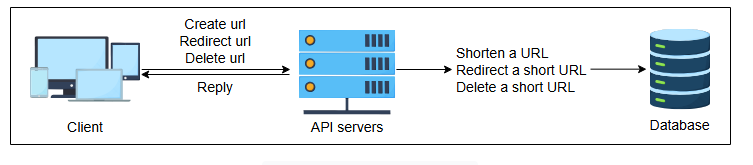

### Сокращение URL

Мы можем создавать новые короткие URL со следующим определением:

```
shortURL(api_dev_key, original_url, custom_alias=None, expiry_date=None)
```

Вызов API выше имеет следующие параметры:

| Параметр       | Описание                                                                                                                                                                                               |
|:---------------|:-------------------------------------------------------------------------------------------------------------------------------------------------------------------------------------------------------|
| `api_dev_key`  | Уникальный идентификатор зарегистрированного аккаунта пользователя. Это полезно для отслеживания активности пользователя и позволяет системе соответствующим образом контролировать связанные сервисы. |
| `original_url` | Исходный длинный URL, который необходимо сократить.                                                                                                                                                    |
| `custom_alias` | Необязательный ключ, который пользователь определяет как кастомный короткий URL.                                                                                                                       |
| `expiry_date`  | Необязательная дата истечения срока действия для сокращенного URL.                                                                                                                                     |

Успешная вставка возвращает пользователю сокращенный URL. В противном случае система возвращает пользователю соответствующий код ошибки.

### Перенаправление короткого URL

Для перенаправления короткого URL определение REST API будет следующим:

```
redirectURL(api_dev_key, url_key)
```

Со следующими параметрами:

| Параметр      | Описание                                                                    |
|:--------------|:----------------------------------------------------------------------------|
| `api_dev_key` | Уникальный идентификатор зарегистрированного аккаунта пользователя.         |
| `url_key`     | Сокращенный URL, по которому необходимо извлечь длинный URL из базы данных. |

Успешное перенаправление приводит пользователя на исходный URL, связанный с `url_key`.

### Удаление короткого URL

Аналогично, для удаления короткого URL определение REST API будет:

```
deleteURL(api_dev_key, url_key)
```

и связанные с ним параметры будут:

| Параметр      | Описание                                                                    |
|:--------------|:----------------------------------------------------------------------------|
| `api_dev_key` | Уникальный идентификатор зарегистрированного аккаунта пользователя.         |
| `url_key`     | Сокращенный URL, по которому необходимо извлечь длинный URL из базы данных. |

Успешное удаление возвращает системное сообщение `URL Removed` (URL удален), информирующее об успешном удалении URL из системы.

## Проектирование

Давайте обсудим основные компоненты дизайна, необходимые для нашего сервиса сокращения URL. Наш дизайн зависит от функциональности каждой
части и постепенно объединяет их для достижения различных рабочих процессов, упомянутых в функциональных требованиях.

### Компоненты

Мы объясним внутренний механизм различных компонентов нашей системы, а также их использование как части всей системы ниже. Мы также выделим
проектные решения, принятые для каждого компонента для достижения общей функциональности.

**База данных**: Для таких сервисов, как сокращение URL, не так много данных для хранения. Однако хранилище должно быть горизонтально
масштабируемым. Тип данных, который нам нужно хранить, включает:

* Детали пользователя.
* Сопоставления URL, то есть длинные URL, которые сопоставлены с короткими URL.

> **Примечание:** Для простоты предположим, что наш сервис не требует регистрации пользователя для генерации короткого URL, поэтому мы можем
> пропустить добавление определенных данных в нашу базу данных.

Кроме того, хранимые записи не будут иметь никаких связей между собой, кроме как связывать детали пользователя, создавшего URL, поэтому нам
не нужно структурированное хранилище для ведения записей. Учитывая вышеуказанные причины и тот факт, что наша система будет ориентирована на
чтение (read-heavy), NoSQL является подходящим выбором для хранения данных. В частности, MongoDB является хорошим выбором по следующим
причинам:

1. Она использует протокол "лидер-последователь" (leader-follower), что позволяет использовать реплики для интенсивного чтения.
2. MongoDB обеспечивает атомарность при одновременных операциях записи и избегает коллизий, возвращая ошибки дублирования ключей при
   проблемах с дублированием записей.

> **Тест**
>
> 1. Почему NoSQL базы данных, такие как Cassandra или Riak, не являются хорошим выбором вместо MongoDB?
>
> <details>
>  <summary><b>Показать ответ</b></summary>
>
> **Ответ:** Поскольку наш сервис более интенсивен на чтение и менее на запись, MongoDB лучше всего подходит для нашего случая использования
> по следующим причинам:
>
> * NoSQL базы данных, такие как Cassandra, Riak и DynamoDB, требуют "восстановления при чтении" (read-repair) на этапе чтения и,
    следовательно, обеспечивают более медленную производительность чтения по сравнению с записью.
> * Это NoSQL базы данных без лидера, которые предоставляют более слабые гарантии согласованности данных при одновременных записях. Будучи
    базой данных с одним лидером, MongoDB обеспечивает более высокую пропускную способность чтения, так как мы можем читать либо с
    реплики-лидера, либо с реплик-последователей. Операции записи должны проходить через реплику-лидера. Это обеспечивает доступность нашей
    системы для задач, интенсивных на чтение, даже в случаях, когда лидер выходит из строя.
>
>
>  Поскольку Cassandra по своей сути обеспечивает большую доступность, чем MongoDB, выбор MongoDB вместо Cassandra может сделать нашу
> систему менее доступной. Однако время, затрачиваемое на алгоритм выбора лидера, незначительно по сравнению со временем, прошедшим между
> генерацией короткого URL и его первым использованием, поэтому это не мешает доступности нашей системы.
></details>

**Генератор коротких URL**: Наш генератор коротких URL будет состоять из одного строительного блока и одного дополнительного компонента:

* **Секвенсор (sequencer)** для генерации уникальных ID
* **Кодировщик Base-58** для улучшения читаемости короткого URL

Мы создали секвенсор в разделе строительных блоков для генерации 64-битных уникальных *числовых* ID. Однако наш предлагаемый дизайн требует
64-битных *буквенно-цифровых* коротких URL в Base-58. Для преобразования числовых (base-10) ID в буквенно-цифровые (base-58) нам понадобится
кодировщик из base-10 в base-58. Мы рассмотрим обоснование этих решений, а также внутреннюю работу кодировщика base-58 в следующем уроке.

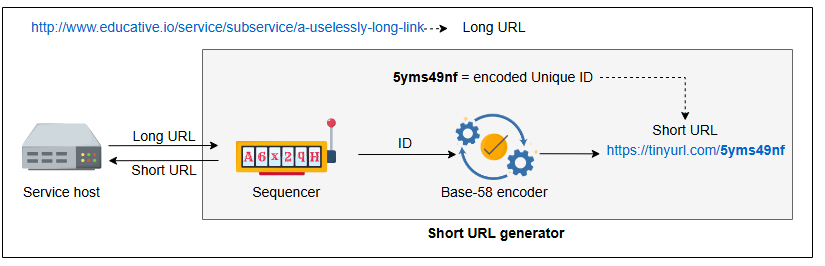

**Другие строительные блоки**: Помимо вышеупомянутых элементов, мы также включим другие строительные блоки, такие как балансировщики
нагрузки, кэш и ограничители скорости.

* **Балансировка нагрузки**: Мы можем использовать Глобальную Балансировку Нагрузки на Серверы (GSLB) помимо локальной балансировки нагрузки
  для повышения доступности.
* **Кэш**: Для нашей специфической задачи, интенсивной на чтение, Memcached является лучшим выбором для решения кэширования.
* **Ограничитель скорости (Rate limiter)**: Ограничение квоты каждого пользователя предпочтительно для добавления уровня безопасности в нашу
  систему. Мы можем достичь этого, уникально идентифицируя пользователей по их `api_dev_key`. Алгоритм счетчика с фиксированным окном (fixed
  window counter) подойдет для этой цели.


> **1. Как мы будем поддерживать уникальное сопоставление, если запросы на перенаправление могут поступать в разные центры обработки данных,
     расположенные географически далеко друг от друга? Предполагает ли наш дизайн, что наша БД географически согласована?**
><details>
>  <summary><b>Показать ответ</b></summary>
>
>  **Решение**: Простой способ достичь этой функциональности — ввести уникальный символ в короткий URL. Этот специальный символ будет
> служить
> индикатором точного центра обработки данных.
>
> **Пример**: `service.com/x/short123/`, где `x` указывает на центр обработки данных, содержащий эту запись.
></details>
>
> **2. Как кэш, специфичный для дата-центра, обработает неизвестный (ранее не встречавшийся) запрос на перенаправление?**
>
> <details>
>  <summary><b>Показать ответ</b></summary>
>
> Поскольку мы предположили, что в нашей системе используется решение для кэширования, специфичное для каждого дата-центра, необходимо
> осветить один случай: обработку нашей системой ранее не встречавшихся запросов на перенаправление.
>
> **Сценарий**: Сценарий заключается в получении неизвестного запроса на перенаправление в центре обработки данных. Поскольку в локальном
> кэше не будет этой записи, он извлечет эту запись из глобально согласованной базы данных и поместит ее в локальный кэш для будущего
> использования.
></details>
>
> **3. Какова вероятность коллизии (совпадения), когда мы запрашиваем у генератора коротких URL новую короткую ссылку?**
>
> <details>
>  <summary><b>Показать ответ</b></summary>
>
> Мы запрашиваем у секвенсора уникальный ID, и по определению дизайна нашего секвенсора, дублирования ID никогда не произойдет. Затем мы
> кодируем эти ID, что также гарантирует отсутствие дублирования. Следовательно, обычный процесс генерации коротких URL гарантирует отсутствие
> дублирования записей.
>
> Теперь рассмотрим случай кастомных (пользовательских) коротких URL. Поскольку пользователь сам предоставляет короткий URL, может
> возникнуть дублирование. Мы можем легко рассчитать вероятность этой коллизии, приняв во внимание размер базы данных, содержащей записи о
> коротких URL.
>
> Предположим, что в базе данных уже есть `n` сгенерированных коротких URL. Вероятность того, что предоставленный пользователем кастомный
> короткий URL будет совпадать с уже существующим, можно рассчитать по формуле:
>
> Вероятность коллизии = n / Общее количество комбинаций URL.
>
> С ростом `n` вероятность коллизии будет увеличиваться, варьируясь от 0 (когда `n=0`) до 1 (когда `n` равно общему числу комбинаций).
>
> Этот расчет предполагает, что пользователь выбирает кастомный короткий URL случайным и равновероятным образом из набора допустимых
> комбинаций. В действительности некоторые слова более популярны, чем другие. Поэтому нашу вероятность можно рассматривать как нижнюю границу
> вероятности коллизии.'
>
></details>

### Диаграмма дизайна

Простая диаграмма дизайна системы сокращения URL приведена ниже.

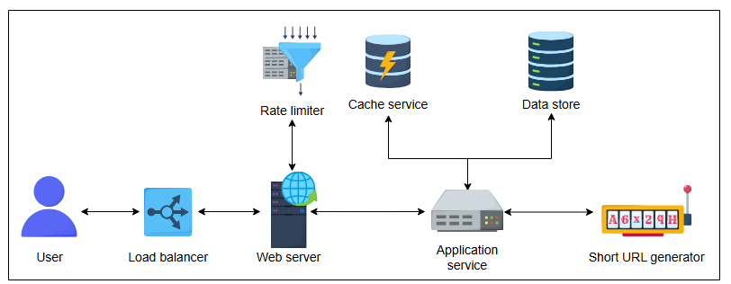

### Рабочий процесс

Давайте подробно проанализируем систему и то, как отдельные части взаимодействуют для обеспечения общей функциональности.

1. **Сокращение**: Каждый новый запрос на создание короткой ссылки перенаправляется сервером приложений в генератор коротких URL (SUG).
   После успешной генерации короткой ссылки система отправляет одну копию обратно пользователю, а другую сохраняет в базе данных для
   будущего использования.

   > **Тест**: Как наша система избегает генерации дублирующихся коротких URL?
   >
    > <details>
    >  <summary><b>Показать ответ</b></summary>
    >
    >
    > * Система сначала проверяет, не был ли уже сокращен данный длинный URL (сначала в кэше, затем в БД).
    > * Если короткий URL для соответствующего длинного URL уже существует, база данных возвращает сохраненный короткий URL.
    > * Если короткий URL не существует, сервер приложений просит SUG вычислить его.
    ></details>


2. **Перенаправление**: Серверы приложений при получении запросов на перенаправление проверяют хранилища (систему кэширования и базу данных)
   на наличие необходимой записи. Если запись найдена, сервер приложений перенаправляет пользователя на связанный длинный URL.

   > **Тест**: Как наша система гарантирует, что наше хранилище данных не станет узким местом?
   > <details>
    >  <summary><b>Показать ответ</b></summary>
    >
    >    Мы можем использовать секвенсор на основе диапазонов, который обеспечивает базовое сопоставление между серверами и короткими
    > URL, или вводить уникальные идентификаторы для разных хранилищ данных и интегрировать их в короткие URL, чтобы направлять запросы в
    > соответствующее хранилище.
    > </details>

3. **Удаление**: Вошедший в систему пользователь может удалить запись, запросив сервер приложений, который пересылает данные пользователя и
   информацию о связанном URL на сервер базы данных для удаления.
4. **Кастомные короткие ссылки**: Эта задача начинается с проверки допустимости запрошенного короткого URL (например, длина до 11 символов).
   После проверки система проверяет его доступность в базе данных. Если URL доступен, пользователь получает сообщение об успехе, в противном
   случае — сообщение об ошибке.


1) Сокращение URL-адреса: пользователь инициирует запрос
   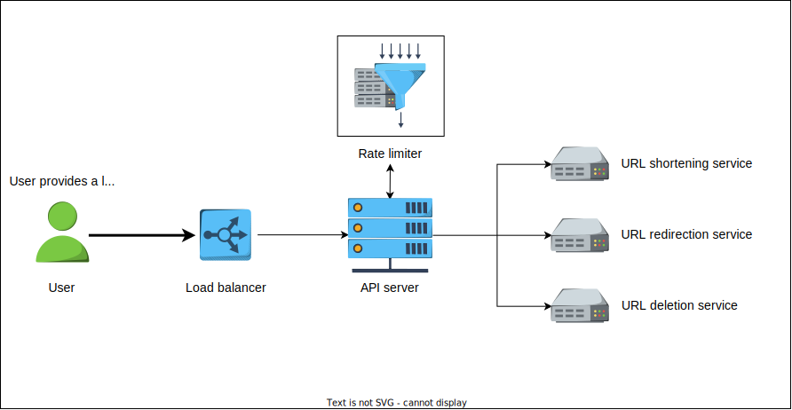


2) Сокращение URL-адреса: подсистема балансировки нагрузки перенаправляет запрос
   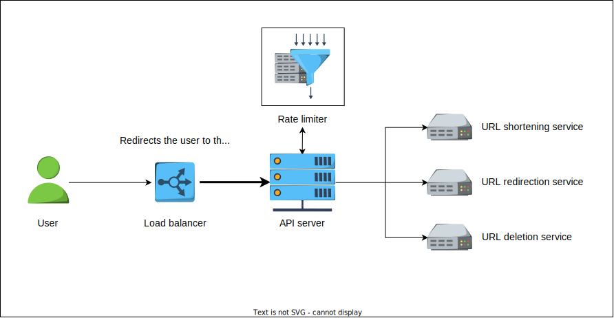


3) Сокращение URL-адреса: Проверяется соответствие запроса пользователя требованиям
   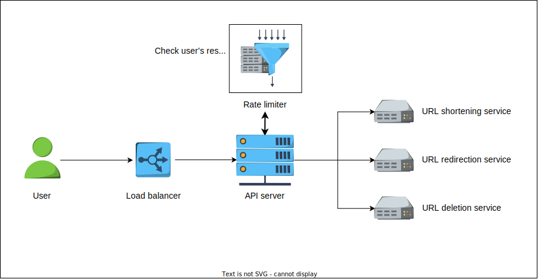


4) Сокращение URL-адреса: запрос перенаправляется на соответствующий сервис
   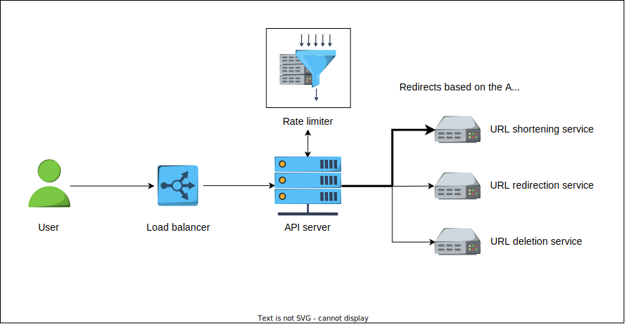


5) Сокращение URL-адреса: выполняется проверка входа в хранилище данных
   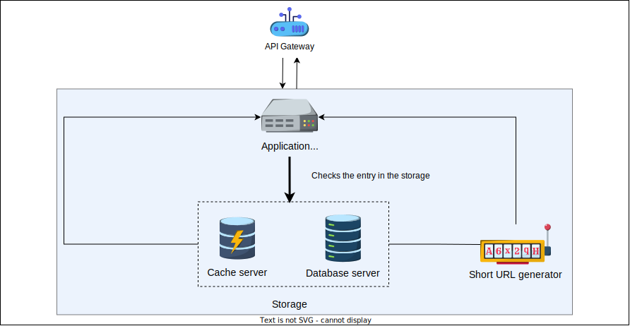


6) Сокращение URL-адреса: короткий URL-адрес найден в хранилище данных (пример 1)
   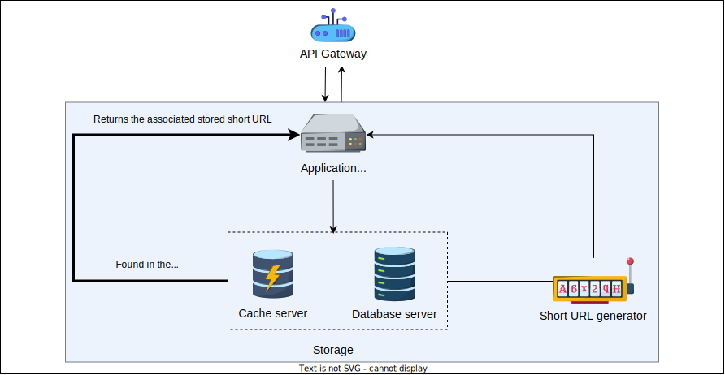


7) Сокращение URL-адреса: Вычисляется короткий URL-адрес (пример 2)
   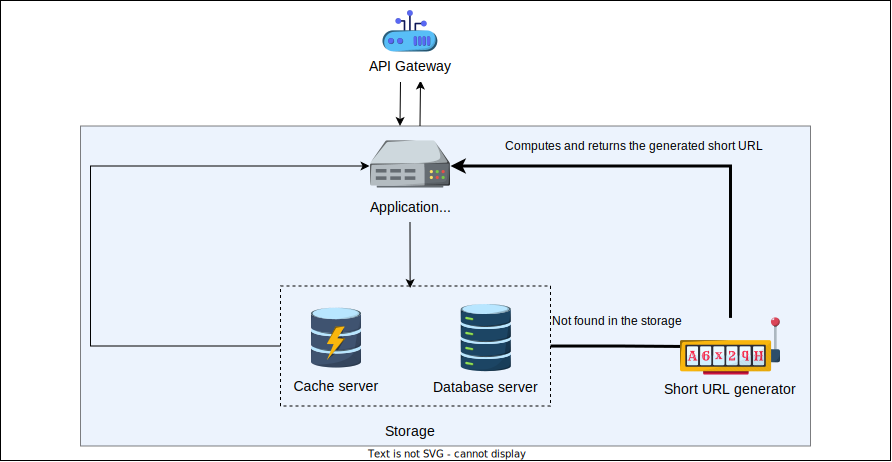


8) Перенаправление URL-адреса: пользователь нажимает на короткий URL-адрес.
   


9) Перенаправление URL-адреса: подсистема балансировки нагрузки перенаправляет запрос.
   


10) Перенаправление URL-адреса: Проверяется соответствие запроса требованиям
    


11) Перенаправление URL-адреса: запрос перенаправляется на соответствующую службу
    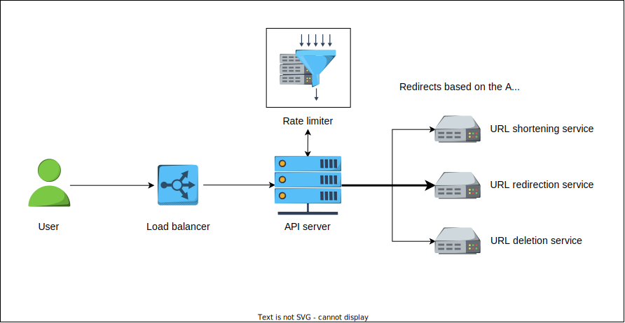


12) Перенаправление URL-адреса: хранилище данных проверяется на наличие записи
    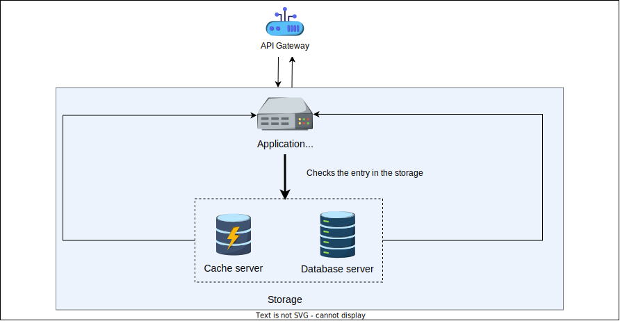


13) Перенаправление URL-адреса: Успешное перенаправление (пример 1)
    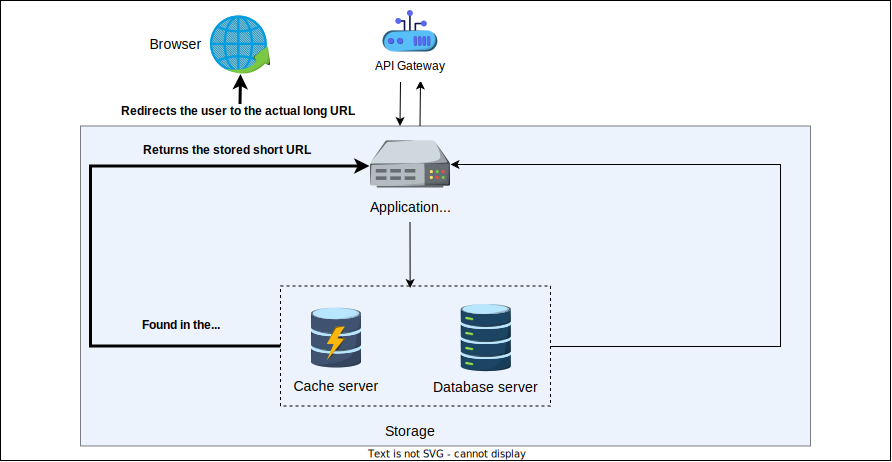


14) Перенаправление URL-адреса: Неудачное перенаправление (пример 2)
    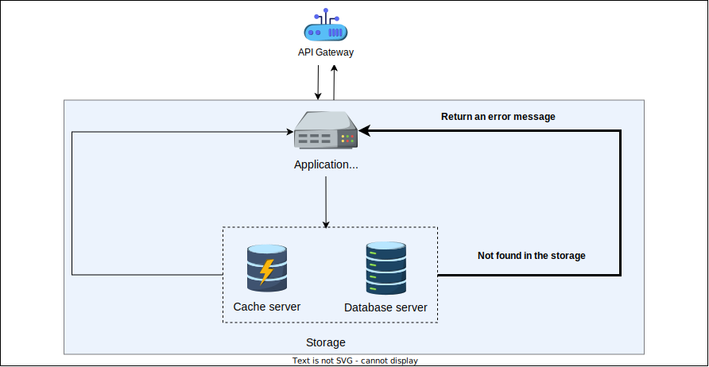


15) Удаление URL-адреса: пользователь инициирует запрос на удаление.
    


16) Удаление URL-адреса: подсистема балансировки нагрузки перенаправляет запрос
    


17) Удаление URL-адреса: Проверяется соответствие запроса требованиям
    


18) Удаление URL-адреса: запрос перенаправляется на соответствующий сервис
    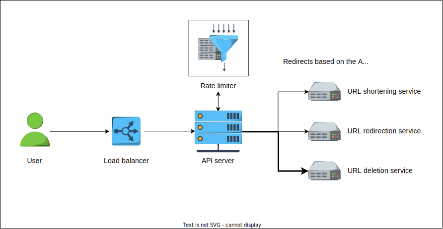


19) Удаление URL-адреса: запись в хранилище данных проверена
    


20) Удаление URL-адреса: Удаление выполнено успешно (пример 1)
    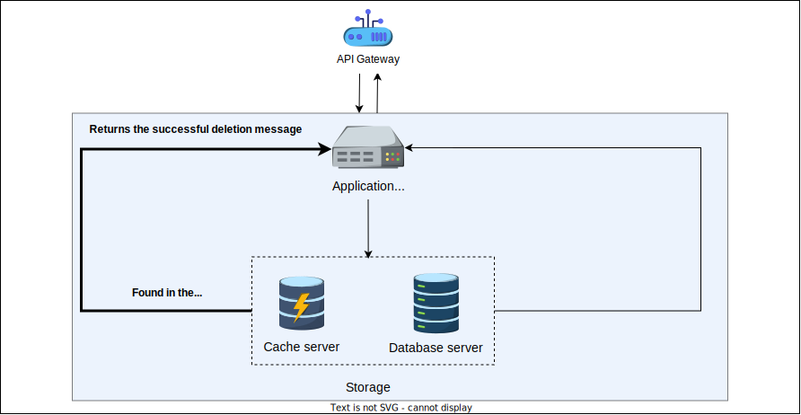


21) Удаление URL-адреса - неудачное удаление (пример 2)
    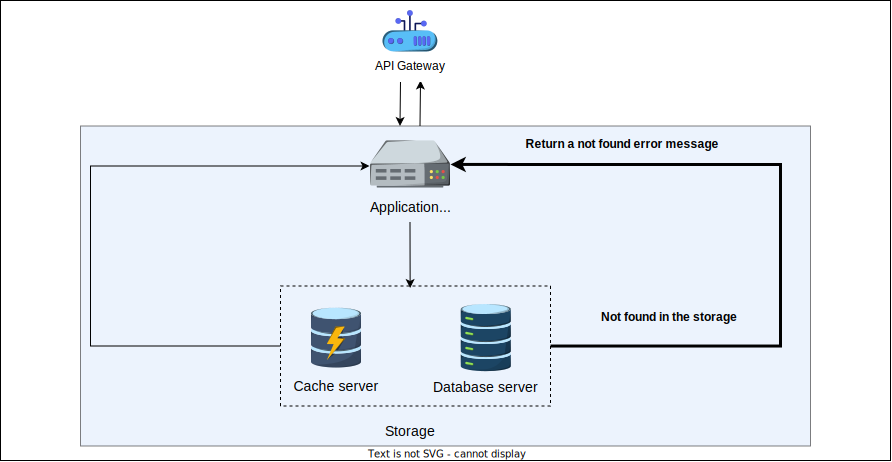


> Представьте ситуацию, когда ваш сервис TinyURL внезапно получает огромный приток трафика для сокращения URL. База данных начинает
> замедляться под нагрузкой на запись. Предложите краткосрочные и долгосрочные решения для масштабирования системы.
> <details>
>  <summary><b>Показать ответ</b></summary>
>
>    Краткосрочно — внедри кеш для часто запрашиваемых URL, чтобы снизить нагрузку на базу. Также оптимизируй индексирование и используй балансировку нагрузки.
Долгосрочно — реализуй шардирование базы, разделив данные по шардкам, и раздели чтение и запись на разные базы или реплики. Это поможет системе масштабироваться при росте трафика.
> </details>


>После успешного выделения кастомного короткого URL, как система изменяет свои записи?
> <details>
>  <summary><b>Показать ответ</b></summary>
>
> Поскольку кастомный короткий URL является кодировкой в Base-58 доступного уникального ID в Base-10, необходимо пометить этот
> уникальный ID как недоступный для будущего использования для целостности системы. На бэкенде система обращается к серверу с эквивалентным
> уникальным ID в Base-10 для этого конкретного короткого URL в Base-58. Она помечает ID как недоступный в диапазоне, исключая любую
> возможность повторного выделения того же ID для другого запроса.
></details>
