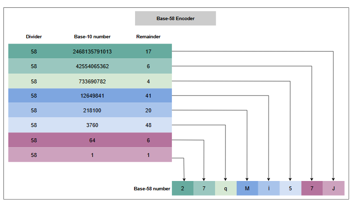
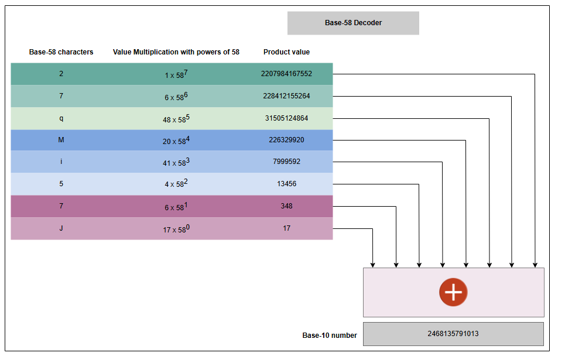

# Кодировщик для TinyURL

Разберитесь во внутренних деталях кодировщика, которые критически важны для сокращения URL.

## Введение

Мы подробно обсудили общий дизайн генератора коротких URL (Short URL Generator, SUG), но два аспекта требуют более детального разъяснения:

1.  Как кодирование улучшает читаемость короткого URL?
2.  Как связаны секвенсор и кодировщик Base-58 в процессе генерации короткого URL?

### Зачем использовать кодирование

Наш секвенсор генерирует 64-битный ID в системе счисления Base-10, который можно преобразовать в короткий URL в Base-64. Base-64 — это наиболее распространенное кодирование для генерации буквенно-цифровых строк. Однако, при использовании Base-64 для данной задачи возникают некоторые проблемы: сгенерированный короткий URL может иметь проблемы с читаемостью из-за визуально схожих символов. Символы, такие как `O` (заглавная "о") и `0` (ноль), `I` (заглавная "и") и `l` (строчная "л"), могут быть перепутаны, а символы `+` и `/` следует избегать из-за других системно-зависимых кодировок.

Поэтому мы исключаем шесть символов и используем Base-58 вместо Base-64 (который включает A-Z, a-z, 0-9, `+` и `/`) для улучшения читаемости. Давайте рассмотрим наше определение Base-58.

**Base-58**

| Значение | Символ | Значение | Символ | Значение | Символ | Значение | Символ |
| :--- | :--- | :--- | :--- | :--- | :--- | :--- | :--- |
| 0 | 1 | 15 | G | 30 | X | 45 | n |
| 1 | 2 | 16 | H | 31 | Y | 46 | o |
| 2 | 3 | 17 | J | 32 | Z | 47 | p |
| 3 | 4 | 18 | K | 33 | a | 48 | q |
| 4 | 5 | 19 | L | 34 | b | 49 | r |
| 5 | 6 | 20 | M | 35 | c | 50 | s |
| 6 | 7 | 21 | N | 36 | d | 51 | t |
| 7 | 8 | 22 | P | 37 | e | 52 | u |
| 8 | 9 | 23 | Q | 38 | f | 53 | v |
| 9 | A | 24 | R | 39 | g | 54 | w |
| 10 | B | 25 | S | 40 | h | 55 | x |
| 11 | C | 26 | T | 41 | i | 56 | y |
| 12 | D | 27 | U | 42 | j | 57 | z |
| 13 | E | 28 | V | 43 | k | | |
| 14 | F | 29 | W | 44 | m | | |

> Выделенные ячейки содержат символы, идущие после исключенных: `0`, `O`, `I` и `l`.

## Преобразование из Base-10 в Base-58

Поскольку мы преобразуем числовые ID в Base-10 в буквенно-цифровые ID в Base-58, объяснение процесса преобразования будет полезно для понимания основного механизма, а также общего диапазона работы SUG. Для этого мы используем **операцию взятия остатка от деления** (modulus).

**Процесс**: Мы последовательно делим число в Base-10 на 58, записывая остаток на каждом шаге. Мы останавливаемся, когда частное становится равным нулю. Затем мы сопоставляем остаткам символы, располагая их в обратном порядке (от последнего к первому).

**Пример**: Предположим, что выбранный уникальный ID — `2468135791013`.

<u>Base-10</u> = 2468135791013

1.  2468135791013 % 58 = 17 (J)
2.  42554065362 % 58 = 6 (7)
3.  733690782 % 58 = 4 (5)
4.  12649841 % 58 = 41 (i)
5.  218100 % 58 = 20 (M)
6.  3760 % 58 = 48 (q)
7.  64 % 58 = 6 (7)
8.  1 % 58 = 1 (2)

Теперь мы записываем символы, соответствующие остаткам, в обратном порядке (с 8-го по 1-й):

<u>Base-58</u> = 27qMi57J

## Преобразование из Base-58 в Base-10

Процесс декодирования так же важен, как и кодирование, поскольку мы использовали декодер в случае генерации кастомных коротких URL.

**Процесс**: Процесс преобразования числа из Base-58 в Base-10 также прост. Нам нужно просто умножить индекс каждого символа (столбец "Значение" из таблицы) на 58 в степени, соответствующей его позиции (справа налево, начиная с 0), и сложить все полученные произведения.

**Пример**: Давайте проделаем обратную операцию для примера выше.

Base-58: `27qMi57J`

*   J (17) × 58⁰ = 17
*   7 (6) × 58¹ = 348
*   5 (4) × 58² = 13456
*   i (41) × 58³ = 7999592
*   M (20) × 58⁴ = 226329920
*   q (48) × 58⁵ = 31505124864
*   7 (6) × 58⁶ = 228412155264
*   2 (1) × 58⁷ = 2207984167552

Сумма = 17 + 348 + ... + 2207984167552 = 2468135791013. Это тот же уникальный ID в Base-10, что и в предыдущем примере.

## Диапазон работы генератора коротких URL

Генератор коротких URL является основой нашего сервиса. Его выходные данные зависят от ограничений, наложенных дизайном:

*   Сгенерированный короткий URL должен содержать буквенно-цифровые символы.
*   Никакие символы не должны быть визуально похожи.
*   Минимальная длина сгенерированного короткого URL по умолчанию должна составлять шесть символов.

Эти ограничения определяют диапазон работы нашего генератора коротких URL.

*   **Начальный диапазон**: Чтобы удовлетворить требованию о минимальной длине, мы можем выбрать, чтобы ID секвенсора начинались как минимум с 10 цифр, то есть с 1 миллиарда.
*   **Конечная точка**: Максимальное количество символов в коротком URL зависит от максимального использования 64 бит.
    *   **Для Base-10**: Количество бит на одну цифру = log₂(10) ≈ 3.13. Общее количество десятичных цифр в 64-битном ID = 64 / 3.13 ≈ **20**.
    *   **Для Base-58**: Количество бит на один символ = log₂(58) ≈ 5.85. Общее количество символов Base-58 в 64-битном ID = 64 / 5.85 ≈ **11**.

> **Максимальная длина**: Приведенные выше расчеты показывают, что максимальное количество цифр в ID, сгенерированном секвенсором, будет 20, и, следовательно, максимальное количество символов в закодированном коротком URL будет 11.

Конечно, вот перевод и извлеченный текст из этого виджета-теста.

---

### Тест

> **1. Поскольку мы используем ID секвенсора, состоящие из 10 и более цифр, есть ли способ использовать ID секвенсора короче 10 цифр?**
> 

>  
<b>Показать ответ</b>

>
>
> Мы можем использовать диапазон ID секвенсора, которые короче десяти цифр, для создания кастомных (пользовательских) коротких ссылок для пользователей с премиум-подпиской. Это обеспечит два преимущества:
>
> *   Использование заблокированного диапазона ID.
> *   Короткие URL длиной менее шести символов.
>
> **Пример**: Предположим, пользователь запрашивает кастомный короткий URL `abc`, и он доступен в нашей системе, так как в хранилище данных нет записей, совпадающих с этим коротким URL. Нам необходимо выполнить две следующие операции:
>
> 1.  Присвоить этот короткий URL запрошенному длинному URL и сохранить эту запись в хранилище данных.
> 2.  Пометить связанный с ним уникальный ID как неиспользуемый. Чтобы найти связанный уникальный ID, нам нужно декодировать `abc` в систему счисления Base-10. Используя описанный выше метод декодирования, мы получаем значение уникального ID в Base-10 равное `113019`. Этот уникальный ID меньше 1 миллиарда, так как кастомный короткий URL короче шести символов, что соответствует двум вышеупомянутым преимуществам.
>
> > Наша система не гарантирует создание кастомной короткой ссылки, так как другой премиум-пользователь мог уже занять запрошенный кастомный короткий URL.
>

>
>**2. Какой короткий URL будет соответствовать самому большому числу секвенсора?**
> 
> 

>  
<b>Показать ответ</b>

>
>
> Поскольку самое большое число секвенсора — это 18,446,744,073,709,551,615 (то есть 2⁶⁴-1), его эквивалент в системе счисления Base-58 будет **`jpXCZedGfVQ`**, что соответствует нашим предыдущим расчетам.
>

## Срок службы секвенсора

Количество лет, в течение которых наш секвенсор сможет предоставлять уникальные ID, зависит от двух факторов:

*   **Общее количество доступных номеров в секвенсоре**: 2⁶⁴ - 10⁹ (поскольку мы начинаем с 1 миллиарда).
*   **Количество запросов в год**: 200 млн/месяц × 12 = 2.4 млрд.

Срок службы секвенсора = (Общее количество доступных номеров) / (Запросы в год) = (2⁶⁴ - 10⁹) / 2.4 млрд ≈ **7,686,143,363.63 лет**.

**Калькулятор срока службы секвенсора**

| Параметр | Значение | Единица |
| :--- | :--- | :--- |
| Количество запросов в месяц | 200 | Миллионов |
| Количество запросов в год | 2.4 | Миллиарда |
| Срок службы секвенсора | 7,686,143,363.63 | лет |

> Таким образом, наш сервис может работать очень долго, прежде чем диапазон исчерпается.