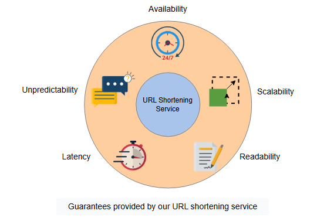

# Оценка дизайна TinyURL

Давайте оценим дизайн сервиса сокращения URL на основе его нефункциональных требований.

## Обзор требований

Последний этап проектирования системы — это ее оценка в соответствии с первоначально заявленными нефункциональными требованиями. Давайте рассмотрим каждый критерий по очереди.

### Доступность

Нам необходима высокая доступность для пользователей, генерирующих новые короткие URL и перенаправляющихся по существующим коротким ссылкам.

Большинство наших строительных блоков, таких как базы данных, кэши и серверы приложений, имеют встроенную репликацию, которая обеспечивает доступность и отказоустойчивость. Система генерации коротких URL также не повлияет на доступность, поскольку она зависит от легко реплицируемой базы данных доступных и использованных уникальных ID.

Для обработки аварийных ситуаций мы можем выполнять частые резервные копии хранилища и серверов приложений, предпочтительно дважды в день, так как мы не можем рисковать потерей данных URL. Мы можем использовать сервис хранения Amazon S3 для резервного копирования, так как он также обеспечивает межзональную репликацию и восстановление. В худшем случае мы можем потерять 3.3 миллиона (при предположении о 6.6 миллионах ежедневных запросов) новосгенерированных коротких URL, которые не были скопированы в этот конкретный день.

Наш дизайн использует **глобальную балансировку нагрузки на серверы (GSLB)** для управления трафиком нашей системы. Это обеспечивает интеллектуальное распределение запросов между различными глобальными серверами, особенно в случае сбоев на месте.

Мы также применяем ограничение на запросы от клиентов для защиты внутренних точек отказа. Для защиты системы от DoS-атак мы используем ограничители скорости (rate limiters) между клиентом и веб-серверами, чтобы ограничить выделение ресурсов каждому пользователю. Это обеспечит хороший и плавный поток трафика и смягчит эксплуатацию системных ресурсов.

### Масштабируемость

Наш дизайн масштабируем, потому что наши данные могут быть легко распределены между горизонтально шардированными базами данных. Мы можем применить схему консистентного хеширования для балансировки нагрузки между уровнями приложений и баз данных.

> **Подсказка:** Мы также можем использовать шардирование на основе диапазонов при масштабировании нашего сервера баз данных. Однако, если мы разделим нашу базу данных на основе предопределенного диапазона, это может привести к несбалансированным разделам из-за переменного распределения URL в каждом диапазоне. Примером этого может быть распределение на основе первой буквы URL.

Наш выбор базы данных для сопоставления URL, MongoDB, также способствует горизонтальному масштабированию. Некоторые интересные причины выбора NoSQL базы данных:

1.  Когда пользователь обращается к нашей системе без входа в систему, наша система не сохраняет `UserID`. Поскольку мы гибки в хранении значений данных, и это больше соответствует схематической гибкости, предоставляемой NoSQL базами данных, их использование для нашего дизайна предпочтительнее.
2.  Горизонтальное масштабирование традиционной реляционной базы данных — сложный процесс и создает проблемы для выполнения наших требований к масштабируемости. Мы хотим масштабировать и автоматически распределять данные нашей системы по нескольким серверам. Для этого требования NoSQL база данных наилучшим образом послужит нашей цели.

Кроме того, большое количество уникальных ID, доступных в дизайне секвенсора, также обеспечивает масштабируемость нашей системы.

### Читаемость

Использование кодировщика Base-58 вместо кодировщика Base-64 повышает читаемость нашей системы. Мы разделяем читаемость на два аспекта:

*   **Различимые символы**: такие символы, как `0` (ноль), `O` (заглавная "о"), `I` (заглавная "и") и `l` (строчная "л"), исключены, что устраняет возможность спутать один символ с другим похожим.
*   **Неалфавитно-цифровые символы**: такие символы, как `+` (плюс) и `/` (слэш), также исключены, чтобы в коротких URL были только буквенно-цифровые символы. Во-вторых, это также помогает избежать других системно-зависимых кодировок и делает URL-адреса легко доступными для всех современных файловых систем и URL-схем. Такие символы могут привести к нежелательному поведению и результатам при парсинге.

Это нефункциональное требование улучшает интерактивность нашей системы с пользователем и делает использование коротких URL менее подверженным ошибкам.

**Таблица: Выполнение нефункциональных требований**

| Требования | Техники |
| :--- | :--- |
| Доступность | <ul><li>Сервис Amazon S3 ежедневно создает резервные копии серверов хранения и кэша.</li><li>Глобальная балансировка нагрузки на серверы для управления трафиком системы.</li><li>Ограничители скорости для лимитирования выделения ресурсов каждому пользователю.</li></ul> |
| Масштабируемость | <ul><li>Горизонтальное шардирование базы данных.</li><li>Распределение данных на основе консистентного хеширования.</li><li>MongoDB в качестве NoSQL базы данных.</li></ul> |
| Читаемость | <ul><li>Внедрение кодировщика Base-58 для генерации коротких URL.</li><li>Удаление неалфавитно-цифровых символов.</li><li>Удаление визуально похожих символов.</li></ul> |
| Задержка | <ul><li>Незаметная задержка в общей операции.</li><li>MongoDB из-за низкой задержки и высокой пропускной способности при чтении.</li><li>Распределенный кэш для минимизации задержек сервиса.</li></ul> |
| Непредсказуемость | <ul><li>Случайный выбор и привязка ID к каждому запросу из пула неиспользованных и доступных уникальных ID.</li></ul> |

### Задержка

Наша система обеспечивает низкую задержку благодаря следующим особенностям:

*   Даже самый трудоемкий этап в процессе генерации короткого URL, кодирование, занимает несколько миллисекунд. Общее время генерации короткого URL относительно невелико, что гарантирует отсутствие значительных задержек в этом процессе.
*   Наша система в основном ориентирована на перенаправления. Запись в базу данных минимальна по сравнению с чтением, и ее производительность зависит от того, насколько хорошо она справляется со всеми запросами на перенаправление. Мы намеренно выбрали MongoDB из-за ее низкой задержки и высокой пропускной способности при задачах с интенсивным чтением.
*   Кроме того, вероятность того, что пользователь воспользуется свежесгенерированным коротким URL в следующие несколько секунд, относительно низка. В течение этого времени возможна синхронная репликация в другие местоположения, что способствует общей низкой задержке системы для пользователя.
*   Развертывание распределенного кэша в нашем дизайне также гарантирует, что система перенаправляет пользователя с минимально возможной задержкой.

В результате таких проектных модификаций система имеет низкую задержку и высокую пропускную способность, обеспечивая хорошую производительность.

### Непредсказуемость

Одним из требований является сделать короткие URL нашей системы непредсказуемыми, что повышает безопасность нашей системы.

Поскольку секвенсор генерирует уникальные ID последовательно и распределяет диапазоны между серверами, последовательное назначение ID запросам сделает предсказание следующего короткого URL легкой задачей. Чтобы противостоять этому, мы можем случайным образом выбирать уникальный ID из доступных и связывать его с длинным URL, обеспечивая непредсказуемость нашей системы.

## Заключение

Система сокращения URL — это эффективный сервис с множеством преимуществ. Наш дизайн сервиса сокращения URL прост, но при этом выполняет все требования производительного дизайна. Ключевые особенности, предлагаемые нашим дизайном:

1.  Динамический диапазон коротких URL
2.  Улучшенная читаемость

Возможным дополнением могло бы стать введение (локальной) "соли" (salt) для дальнейшего повышения непредсказуемости (безопасности) дизайна.