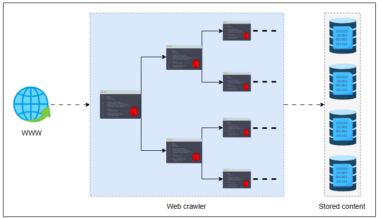

## **Проектирование систем: Веб-краулер**

Узнайте о сервисе веб-краулера.

### Введение

**Веб-краулер** — это интернет-бот, который систематически сканирует Всемирную паутину (WWW) в поиске контента, начиная свою работу с набора исходных URL-адресов. Этот процесс получения контента из WWW называется процессом сканирования. Далее краулер сохраняет контент в хранилищах данных, обеспечивая его доступность для последующего использования. Эффективное хранение и последующее извлечение этих данных являются неотъемлемой частью проектирования надежной системы.

Основная функциональность веб-краулера включает в себя получение веб-страниц, анализ их содержимого и метаданных, а также извлечение новых URL-адресов или списков URL-адресов для дальнейшего сканирования. Это первый шаг, выполняемый поисковыми системами. Результат процесса сканирования служит входными данными для последующих этапов, таких как:

*   Очистка данных
*   Индексирование
*   Оценка релевантности с использованием алгоритмов, таких как PageRank
*   Управление очередью URL (URL frontier)
*   Аналитика

Эта конкретная задача проектирования сосредоточена на системном дизайне веб-краулеров и не включает объяснения последующих этапов индексирования, ранжирования в поисковых системах и т.д. Чтобы узнать о некоторых из этих последующих этапов, обратитесь к нашей главе о распределенном поиске.

### Преимущества веб-краулера

Веб-краулеры предлагают различные утилиты помимо сбора данных:

*   **Тестирование веб-страниц**: Веб-краулеры проверяют валидность ссылок и структур HTML-страниц.
*   **Мониторинг веб-страниц**: Мы используем веб-краулеры для отслеживания обновлений контента или структуры на веб-страницах.
*   **Зеркалирование сайтов**: Веб-краулеры — это эффективный способ зеркалировать популярные веб-сайты.
*   **Проверка на нарушение авторских прав**: Веб-краулеры извлекают и анализируют содержимое страниц для проверки на предмет нарушения авторских прав.

### Сложности проектирования системы веб-краулера

При проектировании веб-краулера возникает несколько сложностей:

*   **Ловушки для краулеров**: Бесконечные циклы, вызванные динамическими ссылками или страницами календарей.
*   **Дублированный контент**: Повторное сканирование одних и тех же веб-страниц впустую расходует ресурсы.
*   **Ограничение частоты запросов**: Слишком частое получение страниц с одного домена может привести к перегрузке сервера. Нам нужна балансировка нагрузки для распределения нагрузки на веб-серверы или серверы приложений.
*   **Задержка при DNS-запросах**: Частые запросы к системе доменных имен (DNS) увеличивают задержку.
*   **Масштабируемость**: Обработка крупномасштабного сканирования является сложной задачей и требует распределенной системы, которая может обрабатывать миллионы исходных URL-адресов и распределять нагрузку между несколькими веб-серверами.

Проектирование веб-краулера — это распространенный вопрос на собеседованиях по системному дизайну для проверки понимания кандидатами таких компонентов, как HTML-сборщик, экстрактор, планировщик и т.д. Интервьюер может задать следующие интересные вопросы:

*   Как бы вы спроектировали систему веб-краулера, способную обрабатывать большие наборы данных, и как бы вы использовали Redis для кеширования и Amazon Web Services (AWS) для масштабируемости?
*   Как бы вы обрабатывали таймауты запросов и управляли ограничениями частоты, установленными веб-сайтами?
*   Какие стратегии оптимизации вы бы использовали для компонентов, таких как парсер, сборщик и т.д., для крупномасштабных сценариев использования, как в компаниях FAANG?
*   Как метрики, такие как время отклика, процент попаданий в кеш и т.д., помогают оценить производительность веб-краулеров при сканировании больших наборов данных для агрегации.

Давайте теперь обсудим, как мы будем проектировать систему веб-краулера.

### Как мы будем проектировать веб-краулер?

В этой главе мы рассмотрим комплексный подход к проектированию системы веб-краулера, обеспечивающий как **масштабируемость**, так и **отказоустойчивость**. Эта глава состоит из четырех уроков, которые охватывают общий дизайн системы веб-краулера:

1.  **Требования**: В этом уроке перечисляются функциональные и нефункциональные требования к системе, а также проводятся расчеты для различных параметров системы.
2.  **Проектирование**: В этом уроке анализируется восходящий подход к созданию сервиса веб-сканирования. Мы получаем подробный обзор всех отдельных компонентов, что приводит к созданию объединенного рабочего механизма для удовлетворения требований, а также API для связи с серверами и структуры данных для хранения данных.
3.  **Улучшения**: Этот урок предоставляет все улучшения дизайна, необходимые для противодействия недостаткам, особенно ловушкам для краулеров. Эти ловушки включают ссылки с параметрами запроса, перенаправление внутренних ссылок, ссылки, содержащие бесконечные страницы календарей, ссылки для динамической генерации контента и ссылки, содержащие циклические каталоги.
4.  **Оценка**: Этот урок предоставляет углубленную оценку нашего выбора дизайна, чтобы проверить, соответствуют ли они всем стандартам и требованиям, которые мы ожидаем от нашего проекта.

Начнем с определения требований к системе веб-краулера.