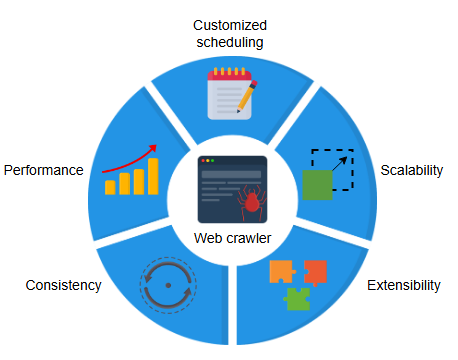
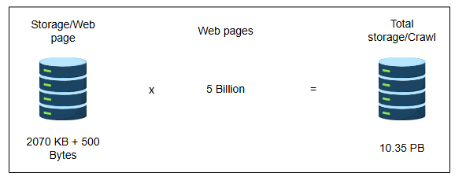
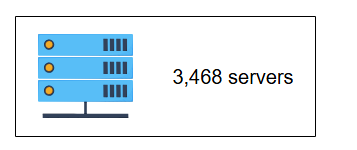
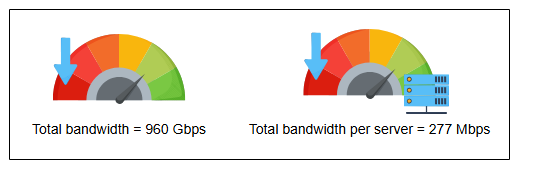
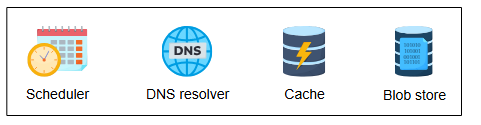
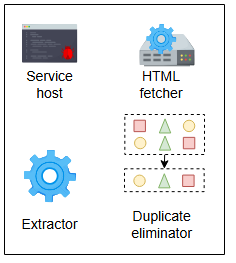

## **Требования к проектированию веб-краулера**

Узнайте о требованиях к проектированию веб-краулера.

### Требования

Давайте выделим функциональные и нефункциональные требования веб-краулера.

#### Функциональные требования

Это функциональные возможности, которые пользователь должен иметь возможность выполнять:

*   **Сканирование**: Система должна прочесывать WWW, начиная с очереди исходных URL-адресов, предоставленных администратором системы.

> **Вопрос:** Откуда мы получаем эти исходные URL-адреса?
>
> 

>  
<b>Показать ответ</b>

>
> **Ответ:** Есть два возможных способа создать или собрать исходные URL-адреса:
>
> 1.  Мы можем создавать их вручную.
> 2.  Мы можем сканировать IP-адреса на наличие веб-серверов.
>
> Эти исходные URL-адреса должны быть высокого качества.
>

*   **Хранение**: Система должна уметь извлекать и хранить содержимое URL в blob-хранилище. Это делает URL и его содержимое доступными для обработки поисковыми системами с целью индексации и ранжирования.
*   **Планирование**: Поскольку сканирование — это повторяющийся процесс, система должна иметь регулярное планирование для обновления записей в своих blob-хранилищах.

#### Нефункциональные требования

*   **Масштабируемость (Scalability)**: Система должна быть по своей сути распределенной и многопоточной, поскольку ей предстоит получать сотни миллионов веб-документов.
*   **Расширяемость(Extensibility)**: В настоящее время наш дизайн поддерживает протокол связи HTTP(S) и хранение текстовых файлов. Для расширения функциональности он должен быть также расширяем для других протоколов сетевой связи, с возможностью добавления нескольких модулей для обработки и хранения различных форматов файлов.
*   **Согласованность (Consistency)**: Поскольку наша система включает несколько рабочих потоков сканирования (workers), необходима согласованность данных между ними.
    В общем контексте согласованность данных означает надежность и точность данных в системе или наборе данных. В контексте веб-краулера это относится к соблюдению всеми рабочими потоками определенного набора правил в их попытке сгенерировать согласованные данные сканирования.
*   **Производительность (Performance)**: Система должна быть достаточно умной, чтобы ограничивать сканирование домена либо по затраченному времени, либо по количеству посещенных URL-адресов этого домена. Этот процесс называется **самоограничением (self-throttling)**. Количество сканируемых URL в секунду и пропускная способность сканируемого контента должны быть оптимальными. 

>Веб-сайты обычно содержат файл robots.txt, который сообщает поисковому роботу об ограничениях, установленных доменом. Поисковый робот должен соблюдать эти ограничения во что бы то ни стало.

* **Улучшенный пользовательский интерфейс — настраиваемое планирование**: Помимо повторного сканирования по умолчанию, что является функциональным требованием, система также должна поддерживать функциональность для выполнения нерегулярного настраиваемого сканирования по требованию системного администратора.

---

### Оценка ресурсов

Нам необходимо оценить различные требования к ресурсам для нашего дизайна.

**Предположения**

Это предположения, которые мы будем использовать при оценке требований к ресурсам:

*   Всего существует 5 миллиардов веб-страниц.
*   Текстовое содержимое одной веб-страницы составляет 2070 КБ.
*   Метаданные для одной веб-страницы составляют 500 байт.

#### Оценка хранилища

Общий объем хранилища, необходимый для хранения текстового содержимого 5 миллиардов веб-страниц, составляет:
`Общий объем хранилища за одно сканирование = 5 миллиардов × (2070 КБ + 500 байт) = 10.35 ПБ`

#### Время обхода

Поскольку время обхода так же важно, как и требования к хранилищу, давайте рассчитаем приблизительное время для однократного сканирования. Предполагая, что среднее время HTTP-обхода одной веб-страницы составляет 60 мс, время для обхода всех 5 миллиардов страниц составит:

`Общее время обхода = 5 миллиардов × 60 мс = 0.3 миллиарда секунд = 9.5 лет`

Для обхода всего Интернета с использованием одного экземпляра сканирования потребуется примерно 9.5 лет, но мы хотим достичь нашей цели за один день. Мы можем этого добиться, спроектировав нашу систему для поддержки архитектуры с несколькими рабочими потоками (multi-worker) и разделив задачи между несколькими потоками, работающими на разных серверах.

#### Оценка количества серверов для архитектуры с несколькими рабочими потоками

Давайте рассчитаем количество серверов, необходимых для завершения сканирования за один день. Предположим, что на каждом сервере работает один рабочий поток.

`Количество дней, необходимое 1 серверу для выполнения задачи = 9.5 лет × 365 дней ≈ 3468 дней`

Один сервер выполняет задачу за 3,468 дней.

Сколько серверов нам понадобится, чтобы выполнить ту же задачу за один день?

Нам понадобится 3,468 серверов, чтобы выполнить ту же задачу всего за один день.

>Если на каждом сервере будет *n* потоков, мы разделим 3468 на *n*. Например, если один сервер способен выполнять десять потоков одновременно, то количество серверов сократится до 3468/10 ≈ 347 серверов.

#### Оценка пропускной способности

Поскольку мы хотим обрабатывать 10.35 ПБ данных в день, общая требуемая пропускная способность составит:

`10.35 ПБ / 86400 сек ≈ 120 ГБ/сек ≈ 960 Гбит/сек`

`960 Гбит/сек` — это общая требуемая пропускная способность. Теперь предположим, что задача равномерно распределена между `3468 серверами`, чтобы выполнить ее за один день. Таким образом, пропускная способность на сервер составит:

`960 Гбит/сек / 3468 серверов ≈ 277 Мбит/сек на сервер`

| Параметр | Значение | Единица |
| :--- | :--- | :--- |
| Количество веб-страниц | 5 | Миллиардов |
| Текстовое содержимое на веб-страницу | 2070 | КБ |
| Метаданные на веб-страницу | 500 | Байт |
| **Общее хранилище** | **10.35** | **ПБ** |
| **Общее время обхода на одном сервере**| **9.5** | **Лет** |
| **Серверов для обхода за один день** | **3468** | **Серверов** |
| **Оценка пропускной способности** | **958.33** | **Гбит/сек** |

---

### Компоненты, которые мы будем использовать

Вот список основных компонентов, которые мы будем использовать в нашем дизайне:

*   **Планировщик (Scheduler)** используется для планирования событий сканирования для URL, хранящихся в его базе данных.
*   **DNS** необходим для получения IP-адресов веб-страниц.
*   **Кэш (Cache)** используется для хранения полученных документов для быстрого доступа всеми модулями обработки.
*   **Blob-хранилище (Blob store)** в основном применяется для хранения отсканированного контента.

Помимо этих основных компонентов, наш дизайн также включает некоторые дополнительные элементы:

| Компонент | Описание |
| :--- | :--- |
| **HTML-сборщик (HTML fetcher)** | Устанавливает сетевое соединение между краулером и веб-хостами. |
| **Хост службы (Service host)** | Управляет операцией сканирования между рабочими потоками. |
| **Экстрактор (Extractor)** | Извлекает встроенные URL-адреса и документ с веб-страницы. |
| **Устранитель дубликатов (Duplicate eliminator)** | Выполняет проверку на дубликаты для входящих URL-адресов и документов. |

В следующем уроке мы сосредоточимся на высокоуровневом и детальном проектировании веб-краулера.