## **Проектирование веб-краулера**

Получите обзор составных блоков и компонентов системы веб-краулера и узнайте о взаимодействии, которое происходит между ними в процессе проектирования веб-краулера.

### Проектирование

Этот урок описывает составные блоки и дополнительные компоненты, участвующие в проектировании и рабочем процессе веб-сканирования с учетом его требований.

#### Компоненты

Ниже приведены детали составных блоков и компонентов, необходимых для нашего дизайна:

*   **Планировщик (Scheduler)**: Это один из ключевых блоков, который планирует сканирование URL-адресов. Он состоит из двух частей: очереди с приоритетом и реляционной базы данных.
    1.  **Очередь с приоритетом (URL-фронтир)**: В очереди находятся URL-адреса, готовые к сканированию, на основе двух свойств, связанных с каждой записью: **приоритета** и **частоты обновлений**.
    2.  **Реляционная база данных**: Она хранит все URL-адреса вместе с двумя упомянутыми выше параметрами. База данных пополняется новыми запросами из следующих двух потоков ввода:
        *   *Добавленные пользователем URL*, которые включают исходные и добавленные в процессе работы URL.
        *   *Извлеченные краулером URL*.

 
> **Вопрос:** Можем ли мы оценить размер очереди с приоритетом? Каковы плюсы и минусы централизованной и распределенной очереди с приоритетом?
>
> 

>  
<b>Показать ответ</b>

>
> **Предположение**: Давайте предположим, что в любой момент времени в URL-фронтире находится примерно один миллион URL-адресов для сканирования.
>
> Давайте рассчитаем размер очереди с приоритетом, необходимой для хранения всех этих URL-адресов.
> `Размер очереди с приоритетом = 1 миллион URL × 2048 байт = 2.048 ГБ`
>
> 2.048 ГБ — это приемлемый объем для очереди, что указывает на то, что нам может не понадобиться реализовывать распределенный механизм для URL-фронтира.
>
> 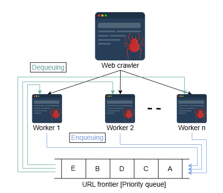
>
> Однако централизованная очередь имеет ограниченную пропускную способность на чтение/запись и является единой точкой отказа. Поэтому лучшим подходом будет наличие подочереди для каждого рабочего потока (worker).
>
> 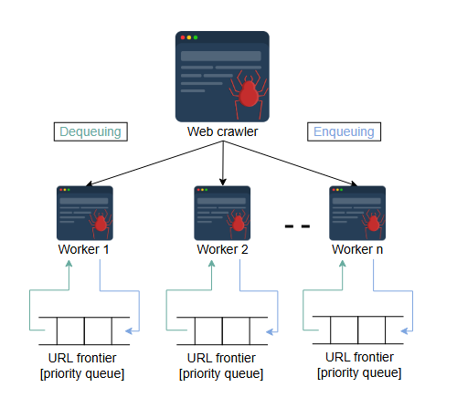
>
> Если мы используем нашу распределенную очередь, все рабочие потоки могут получать данные из одной и той же очереди, если захотят. Но наличие независимых очередей может дополнительно оптимизировать процесс сканирования, особенно в случае высокоприоритетных и более частых сканирований, как у новостных сайтов, которым требуется больше, чем обычные рабочие потоки, для частого сканирования. Этот подход естественным образом облегчит случай увеличения размера очереди.
>
> Наличие единой очереди выгодно для дедупликации избыточных ссылок и лучше для общих ресурсов краулера. Мы будем обрабатывать приоритет и частоту повторного сканирования другим способом, как объяснено в следующих разделах, для чего нам понадобится механизм распределения.
> 

*   **DNS-резолвер (DNS resolver)**: Веб-краулеру необходим DNS-резолвер для сопоставления имен хостов с IP-адресами для получения HTML-контента. Поскольку DNS-запрос — это трудоемкий процесс, лучшим подходом является создание кастомного DNS-резолвера и кэширование часто используемых IP-адресов на время их жизни (time-to-live), так как они могут измениться после истечения этого времени.

*   **Сборщик HTML (HTML fetcher)**: Сборщик HTML инициирует связь с сервером, на котором размещен URL-адрес. Он загружает содержимое файла в зависимости от используемого протокола связи. Мы в основном сосредоточены на *протоколе HTTP* для текстового контента, но *сборщик HTML* легко расширяем для других протоколов связи, как указано в разделе о нефункциональных требованиях веб-краулера.

> **Вопрос:** Как краулер обрабатывает URL-адреса с переменными приоритетами?
>
> 

>  
<b>Показать ответ</b>

>
> **Ответ:** Краулер должен быть достаточно бдительным на каждом этапе, чтобы различать URL-адреса с разными уровнями приоритета.
>
> Давайте посмотрим, как дизайн краулера справляется с такими случаями поэтапно:
>
> 1.  Поскольку мы реализуем наш URL-фронтир как очередь с приоритетом в планировщике, он автоматически обрабатывает размещение на основе значений параметров. Мы выбрали параметры отказоустойчивости и периодичности в качестве индикаторов приоритета для наших URL-адресов.
      >     Назначение этих параметров зависит от характера содержимого веб-страниц. Если это новостная веб-страница, то ее сканирование несколько раз в день является целесообразным и необходимым для поддержания актуальности нашего индекса. Любая обычная веб-страница с редкими обновлениями может иметь стандартную частоту посещения, скажем, раз в две недели.
>
> 2.  Аналогично, на уровне сборщика HTML, где краулер общается с хост-сервером на основе указаний из `robots.txt`, он может передавать значение соответствующего параметра для полученных URL обратно в планировщик на этапе хранения.
>
> Вместо того чтобы связывать индикаторы с URL-адресами, другим решением может быть наличие отдельных очередей для разных приоритетов. Затем мы можем извлекать элементы из этих очередей в соответствии с присвоенными им приоритетами. Этот подход требует только размещения URL в соответствующей очереди и не нуждается в скриптах для планирования на основе дополнительных связанных параметров.
>
> Все зависит от масштаба нашего приложения для сканирования.
> 

*   **Хост службы (Service host)**: Этот компонент действует как мозг краулера и состоит из экземпляров рабочих потоков (workers). для простоты мы будем называть весь этот компонент или один рабочий поток краулером. Этот хост службы/краулер выполняет три основные задачи:
    1.  Он управляет архитектурой с несколькими рабочими потоками для операции сканирования. В зависимости от доступности, каждый рабочий поток связывается с URL-фронтиром, чтобы извлечь следующий доступный URL для сканирования.
    2.  Каждый рабочий поток отвечает за получение DNS-разрешений для входящих URL-адресов от DNS-резолвера.
    3.  Каждый рабочий поток действует как шлюз между планировщиком и сборщиком HTML, отправляя необходимую информацию о DNS-разрешении сборщику HTML для инициации связи.

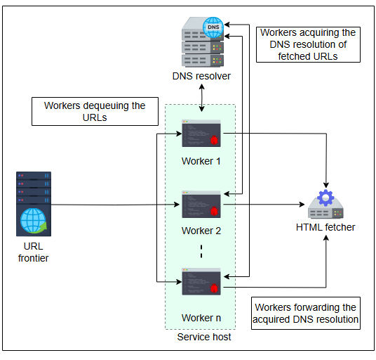

*   **Экстрактор (Extractor)**: Как только сборщик HTML получает веб-страницу, следующим шагом является извлечение из нее двух вещей: URL-адресов и контента. Экстрактор отправляет извлеченные URL-адреса напрямую, а контент через **входной поток документов (DIS)** — устранителю дубликатов. DIS — это кэш, используемый для хранения извлеченного документа, чтобы другие компоненты могли получать к нему доступ и обрабатывать его. Здесь мы можем использовать Redis в качестве нашего кэша из-за его расширенных функциональных возможностей структур данных.
    Как только будет подтверждено отсутствие дубликатов в хранилищах данных, экстрактор отправляет URL-адреса в планировщик задач, который содержит URL-фронтир, и сохраняет контент в blob-хранилище для целей индексации.

*   **Устранитель дубликатов (Duplicate eliminator)**: Поскольку веб взаимосвязан, очевидна вероятность того, что два разных URL-адреса могут указывать на одну и ту же веб-страницу или разные URL-адреса могут указывать на разные веб-страницы с одинаковым содержанием. Краулеру необходим компонент для выполнения проверки на дубликаты (dedup test), чтобы исключить риск расходования ресурсов на хранение и обработку одного и того же контента дважды. Устранитель дубликатов вычисляет контрольную сумму каждого извлеченного URL и сравнивает ее с хранилищем контрольных сумм URL. Если совпадение найдено, он отбрасывает извлеченный URL. В противном случае он добавляет новую запись в базу данных с вычисленным значением контрольной суммы.

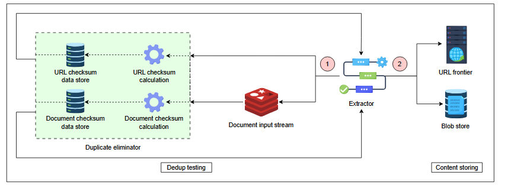

Устранитель дубликатов повторяет тот же процесс с извлеченным контентом и добавляет контрольную сумму новой веб-страницы в хранилище контрольных сумм документов для будущих сопоставлений.

Наш предлагаемый дизайн для устранителя дубликатов может быть сделан устойчивым к этим двум проблемам:

1.  Используя перенаправление URL, новый URL может пройти проверку на дубликаты URL. Но второй этап проверки на дубликаты документа не допустит дублирования контента в blob-хранилище.
2.  При изменении всего одного байта в документе контрольная сумма измененного документа будет отличаться от исходной.

*   **Blob-хранилище (Blob store)**: Поскольку веб-краулер является основой поисковой системы, хранение и индексация полученного контента и соответствующих метаданных чрезвычайно важны. Дизайн должен иметь распределенное хранилище, такое как blob-хранилище, потому что нам нужно хранить большие объемы неструктурированных данных.

Следующая иллюстрация показывает графическое представление общего дизайна веб-краулера:

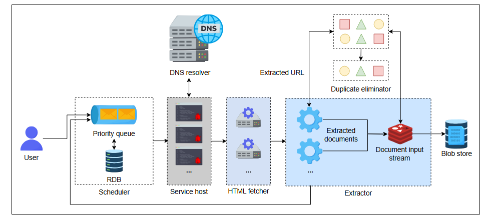

#### Рабочий процесс

1.  **Назначение задачи рабочему потоку**: Краулер (хост службы) инициирует процесс, загружая URL из очереди с приоритетом URL-фронтира и назначает его доступному рабочему потоку.
2.  **DNS-разрешение**: Рабочий поток отправляет входящий URL для DNS-разрешения. Прежде чем разрешить URL, DNS-резолвер проверяет кэш и возвращает запрошенный IP-адрес, если он найден. В противном случае он определяет IP-адрес, отправляет его обратно экземпляру рабочего потока краулера и сохраняет результат в кэше.

> **Вопрос:**  Можем ли мы использовать поиск в глубину (DFS) вместо поиска в ширину (BFS)?
>
> 

>  
<b>Показать ответ</b>

>
> Мы можем использовать поиск в глубину (DFS), когда хотим задействовать постоянное соединение (persistent connection) с веб-сайтом для обхода всех веб-страниц в данном домене. Это экономит время, поскольку позволяет избежать повторных подключений к одному и тому же веб-сайту в случае истечения срока действия сессии.
> 

> Реализация URL-фронтира — извлечение URL из приоритетной очереди FIFO и добавление всех извлеченных URL обратно в очередь, а не их последовательное сканирование — гарантирует, что мы сканируем веб в порядке **поиска в ширину (BFS)**, а не поиска в глубину (DFS).
3.  **Инициация связи сборщиком HTML**: Рабочий поток пересылает URL и связанный IP-адрес сборщику HTML, который инициирует связь между краулером и хост-сервером.
4.  **Извлечение контента**: Как только рабочий поток устанавливает связь, он извлекает URL-адреса и HTML-документ с веб-страницы и помещает документ в кэш для обработки другими компонентами.
5.  **Проверка на дубликаты**: Рабочий поток отправляет извлеченные URL-адреса и документ на проверку на дубликаты в устранитель дубликатов. Устранитель дубликатов вычисляет и сравнивает контрольную сумму как URL, так и документа с уже сохраненными значениями контрольных сумм.
    Устранитель дубликатов отбрасывает входящий запрос в случае совпадения. Если совпадения нет, он помещает вновь вычисленные значения контрольных сумм в соответствующие хранилища данных и дает добро экстрактору на сохранение контента.
6.  **Хранение контента**: Экстрактор отправляет вновь обнаруженные URL-адреса в планировщик, который сохраняет их в базе данных и устанавливает значения для переменных приоритета и частоты повторного сканирования.
    Экстрактор также записывает необходимые части вновь обнаруженного документа — находящегося в данный момент в DIS — в базу данных.
7.  **Повторное сканирование**: После завершения цикла краулер возвращается к первому пункту и повторяет тот же процесс, пока очередь URL-фронтира не опустеет.
    URL-адресам, хранящимся в базе данных планировщика, присвоены приоритет и периодичность. Помещение новых URL в очередь URL-фронтира зависит от этих двух факторов.

> **Примечание:** Благодаря множеству экземпляров каждой службы и архитектуре микросервисов, наш дизайн может использовать балансировку нагрузки на стороне клиента.

Следующее слайд-шоу дает подробный обзор рабочего процесса веб-краулера:

1)  Назначение задачи рабочему потоку
   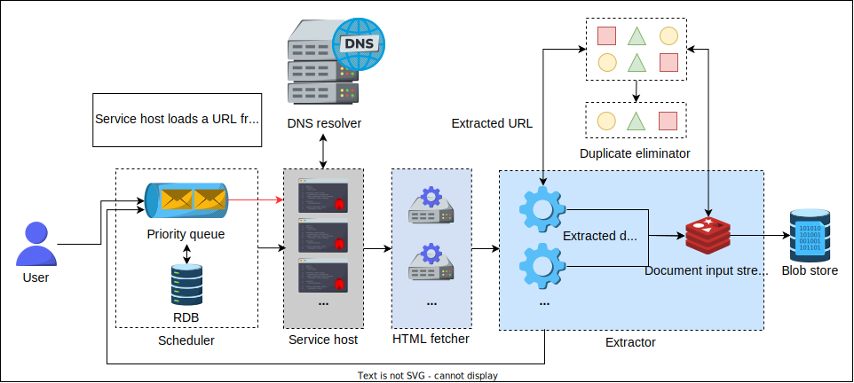

2) DNS-разрешение
   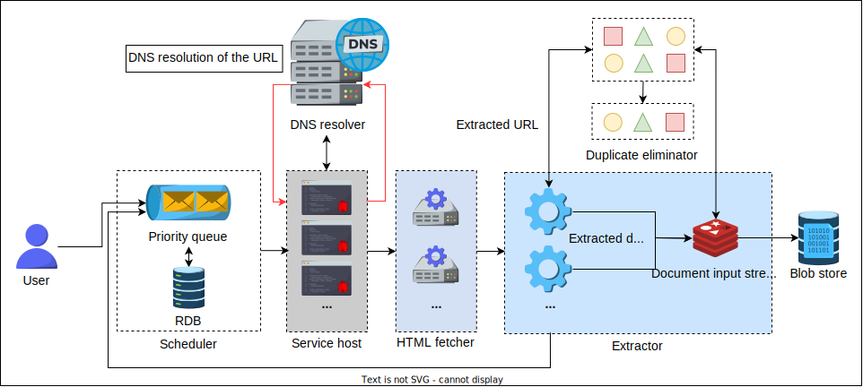

3) Инициация HTTP-соединения
   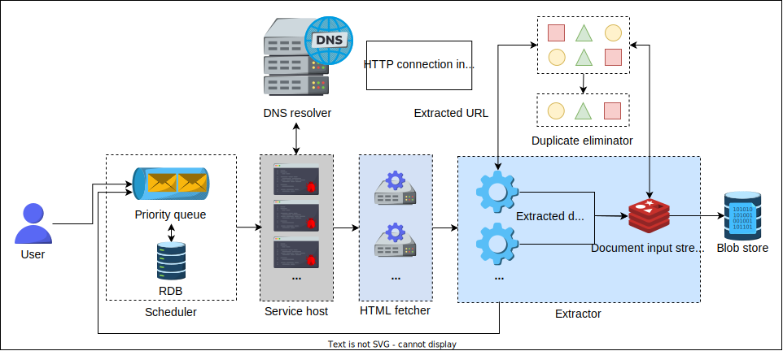

4) Извлечение контента
   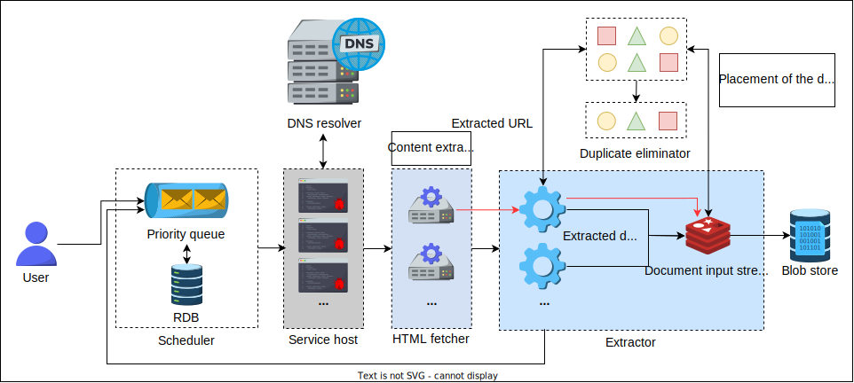

5) Проверка на дубликаты
   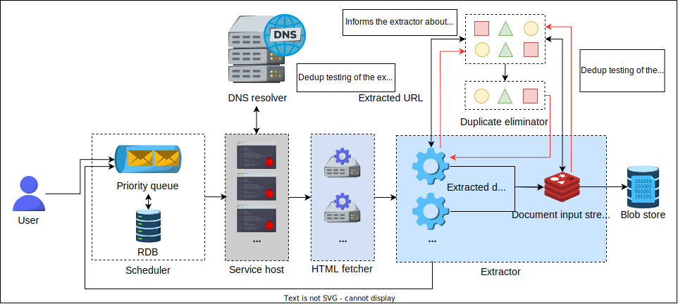

6) Хранение контента
   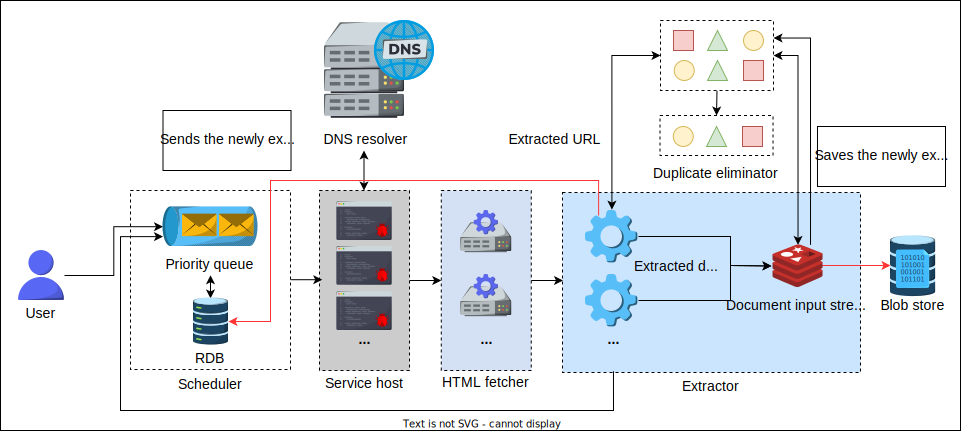

7) Новый цикл
   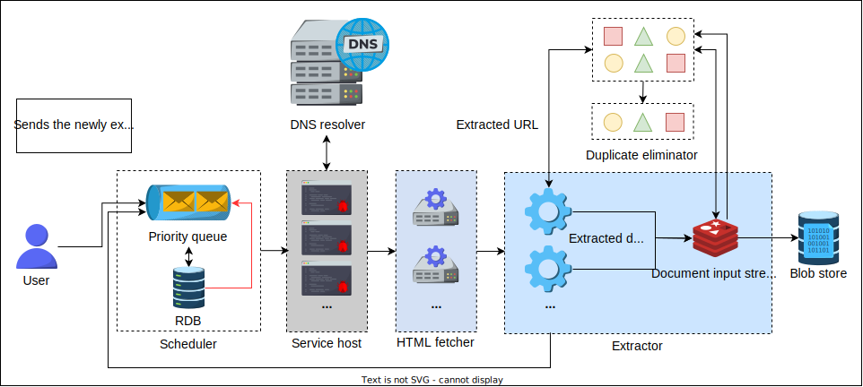

>**Вопрос:** Повторное сканирование (recrawling) — это процесс повторного посещения и обновления проиндексированных страниц. Учитывая это, попробуйте ответить на следующие вопросы:
>1.  Зачем нам нужно повторное сканирование?
>2.  Как мы решаем, когда проводить повторное сканирование?
> 

>  
<b>Показать ответ</b>

>
>  Повторное сканирование необходимо, чтобы поддерживать проиндексированные страницы в актуальном состоянии в соответствии с последними изменениями контента на веб-сайтах. Мы решаем, когда проводить повторное сканирование, основываясь на таких факторах, как частота изменения контента, его релевантность и важность своевременных обновлений. Регулярное повторное сканирование помогает поисковым системам предоставлять пользователям самые свежие и релевантные результаты
> 

В следующем уроке мы рассмотрим некоторые недостатки нашего дизайна и возможные пути их решения.