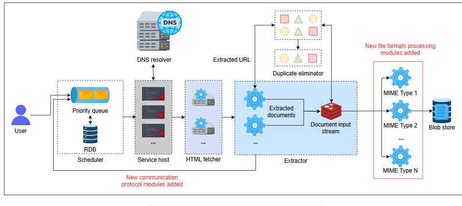
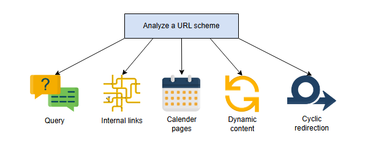
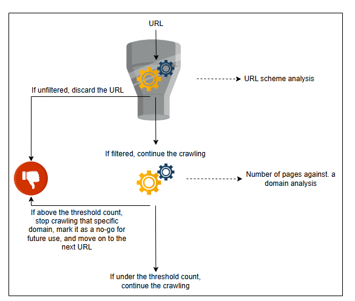
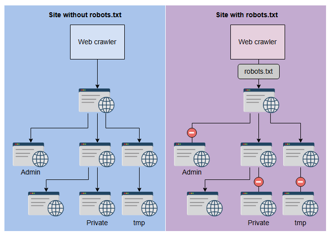

## **Улучшения в проектировании веб-краулера**

Определите недостатки и проблемы проектирования веб-краулера и внесите соответствующие улучшения.

### Введение

Этот урок дает нам подробный разбор улучшений, необходимых для повышения функциональности, производительности и безопасности нашего дизайна веб-краулера. Мы разделили этот урок на два раздела:

1.  Улучшения дизайна для повышения функциональности и производительности — расширяемость и архитектура с несколькими рабочими потоками.
2.  Улучшения дизайна для повышения безопасности — ловушки для краулера.

Давайте углубимся в эти разделы.

### Улучшения проектирования

Наш текущий дизайн является упрощенным и имеет некоторые врожденные недостатки и проблемы. Давайте выделим их по одному и по ходу внесем некоторые коррективы в наш дизайн.

*   **Недостаток**: В настоящее время наш дизайн поддерживает протокол HTTP и извлекает только текстовое содержимое. Это приводит к вопросу о том, как мы можем расширить наш краулер для поддержки нескольких протоколов связи и извлечения различных типов файлов.

    **Корректировка**: Поскольку у нас есть два отдельных компонента для обработки связи и извлечения, сборщик HTML и экстрактор, давайте обсудим их модификации по одному.

    1.  **Сборщик HTML**: До сих пор мы обсуждали только модуль HTTP в этом компоненте из-за широко используемой схемы URL HTTP. Мы можем легко расширить наш дизайн, чтобы включить другие протоколы связи, такие как протокол передачи файлов (FTP). Рабочий процесс тогда будет иметь промежуточный шаг, на котором краулер вызывает соответствующий модуль связи в зависимости от схемы URL. Последующие шаги останутся теми же.
    2.  **Экстрактор**: В настоящее время мы извлекаем только текстовое содержимое из загруженного документа, помещенного во входной поток документов (DIS). Этот документ содержит и другие типы файлов, например, изображения и видео. Если мы хотим извлекать другое содержимое из сохраненного документа, нам нужно добавить новые модули с функциональностью для обработки этих медиатипов. Поскольку мы используем blob-хранилище для хранения контента, хранение вновь извлеченного контента, включающего текст, изображения и видео, не будет проблемой.

*   **Недостаток**: Текущий дизайн не объясняет, как концепция нескольких рабочих потоков (multi-worker) интегрируется в эту систему.

    **Корректировка**: Каждому рабочему потоку нужен URL для работы из очереди с приоритетом. Разные веб-сайты требуют разного времени для завершения сканирования рабочими потоками, поэтому каждый рабочий поток будет извлекать новый URL по мере своей доступности.

    Существует несколько способов реализации этой архитектуры с несколькими рабочими потоками для нашей системы. Некоторые из них следующие:

    1.  **Журнал на уровне домена**: Краулер назначает один целый домен одному рабочему потоку. Все URL-адреса, ответвляющиеся от начального URL, являются ответственностью того же краулера. Мы обеспечиваем это, кэшируя хэш имени хоста против идентификатора рабочего потока для гарантированного будущего назначения тому же рабочему потоку. Это также помогает нам избежать любого избыточного сканирования веб-страниц этого домена любым рабочим потоком.

        Этот подход лучше всего подходит для достижения **обратной индексации URL**, которая включает в себя обход каталогов веб-адресов в обратном порядке. Это обеспечивает эффективность хранения URL-адресов для последующего использования и предотвращает обширные повторяющиеся процессы сопоставления строк для проверки на дублирование.
    2.  **Разделение диапазона**: Диапазон URL-адресов передается каждому краулеру; краулер распределяет диапазон URL-адресов из очереди с приоритетом между рабочими потоками, чтобы избежать столкновений. Как и в предыдущем подходе, краулер должен хэшировать диапазон, связанный с каждым рабочим потоком.
    3.  **Сканирование по URL**: Все URL-адреса помещаются в очередь; рабочий поток берет URL и помещает последующие найденные URL-адреса в очередь с приоритетом. Эти новые URL-адреса сразу же доступны для сканирования другими рабочими потоками. Чтобы избежать постановки в очередь нескольких одинаковых ссылок, которые ведут на одну и ту же веб-страницу, мы вычисляем контрольную сумму канонизированного URL.

### Ловушки для краулера

**Ловушка для краулера** — это URL-адрес или набор URL-адресов, которые вызывают бесконечное истощение ресурсов краулера. Этот раздел посвящен классификации, идентификации и предотвращению ловушек для краулера.

#### Классификация

Может быть много схем классификации ловушек для краулера, но давайте классифицируем их на основе схемы URL.

В основном, ловушки для веб-краулера являются результатом плохой структуры веб-сайта, такой как:

*   **URL с параметрами запроса**: Эти параметры запроса могут содержать огромное количество значений, генерируя при этом большое количество бесполезных веб-страниц для одного домена: `HTTP://www.abc.com?query`.
*   **URL с внутренними ссылками**: Эти ссылки перенаправляют в пределах одного домена и могут создавать бесконечный цикл перенаправлений между веб-страницами одного домена, заставляя краулер сканировать один и тот же контент снова и снова.
*   **URL с бесконечными страницами календаря**: Они имеют бесконечные комбинации веб-страниц на основе меняющихся значений дат и могут создавать большое количество бессмысленных веб-страниц для одного домена.
*   **URL для динамической генерации контента**: Они основаны на запросах и могут генерировать огромное количество веб-страниц на основе динамического контента, получаемого из этих запросов. Такие URL могут стать бесконечным сканированием одного домена.
*   **URL с повторяющимися/циклическими каталогами**: Они образуют бесконечный цикл перенаправлений. Например, `HTTP://www.abc.com/first/second/first/second/...`.

В основном, ловушки для краулера являются непреднамеренными из-за плохой структуры веб-сайта. Интересно, что ловушки для краулера также могут быть размещены намеренно для динамической генерации бесконечной серии веб-страниц с единственной целью истощить пропускную способность краулера. Эти ловушки серьезно влияют на **пропускную способность** краулера и снижают его производительность.

Эти ловушки для краулера могут быть губительны для краулера, но они также серьезно влияют на SEO-рейтинг веб-сайта.

#### Идентификация

Очень важно классифицировать ловушки для сканирования, чтобы правильно их идентифицировать и соответственно продумать корректировки дизайна.

Процесс идентификации ловушки для краулера в основном состоит из двух уровней:

1.  **Анализ схемы URL**: URL-адреса с плохой структурой, например, с циклическими каталогами: `HTTP://www.abc.com/first/second/first/second/...` создадут ловушки для краулера. Следовательно, предварительная фильтрация таких URL спасет ресурсы нашего краулера.
2.  **Анализ общего количества веб-страниц для домена**: Невозможно большое количество веб-страниц для домена в URL-фронтире является сильным индикатором ловушки для краулера. Поэтому ограничение сканирования на таком домене будет иметь первостепенное значение.

#### Решение

В нашем дизайне отсутствуют детали о механизме ответственного сканирования для избежания ловушек для краулера для вышеописанных идентификаций.

Сканирование — это ресурсоемкая и трудоемкая задача, и чрезвычайно важно эффективно избегать ловушек для краулера, чтобы достичь своевременного и полезного сканирования. Как только краулер начинает общаться с сервером для загрузки контента веб-страницы, ему необходимо учитывать множество факторов, в основном на уровне сборщика HTML. Давайте рассмотрим эти факторы по отдельности.

1.  Краулер должен реализовать логику на прикладном уровне для противодействия ловушкам. Эта логика может быть основана на наблюдаемом количестве веб-страниц, превышающем указанный порог.

    Краулер должен быть достаточно умным, чтобы ограничить свое сканирование на определенном домене после конечного количества времени или посещений веб-страниц. Краулер должен умело покидать веб-страницу и сохранять этот URL как запретную зону для будущих обходов, чтобы обеспечить эффективность производительности.
2.  При инициировании связи с веб-сервером краулер должен получить файл с именем `robots.txt`. Этот файл содержит правила поведения для краулера, перечисленные веб-мастерами. Соблюдение этого документа является неотъемлемой частью процесса сканирования. Он также позволяет краулеру получать доступ к определенным веб-страницам домена, приоритетным для сканирования, не ограничивая его доступ к конкретным веб-страницам.

    Другим важным компонентом этого документа являются инструкции по частоте повторных посещений для краулера. Популярный веб-сайт может требовать частого повторного посещения, в отличие от веб-сайта, который редко обновляет свой контент. Этот стандарт общения веб-сайтов с веб-краулерами называется **Протоколом исключений для роботов (Robots Exclusion Protocol)**. Этот протокол предотвращает ненужную трату ресурсов краулерами на несканируемые веб-страницы.

> Файл `robots.txt` не защищает краулеры от вредоносных или преднамеренных ловушек. Эти ловушки должны обрабатываться другими описанными механизмами.

3.  Поскольку каждый домен имеет ограниченную входящую и исходящую пропускную способность, краулер должен быть достаточно вежливым, чтобы ограничивать свое сканирование на определенном домене. Вместо статической скорости сканирования для каждого домена, лучшим подходом является регулировка скорости сканирования на основе значения **Time to First Byte (TTFB)** домена. Чем выше значение TTFB, тем медленнее сервер. И поэтому слишком быстрое сканирование этого домена может привести к большему количеству запросов с тайм-аутом и неполному сканированию.

Эти модификации в дизайне обеспечат краулер, способный избегать ловушек и, следовательно, оптимизировать использование ресурсов.