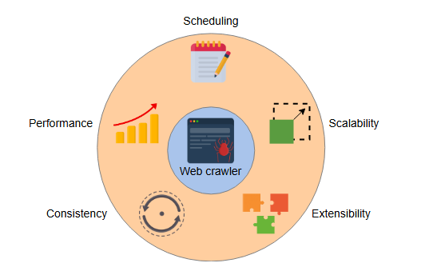

## **Оценка проектирования веб-краулера**

Оцените предложенный дизайн системы веб-краулера на основе выполнения его нефункциональных требований.

### Обзор требований к проектированию

Давайте оценим, как наш дизайн соответствует нефункциональным требованиям предложенной системы.

#### Масштабируемость

Наш дизайн утверждает, что горизонтальное масштабирование нашей системы жизненно важно. Поэтому предложенный дизайн включает следующие проектные решения для удовлетворения требований к масштабируемости:

*   Система масштабируема для обработки постоянно растущего числа URL-адресов. Она включает все необходимые ресурсы, в том числе планировщики, рабочие потоки веб-краулера, сборщики HTML, экстракторы и blob-хранилища, которые добавляются/удаляются по требованию.
*   В случае распределенного URL-фронтира (очереди URL) система использует согласованное хэширование для распределения имен хостов между различными рабочими потоками сканирования, где каждый рабочий поток работает на своем сервере. При этом добавление или удаление сервера краулера не является проблемой.

#### Расширяемость и модульность

До сих пор наш дизайн фокусировался только на определенном типе протокола связи: HTTP. Но согласно нашим нефункциональным требованиям, дизайн нашей системы должен обеспечивать возможность включения других сетевых протоколов связи, таких как FTP.

Чтобы достичь этой расширяемости, нам нужно лишь добавить дополнительные модули для вновь требуемых протоколов связи в сборщик HTML. Соответствующие модули затем будут отвечать за установление и поддержание необходимой связи с хост-серверами.

Аналогичным образом мы ожидаем, что наш дизайн расширит свою функциональность для других типов **MIME**. Модульный подход для различных схем MIME обеспечивает это требование. Рабочий поток будет вызывать соответствующий модуль обработки MIME для извлечения контента из документа, хранящегося в DIS (входном потоке документов).

> Многоцелевое расширение Internet mail, или MIME-тип, - это интернет-стандарт, который описывает содержимое интернет-файлов на основе их природы и форматов.

#### Согласованность

Наша система состоит из нескольких рабочих потоков сканирования. Согласованность данных в отсканированном контенте имеет решающее значение. Поэтому, чтобы избежать несогласованности данных и дублирования сканирования, наша система вычисляет контрольные суммы URL-адресов и документов и сравнивает их с существующими контрольными суммами URL-адресов и документов в хранилищах данных *контрольных сумм URL* и *документов* соответственно.

Помимо дедупликации, для обеспечения согласованности данных в условиях отказоустойчивости, все серверы могут регулярно создавать контрольные точки своего состояния в службе резервного копирования, такой как Amazon S3 или на офлайн-диске.

#### Производительность

Производительность нашего веб-краулера зависит от следующих факторов:

*   **Количество сканируемых URL в секунду**: Мы можем улучшить этот фактор, добавляя новые рабочие потоки в систему.
*   **Использование blob-хранилища для хранения контента**: Это обеспечивает более высокую пропускную способность для огромного количества неструктурированных данных. Это также указывает на быстрое извлечение сохраненного контента, поскольку один blob может поддерживать до 500 запросов в секунду.
*   **Эффективная реализация указаний из файла `robots.txt`**: Мы можем реализовать этот фактор производительности, имея логику на прикладном уровне, устанавливающую наивысший приоритет для указаний из `robots.txt` во время сканирования.
*   **Самоограничение (Self-throttling)**: Мы можем иметь различные проверки на уровне приложения, чтобы убедиться, что наш веб-краулер не снижает производительность хост-серверов веб-сайта, истощая их ресурсы.

---

**Выполнение нефункциональных требований**

| Требование | Техники |
| :--- | :--- |
| **Масштабируемость** | - Добавление/удаление различных серверов в зависимости от увеличения/уменьшения нагрузки - Согласованное хэширование для управления добавлением и удалением серверов - Регулярное резервное копирование серверов в службу резервного копирования Amazon S3 для достижения отказоустойчивости |
| **Расширяемость и модульность** | - Добавление нового модуля протокола связи в сборщик HTML - Добавление новых схем MIME при обработке загруженного документа в DIS |
| **Согласованность** | - Вычисление и сравнение контрольных сумм URL-адресов и документов в соответствующих хранилищах данных |
| **Производительность** | - Увеличение количества рабочих потоков, выполняющих сканирование - Blob-хранилища для хранения контента - Высокий приоритет для указаний из файла robots.txt во время сканирования - Самоограничение на домене во время сканирования |
| **Планирование** | - Предопределенная частота повторного сканирования по умолчанию, или - Отдельные очереди и связанные с ними частоты для URL-адресов с разным приоритетом |

---

#### Планирование

Как было установлено ранее, нам может потребоваться повторно сканировать URL-адреса с различной частотой. Эти частоты определяются назначением URL. Мы можем определять частоту повторного сканирования двумя различными способами:

1.  Мы можем назначить стандартную или конкретную частоту повторного сканирования для каждого URL. Это назначение зависит от назначения URL, определяющего приоритет. Стандартная частота назначается URL-адресам со стандартным приоритетом, а более высокая частота повторного сканирования — URL-адресам с более высоким приоритетом.
    На основе связанной с каждым URL частоты повторного сканирования мы можем решить, ставить ли URL-адреса в очередь с приоритетом из базы данных планировщика. Приоритет определяет место URL в очереди.
2.  Второй метод — иметь отдельные очереди для URL-адресов с разным приоритетом, сначала использовать URL-адреса из высокоприоритетных очередей, а затем переходить к URL-адресам с более низким приоритетом.

> **Вопрос:** Рассмотрим платформу для агрегации новостей в реальном времени, где контент меняется быстро, и частые повторные сканирования имеют решающее значение для получения актуальной информации. Какие немедленные шаги вы предпримете, если **IP** столкнется с проблемами блокировки во время частых сканирований? Поделитесь стратегиями обработки блокировок IP для обеспечения непрерывного доступа к последнему контенту.
>
> 

>  
<b>Показать ответ</b>

>
> Чтобы справиться с проблемами блокировки IP во время частых сканирований, немедленные шаги включают внедрение ротации IP, что предполагает регулярную смену вашего IP-адреса для избежания обнаружения. Использование прокси-серверов также крайне важно, поскольку они действуют как посредники, распределяя запросы по нескольким IP-адресам для предотвращения блокировок. Кроме того, мониторинг эффективности этих стратегий и их корректировка по мере необходимости помогает опережать развивающиеся тактики блокировки. Внедрение мер по борьбе с блокировкой, таких как задержки между запросами и имитация естественного поведения пользователя, может дополнительно снизить риск блокировки.
> 

### Заключение

Система веб-краулера представляет собой дизайн с несколькими рабочими потоками, использующий архитектуру микросервисов. Помимо достижения базовой функциональности сканирования, наш дизайн дает представление о потенциальных недостатках и проблемах, связанных с нашим дизайном, и далее исправляет их с помощью соответствующих модификаций дизайна. Заслуживающие внимания особенности нашего дизайна следующие:

1.  Идентификация и модификация дизайна для ловушек краулера
2.  Расширяемость модулей сбора HTML и извлечения контента