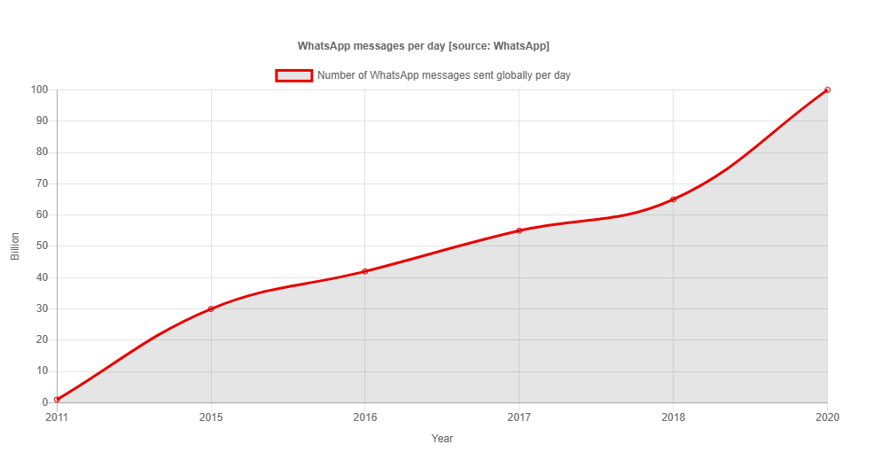

# Проектирование системы: WhatsApp

Научитесь проектировать мессенджер WhatsApp.

---

## WhatsApp
В современном технологическом мире WhatsApp является важным приложением для обмена сообщениями, которое соединяет миллиарды людей по всему миру. Многие пользователи начинают свой день с чтения или отправки сообщений WhatsApp своим друзьям и семье. По оценкам на июль 2021 года, у WhatsApp два миллиарда активных пользователей по всему миру. Кроме того, средний пользователь WhatsApp проводит в приложении около 19.4 часов в месяц.

В декабре 2020 года генеральный директор WhatsApp написал в Твиттере, что пользователи WhatsApp ежедневно обмениваются более чем 100 миллиардами сообщений, что примерно на 54% больше, чем в 2018 году. Увеличение количества отправляемых сообщений в день по всему миру показано на следующем графике:

## Задача проектирования
Как системные проектировщики, мы должны осознавать темпы роста числа пользователей. Относительно WhatsApp возникает много интересных вопросов:

*   Как спроектировано это приложение?
*   Как оно работает?
*   Какие типы компонентов в нем задействованы?
*   Как WhatsApp позволяет миллиардам пользователей общаться друг с другом?
*   Как WhatsApp обеспечивает безопасность всех этих данных?

В этой главе мы сосредоточимся на высокоуровневом и детальном проектировании приложения WhatsApp, чтобы ответить на эти вопросы.

## Как мы будем проектировать WhatsApp?
Мы разделили проектирование мессенджера WhatsApp на следующие пять уроков:

1.  **Требования**: В этом уроке мы определим функциональные и нефункциональные требования. Мы также обсудим оценку ресурсов, необходимых для лучшей и бесперебойной работы предлагаемого дизайна WhatsApp.
2.  **Высокоуровневое проектирование**: Мы сосредоточимся на высокоуровневом проектировании нашей версии WhatsApp. Мы также обсудим основные API для нашего дизайна WhatsApp.
3.  **Детальное проектирование**: В этом уроке мы подробно опишем дизайн нашего мессенджера WhatsApp. Сначала мы объясним дизайн каждого микросервиса, включая соединение с серверами, отправку и получение сообщений и медиаконтента, а также групповые сообщения. В конце дизайн каждого микросервиса будет объединен в детальный дизайн WhatsApp.
4.  **Оценка**: В этом уроке мы объясним, как наша версия WhatsApp соответствует нефункциональным требованиям. Мы также оценим некоторые компромиссы нашего дизайна.

Давайте начнем с обсуждения требований к нашей версии WhatsApp.