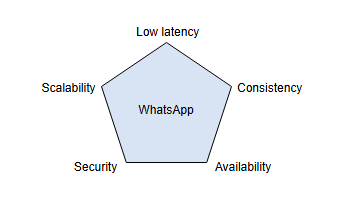
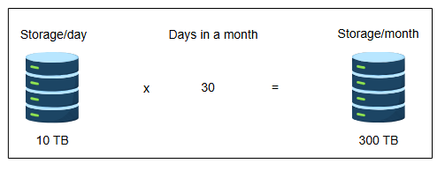
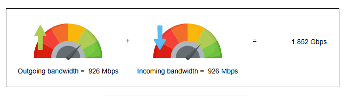
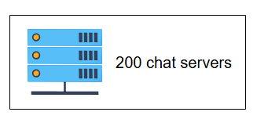
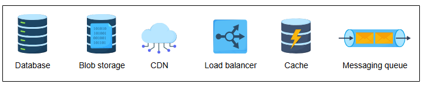

# Требования к дизайну WhatsApp

Узнайте о функциональных и нефункциональных требованиях для чат-приложения, такого как WhatsApp.

---

## Требования
Наш дизайн мессенджера WhatsApp должен соответствовать следующим требованиям.

### Функциональные требования
*   **Общение:** Система должна поддерживать личные и групповые чаты между пользователями.
*   **Подтверждение:** Система должна поддерживать подтверждение доставки сообщений, такое как «отправлено», «доставлено» и «прочитано».
*   **Обмен файлами:** Система должна поддерживать обмен медиафайлами, такими как изображения, видео и аудио.
*   **Хранение чатов:** Система должна поддерживать постоянное хранение сообщений чата, когда пользователь находится в офлайне, до успешной доставки сообщений.
*   **Push-уведомления:** Система должна иметь возможность уведомлять офлайн-пользователей о новых сообщениях, как только их статус изменится на онлайн.

> **Примечание:** Термин «офлайн» обычно относится к пользователям, которые в данный момент не подключены к интернету. Когда эти пользователи снова подключатся, система автоматически отправит push-уведомления, чтобы оповестить их о любых новых сообщениях. С другой стороны, термин «онлайн» указывает на то, что пользователь активно подключен к интернету и может получать сообщения в режиме реального времени.

### Нефункциональные требования
*   **Низкая задержка (Low latency):** Пользователи должны получать сообщения с низкой задержкой.
*   **Согласованность(Consistency):** Сообщения должны доставляться в том порядке, в котором они были отправлены. Кроме того, пользователи должны видеть одинаковую историю чатов на всех своих устройствах.
*   **Доступность(Availability):** Система должна быть высокодоступной. Однако доступностью можно пожертвовать в интересах согласованности.
*   **Безопасность (Security):** Система должна быть защищена сквозным шифрованием. Сквозное шифрование гарантирует, что только две общающиеся стороны могут видеть содержимое сообщений. Никто посторонний, даже WhatsApp, не должен иметь к ним доступа.
*   **Масштабируемость (Scalability):** Система должна быть легко масштабируемой для поддержки постоянно растущего числа пользователей и сообщений в день.

## Оценка ресурсов
WhatsApp является самым используемым приложением для обмена сообщениями во всем мире. По данным WhatsApp, оно поддерживает более двух миллиардов пользователей по всему миру, которые ежедневно обмениваются более чем 100 миллиардами сообщений. Нам необходимо оценить объем хранилища, пропускную способность и количество серверов для поддержки такого огромного числа пользователей и сообщений.

### Оценка хранилища
Поскольку ежедневно через WhatsApp передается более 100 миллиардов сообщений, давайте оценим объем хранилища на основе этого показателя. Предположим, что каждое сообщение в среднем занимает 100 байт. Кроме того, серверы WhatsApp хранят сообщения только 30 дней. Таким образом, если пользователь не подключится к серверу в течение этих дней, сообщения будут навсегда удалены с сервера.

`100 миллиардов/день * 100 байт = 10 ТБ/день`

За 30 дней объем хранилища составит:

`30 * 10 ТБ/день = 300 ТБ/месяц`

Помимо текстовых сообщений, у нас есть также медиафайлы, которые занимают более 100 байт на сообщение. Кроме того, нам нужно хранить информацию о пользователях и метаданные сообщений — например, временную метку, идентификатор и так далее. Попутно нам также потребуется шифрование и дешифрование для безопасной связи. Поэтому нам также нужно будет хранить ключи шифрования и соответствующие метаданные. Таким образом, если быть точным, нам потребуется более 300 ТБ в месяц, но для простоты давайте остановимся на цифре 300 ТБ в месяц.

### Оценка пропускной способности
Согласно оценке объема хранилища, наш сервис будет получать 10 ТБ данных каждый день, что дает нам пропускную способность 926 Мб/с.

`10 ТБ / 86400 сек ≈ 926 Мб/с`

> **Примечание:** Для простоты нашего дизайна мы проигнорировали медиаконтент (изображения, видео, документы и т.д.). Поэтому число 926 может показаться низким.

Нам также требуется равное количество исходящей пропускной способности, поскольку то же сообщение от отправителя необходимо доставить получателю.

### Оценка количества серверов
WhatsApp обрабатывает около 10 миллионов подключений на одном сервере, что кажется довольно высоким показателем для сервера. Однако это возможно благодаря обширной **инженерии производительности**. Нам нужно будет знать все тонкости системы, такие как ядро сервера, сетевая библиотека, конфигурация инфраструктуры и так далее.

> **Примечание:** Мы часто можем оптимизировать сервер общего назначения для специальных задач путем тщательной инженерии производительности всего программного стека.

Перейдем к оценке количества серверов:

`Кол-во серверов = Общее кол-во подключений в день / Кол-во подключений на сервер = 2 миллиарда / 10 миллионов = 200 серверов`

Таким образом, согласно приведенным выше оценкам, нам потребуется 200 чат-серверов.

**Высокоуровневые оценки**

| Тип | Оценки |
| :--- | :--- |
| Общее количество сообщений в день | 100 миллиардов |
| Требуемое хранилище в день | 10 ТБ |
| Хранилище за 30 дней | 300 ТБ |
| Входящие данные в секунду | 926 Мб/с |
| Исходящие данные в секунду | 926 Мб/с |

## Строительные блоки, которые мы будем использовать
В дизайне WhatsApp используются следующие строительные блоки, которые также обсуждались в начальных главах:

*   **Базы данных** необходимы для хранения метаданных пользователей и групп.
*   **Хранилище больших двоичных объектов (Blob storage)** используется для хранения мультимедийного контента, передаваемого в сообщениях.
*   **CDN (сеть доставки контента)** используется для эффективной доставки часто передаваемого мультимедийного контента.
*   **Балансировщик нагрузки** распределяет входящие запросы между пулом доступных серверов.
*   **Кэши** необходимы для хранения часто используемых данных, используемых различными сервисами.
*   **Очередь сообщений** используется для временного хранения сообщений в очереди в базе данных, когда пользователь находится в офлайне.

> Помимо упомянутых строительных блоков, для создания комплексного дизайна необходимы дополнительные компоненты. К ним относятся:
>
> *   Сервис сообщений
> *   Сервис групповых сообщений
> *   Менеджер WebSocket
> *   База данных Mnesia
> *   Кластер Redis
>
> Предоставьте свое решение, учитывая следующие детали:
>
> *   Какая сущность будет обрабатывать сообщения двух пользователей, намеревающихся общаться друг с другом?
> *   Как обрабатываются групповые сообщения?
> *   Где хранятся сообщения, когда пользователь находится в офлайне?
> *   Где будут храниться медиафайлы для частого доступа?
> *   Какой протокол (протоколы) требуется для передачи сообщений с низкой задержкой?
> *   Как будут разделены различные сервисы?
> 
> 

>  
<b>Показать ответ</b>

>
> При проектировании WhatsApp сущностью, которая обрабатывает сообщения между двумя пользователями, обычно является **сервис сообщений**, отвечающий за маршрутизацию и доставку. Групповыми сообщениями управляет **специализированный сервис групповых сообщений**, который для обеспечения слабой связанности компонентов часто использует **очередь сообщений**, например Kafka. Когда пользователь находится в офлайне, сообщения хранятся в **постоянном хранилище**, таком как база данных Mnesia или аналогичная база данных, предназначенная для быстрого извлечения данных. **Медиафайлы хранятся в blob-хранилище или CDN** для обеспечения быстрого доступа. Передача сообщений с низкой задержкой требует использования **протоколов, таких как WebSocket или MQTT**. Чтобы сервисы оставались слабо связанными, компоненты общаются через **очереди сообщений или механизмы «издатель-подписчик» (pub-sub)**. 
> 

