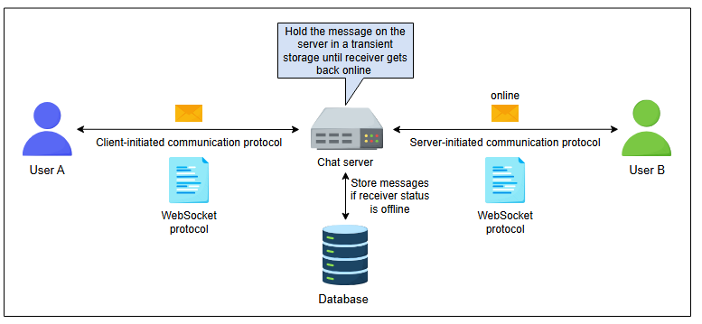
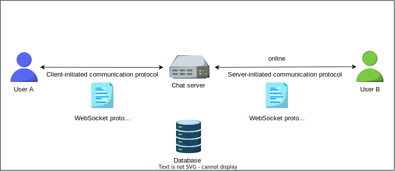
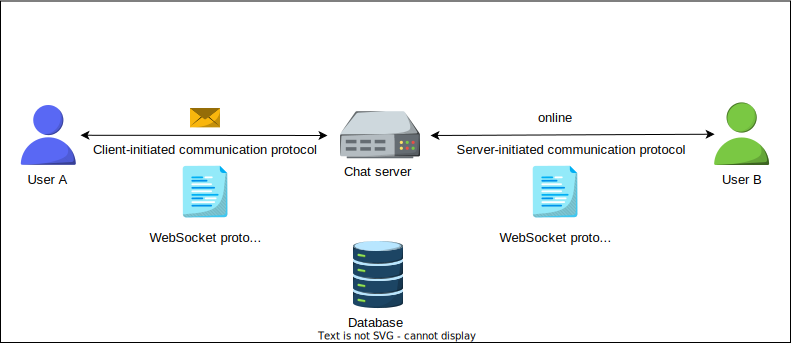
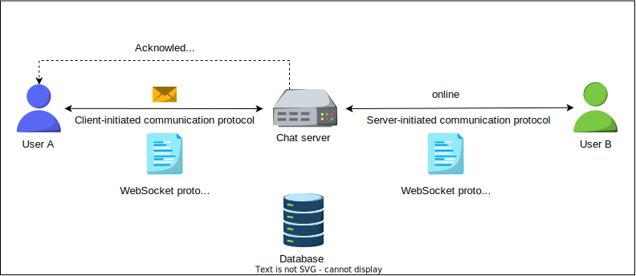
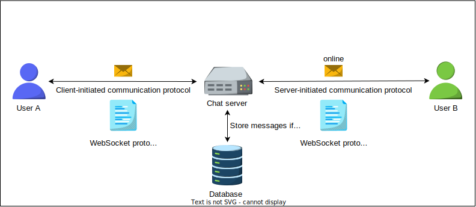
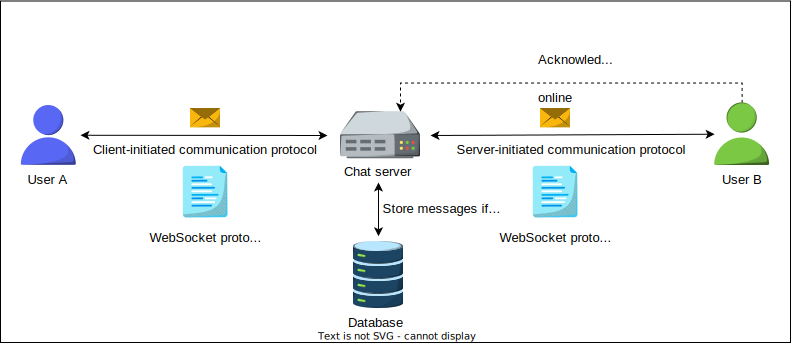
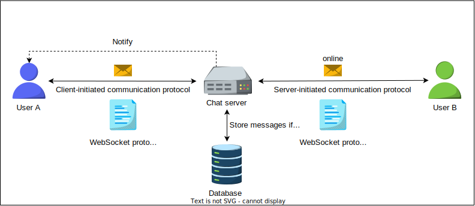
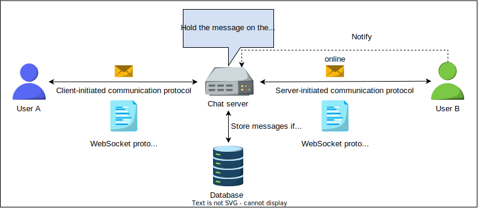
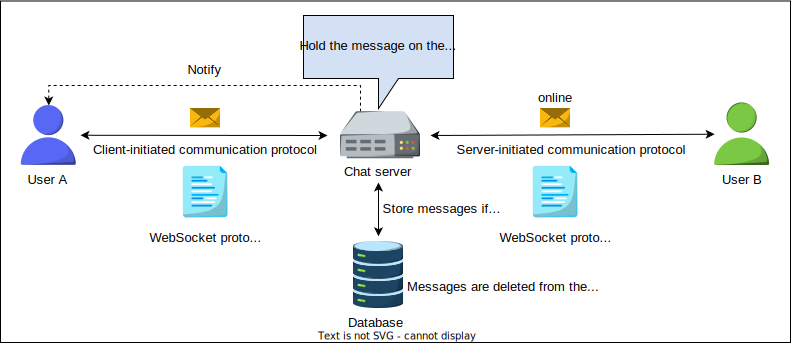

# Высокоуровневое проектирование WhatsApp

Познакомьтесь с высокоуровневым проектированием системы WhatsApp.


## Высокоуровневое проектирование

На абстрактном уровне высокоуровневое проектирование состоит из чат-сервера, отвечающего за связь между отправителем и получателем. Когда
пользователь хочет отправить сообщение другому пользователю, оба подключаются к чат-серверу. Оба пользователя отправляют свои сообщения на
чат-сервер. Затем чат-сервер отправляет сообщение другому предполагаемому пользователю, а также сохраняет сообщение в базе данных.



Следующие шаги описывают коммуникацию между обоими клиентами:

1. Пользователь А и пользователь Б создают канал связи с чат-сервером.
2. Пользователь А отправляет сообщение на чат-сервер.
3. Получив сообщение, чат-сервер отправляет подтверждение пользователю А.
4. Чат-сервер отправляет сообщение пользователю Б и сохраняет его в базе данных, если получатель находится в офлайне.
5. Пользователь Б отправляет подтверждение на чат-сервер.
6. Чат-сервер уведомляет пользователя А об успешной доставке сообщения.
7. Когда пользователь Б читает сообщение, приложение уведомляет об этом чат-сервер.
8. Чат-сервер уведомляет пользователя А, что пользователь Б прочитал сообщение.

Процесс показан на следующих иллюстрациях:

**(Анимация/серия изображений, демонстрирующая шаги обмена сообщениями)**

1) Пользователь А и пользователь Б устанавливают соединение с чат-сервером
  
2) Пользователь А отправляет сообщение на чат-сервер
  
3) Получив сообщение, чат-сервер отправляет подтверждение пользователю А
  
4) Чат-сервер отправляет сообщение пользователю Б и сохраняет его в базе данных
  
5) Пользователь Б отправляет подтверждение на чат-сервер
  
6) Чат-сервер уведомляет пользователя А об успешной доставке сообщения
  
7) Когда пользователь Б читает сообщение, приложение уведомляет об этом чат-сервер
  
8) Чат-сервер уведомляет пользователя А, что пользователь Б прочитал сообщение
  

## Проектирование API

WhatsApp предоставляет своим пользователям огромное количество функций через различные API. Некоторые из них перечислены ниже:

* Отправка сообщения
* Получение сообщения
* Загрузка медиафайла или документа
* Скачивание документа или медиафайла
* Отправка местоположения
* Отправка контакта
* Создание статуса

Однако мы обсудим основные API, связанные с первыми четырьмя функциями.

### Отправка сообщения

API `sendMessage` выглядит следующим образом:

```
sendMessage(message_ID, sender_ID, receiver_ID, type, text=none, media_object=none, document=none)
```

Этот API используется для отправки текстового сообщения `text` от отправителя к получателю путем выполнения POST-запроса к конечной точке
API `/messages`. Как правило, идентификаторами отправителя и получателя являются их номера телефонов. Параметры, используемые в этом вызове
API, описаны в следующей таблице:

| Параметр       | Описание                                                                                                       |
|:---------------|:---------------------------------------------------------------------------------------------------------------|
| `message_ID`   | Это уникальный идентификатор отправленного сообщения.                                                          |
| `sender_ID`    | Это уникальный идентификатор пользователя, отправляющего сообщение.                                            |
| `receiver_ID`  | Это уникальный идентификатор пользователя, получающего сообщение.                                              |
| `type`         | Тип сообщения по умолчанию — текст. Этот параметр указывает, отправляет ли отправитель медиафайл или документ. |
| `text`         | Это поле содержит текст, который необходимо отправить как сообщение.                                           |
| `media_object` | Этот параметр определяется на основе параметра `type`. Он представляет собой медиафайл для отправки.           |
| `document`     | Этот параметр представляет собой документ для отправки.                                                        |

### Получение сообщения

API `getMessage` выглядит следующим образом:

```
getMessage(user_Id)
```

Используя этот вызов API, пользователи могут получить все непрочитанные сообщения, когда они выходят в онлайн после того, как некоторое
время были офлайн.

| Параметр  | Описание                                                                                        |
|:----------|:------------------------------------------------------------------------------------------------|
| `user_Id` | Это уникальный идентификатор пользователя, который должен получить все непрочитанные сообщения. |

### Загрузка медиафайла или документа

API `uploadFile` выглядит следующим образом:

```
uploadFile(file_type, file)
```

Мы можем загружать медиафайлы через API `uploadFile`, выполняя POST-запрос к конечной точке API `/v1/media`. Успешный ответ возвращает ID,
который пересылается получателю. Максимальный размер загружаемого медиафайла составляет 16 МБ, а для документа — 100 МБ.

| Параметр    | Описание                                                            |
|:------------|:--------------------------------------------------------------------|
| `file_type` | Этот параметр представляет тип файла, загружаемого через вызов API. |
| `file`      | Этот параметр содержит файл, загружаемый через вызов API.           |

### Скачивание документа или медиафайла

API `downloadFile` выглядит следующим образом:

```
downloadFile(user_id, file_id)
```

Параметры этого вызова API объясняются в следующей таблице:

| Параметр  | Описание                                                                                                                                                                                                                                                                     |
|:----------|:-----------------------------------------------------------------------------------------------------------------------------------------------------------------------------------------------------------------------------------------------------------------------------|
| `user_id` | Это уникальный идентификатор пользователя, который будет скачивать файл.                                                                                                                                                                                                     |
| `file_id` | Это уникальный идентификатор файла. Он генерируется при загрузке файла через вызов API `uploadFile()`. Вызов API `downloadFile()` скачивает медиафайл по этому идентификатору. Клиент может найти `file_id`, предоставив имя файла серверу. Этот вызов API здесь не показан. |

> Во введении мы упомянули, что в 2020 году WhatsApp обрабатывал более 100 миллиардов сообщений в день — на 54% больше, чем в 2018 году.
> Если объем сообщений продолжит расти, как должна масштабироваться система, чтобы эффективно поддерживать миллиарды пользователей?
>
> <details>
>  <summary><b>Показать ответ</b></summary>
>
>  Поддержка миллиардов пользователей требует распределенной, масштабируемой архитектуры. Для подключения используйте несколько серверов WebSocket, сохраняйте сопоставления пользователей в кластере Redis и сохраняйте сообщения в службе сообщений в базе данных Mnesia. Данные пользователей и групп передаются в кластер MySQL с кэшированием Redis. Распространение компонентов и репликация данных являются ключевыми факторами.
> > </details>


В следующем уроке мы сосредоточимся на детальном проектировании системы WhatsApp.