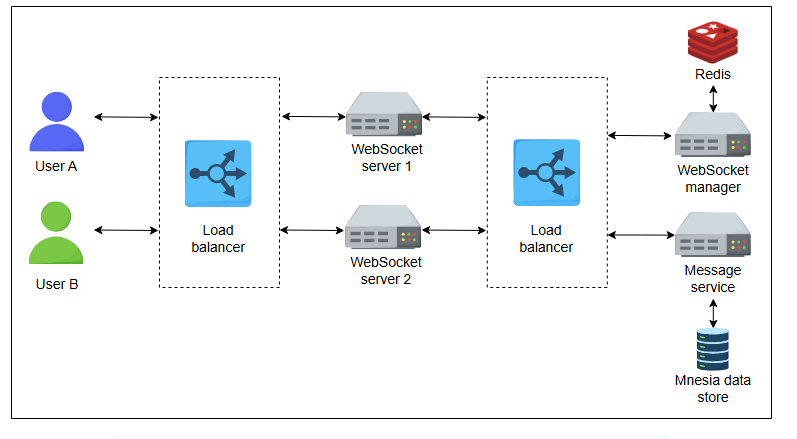

# Детальное проектирование WhatsApp

Узнайте о детальном проектировании системы WhatsApp и поймите взаимодействие различных микросервисов.

## Детальное проектирование
Высокоуровневое проектирование, рассмотренное в предыдущем уроке, не отвечает на следующие вопросы:

*   Как создается канал связи между клиентами и серверами?
*   Как можно масштабировать высокоуровневую архитектуру для поддержки миллиардов пользователей?
*   Как хранятся данные пользователя?
*   Как определяется получатель, которому доставляется сообщение?

Чтобы ответить на все эти вопросы, давайте углубимся в высокоуровневое проектирование и подробно рассмотрим каждый компонент. Начнем с того, как пользователи устанавливают соединение с чат-серверами.

### Соединение с WebSocket-сервером
В WhatsApp каждое активное устройство подключено к **WebSocket-серверу** по протоколу WebSocket. WebSocket-сервер поддерживает открытое соединение со всеми активными (онлайн) пользователями. Поскольку одного сервера недостаточно для обработки миллиардов устройств, должно быть достаточно серверов для обслуживания миллиардов пользователей. Ответственность каждого из этих серверов — предоставить порт каждому онлайн-пользователю. Сопоставление между серверами, портами и пользователями хранится в менеджере WebSocket, который находится поверх кластера хранилища данных. В данном случае это Redis.

> #### Вопрос на размышление
> **1. Почему для связи клиент-сервер предпочтительнее использовать WebSocket, а не протокол HTTP(S)?**
>
>  

>  
<b>Показать ответ</b>

>
>   HTTP(S) не поддерживает постоянное открытое соединение, чтобы серверы могли часто отправлять данные клиенту. С протоколом HTTP(S) клиент постоянно запрашивает обновления с сервера, что обычно называется **опросом (polling)**, это ресурсоемко и вызывает задержки. WebSocket поддерживает постоянное соединение между клиентом и сервером. Этот протокол передает данные клиенту немедленно, как только они становятся доступными. Он обеспечивает двунаправленное соединение, которое используется как стандартное решение для отправки асинхронных обновлений с сервера клиенту.
> 

### Отправка и получение сообщений
Менеджер WebSocket отвечает за поддержание сопоставления между активным пользователем и назначенным ему портом. Всякий раз, когда пользователь подключается к другому WebSocket-серверу, эта информация обновляется в хранилище данных.

WebSocket-сервер также взаимодействует с другим сервисом, называемым сервисом сообщений. **Сервис сообщений** — это репозиторий сообщений поверх **кластера базы данных Mnesia**. Он действует как интерфейс к базе данных Mnesia для других сервисов, взаимодействующих с базами данных. Он отвечает за хранение и извлечение сообщений из базы данных Mnesia. Он также удаляет сообщения из базы данных Mnesia по истечении настраиваемого периода времени. И он предоставляет API для получения сообщений по различным фильтрам, таким как ID пользователя, ID сообщения и так далее.

Теперь предположим, что пользователь A хочет отправить сообщение пользователю B. Как показано на рисунке выше, оба пользователя подключены к разным WebSocket-серверам. Система выполняет следующие шаги для отправки сообщений от пользователя A к пользователю B:

1.  Пользователь A связывается с соответствующим WebSocket-сервером, к которому он подключен.
2.  WebSocket-сервер, связанный с пользователем A, определяет WebSocket, к которому подключен пользователь B, через менеджер WebSocket. Если пользователь B находится в сети, менеджер WebSocket сообщает WebSocket-серверу пользователя A, что пользователь B подключен к его WebSocket-серверу.
3.  Одновременно WebSocket-сервер отправляет сообщение в сервис сообщений, где оно сохраняется в базе данных Mnesia и обрабатывается в порядке «первым пришел — первым ушел» (FIFO). Как только эти сообщения доставляются получателю, они удаляются из базы данных.
4.  Теперь WebSocket-сервер пользователя A имеет информацию о том, что пользователь B подключен к собственному WebSocket-серверу. Начинается обмен данными между пользователем A и пользователем B через их WebSocket-серверы.
5.  Если пользователь B находится в офлайне, сообщения хранятся в базе данных Mnesia. Как только он появляется в сети, все сообщения, предназначенные для пользователя B, доставляются с помощью push-уведомлений. В противном случае эти сообщения удаляются навсегда через 30 дней.

Оба пользователя (отправитель и получатель) обращаются к менеджеру WebSocket, чтобы найти WebSocket-сервер друг друга. Рассмотрим случай, когда между обоими пользователями может происходить непрерывный разговор. В этом случае к менеджеру WebSocket делается много вызовов. Чтобы минимизировать задержку и уменьшить количество этих вызовов, каждый WebSocket-сервер кэширует следующую информацию:

*   Если оба пользователя подключены к одному и тому же серверу, вызов к менеджеру WebSocket избегается.
*   Он кэширует информацию о недавних разговорах о том, какой пользователь к какому WebSocket-серверу подключен.

> #### Вопрос на размышление
> **1. Данные в кэше устареют, если пользователь отключится и подключится к другому серверу. Учитывая это, как долго WebSocket-сервер должен кэшировать информацию?**
>
>  

>  
<b>Показать ответ</b>

>
>    Информация в менеджере WebSocket будет обновлена, когда пользователь отключится из-за сбоев в соединении и снова подключится к другому WebSocket-серверу. Менеджер WebSocket, в свою очередь, аннулирует данные в кэше, используемом WebSocket-серверами, и обновленные данные отправляются в соответствующий кэш. Таким образом, информация в кэше будет оставаться там до тех пор, пока не получит сигнал аннулирования от менеджера WebSocket.
> 

### Отправка и получение медиафайлов
До сих пор мы обсуждали передачу текстовых сообщений. Но что происходит, когда пользователь отправляет медиафайлы? Обычно WebSocket-серверы являются легковесными и не поддерживают сложную логику, такую как обработка отправки и получения медиафайлов. У нас есть другой сервис, называемый **сервисом активов (asset service)**, который отвечает за отправку и получение медиафайлов.

Кроме того, отправка медиафайлов состоит из следующих шагов:

1.  Медиафайл сжимается и шифруется на устройстве.
2.  Сжатый и зашифрованный файл отправляется в сервис активов для сохранения в blob-хранилище. Сервис активов присваивает ID, который сообщается отправителю. Сервис активов также поддерживает хэш для каждого файла, чтобы избежать дублирования контента в blob-хранилище. Например, если пользователь хочет загрузить изображение, которое уже есть в blob-хранилище, изображение не будет загружено. Вместо этого тот же ID будет передан получателю.
3.  Сервис активов отправляет ID медиафайлов получателю через сервис сообщений. Получатель загружает медиафайл из blob-хранилища, используя этот ID.
4.  Контент загружается в CDN, если сервис активов получает большое количество запросов на какой-либо определенный контент.

Следующий рисунок демонстрирует компоненты, участвующие в обмене медиафайлами через мессенджер WhatsApp:

### Поддержка групповых сообщений
WebSocket-серверы не отслеживают группы, поскольку они отслеживают только активных пользователей. Однако в группе одни пользователи могут быть онлайн, а другие — офлайн. За доставку групповых сообщений каждому пользователю в группе отвечают три основных компонента:

*   Обработчик групповых сообщений
*   Сервис групповых сообщений
*   Kafka

Предположим, что пользователь A хочет отправить сообщение в группу с некоторым уникальным ID, например, `Group/A`. Следующие шаги объясняют поток сообщения, отправленного в группу:

1.  Поскольку пользователь A подключен к WebSocket-серверу, он отправляет сообщение в сервис сообщений, предназначенное для `Group/A`.
2.  Сервис сообщений отправляет сообщение в Kafka с другой специфической информацией о группе. Сообщение сохраняется там для дальнейшей обработки. В терминологии Kafka группа может быть топиком, а отправители и получатели — соответственно, производителями и потребителями.
3.  Здесь вступает в игру сервис групп. **Сервис групп** хранит всю информацию о пользователях в каждой группе в системе. Он содержит всю информацию о каждой группе, включая ID пользователей, ID группы, статус, иконку группы, количество пользователей и так далее. Этот сервис находится поверх кластера базы данных MySQL с несколькими вторичными репликами, распределенными географически. Также существует кэш-сервер Redis для кэширования данных с серверов MySQL. Как географически распределенные реплики, так и кэш Redis помогают уменьшить задержку.
4.  Обработчик групповых сообщений связывается с сервисом групп для получения данных о пользователях `Group/A`.
5.  На последнем шаге обработчик групповых сообщений следует тому же процессу, что и WebSocket-сервер, и доставляет сообщение каждому пользователю.

> #### Подсказка: Сквозное шифрование
> По аналогии с сервисом групповых сообщений существует еще один сервис, известный как **сервис пользователей**, который отслеживает каждого пользователя. Он содержит данные, связанные с пользователем, такие как имя, фотография профиля, статус и так далее. Этот сервис находится поверх базы данных MySQL и использует кэш для часто используемых данных.
>
> Во время регистрации клиент WhatsApp генерирует несколько пар открытого и закрытого ключей, которые включают пары ключей для идентификации, подписанный предварительный ключ и пакет одноразовых предварительных ключей. Эти ключи используются для разных целей. Открытые ключи хранятся в базе данных, связанной с сервисом пользователей, вместе с идентификатором пользователя. Всякий раз, когда отправитель хочет установить соединение с получателем, он также запрашивает у сервера ключи, связанные с ID получателя. Закрытые ключи хранятся только на конечных устройствах клиента.
>
> #### Общение один на один
> Для безопасного общения клиенты WhatsApp, как со стороны отправителя, так и со стороны получателя, устанавливают друг с другом парную зашифрованную сессию. Сессия создается с помощью следующих шагов:
>
> 1. Отправитель запрашивает открытый ключ идентификации, подписанный предварительный ключ и один открытый одноразовый предварительный ключ устройства получателя. Одноразовый предварительный ключ используется только один раз.
> 2. Сервер WhatsApp возвращает запрошенные открытые ключи получателя.
> 3. Отправитель генерирует эфемерную пару ключей Curve25519.
> 4. Отправитель создает главный секретный ключ, используя свой собственный ключ идентификации, эфемерную пару ключей и открытые ключи получателя.
> 5. Отправитель использует функцию вывода ключа на основе HMAC (HKDF) для создания двух других ключей, известных как корневой ключ и ключ цепочки, из главного секретного ключа. Отправитель начинает отправлять сообщения получателю после установления парной зашифрованной сессии. Получатель создает ту же сессию на основе информации, присутствующей в заголовке первого полученного сообщения.
> 6. После установления сессии на основе корневого и цепочечного ключей генерируется 80-байтный `Message Key`. `Message Key` используется для шифрования и аутентификации сообщений.
>
> #### Групповое общение
> Общение в группе WhatsApp осуществляется по тому же процессу, который обсуждался в предыдущем разделе об общении один на один. Генерируется ключ отправителя, используемый протоколом обмена сообщениями Signal, и передается на устройство каждого члена группы с использованием парной зашифрованной сессии. Сообщения, отправляемые в группу, шифруются с использованием ключа отправителя.
>
> Общение в группе управляется Kafka, где каждый пользователь в группе подписывается на соответствующий топик (группу с соответствующей очередью сообщений). Затем сообщения доставляются по шаблону fan-out, когда сообщения доставляются от одного отправителя нескольким получателям.
>
> #### Одновременное поддержание сессий WhatsApp на нескольких устройствах
> Каждое устройство в WhatsApp идентифицируется ключом идентификации устройства. Если пользователь использует несколько устройств (основное и несколько других сопутствующих устройств), каждый ключ идентификации устройства хранится в учетной записи пользователя на сервере WhatsApp. Когда сервер WhatsApp получает сообщение от пользователя, он передает сообщения несколько раз на каждое устройство, связанное с учетной записью пользователя.
>
> Аналогично, каждое устройство, используемое пользователем, имеет свой собственный набор ключей шифрования. Если набор ключей одного сопутствующего устройства будет скомпрометирован, злоумышленник не сможет видеть сообщения, передаваемые на другое устройство.
>
> Мы коснулись здесь только основ, поскольку безопасность — это глубокая тема. Для получения дополнительной информации см. [технический документ о безопасности WhatsApp](https://www.whatsapp.com/security/WhatsApp-Security-Whitepaper.pdf).

## Собираем все вместе
Мы обсудили особенности нашего дизайна системы WhatsApp. Он включает в себя подключение пользователя к серверу, отправку сообщений и медиафайлов, групповые сообщения и сквозное шифрование по отдельности. Окончательный дизайн нашего мессенджера WhatsApp выглядит следующим образом:

В следующем уроке мы оценим наш дизайн и рассмотрим нефункциональные требования.