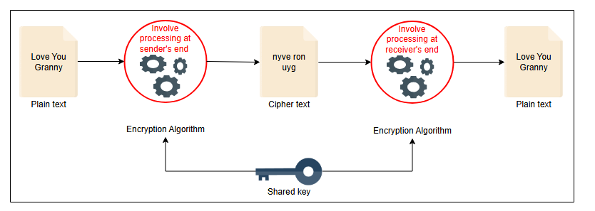

# Оценка дизайна WhatsApp

Оцените дизайн WhatsApp и связанные с ним нефункциональные требования.

## Выполнение требований
Наши нефункциональные требования к предлагаемому дизайну WhatsApp включают низкую задержку, согласованность, доступность и безопасность. Давайте обсудим, как мы достигли этих требований в нашей системе:

*   **Низкая задержка:** Мы можем минимизировать задержку системы на различных уровнях:
    *   Мы можем сделать это с помощью географически распределенных WebSocket-серверов и связанных с ними кэшей.
    *   Мы можем использовать кластеры кэша Redis поверх кластеров баз данных MySQL.
    *   Мы можем использовать CDN для частого обмена документами и медиаконтентом.

*   **Согласованность:** Система также обеспечивает высокую согласованность сообщений с помощью очереди сообщений FIFO со строгим порядком. Однако упорядочивание сообщений потребует использования **секвенсора (Sequencer)** для присвоения каждому сообщению идентификатора с соответствующими механизмами вывода причинно-следственных связей. Для офлайн-пользователей база данных Mnesia хранит сообщения в очереди. Сообщения отправляются позже в последовательности после того, как пользователь выходит в онлайн.

*   **Доступность:** Систему можно сделать высокодоступной, если у нас будет достаточно WebSocket-серверов и мы будем реплицировать данные на нескольких серверах. Когда пользователь отключается из-за сбоя в WebSocket-сервере, сессия воссоздается через балансировщик нагрузки с другим сервером. Кроме того, сообщения хранятся в кластере Mnesia по модели репликации «основной-вторичный», что обеспечивает высокую доступность и долговечность.

*   **Безопасность:** Система также предоставляет механизм сквозного шифрования, который защищает чат между пользователями.

*   **Масштабируемость:** Благодаря высокопроизводительной инженерии масштабируемость может не быть серьезной проблемой, поскольку WhatsApp может обрабатывать около 10 миллионов подключений на один сервер. Однако наша предлагаемая система является гибкой, так как можно добавлять или удалять серверы по мере увеличения или уменьшения нагрузки.

> #### Вопрос на размышление
> **1. В случае сетевого разделения, чем должна пожертвовать система: согласованностью или доступностью?**
>
> 

>  
<b>Показать ответ</b>

>
> Согласно теореме CAP, в случае сбоя или разделения сети система может обеспечить либо согласованность, либо доступность. В нашей системе мессенджера WhatsApp правильный порядок сообщений имеет важное значение. В противном случае контекст передаваемой между пользователями информации может значительно измениться. Поэтому в нашей системе доступность может пострадать в случае сетевого разделения, но согласованность должна быть в приоритете.
> 

**Подходы к достижению нефункциональных требований**

| Нефункциональные требования | Подходы |
| :--- | :--- |
| Минимизация задержки | - Географически распределенные системы управления кэшем и серверы - CDN |
| Согласованность | - Присвоение уникальных ID сообщениям с помощью секвенсора или других механизмов - Использование очереди сообщений FIFO со строгим порядком |
| Доступность | - Предоставление нескольких WebSocket-серверов и менеджеров для установления соединений между пользователями - Репликация сообщений и данных, связанных с пользователями и группами, на разных серверах - Следование протоколам аварийного восстановления |
| Безопасность | - Сквозное шифрование |
| Масштабируемость | - Настройка производительности серверов - Горизонтальное масштабирование сервисов |

## Компромиссы
Мы видели, что наша предлагаемая система WhatsApp выполняет функциональные и нефункциональные требования. Однако в предложенном дизайне WhatsApp существуют два основных компромисса:

*   Компромисс между согласованностью и доступностью.
*   Компромисс между задержкой и безопасностью.

### Компромисс между согласованностью и доступностью
Согласно теореме CAP, в случае сбоя или разделения сети система может обеспечить либо согласованность, либо доступность. Таким образом, в случае нашего дизайна WhatsApp мы должны выбрать либо согласованность, либо доступность. В WhatsApp порядок отправляемых или получаемых пользователем сообщений имеет важное значение. Поэтому мы должны отдавать приоритет согласованности, а не доступности.

### Компромисс между задержкой и безопасностью
Низкая задержка является важным фактором в проектировании систем, который обеспечивает пользователям опыт в реальном времени. Однако, с другой стороны, обмен информацией или данными через WhatsApp может быть небезопасным без шифрования. Отсутствие надлежащего механизма безопасности делает данные уязвимыми для несанкционированного доступа. Таким образом, мы можем принять компромисс, отдавая приоритет безопасной передаче сообщений перед низкой задержкой.

Мы можем задаться вопросом, в чем заключается компромисс. Часто общение включает в себя мультимедиа. Их шифрование почти в реальном времени на устройстве отправителя и дешифрование на стороне получателя может быть ресурсоемким для устройств, вызывая задержку. Процесс проиллюстрирован на следующем рисунке:

## Резюме
В этой главе мы спроектировали мессенджер WhatsApp. Сначала мы определили функциональные и нефункциональные требования, а также оценку ресурсов, имеющих решающее значение для дизайна. Затем мы сосредоточились на высокоуровневом и детальном проектировании системы WhatsApp, где мы описали различные компоненты, отвечающие за разные сервисы. Наконец, мы оценили нефункциональные требования и выделили некоторые компромиссы в дизайне.

Эта задача проектирования подчеркнула, что мы можем оптимизировать вычислительные ресурсы общего назначения для конкретных случаев использования. WhatsApp оптимизировал свой программный стек для обработки значительно большого количества подключений на стандартных серверах.