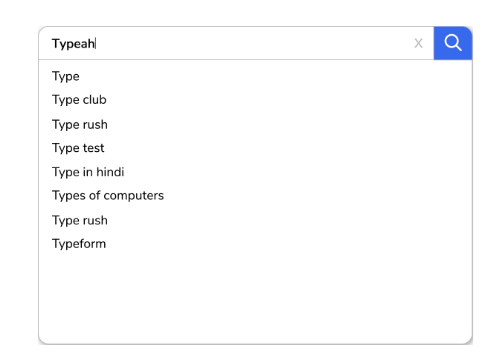

# Дизайн системы: Система подсказок при вводе

Узнайте о системе подсказок при вводе и разберитесь в важных деталях, связанных с процессом ее проектирования.

## Введение

**Подсказки при вводе (Typeahead suggestion)**, также известные как **система автодополнения (autocomplete system)**, — это функциональность фронтенда, которая предоставляет предложения поисковых запросов в реальном времени по мере того, как пользователи печатают. Она позволяет пользователям искать известные и часто запрашиваемые запросы. Эта функция вступает в игру, когда пользователь вводит запрос в поле поиска. Система подсказок предоставляет список лучших предложений для завершения запроса на основе истории поиска пользователя, текущего контекста поиска и популярного контента среди разных пользователей и регионов. Часто запрашиваемые запросы всегда появляются вверху списка предложений. Система подсказок не ускоряет сам поиск. Однако она помогает пользователю быстрее сформулировать предложение. Лежащий в основе алгоритм определяет релевантность и ранжирование предлагаемых терминов.

Системы подсказок при вводе распространены в таких приложениях, как:

*   Поисковые системы, такие как Google или Bing
*   Сайты электронной коммерции для автодополнения названий товаров
*   Текстовые и кодовые редакторы

> **Примечание:** Для обеспечения безупречного пользовательского опыта система подсказок должна иметь низкую задержку и высокую отказоустойчивость. Системы подсказок, разработанные технологическими гигантами, такими как Google и Amazon, повышают точность поиска и персонализируют пользовательский опыт, анализируя прошлые взаимодействия и предпочтения.

## Проблема проектирования системы подсказок при вводе

Как системные проектировщики или кандидаты на собеседовании по дизайну систем, мы должны понимать, как работает система подсказок при вводе. Интервьюер может задать интересные вопросы по дизайну систем:

*   Как бы вы спроектировали систему подсказок, способную обучаться на поведении пользователей — как бы вы включили обработку данных в реальном времени и циклы обратной связи?
*   Как размещение и конфигурация балансировщика нагрузки влияют на производительность системы подсказок и пользовательский опыт?
*   Как бы вы эффективно обновляли структуры поддеревьев в системе подсказок для учета поступления новых данных из различных источников, таких как веб-краулеры и т. д.?

## Краткий обзор главы

Надежная система подсказок требует тщательного рассмотрения нескольких архитектурных компонентов. Например, бэкенд часто поддерживается хранилищами «ключ-значение», обеспечивающими быстрый доступ к данным. Аналогично, разделение (партиционирование) данных по нескольким серверам приложений повышает масштабируемость и производительность. Для улучшения качества предложений могут использоваться офлайн-задачи MapReduce для предварительной обработки и анализа огромных объемов данных.

Для достижения высокой доступности и отказоустойчивости сервиса необходима репликация данных между серверами. Кроме того, метрики производительности системы в реальном времени, такие как задержка и пропускная способность, необходимы для выявления узких мест и оптимизации системы. Тщательно спроектированные интерфейсы между фронтендом и бэкендом, наряду с эффективной балансировкой нагрузки, способствуют безупречному пользовательскому опыту в различных сценариях использования.

Давайте перейдем к плану проектирования системы подсказок при вводе.

## Как мы будем проектировать систему подсказок при вводе?

Мы разделили главу о проектировании системы подсказок при вводе на шесть уроков:

1.  **Требования:** В этом уроке мы сосредоточимся на функциональных и нефункциональных требованиях к проектированию системы подсказок. Мы также обсудим оценку ресурсов для бесперебойной работы системы.
2.  **Высокоуровневый дизайн:** В этом уроке мы обсудим высокоуровневый дизайн нашей версии системы подсказок. Мы также обсудим некоторые важные API, используемые в дизайне.
3.  **Структура данных для хранения префиксов:** В этом уроке мы рассмотрим структуру данных trie (эффективную древовидную структуру данных), которая используется для хранения поисковых префиксов. Мы также обсудим, как ее можно дополнительно оптимизировать для сокращения времени обхода дерева.
4.  **Детальный дизайн:** В этом уроке мы объясним два основных компонента, сервис *предложений* и *сборщик*, которые составляют детальный дизайн системы подсказок.
5.  **Оценка:** Этот урок оценивает предложенный дизайн системы подсказок на основе нефункциональных требований системы. Он также представляет некоторые оптимизации на стороне клиента и персонализацию, которые могут значительно повлиять на дизайн системы.

Давайте начнем с определения требований к проектированию системы подсказок при вводе.

