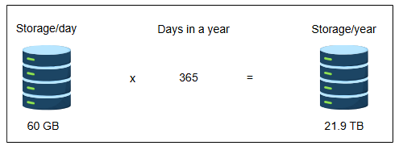
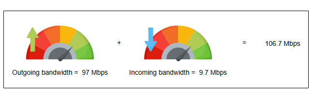
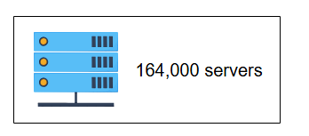

# Требования к дизайну системы подсказок при вводе

Узнайте о требованиях и оценке ресурсов для проектирования системы подсказок при вводе.

## Требования

В этом уроке мы рассмотрим требования и оценочные ресурсы, необходимые для проектирования системы подсказок при вводе. Наш предлагаемый дизайн должен соответствовать следующим требованиям.

### Функциональные требования

Система должна предлагать N (скажем, десять) наиболее частых и релевантных терминов пользователю на основе текста, который он вводит в поле поиска.

### Нефункциональные требования

*   **Низкая задержка (Low latency):** Система должна показывать все предложенные запросы в реальном времени после того, как пользователь напечатает. Задержка не должна превышать 200 мс. Исследование показывает, что среднее время между двумя нажатиями клавиш составляет 160 миллисекунд. Поэтому наш временной бюджет на предложения должен быть больше 160 мс, чтобы дать ответ в реальном времени. Это потому, что если пользователь печатает быстро, он уже знает, что искать, и может не нуждаться в подсказках. В то же время ответ нашей системы должен быть больше 160 мс. Однако он не должен быть слишком высоким, потому что в этом случае предложение может быть устаревшим и менее полезным.
*   **Отказоустойчивость (Fault tolerance):** Система должна быть достаточно надежной, чтобы предоставлять подсказки, несмотря на сбой одного или нескольких ее компонентов.
*   **Масштабируемость (Scaleability):** Система должна поддерживать постоянно растущее число пользователей с течением времени.

## Оценка ресурсов

Как было сказано ранее, функция подсказок используется для улучшения пользовательского опыта при вводе запроса. Нам нужно спроектировать систему, которая работает в масштабах, аналогичных поиску Google. Google получает более 3,5 миллиардов поисковых запросов каждый день. Проектирование такой огромной системы — сложная задача, требующая различных ресурсов. Давайте оценим требования к хранилищу и пропускной способности для предлагаемой системы.

### Оценка хранилища

Предположим, что из 3,5 миллиардов запросов в день два миллиарда являются уникальными и их необходимо сохранить. Также предположим, что каждый запрос в среднем состоит из 15 символов, и каждый символ занимает 2 байта. Согласно этой формуле, нам потребуется следующее:

2 миллиарда × 15 × 2 = 60 ГБ для хранения всех запросов за день.

Требуемое хранилище в год:

60 ГБ/день × 365 = 21,9 ТБ/год

### Оценка пропускной способности

3,5 миллиарда запросов будут поступать в нашу систему каждый день. Предположим, что каждый запрос, который вводит пользователь, в среднем имеет длину 15 символов.

Учитывая это, общее количество запросов на чтение символов в день будет следующим:

15 × 3,5 миллиарда = 52,5 миллиарда символов в день.

Всего запросов на чтение в секунду: 52,5 млрд / 86400 ≈ 0,607 млн символов/сек. 86 400 — это количество секунд в сутках.

Поскольку каждый символ занимает 2 байта, пропускная способность, которая потребуется нашей системе, следующая:

0,607 млн × 2 × 8 = 9,7 Мбит/сек

9,7 Мбит/сек — это требование к входящей пропускной способности для запросов максимальной длиной 15 символов. Наша система будет предлагать десять лучших запросов, которые примерно такой же длины, как и сам запрос, после каждого введенного пользователем символа. Следовательно, требование к исходящей пропускной способности станет следующим:

10 × 9,7 Мбит/сек = 97 Мбит/сек.

### Оценка количества серверов

Наша система будет получать 52,5 миллиарда запросов в день. Учитывая наше предположение об использовании ежедневных активных пользователей как показателя для количества запросов в секунду при пиковой нагрузке, мы получаем 52,5 миллиарда запросов в секунду (считая каждый символ как запрос).

Напомним, что типичный сервер может обслуживать 64 000 запросов в секунду (RPS). Таким образом, необходимое количество серверов можно оценить по следующей формуле:

Количество серверов = Количество запросов/секунду / RPS сервера

Количество серверов = 52,5 миллиарда / 64 000 = 820312.5 ≈ 821 тыс. серверов

> Первоначальная оценка в 52,5 миллиарда запросов в секунду кажется нереалистичной. Однако в среднем человек печатает со скоростью около трех-четырех символов в секунду.

Поэтому, предполагая 3,5 миллиарда пользователей и сценарий пиковой нагрузки, когда каждый пользователь печатает примерно три символа в секунду, мы приходим к более реальной оценке в (3,5 × 3) миллиарда запросов в секунду. Эта пересмотренная цифра дает более реалистичную оценку:

Количество серверов = (3,5 миллиарда × 3) / 64 000 = 164062.5 ≈ 164 тыс. серверов

#### Оценка ресурсов для системы подсказок при вводе

| Параметр | Значение | Единица |
| :--- | :--- | :--- |
| Всего запросов в день | 3.5 | миллиард |
| Уникальных запросов в день | 2 | миллиард |
| Минимум символов в запросе | 15 | Символов |
| RPS сервера | 64000 | Запросов в секунду |
| Хранилище | 60 | ГБ/день |
| Входящая пропускная способность | 9.7 | Мбит/сек |
| Исходящая пропускная способность | 97 | Мбит/сек |
| Количество серверов (равномерные запросы) | 9 | Серверов |
| Количество серверов (пиковая нагрузка) | 164063 | Серверов |

## Компоненты, которые мы будем использовать

Проектирование системы подсказок при вводе состоит из следующих компонентов, которые были рассмотрены в начальных главах курса:

*   **Базы данных** необходимы для хранения данных, связанных с префиксами запросов.
*   **Балансировщики нагрузки** необходимы для распределения входящих запросов между несколькими активными серверами.
*   **Кэши** используются для хранения N лучших предложений для быстрого извлечения.

В следующем уроке мы сосредоточимся на высокоуровневом дизайне и API системы подсказок при вводе.
