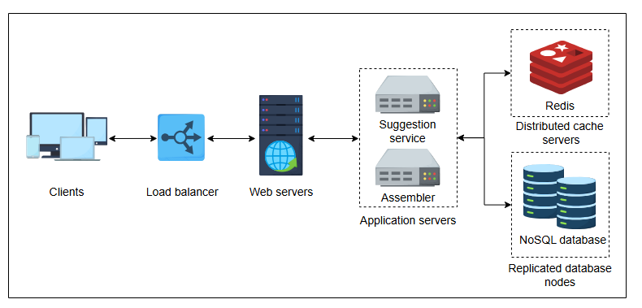

# Высокоуровневый дизайн системы подсказок при вводе

Получите обзор высокоуровневого дизайна системы подсказок при вводе.

## Высокоуровневый дизайн

Согласно нашим требованиям, система должна не только предлагать запросы в реальном времени с минимальной задержкой, но и хранить новые поисковые запросы в базе данных. Таким образом, пользователь получает предложения, основанные на популярных и недавних поисках.

Наша предлагаемая система должна делать следующее:

*   Предоставлять предложения на основе истории поиска пользователя.
*   Хранить все новые и популярные запросы в базе данных, чтобы включать их в список предложений.

Когда пользователь начинает вводить запрос, каждый напечатанный символ попадает на один из серверов приложений. Предположим, у нас есть **сервис предложений (suggestions service)**, который получает десять лучших предложений из кэша Redis и возвращает их в качестве ответа клиенту. В дополнение к этому, предположим, у нас есть другой сервис, известный как **сборщик (assembler)**. Сборщик собирает поисковые запросы пользователей, применяет некоторую аналитику для ранжирования поисков и сохраняет их в базе данных NoSQL, распределенной по нескольким узлам.

Кроме того, нам также нужны балансировщики нагрузки для равномерного распределения входящих запросов. Мы также добавляем веб-серверы в качестве точек входа для клиентов, чтобы они могли перенаправлять запросы к соответствующим микросервисам. Эти веб-серверы инкапсулируют внутреннюю архитектуру системы и предоставляют другие услуги, такие как аутентификация, мониторинг, формирование запросов, управление и многое другое.

## Дизайн API

Поскольку система предоставляет пользователю предложения и добавляет популярные запросы в базы данных, нам понадобятся следующие API.

### Получение подсказок

`getSuggestions(prefix)`

Этот вызов API извлекает предложения с серверов. Вызов осуществляется через сервис предложений и возвращает ответ клиенту.

В следующей таблице объясняется параметр, который передается в вызов API:

| Параметр | Описание |
| :--- | :--- |
| `prefix` | Это то, что пользователь ввел в строку поиска. |

### Добавление популярных запросов в базу данных

`addToDatabase(query)`

Этот вызов API добавляет популярный `query` в базу данных через сборщик, если этот запрос уже искали и он превысил определенный порог.

| Параметр | Описание |
| :--- | :--- |
| `query` | Представляет часто искомый запрос, который превышает предопределенный лимит. |

---

> **1. Вместо обновления всей страницы нам нужно обновлять только предложенный запрос в поле поиска в реальном времени. Какую технику мы можем использовать для этой цели?**
>
>
> 

>  
<b>Показать ответ</b>

>
>  Мы должны обновлять запрос асинхронно с помощью **AJAX**. **AJAX** — это набор техник веб-разработки. Он позволяет веб-страницам обмениваться небольшим количеством данных с сервером, как в системе подсказок, не мешая отображению и поведению существующей веб-страницы.
>  

---

> Предположим, нашей системе подсказок необходимо одновременно поддерживать несколько языков для обслуживания глобальной пользовательской базы. Каковы потенциальные узкие места в текущем высокоуровневом дизайне, и как мы их решим?
>
> 

>  
<b>Показать ответ</b>

>
>  Основные узкие места в поддержке нескольких языков — это нюансы языков, поддержка символов, балансировка нагрузки, хранение и поиск данных, а также ранжирование предложений. Решения — использовать языко-специфичные алгоритмы, поддерживать все символы, улучшать балансировку, оптимизировать хранение и внедрять отдельные системы ранжирования для каждого языка.
>  

