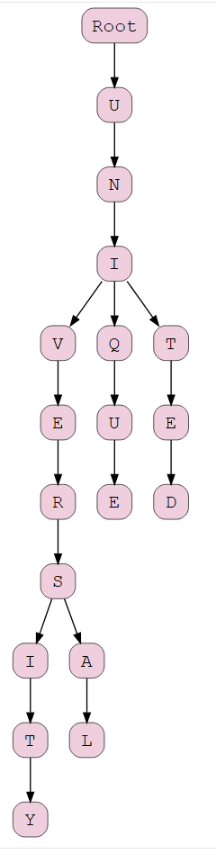
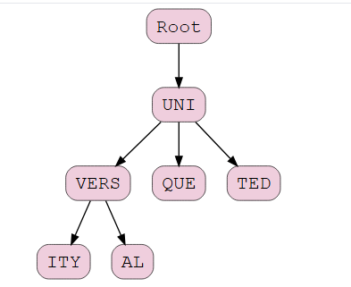
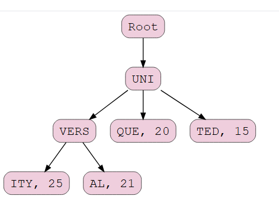
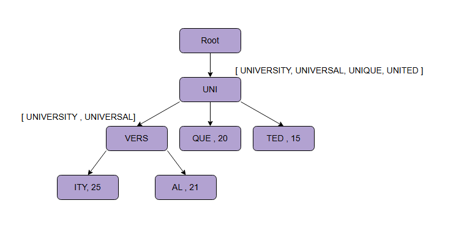

Ы
# Структура данных для хранения префиксов

Узнайте об эффективной структуре данных, которая используется для хранения поисковых подсказок.

## Структура данных trie

Прежде чем мы перейдем к обсуждению детального дизайна системы подсказок при вводе, мы должны выбрать эффективную структуру данных для хранения префиксов. Префиксы — это группы символов, которые вводит пользователь. Проблема, которую мы пытаемся решить, заключается в том, что у нас есть много `строк`, которые нужно хранить таким образом, чтобы пользователи могли искать их по любому префиксу. Наш сервис предлагает следующие слова, которые соответствуют предоставленному префиксу. Предположим, наша база данных содержит фразы `UNITED`, `UNIQUE`, `UNIVERSAL` и `UNIVERSITY`. Наша система должна предлагать «**UNIVERSAL**» и «**UNIVERSITY**», когда пользователь вводит «**UNIV**».

Должен существовать метод, который может эффективно хранить наши данные и помогать нам проводить быстрые поиски, потому что нам приходится обрабатывать множество запросов с минимальной задержкой. Мы не можем полагаться на базу данных для этого, потому что предоставление подсказок из базы данных занимает больше времени по сравнению с чтением подсказок из **оперативной памяти (RAM)**. Поэтому нам нужно хранить наш индекс в памяти в эффективной структуре данных. Однако для долговечности и доступности эти данные хранятся в базе данных.

**Trie** (произносится как «трай», также известно как префиксное дерево) — одна из структур данных, которая лучше всего подходит для наших нужд. **Trie** — это древовидная структура данных для хранения фраз, где каждый узел дерева поочередно хранит символ фразы. Если бы нам нужно было хранить `UNITED`, `UNIQUE`, `UNIVERSAL` и `UNIVERSITY` в trie, это выглядело бы так:

Если пользователь вводит «UNIV», наш сервис может обойти trie до узла `V`, чтобы найти все термины, начинающиеся с этого префикса — например, `UNIVERSAL`, `UNIVERSITY` и так далее.

Trie может объединять узлы, у которых есть только одна ветвь, в один, что уменьшает глубину дерева. Это также сокращает время обхода, что, в свою очередь, повышает эффективность. В качестве примера, эффективная по пространству и времени модель вышеупомянутого trie выглядит следующим образом:

### Отслеживание самых популярных поисковых запросов

Поскольку наша система отслеживает самые популярные поисковые запросы и возвращает лучшие подсказки, мы храним количество поисков каждого термина в узле trie. Допустим, пользователь искал `UNITED` 15 раз, `UNIQUE` 20 раз, `UNIVERSAL` 21 раз и `UNIVERSITY` 25 раз. Чтобы предоставить пользователю лучшие подсказки, эти счетчики хранятся в каждом узле, где заканчиваются эти термины. Результирующее trie выглядит так:

Если пользователь вводит «UNI», система начинает обход дерева под корневым узлом для `UNI`. После сравнения всех терминов, исходящих из корневого узла, система предоставляет подсказки всех возможных слов. Поскольку частота слова `UNIVERSITY` высока, оно появляется вверху. Аналогично, частота слова `UNITED` относительно низка, поэтому оно появляется последним. Если пользователь выберет `UNIQUE` из списка подсказок, число напротив `UNIQUE` увеличится до 21.

> **1. Мы сократили время обхода trie, объединив узлы с единственной ветвью и уменьшив количество уровней. Есть ли другой способ минимизировать время обхода trie?**
>
>
> 

>  
<b>Показать ответ</b>

>
> Один из способов сократить время обхода trie — это **предварительно вычислить** и сохранить десять лучших (или любое выбранное нами количество) подсказок для каждого префикса в узле. Это означает, что вместо того, чтобы каждый раз обходить trie, когда пользователь вводит «UNIVERS» в строку поиска, система будет иметь предварительно вычисленное, отсортированное и сохраненное решение для префикса `UNIVERS` — то есть `UNIVERSITY`, `UNIVERSAL` и так далее — внутри узла, который несет префикс `UNIVERS`. Однако этот подход требует дополнительного места для сохранения предварительно вычисленных результатов.
> 
>  

### Разделение (партиционирование) trie

Мы стремимся спроектировать систему, подобную Google, которую можно использовать для обработки миллиардов запросов в секунду. Одного сервера недостаточно для обработки такого огромного количества запросов. Кроме того, хранение всех префиксов в одном trie не является жизнеспособным вариантом для доступности, масштабируемости и отказоустойчивости системы. Хорошим решением является разделение trie на несколько для улучшения пользовательского опыта.

Предположим, что trie разделено на две части, и каждая часть имеет реплику для целей отказоустойчивости. Все префиксы, начинающиеся с «A» по «M», хранятся на Сервере/01, а реплика хранится на Сервере/02. Аналогично, все префиксы, начинающиеся с «N» по «Z», хранятся на Сервере/03, а реплика — на Сервере/04. Следует отметить, что эта простая техника не всегда равномерно распределяет нагрузку, потому что некоторые префиксы содержат гораздо больше слов, чем другие. Мы используем эту простую технику для понимания разделения.

Мы можем разделить trie на столько частей, сколько захотим, чтобы распределить нагрузку на разные серверы и достичь желаемой производительности.

#### Разделенное Trie

| Префиксы | Основной | Резервный |
| :--- | :--- | :--- |
| A до M | Сервер/01 | Сервер/02 |
| N до Z | Сервер/03 | Сервер/04 |

> **Где будет храниться сопоставление между префиксами и их основным и резервным хранилищем? Кто будет управлять и направлять запросы на эти серверы?**
>
> 

>  
<b>Показать ответ</b>

>
>  В распределенной системе, где для определенного сервиса могут использоваться несколько кластеров, состоящих из нескольких серверов, мы используем менеджер кластеров, такой как ZooKeeper, для хранения сопоставления между кластерами.
>  

#### Обработка запроса после разделения

Когда пользователь вводит запрос, он попадает на балансировщик нагрузки и перенаправляется на один из серверов приложений. Сервер приложений ищет в соответствующем trie в зависимости от префикса, введенного пользователем. Например, если пользователь вводит что-то, начинающееся с «U», он обращается либо к Серверу/03, либо к Серверу/04, поскольку на обоих хранятся trie с префиксами, начинающимися с «U».

### Обновление trie

Миллиарды поисковых запросов каждый день дают нам сотни тысяч запросов в секунду. Поэтому процесс обновления trie для каждого запроса очень ресурсоемок и трудоемок и может помешать нашим запросам на чтение. Эту проблему можно решить, обновляя trie в офлайн-режиме через определенные промежутки времени. Для офлайн-обновления trie мы записываем запросы и их частоту в хэш-таблицу и агрегируем данные через регулярные промежутки времени. Через определенное время trie обновляется агрегированной информацией. После обновления trie все предыдущие записи удаляются из хэш-таблицы.

#### Префиксы и их частоты, обновляемые периодически

| Префикс | Временной интервал (один час) | Частота |
| :--- | :--- | :--- |
| UNIVERSITY | 1-й час | 25 |
| UNIVERSITY | 2-й час | 60 |
| UNIVERSITY | 3-й час | 100 |

Мы можем запустить задачу **MapReduce (MR)** для регулярной обработки всех данных логов, скажем, каждые 15 минут. Эти MR-сервисы вычисляют частоту всех искомых фраз за предыдущие 15 минут и выгружают результаты в хэш-таблицу в базе данных, такой как Cassandra. После этого мы можем дополнительно обновить trie новыми данными. Мы можем обновить текущую копию trie всеми новыми словами и их частотами. Мы должны выполнять это офлайн, потому что наш приоритет — предоставлять подсказки пользователям, а не заставлять их ждать.

В основном, мы можем обновлять trie, используя два следующих подхода:

*   Мы можем реплицировать trie на каждом сервере, чтобы обновлять его офлайн. После этого мы можем начать использовать его для подсказок и отбросить старые.
*   Другой способ — иметь одну основную копию и несколько резервных копий trie. Пока основная копия используется для ответов на запросы, мы можем обновлять резервную копию. Мы также можем сделать резервную копию основной после завершения обновления. Затем мы можем обновить нашу предыдущую основную, которая также сможет обслуживать трафик.

> **Если частоты префиксов со временем продолжают расти, соответствующие целые числа, хранящие их, могут переполниться. Как мы можем решить эту проблему?**
>
>
> 

>  
<b>Показать ответ</b>

>
>  Мы можем нормализовать частоты, сопоставив их с диапазоном, скажем, от нуля до 1000. В качестве альтернативы мы можем прекратить дальнейшие добавления после достижения определенного порога, предполагая, что любой префикс, достигший этого порога, находится на вершине рейтинга.
>  

---

В следующем уроке мы обсудим детальный дизайн системы подсказок при вводе.