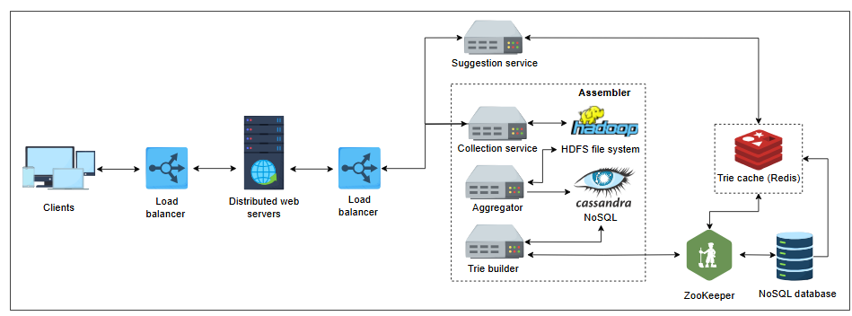

# Детальный дизайн системы подсказок при вводе

Узнайте о детальном дизайне системы подсказок при вводе.

## Детальный дизайн

Давайте рассмотрим поток и взаимодействие компонентов, показанных на иллюстрации ниже. Наш дизайн разделен на две основные части:

*   Сервис предложений
*   Сборщик

### Сервис предложений (Suggestion service)

В то время как пользователь вводит запрос в поле поиска, вызовы API `getSuggestions(prefix)` попадают в сервисы предложений. Десять самых популярных запросов возвращаются из распределенного кэша, Redis.

### Сборщик (Assembler)

В предыдущем уроке мы обсуждали, как создаются, разделяются и хранятся префиксные деревья (tries) в базе данных. Однако создание и обновление trie не должны находиться на критическом пути выполнения запроса пользователя. Мы не должны обновлять trie в реальном времени по следующим причинам:

*   Могут быть миллионы пользователей, вводящих запросы каждую секунду. В такие периоды с большим объемом входящего трафика обновление trie в реальном времени при каждом запросе может замедлить наш **сервис предложений**.
*   Мы должны предоставлять лучшие предложения, которые могут не часто меняться после создания или обновления trie. Поэтому менее важно часто обновлять trie.

В свете вышеизложенных причин у нас есть отдельный сервис, называемый сборщиком (assembler), который отвечает за создание и обновление trie через определенный настраиваемый промежуток времени. Сборщик состоит из следующих различных сервисов:

*   **Сервис сбора (Collection service):** Всякий раз, когда пользователь печатает, этот сервис собирает лог, состоящий из фраз, времени и других метаданных, и выгружает его в базу данных, которая обрабатывается позже. Поскольку размер этих данных огромен, **распределенная файловая система Hadoop (HDFS)** считается подходящей системой хранения для этих необработанных данных. Пример необработанных данных от сервиса сбора показан в следующей таблице. Мы записываем время, чтобы система знала, когда обновлять частоту определенной фразы.

#### Необработанные данные, собранные сервисом сбора

| Фразы | Дата и время (ДД-ММ-ГГГГ ЧЧ:ММ:СС) |
| :--- | :--- |
| UNIVERSAL | 23-03-2022 10:16:18 |
| UNIVERSITY| 23-03-2022 10:20:11 |
| UNIQUE | 23-03-2022 10:21:10 |
| UNIQUE | 23-03-2022 10:22:24 |
| UNIVERSITY| 23-03-2022 10:25:09 |

*   **Агрегатор (Aggregator):** Необработанные данные, собранные **сервисом сбора**, обычно не находятся в консолидированном виде. Нам нужно консолидировать необработанные данные, чтобы обрабатывать их дальше и создавать или обновлять trie. Агрегатор извлекает данные из HDFS и распределяет их по разным рабочим узлам. Обычно MapReducer отвечает за агрегацию частоты префиксов за заданный интервал времени, и частота периодически обновляется в соответствующей базе данных Cassandra. **Cassandra** подходит для этой цели, поскольку может хранить большие объемы данных в табличном формате. В следующей таблице показаны обработанные и консолидированные данные за определенный период. Эта таблица регулярно обновляется агрегатором и хранится в хэш-таблице в базе данных, такой как Cassandra. Для простоты мы предполагаем, что наши данные нечувствительны к регистру.

#### Полезная информация, извлеченная из необработанных данных

| Фразы | Частота | Временной интервал |
| :--- | :--- | :--- |
| UNIVERSAL | 1400 | Первые 15 минут |
| UNIVERSITY| 1340 | Первые 15 минут |
| UNIQUE | 1200 | Первые 15 минут |

*   **Построитель Trie (Trie builder):** Этот сервис отвечает за создание или обновление trie. Он сохраняет эти новые и обновленные trie на их соответствующих шардах в базе данных trie через ZooKeeper. Trie хранятся в постоянном хранилище в файле, чтобы мы могли легко восстановить наше trie при необходимости. Документные базы данных NoSQL, такие как MongoDB, подходят для хранения этих trie. Это хранение trie необходимо при перезапуске машины. Trie обновляется из агрегированных данных в базе данных Cassandra. Существующий снимок trie обновляется всеми новыми терминами и их соответствующими частотами. В противном случае создается новое trie с использованием данных из базы данных Cassandra. Как только trie создано или обновлено, система делает его доступным для сервиса предложений.

---

> Как бы вы обрабатывали слова с опечатками или неполные слова в системе подсказок при вводе? Для начала, напишите «Привет» в виджете ниже.
>
> 

>  
<b>Показать ответ</b>

>
>  Чтобы обработать опечатки или неполные слова в системе автодополнения, используют такие методы:
> 1. Неточность совпадения (fuzzy matching) — ищет похожие слова.
> 2. Автокорректировка — исправляет орфографические ошибки при вводе.
> 3. Предиктивный текст — предлагает слова, основываясь на предыдущих вводах.
> 4. Контекстуальные подсказки — учитывают смысл и контекст, чтобы предложить релевантные слова.
>
> >  

---

> **Должны ли мы собирать данные и создавать trie для каждого пользователя, или оно должно быть общим для всех пользователей?**
>
>
> 

>  
<b>Показать ответ</b>

>
>  Поскольку мы стремимся спроектировать систему в масштабе, подобном поиску Google, миллиарды пользователей будут использовать наш сервис. Так как количество пользователей будет огромным, поддержка дерева для каждого пользователя станет сложной и трудоемкой. Также существует вероятность дублирования деревьев, если несколько пользователей вводили некоторые общие запросы, что приведет к растрате ресурсов.
>
> Поэтому наш дизайн предполагает **общее trie**, которое используется всеми пользователями, где ранжирование будет основано на отдельных фразах в trie и частоте терминов.
>  

