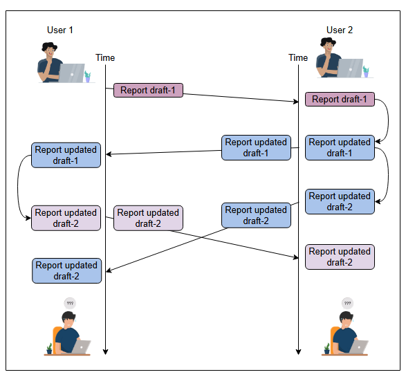
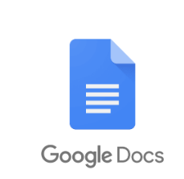

# **Системный дизайн: Google Docs**

Узнайте, что такое совместное редактирование документов и какому плану следовать при проектировании такого сервиса.

---

## **Постановка задачи**

Представьте, что два студента готовят отчет по проекту, который они только что завершили. Поскольку студенты живут отдельно, первый студент просит второго начать писать отчет, а сам будет улучшать полученную копию. Несмотря на высокую мотивацию, студенты скоро понимают, что такое сотрудничество неорганизованно. Следующая иллюстрация показывает, насколько утомительным может стать этот процесс.

Проблемы, возникающие при отсутствии сервиса для совместного редактирования документов

Описанный выше сценарий — это один из примеров, который приводит к потере времени и разочарованию, когда пользователи совместно работают над документом, обмениваясь файлами.

## **Google Docs**

Чтобы решить вышеуказанную проблему, мы можем использовать онлайн-сервис для совместного редактирования документов, такой как Google Docs. Некоторые преимущества использования онлайн-сервиса для редактирования документов вместо настольного приложения следующие:

*   Пользователи могут рецензировать и комментировать документ во время его редактирования.
*   Не требуется никаких особых аппаратных характеристик для получения новейших функций. Достаточно компьютера, который может запустить браузер.
*   Возможно работать из любого места.
*   В отличие от локальных настольных редакторов, пользователи могут просматривать долгосрочную историю документа и при необходимости восстанавливать старую версию.
*   Сервис является бесплатным.

Помимо Google Docs, к популярным онлайн-сервисам для редактирования относятся Etherpad, Microsoft Office 365, Slite и многие другие.

## **Проектирование Google Docs**

Сервис для совместного редактирования документов можно спроектировать двумя способами:

*   Он может быть спроектирован как централизованный объект с использованием клиент-серверной архитектуры для предоставления услуг по редактированию документов всем пользователям.
*   Он может быть спроектирован с использованием технологии peer-to-peer для совместной работы над одним документом.

Большинство коммерческих решений сосредоточены на клиент-серверной архитектуре для более тонкого контроля. Поэтому мы сосредоточимся на проектировании сервиса с использованием клиент-серверной архитектуры. Давайте посмотрим, как мы будем продвигаться в этой главе.

> **Примечание:** Согласно опросу, 64% людей используют Google Docs для редактирования документов как минимум раз в неделю.

## **Как мы будем проектировать Google Docs?**

Мы разделили задачу проектирования на четыре этапа:

1.  **Требования к дизайну Google Docs**: Этот урок будет посвящен определению требований для проектирования сервиса совместного редактирования документов. На этом этапе мы также оценим требования к инфраструктуре.
2.  **Дизайн Google Docs**: Цель этого урока — разработать дизайн, который удовлетворяет требованиям сервиса. В этом уроке будет объяснено, почему используется тот или иной компонент и как он интегрируется с другими компонентами для выполнения функциональных требований.
3.  **Параллелизм при совместном редактировании**: Онлайн-сервисы для редактирования документов должны разрешать конфликты между пользователями, редактирующими одну и ту же часть документа. Этот урок охватывает типы проблем, которые могут возникнуть, и методы, используемые для их разрешения.
4.  **Оценка дизайна Google Docs**: Основная цель этого урока — оценить наш дизайн на соответствие нефункциональным требованиям. В основном мы посмотрим, является ли наш дизайн производительным, согласованным, доступным и масштабируемым.

Давайте начнем с рассмотрения наших требований.
