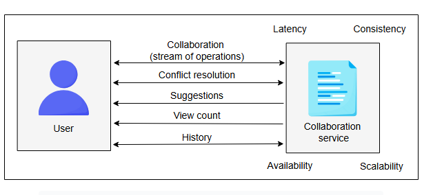
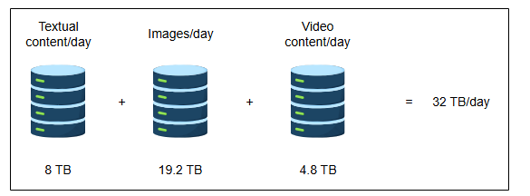
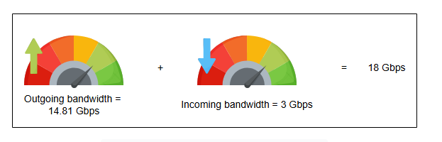
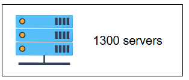
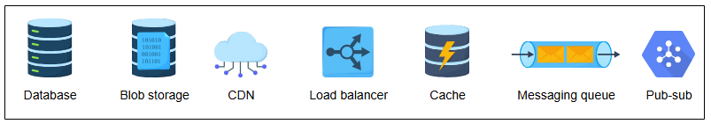

# **Требования к дизайну Google Docs**

Узнайте о требованиях к проектированию сервиса для совместного редактирования.

## **Требования**

Давайте рассмотрим функциональные и нефункциональные требования к проектированию сервиса для совместного редактирования.

### **Функциональные требования**

Ниже перечислены действия, которые пользователь сможет выполнять с помощью нашего сервиса для совместного редактирования документов:

*   **Совместная работа над документом**: Несколько пользователей должны иметь возможность одновременно редактировать документ. Также большое количество пользователей должно иметь возможность просматривать документ.
*   **Разрешение конфликтов**: Система должна передавать правки, сделанные одним пользователем, всем остальным участникам. Система также должна разрешать конфликты между пользователями, если они редактируют одну и ту же часть документа.
*   **Предложения**: Пользователь должен получать подсказки для завершения часто используемых слов, фраз и ключевых слов в документе, а также предложения по исправлению грамматических ошибок.
*   **Счетчик просмотров**: Редакторы документа должны иметь возможность видеть количество просмотров документа.
*   **История**: Пользователь должен иметь возможность просматривать историю совместной работы над документом.

Реальный редактор документов также должен иметь такие функции, как создание, удаление документов и управление доступом пользователей. Мы сосредотачиваемся на перечисленных выше основных функциях, но в последующих уроках мы также обсудим возможность реализации других функций.

### **Нефункциональные требования**

*   **Задержка (latency)**: Разные пользователи могут быть подключены для совместной работы над одним и тем же документом. Поддержание низкой задержки является сложной задачей для пользователей, подключенных из разных регионов.
*   **Согласованность (consistency)**: Система должна уметь разрешать конфликты между пользователями, одновременно редактирующими документ, обеспечивая тем самым согласованное представление документа. В то же время пользователи в разных регионах должны видеть обновленное состояние документа. Поддержание согласованности важно для пользователей, подключенных как к одной, так и к разным зонам.
*   **Доступность (availability)**: Сервис должен быть доступен в любое время и демонстрировать устойчивость к сбоям.
*   **Масштабируемость (scalability)**: Большое количество пользователей должно иметь возможность одновременно использовать сервис. Они могут как просматривать один и тот же документ, так и создавать новые документы.

## **Оценка ресурсов**

Давайте сделаем некоторые оценки ресурсов, основываясь на следующих допущениях:

*   Мы предполагаем, что у нас 80 миллионов ежедневно активных пользователей (DAU).
*   Максимальное количество пользователей, которые могут одновременно редактировать документ, — 20.
*   Размер текстового документа — 100 КБ.
*   30% всех документов содержат изображения, в то время как только 2% документов содержат видео.
*   Общий объем хранилища, необходимый для изображений в документе, составляет 800 КБ, в то время как каждое видео — 3 МБ.
*   Пользователь создает один документ в день.

На основе этих допущений мы сделаем следующие оценки.

### **Оценка хранилища**

Учитывая, что каждый пользователь может создавать один документ в день, общее количество создаваемых документов составляет 80 миллионов в день. Ниже мы оцениваем объем хранилища, необходимый на один день:

**Оценка требований к хранилищу**

| Параметр | Значение | Единица |
| :--- | :--- | :--- |
| Количество документов, создаваемых каждым пользователем | 1 | в день |
| Количество активных пользователей | 80 | миллионов |
| Количество документов в день | 80 | миллионов |
| Требуемое хранилище для текстового контента в день | 8 | ТБ |
| Требуемое хранилище для изображений в день | 19.2 | ТБ |
| Требуемое хранилище для видеоконтента в день | 4.8 | ТБ |
| **Общее требуемое хранилище в день** | **32** | **ТБ** |

*   Общее количество документов в день: `80M × 1 документ = 80M` документов в день.
*   Хранилище для каждого текстового документа: `80M × 100КБ = 8 ТБ`.
*   Требуемое хранилище для изображений в день: `(80M × 30 / 100) × 800КБ = 19.2 ТБ` (Тридцать процентов документов содержат изображения).
*   Требуемое хранилище для видеоконтента в день: `(80M × 2 / 100) × 3МБ = 4.8 ТБ` (Два процента документов содержат видео).

Общий объем хранилища, необходимый на один день: `8 + 19.2 + 4.8 = 32 ТБ` в день.

> **Примечание:** Хотя наши функциональные требования указывают на необходимость хранения истории документов, мы не включили требования к хранилищу для исторических данных для краткости.

### **Оценка пропускной способности**

**Входящий трафик**: Предполагая, что 32 ТБ данных загружаются в день в сеть сервиса совместного редактирования, требование к пропускной способности для входящего трафика будет следующим:

`(32 ТБ / 86400) × 8 ≈ 3 Гбит/с`

**Исходящий трафик**: Чтобы оценить пропускную способность исходящего трафика, мы предположим количество документов, просматриваемых пользователем каждый день. Допустим, типичный пользователь просматривает пять документов в день. Тогда применяются следующие расчеты:

| Параметр | Значение | Единица |
| :--- | :--- | :--- |
| Количество документов, просматриваемых пользователями | 5 | в день |
| Количество активных пользователей | 80 | миллионов |
| Количество просматриваемых документов в день | 400 | миллионов |
| Количество просматриваемых документов в секунду | 4630 | в секунду |
| Пропускная способность для текстового контента в секунду | 3.704 | Гбит/с |
| Пропускная способность для контента с изображениями в секунду | 8.89 | Гбит/с |
| Пропускная способность для видеоконтента в секунду | 2.22 | Гбит/с |
| **Общая требуемая исходящая пропускная способность** | **14.81** | **Гбит/с** |

*   Всего документов, просматриваемых в день всеми пользователями: `80M × 5 = 400M`
*   Документов, просматриваемых в секунду: `400M / 86400 = 4.6 × 10³`
*   Расчет пропускной способности для текстового контента: `4.6 × 10³ × 100КБ × 8 = 3.7 Гбит/с`
*   Расчет пропускной способности для контента с изображениями: `(4.6 × 10³ × 30 / 100) × 800КБ × 8 = 8.8 Гбит/с`
*   Расчет пропускной способности для видеоконтента: `(4.6 × 10³ × 2 / 100) × 3МБ × 8 = 2.2 Гбит/с`
*   Общая исходящая пропускная способность: `3.7 + 8.8 + 2.2 = 14.7 Гбит/с`

> **Примечание:** Общая требуемая пропускная способность равна сумме входящего и исходящего трафика. `= 3 + 14.7 ≈ 18 Гбит/с`

### **Оценка количества серверов**

Поскольку у нас 80 миллионов ежедневно активных пользователей, работающих с документами для совместной работы. Используя наше допущение о том, что ежедневное количество активных пользователей является косвенным показателем количества запросов в секунду для определения количества серверов во время пиковой нагрузки, мы получаем 80 миллионов запросов в секунду. Затем мы используем следующую формулу для расчета количества серверов:

`Серверы, необходимые при пиковой нагрузке = (Количество запросов/секунду) / (RPS сервера)`

Используя 64,000 в качестве оценочного RPS (запросов в секунду), которое может обработать сервер, требуемое количество серверов оценивается следующим образом:

`Серверы, необходимые при пиковой нагрузке = 80 миллионов / 64,000 = 1250 ≈ 1.3K серверов`

## **Основные компоненты, которые мы будем использовать**

Мы будем использовать следующие основные компоненты при проектировании сервиса для совместного редактирования документов.

Основные компоненты, которые необходимо интегрировать в дизайн

*   **Базы данных** понадобятся для хранения различных данных, включая текстовый контент, историю документов, данные пользователей и т.д. Для этого нам могут понадобиться разные типы баз данных.
*   **Хранилище больших двоичных объектов (Blob storage)** будет хранить большие файлы, такие как изображения и видео.
*   **CDN (сеть доставки контента)** может хранить часто запрашиваемые медиафайлы из документа. Мы также можем размещать в CDN документы только для чтения, которые часто запрашиваются.
*   **Балансировщики нагрузки** будут первой точкой контакта для пользователей.
*   **Кэширование** поможет нам улучшить производительность нашего дизайна.
*   **Система очередей** будет ставить в очередь операции редактирования, запрошенные разными пользователями. Поскольку многие запросы на редактирование не могут быть выполнены одновременно, нам придется временно помещать их в очередь.
*   **Системы «издатель-подписчик» (Pub-Sub)** могут выполнять задачи, которые не могут быть выполнены немедленно. В нашем дизайне мы будем выполнять ряд задач асинхронно. Поэтому мы будем использовать систему «издатель-подписчик».

