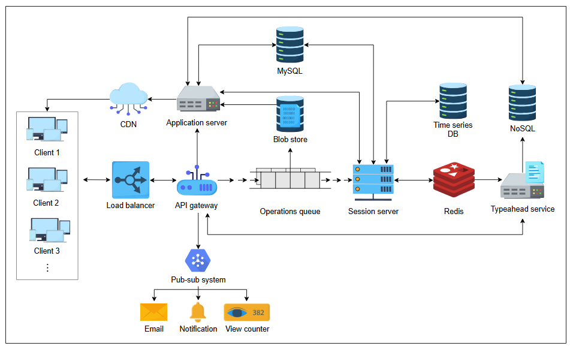

# **Дизайн Google Docs**

Давайте разберемся, как мы можем спроектировать сервис для совместного редактирования документов, используя различные компоненты.

## **Дизайн**

Мы завершим наш дизайн в два этапа. На первом этапе мы объясним различные компоненты и строительные блоки, а также причину их выбора в нашем дизайне. Второй этап опишет, как мы выполняем различные функциональные требования, изображая рабочий процесс.

### **Компоненты**

Мы использовали следующий набор компонентов для завершения нашего дизайна:

*   **Шлюз API (API gateway)**: Различные клиентские запросы будут перехватываться через шлюз API. В зависимости от запроса, можно перенаправить один запрос нескольким компонентам, отклонить запрос или мгновенно ответить, используя уже кэшированный ответ, — все через шлюз API. Запросы на редактирование, комментарии к документу, уведомления, аутентификация и запросы на хранение данных будут проходить через шлюз API.
*   **Серверы приложений (Application servers)**: Серверы приложений будут выполнять бизнес-логику и задачи, которые обычно требуют вычислительной мощности. Например, некоторые документы могут быть преобразованы из одного типа файла в другой (например, из PDF в документ Word) или поддерживать такие функции, как импорт и экспорт. Они также являются центральным элементом для сбора атрибутов для механизма рекомендаций.
*   **Хранилища данных (Data stores)**: Для выполнения наших требований будут использоваться различные хранилища данных. Мы будем использовать реляционную базу данных для сохранения информации о пользователях и информации, связанной с документами, для наложения ограничений на права доступа. Мы можем использовать NoSQL для хранения комментариев пользователей для более быстрого доступа. Для сохранения истории редактирования документов мы можем использовать базу данных временных рядов. Мы будем использовать хранилище больших двоичных объектов (blob storage) для хранения видео и изображений в документе. Наконец, мы можем использовать распределенный кэш, такой как Redis, и CDN, чтобы обеспечить конечным пользователям хорошую производительность. Мы используем Redis специально для хранения различных структур данных, включая сессии пользователей, признаки для сервиса автодополнения (typeahead) и часто запрашиваемые документы. CDN хранит часто запрашиваемые документы и тяжелые объекты, такие как изображения и видео.

---

> **Вопрос:** Каковы соображения при бессрочном хранении истории редактирования документа?
>
> 

>  
<b>Показать ответ</b>

>
>  Бессрочное хранение истории редактирования документа предлагает несколько преимуществ, таких как возможность неограниченной отмены действий, детальное отслеживание версий и улучшенное сотрудничество за счет предоставления полной записи изменений. Эти функции улучшают пользовательский опыт и подотчетность данных.
>
>С другой стороны, это создает проблемы, такие как высокие затраты на хранение, поскольку объем данных со временем растет, и потенциальные проблемы с производительностью, так как извлечение и индексация больших историй могут замедлить работу системы.
>
> Чтобы решить эти проблемы, можно использовать такие методы, как сжатие старых версий, хранение только инкрементальных изменений вместо полных копий и сохранение только ключевых ревизий или снимков. Эти стратегии помогают оптимизировать пространство для хранения и поддерживать производительность системы, сохраняя при этом ценные исторические данные.
>  

---
*   **Очередь обработки (Processing queue)**: Поскольку редактирование документов требует частой отправки небольших объемов данных (обычно символов) на сервер, хорошей идеей является постановка этих данных в очередь для периодической пакетной обработки. Мы будем добавлять символы, изображения, видео и комментарии в очередь обработки. Использование HTTP-вызова для отправки каждого незначительного символа неэффективно. Поэтому мы будем использовать WebSockets для уменьшения накладных расходов и наблюдения за изменениями в документе в реальном времени от разных пользователей.
*   **Другие компоненты**: Другие компоненты включают серверы сессий, которые поддерживают информацию о сессии пользователя. Мы будем управлять правами доступа к документам через серверы сессий. По сути, также будут существовать службы конфигурации, мониторинга, pub-sub и логирования, которые будут выполнять такие задачи, как мониторинг и выбор лидеров в случае сбоев серверов, постановка в очередь таких задач, как уведомления пользователей, и логирование отладочной информации.

---
Конечно, вот перевод.

---
### **Тест**

**1. Почему мы должны использовать WebSockets вместо HTTP-методов? Почему WebSockets оптимальны для такого вида связи?**

  
Скрыть/Показать ответ

   

WebSockets предлагают нам следующие характеристики:

*   Они поддерживают длительное соединение между клиентами и серверами.
*   Они обеспечивают полнодуплексную связь. То есть, мы можем одновременно общаться от клиента к серверу и наоборот.
*   Отсутствуют накладные расходы на заголовки HTTP-запросов и ответов.

Легковесная природа WebSockets снижает задержку и позволяет серверу отправлять изменения клиентам, как только они становятся доступными.

**2. В приведенном выше дизайне изображена микросервисная архитектура вместо монолитной. Почему она здесь подходит?**

  
Скрыть/Показать ответ

   

Микросервисы предпочтительны по следующим причинам:

*   Разработка проще и быстрее.
*   Каждый сервис в архитектуре изолирован. То есть, сбой одного сервиса не вызывает каскадного эффекта.
*   Разные компоненты могут иметь разные требования к языкам программирования по различным причинам. Микросервисы предоставляют свободу использования разных языков программирования для разных компонентов.
*   Благодаря модульной природе микросервисов, их легко масштабировать и обновлять по отдельности.

**3. Какой алгоритм организации очереди лучше всего подходит для очереди операций в представленном выше дизайне?**

  
Скрыть/Показать ответ

   

Алгоритм "первым пришел — первым вышел" (FIFO) со строгим соблюдением порядка лучше всего подходит для очереди операций, чтобы операции выполнялись в том порядке, в котором они были запрошены пользователями.

---

### **Рабочий процесс**

На следующих шагах мы объясним, как будут обрабатываться различные запросы после их поступления на шлюз API:

*   **Совместное редактирование и разрешение конфликтов**: Каждый запрос перенаправляется в очередь операций. Именно здесь разрешаются конфликты между разными соавторами одного и того же документа. Если конфликтов нет, данные пакетируются и сохраняются в базе данных временных рядов через серверы сессий. Данные, такие как видео и изображения, сжимаются для оптимизации хранения, в то время как символы обрабатываются немедленно.
*   **История**: Возможно восстановление различных версий документа с помощью базы данных временных рядов. Различные версии можно сравнивать с помощью операций DIFF, которые сравнивают версии и выявляют различия для восстановления старых версий того же документа.
*   **Асинхронные операции**: Уведомления, электронные письма, счетчики просмотров и комментарии являются асинхронными операциями, которые могут быть поставлены в очередь через компонент pub-sub, такой как Kafka. Шлюз API генерирует эти запросы и перенаправляет их в модуль pub-sub. Пользователи, делящиеся документами, могут генерировать уведомления через этот процесс.
*   **Предложения**: Предложения представляют собой сервис автодополнения (typeahead), который предлагает варианты для часто используемых слов и фраз. Сервис автодополнения также может извлекать атрибуты и ключевые слова из документа и предоставлять предложения пользователю. Поскольку количество слов может быть большим, мы будем использовать для этой цели базу данных NoSQL. Кроме того, наиболее часто используемые слова и фразы будут храниться в системе кэширования, такой как Redis.
*   **Импорт и экспорт документов**: Серверы приложений выполняют ряд важных задач, включая импорт и экспорт документов. Серверы приложений также преобразуют документы из одного формата в другой. Например, документ `.doc` или `.docx` может быть преобразован в `.pdf` и наоборот. Серверы приложений также отвечают за извлечение признаков для сервиса автодополнения.

> **Примечание:** Использование WebSockets ускоряет общую производительность и позволяет нам организовать чат между пользователями, которые совместно работают над одним и тем же документом. Если мы объединим WebSockets с кэшем типа Redis, можно разработать эффективную функцию чата.

---

### **Тест**

**1. Мы реализуем счётчики просмотров с помощью асинхронного метода, а это значит, что количество просмотров документа может быть неактуальным. Можем ли мы использовать шардированные счётчики или счётчики Redis для получения эффективных результатов?**

  
Скрыть/Показать ответ

   

Оба решения (шардированные счётчики или счётчики Redis) сработают, хотя они и кажутся избыточными для подсчёта просмотров документов.

Чтобы обеспечить подсчёт просмотров в режиме, близком к реальному времени, мы можем использовать потоковую систему «издатель-подписчик» (pub-sub), например Kafka, где топик может основываться на идентификаторе документа.

**2. В представленном выше детальном дизайне не показано, где хранятся данные счетчика просмотров. Какое хранилище было бы подходящим для счетчика просмотров, и какие изменения в дизайне потребуется внести?**

  
Скрыть/Показать ответ

   

В целях масштабируемости целесообразно хранить данные счетчика просмотров в NoSQL, поскольку задержка чтения/записи в NoSQL, как правило, ниже.

Чтобы завершить дизайн, нам нужно будет соединить счетчик просмотров с базой данных NoSQL.

