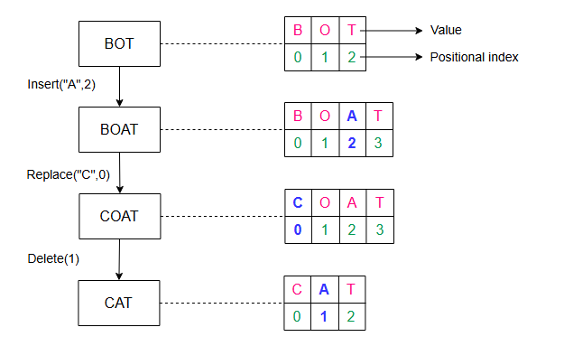

# **Параллелизм при совместном редактировании**

Давайте рассмотрим различные методы разрешения конфликтов при одновременной совместной работе над документом.

## **Введение**

Мы обсудили дизайн сервиса для совместного редактирования документов, но не рассмотрели, как мы будем справляться с одновременными изменениями в документе от разных пользователей. Однако, прежде чем обсуждать проблемы параллелизма, нам нужно понять, что такое редактор для совместной работы.

## **Что такое редактор документов?**

**Документ** — это композиция символов в определенном порядке. Каждый символ имеет значение и позиционный индекс. Символом может быть буква, цифра, перенос строки (↵) или пробел. Индекс представляет позицию символа в упорядоченном списке символов.

Задача текстового или документного редактора — выполнять операции, такие как `insert()` (вставка), `delete()` (удаление), `edit()` (редактирование) и другие, над символами в документе. Ниже приведено изображение документа и того, как редактор будет выполнять эти операции.

## **Проблемы параллелизма**

Совместная работа над одним и тем же документом разными пользователями может привести к проблемам параллелизма. Конфликты могут возникать, когда несколько пользователей редактируют одну и ту же часть документа. Поскольку у пользователей есть локальная копия документа, конечное состояние документа на сервере может отличаться от того, что пользователи видят у себя. После того как сервер отправит обновленную версию, пользователи обнаруживают неожиданный результат.

### **Пример 1**

Рассмотрим сценарий, где два пользователя хотят добавить символы в одно и то же место по позиционному индексу. Ниже мы показали, как два пользователя, изменяющие одно и то же предложение, могут прийти к противоречивым результатам:

Как показано выше, два пользователя пытаются изменить одно и то же предложение: «Educative by developers». Оба пользователя выполняют операцию `insert()` по индексу `10`. Возможны два варианта:

*   Фраза «for developers» перезаписывает «platform». Это приводит к результату «for developers».
*   Фраза «platform» накладывается на «for developers». Это приводит к результату «platformlopers».

Этот пример показывает, что операции, примененные в разном порядке, не обладают свойством коммутативности.

### **Пример 2**

Рассмотрим другой простой пример, где два пользователя пытаются удалить один и тот же символ из слова. Возьмем слово «EEDUCATIVE». Поскольку в слове есть лишняя буква «E», оба пользователя захотят удалить лишний символ. Ниже мы видим, как может возникнуть неожиданный результат:

Этот второй пример показывает, что применение одной и той же операции разными пользователями не будет **идемпотентным**. Таким образом, разрешение конфликтов необходимо там, где несколько соавторов одновременно редактируют одну и ту же часть документа.

Из приведенных выше примеров мы понимаем, что решение проблем параллелизма при совместном редактировании должно соблюдать два правила:

*   **Коммутативность**: Порядок применения операций не должен влиять на конечный результат.
*   **Идемпотентность**: Одинаковые повторяющиеся операции должны применяться только один раз.

Ниже мы рассмотрим две хорошо известные техники разрешения конфликтов.

## **Техники разрешения конфликтов**

Давайте обсудим две ведущие технологии, которые используются для разрешения конфликтов при совместном редактировании.

### **Операционное преобразование (Operational transformation, OT)**

**Операционное преобразование (ОП)** — это техника, широко используемая для разрешения конфликтов при совместном редактировании. ОП появилось в 1989 году и совершенствовалось на протяжении многих лет. Это подход к разрешению конфликтов без блокировок и неблокирующий. Если операции между соавторами конфликтуют, ОП разрешает конфликты и отправляет правильное, сведенное воедино состояние конечным пользователям. В результате ОП обеспечивает согласованность для пользователей.

ОП выполняет операции, используя метод позиционного индекса для разрешения конфликтов, подобных тем, что мы обсуждали выше. ОП решает вышеуказанные проблемы, соблюдая коммутативность и идемпотентность.

Обеспечение коммутативности 

Обеспечение идемпотентности 

Редакторы для совместной работы, основанные на ОП, являются согласованными, если они обладают следующими двумя свойствами:

*   **Сохранение причинно-следственной связи**: Если операция `a` произошла до операции `b`, то операция `a` выполняется до операции `b`.
*   **Сходимость**: Все реплики документа у разных клиентов в конечном итоге станут идентичными.

Вышеуказанные свойства являются частью **модели согласованности CC**, которая является моделью для поддержания согласованности при совместном редактировании.

> AИсследовательское сообщество предложило различные модели согласованности на протяжении многих лет. Некоторые из них специфичны для совместного редактирования, в то время как другие — для алгоритмов ОП. Ключевые модели согласованности следующие:
> *   Модель CC: Как мы определили выше, она включает сохранение причинно-следственной связи и сходимость.
> *   Модель CCI: Она включает сохранение причинно-следственной связи, сходимость и сохранение намерений.

Другие модели включают модель CSM (причинность, эффекты одной операции и эффекты нескольких операций) и модель CA (причинность и допустимость).
Предлагаются различные модели согласованности, и обычно более новые являются надмножествами более ранних. Поскольку предложено так много алгоритмов, их обсуждение выходит за рамки нашего урока.

У ОП есть два недостатка:
*   Каждая операция с символами может потребовать изменений в позиционном индексе. Это означает, что операции **зависят от порядка** друг друга.
*   Его сложно разрабатывать и реализовывать.

Операционное преобразование — это набор сложных алгоритмов, и его корректная реализация оказалась сложной для реальных приложений. Например, команде Google Wave потребовалось два года для реализации алгоритма ОП.

### **Бесконфликтный реплицируемый тип данных (Conflict-free Replicated Data Type, CRDT)**

**Бесконфликтный реплицируемый тип данных (CRDT)** был разработан в попытке улучшить ОП. У CRDT сложная структура данных, но упрощенный алгоритм.

CRDT удовлетворяет как коммутативности, так и идемпотентности, присваивая каждому символу два ключевых свойства:
*   Он присваивает каждому символу глобально уникальный идентификатор.
*   Он глобально упорядочивает каждый символ.

Каждая операция теперь имеет обновленную структуру данных:

`SiteID` уникально идентифицирует сайт пользователя, запрашивающего операцию со `Value` (значением) и `PositionalIndex` (позиционным индексом). Значение `PositionalIndex` может быть дробным по двум основным причинам:

*   `PositionalIndex` других символов не изменится из-за определенных операций.
*   Будет избегаться зависимость операций от порядка между разными пользователями.

Пример ниже показывает, что пользователь с ID сайта `123e4567-e89b-12d3` вставляет символ со значением `A` по `PositionalIndex` `1.5`. Хотя новый символ добавлен, позиционные индексы существующих символов сохраняются с помощью дробных индексов. Таким образом, избегается зависимость операций от порядка. Как показано ниже, вставка `insert()` между `O` и `T` не повлияла на позицию `T`.

CRDT обеспечивают строгую согласованность между пользователями. Даже если некоторые пользователи находятся в автономном режиме, локальные реплики у конечных пользователей сойдутся, когда они снова выйдут в онлайн.

Хотя известные онлайн-платформы для редактирования, такие как Google Docs, Etherpad и Firepad, используют ОП, CRDT упростили параллелизм и согласованность при совместном редактировании документов. Фактически, с помощью CRDT возможно реализовать бессерверный одноранговый (peer-to-peer) сервис для совместного редактирования документов.

> **Примечание:** ОП и CRDT являются хорошими решениями для разрешения конфликтов при совместном редактировании, но наше использование WebSockets позволяет подсвечивать курсор соавтора. Другие пользователи будут предвидеть позицию следующей операции соавтора и естественным образом избегать конфликтов.

---
### **Тест**

**1. Почему мы не можем использовать блокировки для синхронизации между пользователями?**

  
Скрыть/Показать ответ

   

Блокировки требуют, чтобы мы разделили документы на небольшие секции, где пользователи могли бы заблокировать часть и редактировать ее. Это поможет разработчикам создать простое решение и избежать сложностей, таких как OT и CRDT. Однако это также приводит к плохому пользовательскому опыту. Например, два пользователя могут захотеть добавить символы в одну и ту же секцию документа, но их операции могут не обязательно конфликтовать.

Блокировка — хороший выбор для таких сервисов, как Google Sheets. Это потому, что документ разделен на ячейки одинакового размера, и только один пользователь может добавлять или редактировать содержимое конкретной ячейки.

---

**2. Что произойдет, если два пользователя совместно работают над документом и у них разная скорость интернета? Какая технология, OT или CRDT, лучше подходит для разрешения конфликтов в таком случае?**

  
Скрыть/Показать ответ

   

При разной скорости интернет-соединения порядок операций между пользователями может привести к проблемам. Однако операции в OT зависят от порядка, в то время как операции в CRDT от порядка не зависят. Вот почему CRDT являются подходящим решением для такой проблемы.

---