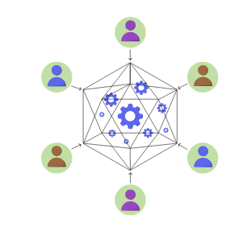
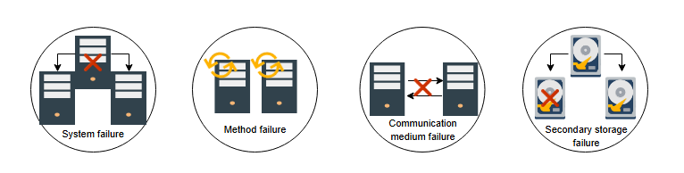
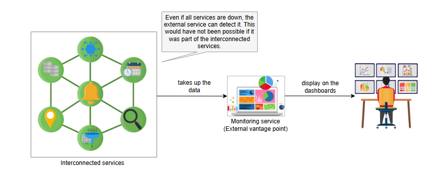

# **Введение в сбои распределенных систем**

Узнайте о сбоях в распределенных системах и о важности независимых точек обзора.

---

## **Введение**

Время от времени мы сталкиваемся со сбоями в работе сервисов, ставших нарицательными, и на это реагируют как отдельные люди, так и компании. Как системные дизайнеры, мы можем задаться вопросом, как могут давать сбой даже тщательно спроектированные сервисы, которые годами совершенствовались опытными командами.

В этой главе обсуждаются некоторые из крупных сбоев известных сервисов и меры, которые можно предпринять для их предотвращения.

Следующие два фактора способствуют сбоям:

*   **Разнообразие пользователей**: Большинство сервисов имеют активное сообщество пользователей, и по мере развития их потребностей развиваются и программные продукты. Если программное обеспечение не обновляется в части предоставления новых функций и услуг, со временем оно станет стабильным. Однако в нем может не быть тех функций, которые нужны клиентам.
*   **Сложность систем**: Системы сложны, и у них обычно есть эмерджентные свойства, при которых сумма компонентов системы сложнее, чем отдельные части.

## **Типы сбоев в распределенных системах**

Большинство современных сервисов спроектированы таким образом, что сбои локализуются, а другие могут быть ограничены для некоторых пользователей. Давайте рассмотрим типы сбоев, которые мы можем наблюдать в распределенных системах.

*   **Сбой системы**: Сбой программного или аппаратного обеспечения — наиболее частая причина сбоя системы. При сбое системы содержимое основной памяти теряется. Однако данные во вторичном хранилище или репликах остаются незатронутыми. Во время такого сбоя система перезагружается.
*   **Сбой метода**: Такие сбои приостанавливают работу распределенных систем. Они также могут заставить систему выполнять процессы неправильно или войти в состояние взаимной блокировки (deadlock).
*   **Сбой среды передачи данных**: Такие сбои происходят, когда один компонент или сервис системы не может достичь других внутренних или внешних сущностей.
*   **Сбой вторичного хранилища**: При таких сбоях вторичное хранилище или реплики выходят из строя. Данные на этих узлах становятся недоступными, поэтому основным узлам необходимо создать другую реплику для обеспечения надежности и отказоустойчивости.

A

## **Точки обзора**

В крупных сервисах всегда что-то выходит из строя. Предпочтительна плавная деградация, чтобы затронута была лишь небольшая часть пользователей на короткое время. Поэтому нам нужны глобально распределенные точки обзора для независимого наблюдения за состоянием сервиса.

> **Примечание:** Существует множество независимых сервисов, таких как Downdetector, для сбора сообщений о проблемах от пользователей. Интересно отметить, что если мы посетим такой сервис и посмотрим на статус наших любимых приложений, мы увидим, что в мире всегда есть кто-то, кто сталкивается с какой-либо проблемой в работе сервиса.

### **Важность независимых поставщиков услуг**

Одной из целей проектирования первоначального Интернета было обеспечение отказоустойчивости, чтобы в случае сбоя одной части остальные могли продолжать работать.

С появлением за последнее десятилетие нескольких крупных поставщиков услуг, **критики выразили обеспокоенность** по поводу такой централизации и потенциальных последствий сбоев. Большинство компаний предоставляют своего рода панель мониторинга (dashboard), чтобы пользователи могли видеть статус сервиса. Однако некоторые сбои могут вывести из строя даже эти панели. Пострадавшие компании затем общаются со своими клиентами через сервисы, такие как Twitter, чтобы объявлять об обновлениях. Независимые сторонние сервисы ценны для обнаружения сбоев и распространения информации о статусе.

> **Примечание:** Более широкая концепция здесь заключается в использовании независимых **доменов отказа** (failure domains). **Домен отказа** — это концепция, согласно которой сбой чего-либо внутри домена или сети не должен влиять на другие компоненты и сервисы в других доменах. Иногда мы говорим, что два домена независимы, если они находятся за пределами **радиуса поражения** (blast radius) друг друга.

В следующих уроках мы обсудим сбои известных сервисов от гигантских компаний, причины сбоев и какие методы смягчения последствий можно использовать, чтобы избежать этих сбоев. Хотя сбои — это отличный способ узнать, что пошло не так и что первоначальные разработчики могли бы сделать, чтобы избежать таких сбоев, мы хотели бы предотвратить их возникновение в принципе.
