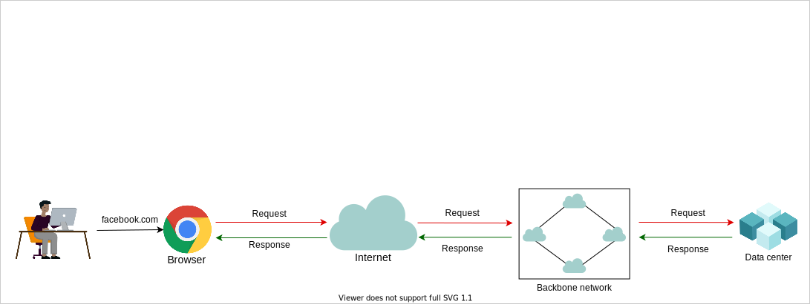
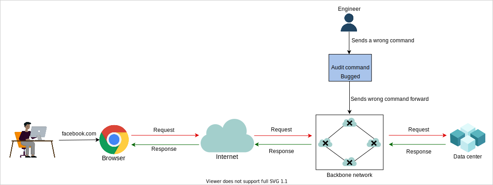

# **Сбой Facebook, WhatsApp, Instagram, Oculus**

Узнайте о причинах крупного сбоя Facebook и о том, как их избежать.

В октябре 2021 года Facebook столкнулся с глобальным сбоем, который длился около шести часов и затронул его дочерние компании, включая Messenger, WhatsApp, Mapillary, Instagram и Oculus. Популярные СМИ широко освещали последствия этого сбоя. *New York Times* вышла с таким заголовком: «Пропал за минуты, недоступен часами: сбой потряс Facebook».

По одной из оценок, этот сбой стоил Facebook около 100 миллионов долларов потерянной выручки и многомиллиардных убытков из-за падения акций компании.

Давайте рассмотрим последовательность событий, которые привели к этой глобальной проблеме.

## **Последовательность событий**

Следующая последовательность событий привела к сбою Facebook и сопутствующих сервисов:

*   Потребовалось плановое техническое обслуживание для определения свободных мощностей в магистральной сети Facebook.
*   Из-за ошибки в конфигурации система технического обслуживания отключила все центры обработки данных друг от друга в магистральной сети. Ранее для поиска проблем в конфигурации использовался автоматизированный инструмент проверки, но такие инструменты не идеальны. В данном конкретном случае инструмент проверки пропустил проблемы, присутствовавшие в конфигурации.
*   У авторитативных серверов доменных имен (DNS) Facebook было правило проверки работоспособности: если они не могли связаться с внутренними центрами обработки данных Facebook, они прекращали отвечать на DNS-запросы клиентов, отзывая маршруты.
*   Когда сетевые маршруты, где размещались авторитативные DNS-серверы Facebook, были отозваны, все кэшированные сопоставления человекочитаемых имен с IP-адресами вскоре истекли на всех публичных DNS-резолверах. Когда клиент пытается разрешить `www.facebook.com`, DNS-резолвер сначала обращается к одному из корневых DNS-серверов, который предоставляет список авторитативных DNS-серверов для домена `.com`. Резолвер подключается к одному из них, и те, в свою очередь, предоставляют IP-адреса авторитативных DNS-серверов для Facebook. Однако после отзыва маршрутов связаться с ними стало невозможно.
*   В результате никто не мог получить доступ к Facebook и его дочерним компаниям.

Слайды ниже изображают события в графической форме.

1.  Высокоуровневая архитектура Facebook.
    

2.  Команда технического обслуживания отправила неверные команды в магистральную сеть.
    

3.  Инструмент проверки (команда аудита) не смог определить проблему с командой и отправил ее дальше в магистральную сеть.
    

4.  Из-за ошибочных команд произошел сбой в работе магистральной сети.
    

5.  В результате ошибочных команд Facebook стал недоступен.
    

## **Анализ**

Некоторые ключевые выводы из показанной выше серии событий:

*   **От обычного действия к катастрофе**: Отзыв или добавление сетевых маршрутов — относительно обычное действие. Совпадение ошибок (сначала неверная конфигурация, а затем ошибка в инструменте аудита, который не смог обнаружить такую проблему) вызвало цепную реакцию, которая привела к **каскадному сбою**. Каскадный сбой — это когда один сбой может вызвать другой, в конечном итоге выводя из строя всю систему.
*   **Причины медленного восстановления**: Может показаться странным, что на восстановление сервиса ушло шесть часов. Разве не было просто снова объявить отозванные маршруты? В масштабах, в которых работает Facebook, редко что-то делается вручную; для выполнения изменений существуют автоматизированные системы. Внутренние инструменты, вероятно, зависели от DNS-инфраструктуры, и когда все центры обработки данных были отключены от магистральной сети, использовать эти инструменты было практически невозможно. Потребовалось ручное вмешательство. Вручную запустить систему такого масштаба непросто. Обычные физические и цифровые механизмы безопасности, которые были на месте, замедлили процесс ручного вмешательства.
*   **События с низкой вероятностью могут произойти**: Оглядываясь назад, может показаться странным, что авторитативные DNS-системы отключаются, если внутренние центры обработки данных недоступны. Это еще один пример того, как произошло очень редкое событие, такое как недоступность всех центров обработки данных, что вызвало другое событие.
*   **Подводные камни автоматизации**: Facebook был одним из первых сторонников автоматизации изменений в сетевой конфигурации, утверждая, что программное обеспечение может выполнять работу по управлению сетью лучше, чем люди, которые более склонны к ошибкам. Однако в программном обеспечении могут быть ошибки, как и в этом случае.

## **Извлеченные уроки**

*   **Готовность операционной команды**: В сложных системах может существовать скрытая единая точка отказа. Лучшая защита от таких сбоев — это готовность операционной команды к таким ситуациям, обеспечиваемая регулярными тренировками. Умение ясно мыслить в стрессовых ситуациях становится необходимым для应对 таких событий.
*   **Простой дизайн системы**: По мере роста системы становятся сложнее и приобретают эмерджентные свойства. Чтобы понять общее поведение системы, может быть недостаточно понимать только поведение ее компонентов. Могут возникать каскадные сбои. Это одна из причин, по которой дизайн системы следует делать как можно более простым для текущих нужд и развивать его медленно. К сожалению, идеального решения этой проблемы не существует. Мы должны принять возможность таких сбоев, проводить непрерывный мониторинг, иметь возможность решать проблемы по мере их возникновения и учиться на сбоях для улучшения системы.
*   **План на случай непредвиденных обстоятельств**: Некоторые сторонние сервисы полагаются на Facebook для единого входа (single sign-on). Когда произошел сбой, сторонние сервисы работали, но их клиенты не могли ими воспользоваться, потому что функция входа через Facebook также была недоступна. Это еще один пример предположения, что какой-то сервис всегда будет доступен, и скрытой единой точки отказа.
*   **Размещение DNS у независимых сторонних провайдеров**: Существует несколько сервисов, которые настолько надежно спроектированы и усовершенствованы со временем, что их клиенты начинают предполагать, что сервис всегда будет доступен на 100%. DNS — один из таких сервисов, и он был очень тщательно разработан. Дизайнеры часто предполагают, что он никогда не выйдет из строя. Размещение DNS у независимых сторонних провайдеров может быть способом защиты от таких проблем. DNS позволяет иметь несколько авторитативных серверов, и организация может иметь их в разных местах. Хотя следует отметить, что DNS в масштабах Facebook — это непросто, он тесно связан с их магистральной инфраструктурой и часто меняется. Делегирование такой части независимому третьему лицу дорого, и это может раскрыть внутренние детали сервиса. Таким образом, может существовать компромисс между бизнес-потребностями и требованиями к надежности.
*   **Компромиссы**: Могут возникать неожиданные компромиссы. Примером здесь является необходимость в безопасности данных и необходимость быстрого ручного ремонта. Из-за множества физических и цифровых мер безопасности ручное вмешательство было медленным. Это ситуация "уловки-22" — снижение требований к безопасности может вызвать огромные проблемы, а медленный ремонт в таких случаях также может усложнить жизнь компаниям. Остается надеяться, что необходимость в таких ремонтах — очень редкое событие.
*   **Всплеск нагрузки**: Сбой крупных игроков нарушает работу всего Интернета. Сторонние публичные резолверы, такие как Google и Cloudflare, столкнулись с резким ростом нагрузки из-за безуспешных повторных DNS-запросов.
*   **Возобновление работы сервиса**: Перезапуск крупного сервиса — это не так просто, как щелкнуть выключателем. Когда нагрузка внезапно падает почти до нуля, резкое включение может привести к росту энергопотребления на многие мегаватты. Это может даже вызвать проблемы для электросети. Сложные системы обычно имеют устойчивое состояние, и если они выходят из этого состояния, необходимо проявлять осторожность, чтобы вернуть их обратно.

---
### **Вопрос для размышления**

**1. Что можно сделать, чтобы защититься от сбоев, подобных тем, что произошли с Facebook?**

  
Скрыть/Показать ответ

   

Некоторые возможные решения могут выглядеть следующим образом:

*   **Верификация сети** в последнее время набирает обороты и показала свою перспективность в раннем выявлении ошибок. Такие инструменты используют абстрактную модель инфраструктуры.
*   Может быть более одного уровня аудита. Второй уровень может использовать симулятор, чтобы убедиться, что после изменений конфигурации критически важные сетевые инфраструктуры остаются доступными с нескольких глобальных точек обзора.
*   Следует приложить все усилия, чтобы уменьшить масштаб изменения конфигурации, чтобы избежать каскадных эффектов.
*   Критически важная инфраструктура может быть запрограммирована таким образом, что в случае возникновения проблем она могла бы вернуться к последнему известному рабочему состоянию. Это легче сказать, чем сделать, из-за огромного количества компонентов.

