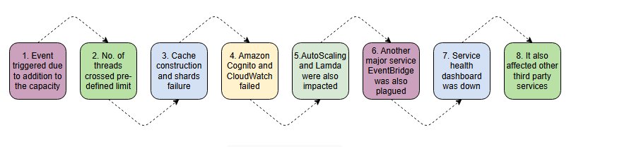
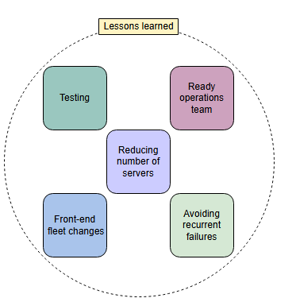

# **Сбой AWS Kinesis, затронувший многие организации**

Узнайте о причинах и анализе крупного сбоя AWS Kinesis.

**Amazon Kinesis** позволяет нам агрегировать, обрабатывать и анализировать потоковые данные в реальном времени для получения своевременных инсайтов и быстрой реакции на предоставляемую информацию. Он непрерывно захватывает гигабайты данных из сотен тысяч источников в секунду. Фронтенд-часть сервиса Kinesis обрабатывает аутентификацию, регулирование нагрузки (throttling) и распределяет рабочие нагрузки на свой бэкенд-кластер «рабочих лошадок» с помощью шардирования базы данных. 25 ноября 2020 года сервис Amazon Kinesis был нарушен в регионе US-East-1 (Северная Вирджиния), что затронуло тысячи других сторонних сервисов. Сбой был достаточно серьезным, чтобы вывести из строя значительную часть интернет-сервисов.

## **Последовательность событий**

*   По данным Amazon, событие было вызвано добавлением небольшой мощности во фронтенд-флот (группу) серверов AWS, запланированным с 2:44 до 3:47 по тихоокеанскому времени.
*   Добавление новой мощности привело к тому, что все серверы во флоте превысили максимальное количество потоков, разрешенное конфигурацией операционной системы.
*   Из-за превышения лимита потоков построение кэша не могло завершиться, и фронтенд-серверы оставались с бесполезными картами шардов, что не позволяло им маршрутизировать запросы к бэкенд-кластерам.
*   Другие основные сервисы Amazon также перестали работать, включая Amazon Cognito и CloudWatch.
    *   Kinesis Data Streams используется Amazon Cognito для сбора и анализа паттернов использования API. Из-за длительной проблемы с Kinesis Data Streams скрытая ошибка в коде буферизации, необходимом для сервисов Cognito, привела к тому, что веб-серверы Cognito начали блокироваться на переполненных буферах Kinesis Data Stream. В результате клиенты Cognito столкнулись с увеличением ошибок API и задержек для пулов пользователей и пулов идентификаторов Cognito, что сделало невозможным для внешних пользователей аутентификацию или получение временных учетных данных AWS.
    *   CloudWatch использует Kinesis Data Streams для обработки метрик и данных журналов. API `PutMetricData` и `PutLogEvents` в CloudWatch столкнулись с более высокими показателями ошибок и задержек, а оповещения были установлены в состояние `INSUFFICIENT DATA` (НЕДОСТАТОЧНО ДАННЫХ). Подавляющее большинство метрик не могли быть обработаны из-за более высоких показателей ошибок и задержек. Когда CloudWatch испытывал эти серьезные проблемы, внутренние и внешние клиенты не могли сохранять все данные метрик в сервисе CloudWatch.

*   Из-за проблем с метриками CloudWatch также пострадали два сервиса. Во-первых, политики AutoScaling, которые зависят от измерений CloudWatch, столкнулись с задержками. Во-вторых, пострадал Lambda. В настоящее время отправка данных метрик в CloudWatch является обязательной частью вызова функции Lambda. Если CloudWatch недоступен, агенты метрик Lambda должны буферизировать данные метрик локально в течение определенного времени. Буферизация данных метрик стала настолько большой, что вызвала перегрузку памяти на хостах, используемых для вызовов функций Lambda, что привело к увеличению числа ошибок.
*   Увеличение ошибок API и задержек обработки событий затронуло CloudWatch Events и EventBridge. EventBridge используется Elastic Container Service (ECS) и Elastic Kubernetes Service (EKS) для управления внутренними процессами по управлению клиентскими кластерами и задачами. Это повлияло на предоставление новых кластеров, масштабирование существующих кластеров и отзыв задач.
*   Помимо проблем с сервисами, Amazon также столкнулся с задержками в информировании клиентов о состоянии сервисов. Amazon использует две панели мониторинга для общения с клиентами: Service Health Dashboard и Personal Health Dashboard. Service Health Dashboard информирует всех клиентов о событиях, подобных текущему. Он был недоступен из-за своей зависимости от Cognito, который пострадал от этого события.
*   Помимо сбоя в сервисах Amazon, это также вызвало цепную реакцию, затронувшую тысячи сторонних онлайн-сервисов, приложений и веб-сайтов. Среди них Adobe Spark, Acorns, Coinbase, *Washington Post* и сотни других подобных сервисов.

## **Анализ**

*   **Сложность повышения масштабируемости**: Мы постоянно подчеркивали необходимость горизонтальной масштабируемости во всех наших задачах по проектированию. Этот случай сбоя показывает, что на практике добавление дополнительной мощности в обслуживающий кластер, чтобы не отказывать ни одному запросу клиента, может быть сложным и иметь непредвиденные побочные эффекты.
*   **Необходимость обученной команды**: Обучение производственной команды для работы с такими непредвиденными ситуациями — сложная задача, но она того стоит и может привести к ускоренному восстановлению. Кроме того, случайный перезапуск фронтенд-серверов и подозрение, что проблему вызывает нехватка памяти, указывают на трудности в поиске первопричин в условиях цейтнота.
*   **Чтение с авторитативных серверов во время начальной загрузки**: Во время процесса начальной загрузки (bootstrap) хорошей идеей является получение данных из авторитативного хранилища метаданных, а не с фронтенд-серверов, чтобы уменьшить влияние подобных сбоев.
*   **Выявление неисправностей на начальных этапах**: Необходимы автоматизированные процессы для выявления причин сбоя на начальных этапах его возникновения.
*   **Правильные механизмы тестирования могут снизить серьезность сбоя**: Новая мощность, из-за которой серверы во флоте превышают максимальное количество потоков, — это потенциальная ошибка, которую следовало исправить до перезапуска серверов. Это отражает неспособность должным образом протестировать систему. Должен существовать своего рода симулятор для тестирования всех случаев перед развертыванием дополнительной мощности во флоте.
*   **Обнаружение потенциальных ошибок перед плановыми событиями**: Проблема с Kinesis Data Streams выявила скрытую ошибку в коде буферизации, которая заставила веб-серверы Cognito начать блокироваться на переполненных буферах Kinesis Data Stream. Потенциальные ошибки должны быть выявлены и исправлены до критических плановых событий, таких как добавление мощности или техническое обслуживание программного и аппаратного обеспечения.
*   **Внедрение автоматизированных процессов для распределения ресурсов**: Команда Cognito пыталась уменьшить влияние сбоев Kinesis на ранних этапах события, предоставляя дополнительную мощность и тем самым увеличивая свою способность буферизировать вызовы к Kinesis. Вместо ручного назначения мощности должна существовать автоматизированная система для увеличения или перераспределения мощности в таких случаях.

## **Извлеченные уроки**

*   **Тестирование**: Правильное тестирование и выявление потенциальных ошибок имеют важное значение. В данном случае превышение максимального количества потоков, определенного операционной системой, кажется возможной ошибкой.
*   **Готовность операционной команды**: Ошибка, приводящая к остановке всей системы, является единой точкой отказа, что возможно в сложной системе. Производственная команда должна быть обучена и готова к таким событиям.
*   **Уменьшение количества серверов**: Чтобы получить значительный запас по количеству используемых потоков, необходимо перейти на более мощные серверы с точки зрения ЦП и памяти. Это уменьшит общее количество серверов и количество потоков, необходимых каждому серверу для связи внутри флота. Меньшее количество серверов означает, что каждый сервер поддерживает меньше потоков. Amazon добавляет детализированные оповещения о потреблении потоков в сервисе.
*   **Изменения во фронтенд-флоте**: Требуется несколько изменений для радикального улучшения времени холодного старта для фронтенд-флота. Кроме того, кэш фронтенд-сервера необходимо перенести в выделенный флот.
*   **Избегание повторных сбоев**: Чтобы избежать повторных сбоев в будущем, обширные сервисы AWS, такие как CloudWatch и другие, должны быть перенесены в отдельный, секционированный фронтенд-флот.

=

---
### **Вопрос для размышления**

**1. Какие возможные меры должен был принять Amazon, чтобы защититься от сбоев, с которыми они столкнулись в Kinesis Data Streams?**

  
Скрыть/Показать ответ

   

### Возможные решения

*   Разделение региона на независимые домены отказа уменьшило бы радиус поражения события и позволило бы производственной команде быстро восстановиться после проблемы.
*   У них должна была быть система, подобная системе распределения ресурсов Facebook, для резервирования мощностей на случай плановых и внеплановых событий.
*   Создание приложения на нескольких облаках или в нескольких регионах AWS облегчило бы пострадавшим клиентам быстрое восстановление.
*   Необходимо в крайней степени развязать сервисы, чтобы устранить проблемы с перекрестной зависимостью.
*   Сбои в сложной системе неизбежны. Однако некоторые важные сервисы, такие как панель статуса, должны размещаться на разных серверах, либо внутри сервиса, либо в инфраструктуре какой-либо третьей стороны.

