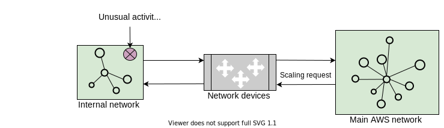
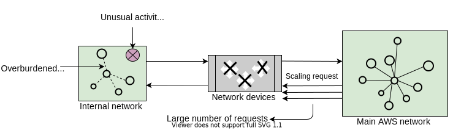
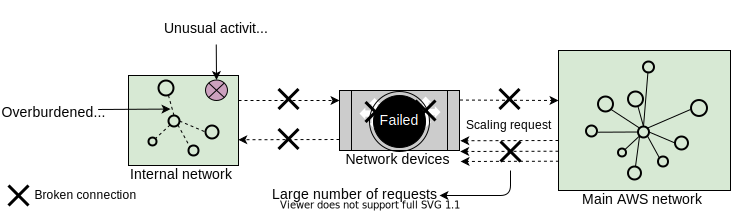

# **Масштабный сбой AWS**

Узнайте, как сбой AWS остановил работу сервисов для частных пользователей и компаний по всему миру.

## **Введение**

Несколько сервисов Amazon и другие сервисы, зависящие от AWS, были нарушены в результате инцидента со сбоем, который продолжался более
восьми часов во вторник, 7 декабря 2021 года, примерно в 7:35 утра по тихоокеанскому времени. Инцидент затронул всё, от домашних
потребительских товаров до многочисленных коммерческих услуг.

Этот многочасовой сбой попал в заголовки популярных СМИ, например, в *Financial Times*: «От разгневанных фанатов Адель до сломанных
роботов-пылесосов: сбой AWS прокатился по США». Сбой затронул миллионы пользователей по всему миру, включая частных лиц, которые
использовали онлайн-магазины AWS, и другие компании, которые в значительной степени полагались на AWS для предоставления своих услуг.

Сбой, вызванный AWS, подчеркнул необходимость децентрализованного Интернета, где сервисы не зависят от небольшого числа гигантских компаний.
По данным Gartner, 80% облачного рынка контролируется всего пятью компаниями. Amazon, с долей в 41% на рынке облачных вычислений, является
крупнейшим игроком.

Сбои, подобные вышеописанному, напоминают нам знаменитую шутку Лэмпорта: «Распределенная система — это та, в которой отказ компьютера, о
существовании которого вы даже не подозревали, может сделать ваш собственный компьютер непригодным для использования».

## **Последовательность событий**

* Автоматизированное действие по расширению мощности одного из сервисов AWS вблизи основной сети AWS вызвало необычное поведение у
  значительного числа клиентов во внутренней сети.
* В результате произошел значительный рост активности подключений, что перегрузило сетевое оборудование, соединяющее внутреннюю сеть с
  основной сетью AWS.
* Связь между этими сетями стала задерживаться. Эти задержки увеличили латентность и количество сбоев для сервисов, взаимодействующих между
  этими сетями, что привело к росту повторных попыток и ping-запросов.
* В результате устройства, соединяющие две сети, испытали постоянную перегрузку и проблемы с производительностью.
* Эта перегрузка мгновенно повлияла на доступность данных мониторинга в реальном времени для внутренних операционных команд AWS, что
  затруднило их способность выявлять и устранять причину перегрузки.
* Операторы полагались на логи, чтобы выяснить, что происходит, и первоначально заметили увеличение внутренних сбоев DNS.

Следующие слайды показывают серию событий, которые привели к сбою.

1. Высокоуровневая инфраструктура Amazon. Основная сеть AWS соединяется с внутренней сетью через сетевое устройство.
   

2. Основная сеть AWS отправляет запрос на масштабирование во внутреннюю сеть.
   

3. Запрос на масштабирование вызывает необычное поведение во внутренней сети.
   

4. Внутренняя сеть получает большое количество клиентских запросов, что перегружает сеть.
   

5. Поступают дополнительные запросы от основной сети AWS.
   

6. Сетевые устройства перегружаются из-за большого количества запросов на подключение от основной сети AWS.
   

7. Сетевыеустройства выходят из строя, что приводит к отключению связи между внутренней и основной сетями AWS.
   

## **Анализ**

* **Нарушение работы сервисов AWS**: Проблемы с сетью затронули различные сервисы AWS, что повлияло на клиентов, которые использовали эти
  возможности. Поскольку основная сеть AWS осталась незатронутой, некоторые клиентские приложения, которые не зависят от этих возможностей,
  пострадали от этого события в относительно меньшей степени. Пользователи AWS, такие как Amazon RDS, EMR и Workspaces, не могли создавать
  новые ресурсы из-за невозможности системы запускать новые инстансы EC2.
* **Нарушение работы плоскости управления (control plane)**: Помимо сервисов AWS, также пострадали плоскости управления AWS, которые
  используются для создания и управления ресурсами AWS. Эти плоскости управления используют сервисы, размещенные во внутренней сети.
  Например, инстансы EC2 не были затронуты этим событием, но API EC2 столкнулись с увеличением задержек и частоты ошибок.
* **Медленное восстановление**: Поскольку DNS является основой всей коммуникации в вебе, операторы сосредоточились на перемещении
  внутреннего DNS-трафика из перегруженных участков сети для улучшения доступности. Однако, поскольку службы мониторинга были недоступны,
  операторам пришлось вручную выявлять и отключать основные источники трафика. Это дополнительно улучшило доступность сервисов.
* **Elastic Load Balancers (ELB)**: Существующие Elastic Load Balancers не были затронуты инцидентом. Однако увеличение частоты ошибок API и
  задержек для API ELB привело к увеличению времени предоставления новых балансировщиков нагрузки.

## **Извлеченные уроки**

* **Независимая система связи**: Хотя намерение иметь внутреннюю сеть, отдельную от основной, является правильной идеей, они не были
  по-настоящему независимыми. Последовательность событий выявила их зависимость. Обнаружение таких зависимостей имеет решающее значение для
  того, чтобы по-настоящему извлечь выгоду из независимых сетей для внутреннего использования сервисов и для внешних клиентов.
* **План на случай непредвиденных обстоятельств**: Хотя AWS принимает меры для подготовки своей инфраструктуры к внезапным всплескам
  запросов клиентов или потребления электроэнергии, организация все же оказалась в сложной ситуации из-за необычной серьезности сбоя.
  Инвестиции в более глубокое планирование на случай непредвиденных обстоятельств, основанное на оценке рисков, приносят пользу организациям
  во время кризисов.
* **Готовность операционной команды**: Ошибка, приводящая к остановке всей системы, является единой точкой отказа, что возможно в сложной
  системе. Производственная команда должна быть обучена и готова к таким событиям.
* **Несколько поставщиков облачных вычислений**: Организации могут реплицировать свои операции между несколькими поставщиками облачных
  вычислений, чтобы ни один сбой не вывел их из строя. Однако это легче сказать, чем сделать. Альтернативный подход заключается в
  использовании разных регионов одного и того же провайдера для различных целей.
* **Тестирование**: Проведение надлежащего тестирования и выявление потенциальных ошибок являются обязательными. В данном случае перегрузка
  сетевых устройств привела к задержкам связи между этими сетями.

---

### **Вопрос для размышления**

**1. Что можно сделать, чтобы защититься от серии сбоев, с которыми столкнулся Amazon?**

  
Скрыть/Показать ответ

   

Мы предлагаем следующие решения:

* Сквозная прозрачность на каждом уровне дает информацию, необходимую для правильной работы сайтов и сервисов.
* Создание приложения на нескольких облаках или в нескольких регионах AWS облегчило бы пострадавшим клиентам быстрое восстановление.
* Необходимо в крайней степени развязать сервисы, чтобы устранить проблемы с перекрестной зависимостью.

