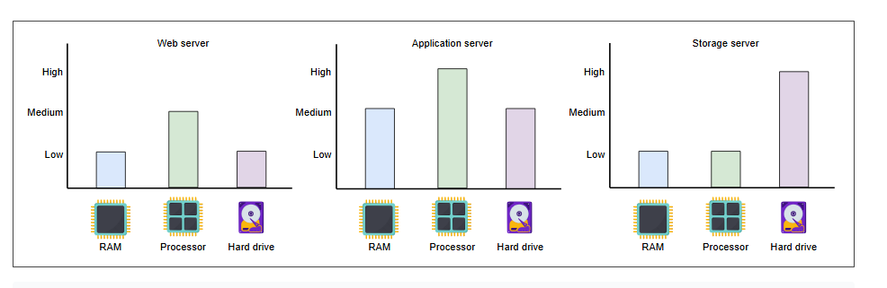
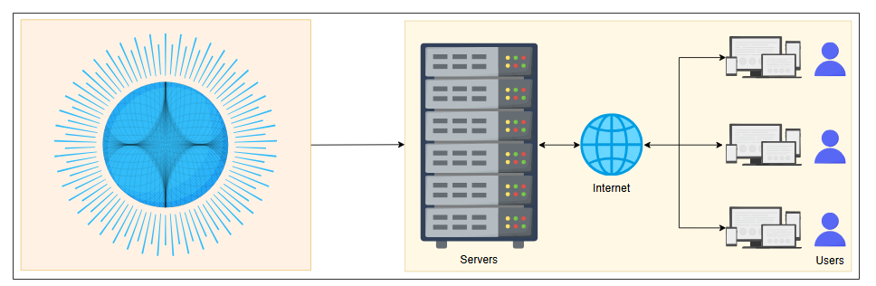

### **Оценка значимости приблизительных расчётов**

Научитесь использовать подходящие числа в приблизительных («на салфетке») расчётах.

Приблизительные расчёты (также известные как «расчёты на салфетке», англ. Back-of-the-envelope calculations, BOTEC) — это быстрые, ориентировочные и упрощённые оценки или вычисления, которые обычно делаются на бумаге или, образно говоря, на обороте конверта. Хотя такие расчёты не предназначены для получения точных результатов, они служат быстрой и предварительной оценкой ключевых параметров и жизнеспособности системы.

Например, представим, что мы находимся в городе и хотим оценить население определённого района. Мы могли бы подсчитать количество домов на выборочном участке, оценить среднее количество людей в одном домохозяйстве, а затем экстраполировать эти данные на весь район. Подобные расчёты можно использовать для проверки достоверности данных переписи населения для некоторых районов.

#### Приблизительные расчёты в проектировании систем

Современная система — это сложная сеть вычислительных ресурсов, соединённых через сеть. Различные типы узлов, такие как балансировщики нагрузки, веб-серверы, серверы приложений, кэши, базы данных в памяти и узлы хранения, совместно обслуживают клиентов. Такая система может быть спроектирована по-разному, включая монолитную архитектуру, модульную монолитную архитектуру или микросервисную архитектуру. Точно учитывать всё это многообразие на уровне проектирования (особенно на собеседовании) нецелесообразно, а иногда и невозможно. Приблизительные расчёты помогают нам игнорировать мелкие детали системы (по крайней мере, на уровне проектирования) и сосредоточиться на более важных аспектах, таких как определение жизнеспособности сервиса с точки зрения вычислительных ресурсов.

Некоторые примеры, где часто требуются приблизительные расчёты, включают следующие оценки:

*   Количество одновременных TCP-соединений, которое может поддерживать сервер.
*   Количество запросов в секунду (RPS), которое может обработать веб-сервер, сервер баз данных или кэш-сервер.
*   Требования к объёму хранилища для сервиса.

Используя приблизительные расчёты, мы абстрагируемся от сложных деталей, специфичных для различных типов серверов, используемых в реальной системе, различных задержек доступа к компонентам системы, разной пропускной способности и разных типов запросов. Далее мы сначала рассмотрим эти различные типы серверов, задержки доступа, показатели пропускной способности и типы запросов, чтобы понять реальность систем и увидеть, насколько они сложны. Затем, абстрагируясь от этих деталей, мы научимся оценивать количество RPS, которое может обработать сервер. Наконец, мы попрактикуемся на примерах оценки пропускной способности, количества серверов и объёма хранилища.

### Типы серверов в центрах обработки данных
В центрах обработки данных (ЦОД) не используется один-единственный тип серверов. Корпоративные решения используют стандартное оборудование для экономии средств и разработки масштабируемых решений. Ниже мы обсуждаем типы серверов, которые обычно используются в ЦОД для обработки различных рабочих нагрузок.

#### Веб-серверы
Для обеспечения масштабируемости веб-серверы отделены от серверов приложений. Веб-серверы — это первая точка контакта после балансировщиков нагрузки. В ЦОД есть стойки, полные веб-серверов, которые обычно обрабатывают API-вызовы от клиентов. В зависимости от предлагаемого сервиса, объём памяти и хранилища на веб-серверах может быть от малого до среднего. Однако такие серверы требуют хороших вычислительных ресурсов. Например, в прошлом Facebook использовал веб-серверы с 32 ГБ ОЗУ и 500 ГБ дискового пространства.

#### Серверы приложений
На серверах приложений выполняется основное программное обеспечение и бизнес-логика. Разница между веб-серверами и серверами приложений несколько размыта. Серверы приложений в основном предоставляют динамический контент, в то время как веб-серверы — статический контент клиенту. Они могут требовать значительных вычислительных и дисковых ресурсов. Ресурсы хранения могут быть как энергозависимыми, так и энергонезависимыми. Facebook использовал серверы приложений с ОЗУ до 256 ГБ и двумя типами хранилищ — традиционными вращающимися дисками и флеш-памятью — с общей ёмкостью до 6,5 ТБ.

#### Серверы хранения данных
С взрывным ростом числа интернет-пользователей объём данных, хранимых гигантскими сервисами, многократно увеличился. Кроме того, различные типы данных теперь хранятся в разных хранилищах. Например, YouTube использует следующие хранилища данных:

*   **Хранилище BLOB-объектов:** Используется для закодированных видео.
*   **Временное хранилище очереди обработки:** Может вмещать несколько сотен часов видеоконтента, загружаемого на YouTube ежедневно для обработки.
*   **Bigtable:** Специализированное хранилище для хранения большого количества миниатюр видео.
*   **Система управления реляционными базами данных (СУБД):** Для метаданных пользователей и видео (комментарии, лайки, каналы пользователей и т.д.).

Другие хранилища данных по-прежнему используются для аналитики, например, HDFS от Hadoop. Серверы хранения в основном включают системы управления структурированными (например, SQL) и неструктурированными (NoSQL) данными.

Возвращаясь к примеру Facebook: они использовали серверы с ёмкостью хранилища до 120 ТБ. С учётом количества используемых серверов, Facebook может размещать эксабайты данных. (Один эксабайт равен 1018 байт. По соглашению, объём хранилища и пропускная способность сети измеряются в системе с основанием 10, а не 2.) Однако объём ОЗУ на этих серверах составляет всего 32 ГБ.

> **Примечание:** Описанные выше серверы — не единственные типы серверов в ЦОД. Организациям также требуются серверы для таких служб, как конфигурация, мониторинг, балансировка нагрузки, аналитика, учёт, кэширование и так далее.

Нам нужна отправная точка для обоснования наших расчётов. В таблице ниже мы приводим характеристики типичного сервера, который может использоваться в современных ЦОД:

| Типичные характеристики сервера | |
| :--- | :--- |
| **Компонент** | **Характеристика** |
| Процессор | Intel Xeon (Sapphire Rapids 8488C) |
| Количество ядер | 64 ядра |
| ОЗУ | 256 ГБ |
| Кэш (L3) | 112.5 МБ |
| Ёмкость хранилища | 16 ТБ |

### Стандартные числа, которые стоит запомнить
В планирование и реализацию сервиса вкладывается много усилий. Но без базовых знаний о том, какие рабочие нагрузки могут выдерживать машины, это планирование невозможно. Задержки играют важную роль в определении объёма нагрузки, которую может обработать машина. В таблице ниже приведены некоторые важные числа, которые должны знать проектировщики систем для выполнения оценки ресурсов.

| Важные задержки | |
| :--- | :--- |
| **Компонент** | **Время (наносекунды)** |
| Обращение к кэшу L1 | 0.9 |
| Обращение к кэшу L2 | 2.8 |
| Обращение к кэшу L3 | 12.9 |
| Обращение к основной памяти | 100 |
| Сжатие 1 КБ с помощью Snzip | 3,000 (3 микросекунды) |
| Последовательное чтение 1 МБ из памяти | 9,000 (9 микросекунд) |
| Последовательное чтение 1 МБ с SSD | 200,000 (200 микросекунд) |
| Полный цикл (round trip) в пределах одного ЦОД | 500,000 (500 микросекунд) |
| Последовательное чтение 1 МБ с SSD со скоростью ~1 ГБ/с | 1,000,000 (1 миллисекунда) |
| Поиск на диске (seek) | 4,000,000 (4 миллисекунды) |
| Последовательное чтение 1 МБ с диска | 2,000,000 (2 миллисекунды) |
| Отправка пакета SF->NYC | 71,000,000 (71 миллисекунда) |

Важнее помнить порядок величин разницы между различными компонентами и операциями, чем запоминать точные числа. Например, мы должны знать, что выполнение работы, ограниченной вводом-выводом (например, последовательное чтение 1 МБ данных с SSD-диска), на два порядка медленнее, чем работа, ограниченная ЦП (например, сжатие 1 КБ данных с помощью snzip). Вы можете задаться вопросом, почему размеры данных в сравнении разные!

Пока данные для сжатия легко доступны процессору из кэшей L1, L2 или L3, время сжатия будет относительно постоянным. Данные размером до L3-кэша сервера (обычно несколько МБ — 45 МБ для типичного сервера, как упоминалось выше) полностью помещаются в кэш, и поэтому сжатие данных до этого предела займёт почти одинаковое время. Это связано с тем, что процессор может быстро получить доступ к данным из кэша, не неся дополнительных задержек, связанных с извлечением данных с более медленных уровней памяти или хранилища.

Помимо перечисленных выше задержек, показатели пропускной способности измеряются как количество запросов в секунду (QPS), которое может обработать типичное односерверное хранилище данных.

| **Компонент** | **QPS** |
| :--- | :--- |
| QPS, обрабатываемые MySQL | 1000 |
| QPS, обрабатываемые хранилищем «ключ-значение» | 10,000 |
| QPS, обрабатываемые кэш-сервером | 100,000–1,000,000 |

Приведённые выше числа являются приблизительными и сильно варьируются в зависимости от ряда причин, таких как тип запроса (точечный или диапазонный), спецификация машины, дизайн базы данных, индексация, нагрузка на сервер и так далее.

> **Примечание:** Для реальных проектов первоначальные проекты используют приблизительные расчёты, подобные тем, которые мы используем на собеседовании по проектированию систем. По мере того как проект проходит итерации для реальных продуктов, мы можем использовать эталонные числа из некоторой синтетической нагрузки, которая соответствует нашим запросам (например, spec int для характеристик ЦП и TPC-C для измерения транзакций базы данных в единицу времени). Первоначальные прототипы используются для проверки предположений на уровне проектирования. Позже встроенный мониторинг ресурсов и спроса тщательно анализируется для выявления узких мест и для будущего планирования мощностей.

#### Вопросы для размышления

Ссылаясь на приведённые выше показатели пропускной способности, что вы ответите, если интервьюер скажет, что, по его мнению, среднее количество запросов в секунду, обрабатываемых базой данных MySQL, составляет 2000?

  
Ответ

 2000 находится в том же порядке величины, что и 1000. Если для некоторых случаев использования нам нужна большая точность, мы можем использовать диапазон, например, 250 запросов для сложных запросов, 1750 для более простых и в среднем 1000.

### Типы запросов
В следующем разделе мы увидим, что при оценке количества запросов, которое может обработать сервер, мы не вдаёмся в детали того, для какого типа запросов мы производим расчёт. Но в реальности не все запросы одинаковы. Рабочие нагрузки (запросы клиентов) можно в целом разделить на три категории: ограниченные ЦП, ограниченные памятью и ограниченные вводом-выводом.

*   **Запросы, ограниченные ЦП (CPU-bound):** В основном зависят от процессора узла. Примером такого запроса является сжатие 1 КБ данных с помощью snzip. Из таблицы выше мы видим, что эта операция занимает 3 микросекунды.
*   **Запросы, ограниченные памятью (Memory-bound):** В основном ограничены подсистемой памяти. Примером является последовательное чтение 1 МБ данных из ОЗУ узла. Из таблицы выше мы видим, что такая операция занимает 9 микросекунд (что в три раза медленнее, чем операция, ограниченная ЦП!).
*   **Запросы, ограниченные вводом-выводом (IO-bound):** В основном ограничены подсистемой ввода-вывода (например, дисками или сетью). Примером является последовательное чтение 1 МБ данных с диска. Из таблицы выше мы видим, что такая операция занимает 200 микросекунд (что в целых 66 раз медленнее, чем операции, ограниченные ЦП!).

Аналогично приблизительным расчётам, мы можем сказать, что если для выполнения некоторой работы на узле запрос, ограниченный ЦП, требует `X` единиц времени, то рабочие нагрузки, ограниченные памятью, на порядок медленнее (`10X`), а рабочие нагрузки, ограниченные вводом-выводом, на два порядка медленнее (`100X`), чем рабочая нагрузка, ограниченная ЦП. Мы делаем такие упрощения, чтобы облегчить любые дальнейшие вычисления.

### Абстрагирование от сложностей реальной системы
Выше мы видели сложности, связанные с реальными системами. Вы, возможно, поняли, что учёт всех таких сложностей на уровне проектирования, особенно в ограниченные временные рамки, такие как собеседование, непрактичен.

Приблизительные расчёты — это ценный инструмент для быстрых, высокоуровневых оценок и решений на ранних этапах проектирования системы или когда требуется быстрая оценка. Итак, двигаясь дальше, мы научимся выполнять приблизительные расчёты.

*Реальный сервис сложен, запросы проходят через множество микросервисов, как показано на левой стороне изображения (которая является абстракцией правой стороны).*

### Оценка запросов в проектировании систем
В этом разделе обсуждается количество запросов, которое типичный сервер может обработать за секунду. Реальный запрос затронет множество узлов в ЦОД для различных видов обработки, прежде чем ответ будет отправлен обратно клиенту, и мы суммируем всю такую работу для наших оценок.

Следующее уравнение вычисляет время ЦП для выполнения программы (запроса). для простоты мы предполагаем, что каждая инструкция может быть выполнена за один такт; следовательно, `CPI` (тактов на инструкцию) в следующем уравнении равен 1. Предположим, что средняя тактовая частота процессора нашего сервера составляет `3.5 ГГц` (3 500 000 000 тактов в секунду). Разумно предположить, что на полную обработку одного запроса уйдёт несколько миллионов инструкций. Для простоты предположим, что в среднем каждый запрос требует `3.5 миллиона` инструкций.

`Время ЦП на программу = Инструкций на программу × CPI × Время ЦП на такт`

Давайте убедимся, что единицы измерения совпадают с обеих сторон уравнения. Справа у нас есть следующее:

*   **Инструкций на программу:** Это количество инструкций, из которых состоит программа (запрос), поэтому у него нет единицы измерения.
*   **CPI:** Это количество тактов, необходимых для обработки одной инструкции, поэтому у него нет единицы измерения.
*   **Время ЦП на такт:** Это время, которое ЦП затрачивает на завершение одного такта, измеряемое в секундах.

Из этого мы видим, что справа мы получаем результат в секундах, что является временем, затрачиваемым ЦП на программу (запрос).

Теперь подставим принятые значения в уравнение выше. Но перед этим найдём время ЦП на такт, учитывая, что частота ЦП равна `3.5 ГГц`.

`Тактов в секунду для ЦП с частотой 3.5 ГГц = 3.5 × 10⁹`

`Время ЦП на такт = 1 / (3.5 × 10⁹)`

Подставляя все значения вместе, мы получаем:

`Время ЦП на программу = (3.5 × 10⁶) × 1 × (1 / (3.5 × 10⁹)) = 0.001 секунды`

`Всего запросов, выполняемых одним ядром ЦП за 1 секунду = 1 / 10⁻³ = 1000 запросов`

`Всего запросов, выполняемых 64-ядерным сервером за 1 секунду = 64000 запросов`

Обратите внимание, что изменяя предположения (например, количество инструкций в запросе), мы получим другие окончательные ответы. В отсутствие дополнительной информации от этих измерений, наши оценки являются разумными.

Заметьте, как мы избежали сложностей, связанных с запросами, ограниченными ЦП, памятью или вводом-выводом, а также с архитектурой системы. Это и является отличительной чертой приблизительных расчётов.

В следующем уроке мы будем использовать показатели RPS для оценки серверов вместе с другими ресурсами, такими как хранилище и пропускная способность сети.