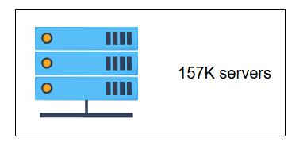
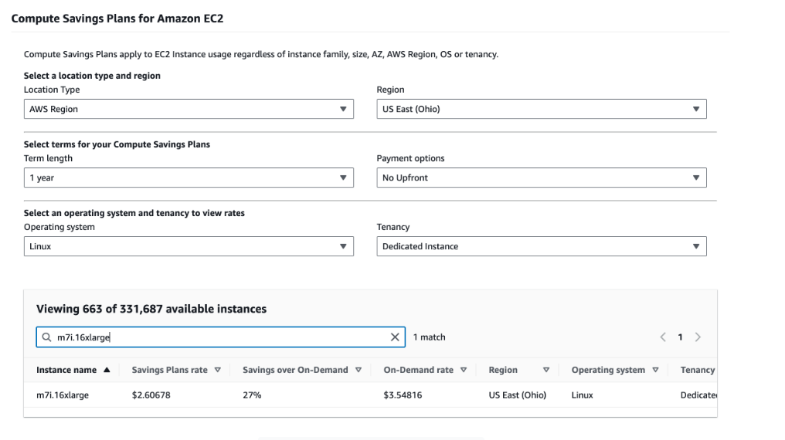
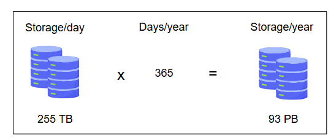
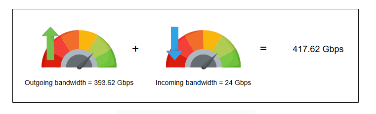

### **Примеры оценки ресурсов**

Попробуйте свои силы в некоторых приблизительных расчётах.

#### Введение

Теперь, когда мы заложили основу для оценки ресурсов, давайте воспользуемся знаниями, полученными на предыдущем уроке, для оценки таких
ресурсов, как серверы, хранилище и пропускная способность. Ниже мы рассмотрим сервис типа Twitter, сделаем предположения и на их основе
проведём оценки. Давайте начнём!

### Количество необходимых серверов

Давайте сделаем следующие предположения о сервисе, подобном Twitter.

**Предположения:**

* 500 миллионов (M) ежедневных активных пользователей (DAU).
* Один пользователь в среднем делает 20 запросов в день.
* Мы знаем, что один сервер (с 64 ядрами) может обрабатывать 64 000 RPS (запросов в секунду).

  
<b>Показать подробный расчёт</b>

* **Общее количество запросов в день:**
  `500 млн пользователей × 20 запросов/пользователь = 10 млрд запросов/день`
* **Общее количество секунд в дне:**
  `24 часа × 60 минут × 60 секунд = 86 400 секунд`
* **Среднее количество запросов в секунду (RPS):**
  `10 млрд запросов / 86 400 секунд ≈ 115 740 RPS`
* **Количество необходимых серверов:**
  `115 740 RPS / 64 000 RPS на сервер ≈ 1.8 сервера`

Мы можем округлить это значение до 2 серверов.

#### Вопросы для размышления

Можете ли вы определить скрытое предположение в наших расчётах выше?

  
<b>Показать ответ</b>

  Мы предположили, что нагрузка распределена равномерно в течение 24 часов. В реальности существуют пиковые часы, когда нагрузка значительно выше средней.

**Проверка на правдоподобие:** Для всех приблизительных расчётов нам нужно оценить, выглядят ли наши цифры разумными. Например, если бы мы
получили оценку в два сервера для крупного сервиса с миллионами DAU, это число могло бы быть нижней границей, но кажется далёким от
реальности.

### Пиковая нагрузка

Часто крупные сервисы должны быть готовы к внезапному наплыву посетителей. Мы можем получить оценку пиковой мощности. Предположим, что в
сутках есть одна конкретная секунда, когда все запросы от всех пользователей поступают в сервис одновременно. Мы используем это для оценки
мощности при пиковой нагрузке. Для более точной оценки нам понадобятся распределения запросов и ответов, которые могут быть доступны на
этапе прототипирования. Мы можем предположить, что запросы следуют определённому типу распределения, например, распределению Пуассона.

Используя DAU в качестве показателя пиковой нагрузки для конкретной секунды, мы избежали трудностей с поиском распределений запросов. Таким
образом, DAU становится количеством запросов в секунду. Так что количество серверов при пиковой нагрузке можно рассчитать следующим образом:

`Серверов необходимо при пиковой нагрузке = Количество запросов/секунду / RPS сервера = 10 млрд / 64 000 ≈ 157 тыс.`

> *Количество серверов, необходимое для сервиса типа Twitter*

Если наше предположение о том, что вся нагрузка может возникнуть одновременно в одну секунду и каждый из наших серверов может обрабатывать
64 000 запросов в секунду, верно, нам понадобится астрономическое количество в 157 тыс. серверов! Если это неосуществимо, у нас есть два
потенциальных пути дальнейших действий, как описано ниже.

#### Увеличение RPS сервера

Во-первых, если мы считаем наше предположение о пиковой нагрузке верным, мы можем рассчитать, сколько серверов мы можем максимально
задействовать. Предположим, мы можем использовать не более 100 000 серверов. Это означает:

`Количество запросов/секунду / Макс. серверов = 10 млрд / 100 000 = 100 000 запросов в секунду на сервер`

Нам потребуются значительные инженерные усилия, чтобы поднять RPS, который мы можем получить от сервера, с 64 000 до 100 000!

Существует множество примеров, когда организации полагались на extensive engineering, чтобы улучшить RPS серверов.

* **Первый пример:** WhatsApp в 2012 году сообщил, что они могут управлять 2 миллионами одновременных TCP-соединений на одном сервере. В
  отчёте 2017 года упоминалось, что WhatsApp использует около 700 серверов от IBM для своего сервиса. Неясно, какова была конкретная
  спецификация сервера.
* **Второй пример:** Исследовательская система, которая была тщательно оптимизирована для ввода-вывода, выиграла несколько соревнований по
  сортировке в 2010 году. Они отсортировали один триллион записей данных за 172 минуты, используя всего четверть вычислительных ресурсов
  другого рекордсмена, что означает, что они улучшили RPS в три раза по сравнению с ним.

Приведённые выше примеры подчёркивают, что улучшение RPS для конкретных сценариев использования возможно, хотя и за счёт целенаправленных
R&D и сопутствующих денежных затрат.

#### Уточнение предположения о пиковой нагрузке

Второй вариант для нас — изменить наше предположение о пиковой нагрузке. Использование принципа Парето, также известного как правило 80/20,
может быть разумным подходом для оценки пикового трафика во многих случаях. Принцип Парето гласит, что примерно `80%` следствий происходят
из `20%` причин. В контексте оценки пикового трафика мы можем предположить, что `80%` нашего пикового трафика происходит в течение `20%`
времени (окно в 4,8 часа за 24 часа).

`Количество серверов ≈ (0.8 × 10 млрд / (4.8 × 60 × 60 секунд)) / 64 000 ≈ 8 серверов`

И снова мы предположили, что запросы равномерно распределены в окне 4,8 часа. Приведённые выше примеры показывают нам, что есть огромная
разница между одновременным поступлением запросов и их распределением во времени. Когда системы строятся на таких предположениях, вводятся в
действие системы мониторинга, чтобы убедиться, что такие предположения никогда не нарушаются. Если нагрузка становится выше, чем мы
прогнозируем, могут применяться такие методы, как сброс нагрузки (load-shedding), прерыватели цепи (circuit-breakers) и троттлинг (
throttling). Работа с неожиданным пиком трафика — сложная проблема.

#### Плавная деградация

Рассмотрим сервис, на котором размещён динамический и персонализированный веб-сайт крупной новостной организации. Из-за некоторых
   непредвиденных событий, таких как 11 сентября, на сайт приходит внезапный наплыв посетителей, чтобы узнать последние новости. Это может
   быть ситуация, когда все DAU приходят одновременно.
   Такая ситуация явно нарушит наши обычные предположения о нагрузке. Можете ли вы придумать какой-либо способ плавной деградации сервиса,
   чтобы справиться с такой неожиданной нагрузкой?

  
<b>Показать ответ</b>

  Один из способов — временно отключить персонализацию и динамические компоненты и обслуживать статический, одинаковый для всех пользователей контент. Статический контент можно эффективно кэшировать на уровне CDN (Content Delivery Network), что значительно снижает нагрузку на основные серверы.

### Стоимость серверов

Мы выбрали тип инстанса EC2 под названием **m7i.16xlarge** с 64-ядерным процессором и 256 ГБ ОЗУ, чтобы получить представление о стоимости
серверов в долларах. Он работает на базе процессоров Intel Xeon Scalable 4-го поколения. Почасовая стоимость одного такого инстанса
составляет **$3.54816** по годовому контракту.

*Примерная стоимость инстанса AWS*

Мы взяли инстанс EC2 от AWS со следующими характеристиками:

| Характеристики инстанса EC2 |          |                  |               |                             |                            |
|:----------------------------|:---------|:-----------------|:--------------|:----------------------------|:---------------------------|
| **Размер инстанса**         | **vCPU** | **Память (ГиБ)** | **Хранилище** | **Проп. сп. сети (Гбит/с)** | **Проп. сп. EBS (Гбит/с)** |
| m7i.16xlarge                | 64       | 256              | Только EBS    | 25                          | 20                         |

В следующей таблице показана стоимость инстансов m7i.16xlarge для двух, восьми и 157 тыс. серверов. Стоимость может быстро расти, как мы
видим в случае пиковой нагрузки. В реальных проектах долларовый бюджет, выделяемый на определённые статьи, такие как серверы, является
жёстким ограничением, которое инженерная команда должна соблюдать.

| Стоимость серверов                       |                                      |                                          |
|:-----------------------------------------|:-------------------------------------|:-----------------------------------------|
| **Стоимость мин. кол-ва серверов в час** | **Стоимость по правилу 80/20 в час** | **Стоимость при пиковой нагрузке в час** |
| 2 × $3.548 = $7.096                      | 8 × $3.548 = $28.38                  | 157 000 × $3.548 = $557 061              |

### Требования к хранилищу

В этом разделе мы попытаемся понять, как выполняется оценка хранилища на примере Twitter. Мы оценим объём дискового пространства,
необходимый Twitter для новых твитов в течение года. Давайте сделаем следующие предположения:

* У нас 500 млн ежедневных активных пользователей.
* Каждый пользователь публикует три твита в день.
* 10% твитов содержат изображения, а 5% твитов — видео. Твит, содержащий видео, не содержит изображения, и наоборот.
* Размер изображения в среднем составляет 200 КБ, а видео — 3 МБ.
* Текст твита и его метаданные требуют 250 байт в базе данных.

Тогда в день потребуется следующее дисковое пространство:

  
<b>Показать подробный расчёт</b>

* **Общее количество твитов в день:**
  `500 млн пользователей × 3 твита/пользователь = 1.5 млрд твитов`
* **Хранилище для текста и метаданных:**
  `1.5 млрд твитов × 250 байт/твит = 375 млрд байт ≈ 0.375 ТБ`
* **Хранилище для изображений:**
  `1.5 млрд твитов × 10% × 200 КБ/изображение = 30 млрд КБ ≈ 30 ТБ`
* **Хранилище для видео:**
  `1.5 млрд твитов × 5% × 3 МБ/видео = 225 млн МБ ≈ 225 ТБ`

  
Общий объём хранилища, необходимый на один день = `0.375 ТБ + 30 ТБ + 225 ТБ ≈ 255 ТБ`.
Объём хранилища, необходимый на один год = `365 × 255 ТБ = 93.08 ПБ` (Петабайт).

*Общий объём хранилища, требуемый Twitter за год*

### Требования к пропускной способности

Чтобы оценить требования к пропускной способности для сервиса, мы используем следующие шаги:

1. Оценить ежедневный объём входящих данных в сервис.
2. Оценить ежедневный объём исходящих данных из сервиса.
3. Оценить пропускную способность в Гбит/с (Гигабит в секунду), разделив входящие и исходящие данные на количество секунд в сутках.

**Входящий трафик:** Давайте продолжим наш предыдущий пример с Twitter, которому требуется 255 ТБ хранилища каждый день. Следовательно,
входящий трафик должен поддерживать следующую пропускную способность в секунду:

`(255 × 10¹² байт / 86400 с) × 8 бит/байт ≈ 24 Гбит/с`

> *Примечание: Мы умножаем на 8, чтобы преобразовать байты (B) в биты (b), так как пропускная способность измеряется в битах в секунду.*

**Исходящий трафик:** Предположим, что один пользователь просматривает 50 твитов в день. Учитывая то же соотношение в 5% для видео и 10% для
изображений для 50 твитов, 2.5 твита будут содержать видео, а 5 твитов — изображение. Учитывая 500 млн активных ежедневных пользователей, мы
приходим к следующим оценкам:

  
<b>Показать подробный расчёт</b>

* **Просмотры твитов в день:** `500 млн пользователей × 50 твитов = 25 млрд просмотров`
* **Трафик для текста:** `25 млрд × 250 байт = 6.25 ТБ`
* **Трафик для изображений:** `25 млрд × 10% × 200 КБ = 500 ТБ`
* **Трафик для видео:** `25 млрд × 5% × 3 МБ = 3750 ТБ`
* **Общий исходящий трафик в день:** `6.25 + 500 + 3750 = 4256.25 ТБ`
* **Исходящая пропускная способность:** `(4256.25 × 10¹² байт / 86400 с) × 8 бит/байт ≈ 393.62 Гбит/с`

Twitter потребуется `24 Гбит/с` входящего трафика и `393.62 Гбит/с` исходящего, при условии, что загруженный контент не сжимается. Общие
требования к пропускной способности = `24 + 393.62 = 417.62 Гбит/с`.

*Общая пропускная способность, требуемая Twitter*

И снова, приведённые выше расчёты зависят от наших конкретных предположений о соотношении трафика (текст/изображения/видео) и соотношении
чтений/записей.

#### Вопросы для размышления

Мы получили цифру 93 ПБ для потребностей в хранилище в год. Является ли это число правдоподобным?

  
<b>Показать ответ</b>

  Да, это число правдоподобно. В 2013 году Facebook сообщал о хранении около 300 ПБ данных. Учитывая рост объёма медиаконтента (видео, изображения высокого разрешения) за последнее десятилетие, потребность в хранилище объёмом около 100 ПБ в год для крупного социального медиа-сервиса выглядит вполне реалистично.

---
Этот урок является шаблоном для оценки ресурсов в остальной части курса. Мы будем использовать цифры из этого урока на протяжении всего
курса. Приблизительные расчёты позволяют нам показать жизнеспособность системы при определённом дизайне. На собеседованиях способность
выполнять такие расчёты демонстрирует навыки кандидата в решении проблем в условиях неопределённости. На собеседовании мы можем сделать не
так много. Однако в реальном мире организации полагаются на реальные измерения для своих конкретных рабочих нагрузок и используют их в своих
приблизительных расчётах.