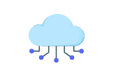
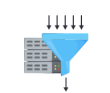
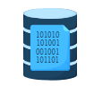
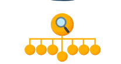
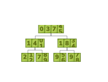

### **Введение в строительные блоки для проектирования современных систем**

Узнайте, как проектирование систем похоже на использование кубиков Lego для создания более крупных и удивительных артефактов.

#### Восходящий подход к проектированию современных систем

Задачи проектирования систем обычно имеют некоторые сходства, хотя конкретные детали часто уникальны. Мы выделили эти сходства из различных задач проектирования в виде базовых строительных блоков, которые мы и будем рассматривать. Одним из примеров строительного блока является компонент балансировки нагрузки, который мы, вероятно, будем так или иначе использовать в каждой задаче проектирования.

Цель разделения на строительные блоки — подробно обсудить их проектирование всего один раз. Это означает, что позже мы сможем использовать их где угодно, не углубляясь в детали снова. Можно рассматривать строительные блоки как кирпичики для создания более эффективных и функциональных систем.

Многие из обсуждаемых нами строительных блоков также доступны для реального использования в публичных облаках, таких как Amazon Web Services (AWS), Azure и Google Cloud Platform (GCP). Мы можем использовать такие конструкции для создания системы, чтобы ещё больше укрепить наше понимание. (Мы не будем создавать систему в рамках этого курса, но оставили это как упражнение для заинтересованных учащихся).

*Использование строительных блоков для разработки восходящего подхода к проектированию систем*

Мы подробно обсудим следующие строительные блоки:

*   **Система доменных имён (DNS):** Этот строительный блок посвящён проектированию иерархических и распределённых систем именования для компьютеров, подключённых к Интернету по различным интернет-протоколам.

*   **Балансировщики нагрузки:** Здесь мы разберёмся в проектировании балансировщика нагрузки, который используется для справедливого распределения входящих запросов клиентов между пулом доступных серверов. Он также снижает нагрузку и может обходить отказавшие серверы.

    

*   **Базы данных:** Этот строительный блок позволяет нам хранить, извлекать, изменять и удалять данные в связи с различными процедурами их обработки. Здесь мы обсудим типы баз данных, репликацию, партиционирование и анализ распределённых баз данных.

    

*   **Хранилище «ключ-значение»:** Это нереляционная база данных, которая хранит данные в виде пар «ключ-значение». Здесь мы объясним проектирование такого хранилища, а также важные концепции, такие как достижение масштабируемости, надёжности и конфигурируемости.

    

  *   **Сеть доставки контента (CDN):** В этой главе мы спроектируем сеть доставки контента (CDN), которая используется для хранения вирального контента, такого как видео, изображения, аудио и веб-страницы. Она эффективно доставляет контент конечным пользователям, снижая задержку и нагрузку на центры обработки данных.
  
    

*   **Генератор последовательностей (Sequencer):** В этом строительном блоке мы сосредоточимся на проектировании генератора уникальных ID с основным упором на сохранение причинно-следственных связей. Также будут объяснены три различных метода генерации уникальных ID.

    

*   **Мониторинг сервисов:** Системы мониторинга критически важны в распределённых системах, поскольку они помогают анализировать систему и оповещать заинтересованные стороны в случае возникновения проблем. Мониторинг часто полезен для создания систем раннего предупреждения, чтобы системные администраторы могли действовать до того, как надвигающаяся проблема превратится в серьёзную. Здесь мы создадим две системы мониторинга: одну для серверной стороны, а другую — для ошибок на стороне клиента.

*   **Распределённое кэширование:** В этом строительном блоке мы спроектируем распределённую систему кэширования, в которой несколько кэш-серверов координируются для хранения часто запрашиваемых данных.

    

*   **Распределённая очередь сообщений:** В этом строительном блоке мы сосредоточимся на проектировании очереди, состоящей из нескольких серверов, которая используется между взаимодействующими сущностями, называемыми производителями и потребителями. Это помогает разделить производителей и потребителей, обеспечивает их независимую масштабируемость и повышает надёжность.

    

*   **Система «издатель-подписчик» (Pub-Sub):** В этом строительном блоке мы сосредоточимся на проектировании асинхронного метода межсервисного взаимодействия, называемого системой «издатель-подписчик». Он популярен в бессерверных, микросервисных архитектурах и системах обработки данных.

  *   **Ограничитель скорости (Rate Limiter):** Здесь мы спроектируем систему, которая регулирует входящие запросы к сервису на основе предопределённого лимита. Обычно она используется в качестве защитного слоя для сервисов, чтобы избежать их чрезмерного использования — преднамеренного или непреднамеренного.
  
    

*   **Хранилище BLOB-объектов:** Этот строительный блок посвящён решению для хранения неструктурированных данных, например, мультимедийных файлов и исполняемых двоичных файлов.

    

*   **Распределённый поиск:** Поисковая система принимает запрос от пользователя и возвращает релевантный контент за несколько секунд или меньше. Этот строительный блок фокусируется на трёх неотъемлемых компонентах: сканирование (crawl), индексация (index) и поиск (search).

*   **Распределённое логирование:** Логирование — это операция, интенсивно использующая ввод-вывод, которая является трудоёмкой и медленной. Здесь мы спроектируем систему, которая позволит сервисам в распределённой системе эффективно логировать свои события. Система будет сделана масштабируемой и надёжной.

    

*   **Распределённое планирование задач:** Мы спроектируем распределённую систему планирования задач, которая выступает посредником между задачами и ресурсами. Она интеллектуально распределяет ресурсы по задачам для достижения целей на уровне задач и на уровне системы. Часто используется для переноса фоновой обработки для асинхронного выполнения.

  *   **Шардированные счётчики:** Этот строительный блок демонстрирует эффективную распределённую систему подсчёта для обработки миллионов одновременных запросов на чтение/запись, таких как лайки под твитом знаменитости.
  
    

Мы расположили строительные блоки в топологическом порядке, так что блоки, зависящие от других, идут позже.

### Соглашения
Для более детального описания мы будем использовать раздел «Требования» всякий раз, когда проектируем строительный блок (или решаем задачу проектирования). Раздел «Требования» будет освещать ожидаемые результаты, которые мы хотим получить от разработанного дизайна. «Требования» будут иметь две подкатегории:

*   **Функциональные требования:** Они представляют собой функции, которые сможет использовать пользователь проектируемой системы. Например, система позволит пользователю искать контент с помощью строки поиска.
*   **Нефункциональные требования (НФТ):** Это критерии, на основе которых пользователь системы будет считать её пригодной к использованию. НФТ могут включать такие требования, как высокая доступность, низкая задержка, масштабируемость и так далее.

Давайте приступим к нашим строительным блокам.