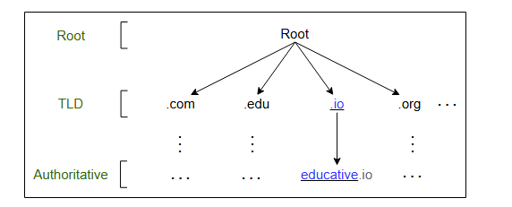
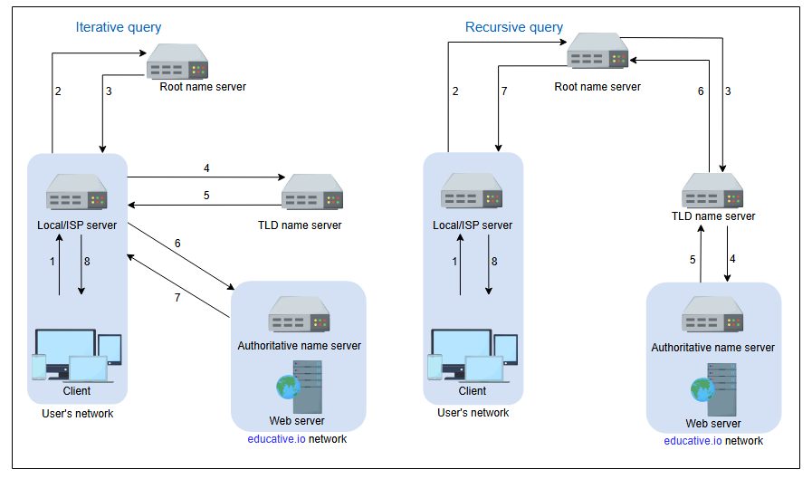
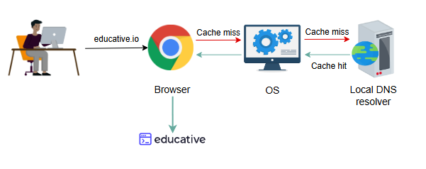
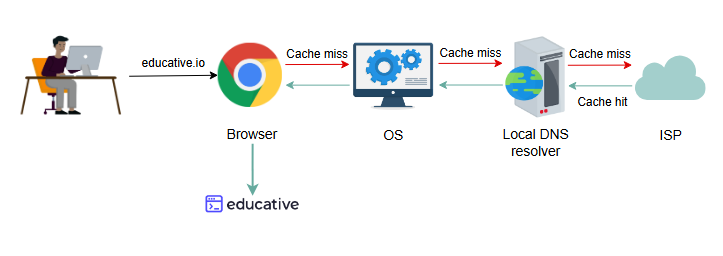
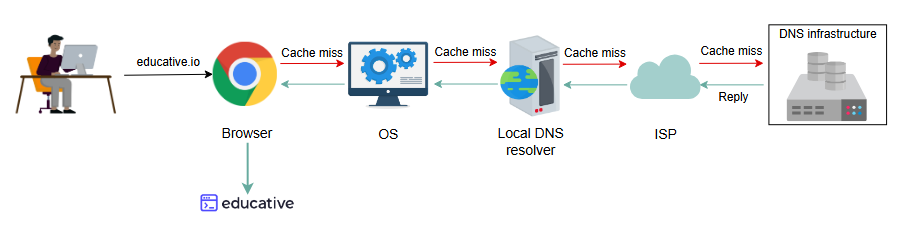
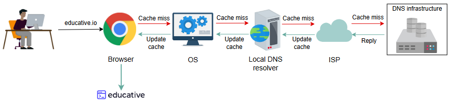
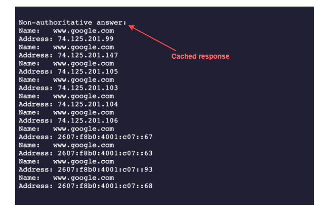
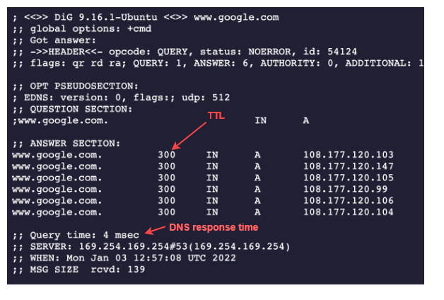

### **Как работает Система Доменных Имён**

Разберитесь в деталях работы системы доменных имён.

В этом уроке мы ответим на следующие вопросы:

* Как формируется иерархия DNS с использованием различных типов DNS-серверов имён?
* Как выполняется кэширование на разных уровнях Интернета для снижения нагрузки на инфраструктуру DNS?
* Как распределённая природа инфраструктуры DNS способствует её надёжности?

Давайте начнём.

### Иерархия DNS

Как уже говорилось, DNS — это не один-единственный сервер, который принимает запросы и отвечает пользователям. Это полноценная
инфраструктура с серверами имён на разных уровнях иерархии.

В иерархии DNS существует четыре основных типа серверов:

1. **DNS-резолвер (DNS resolver):** Резолверы инициируют последовательность запросов и перенаправляют их на другие DNS-серверы имён. Обычно
   DNS-резолверы находятся в сети пользователя. Однако они также могут обслуживать DNS-запросы пользователей с помощью методов кэширования,
   как мы скоро увидим. Эти серверы также могут называться локальными или серверами по умолчанию.
2. **Корневые серверы имён (Root-level name servers):** Эти серверы получают запросы от локальных серверов. Корневые серверы имён хранят
   информацию о серверах имён на основе доменов верхнего уровня, таких как `.com`, `.edu`, `.us` и так далее. Например, когда пользователь
   запрашивает IP-адрес `educative.io`, корневые серверы вернут список серверов доменов верхнего уровня (TLD), которые хранят информацию о
   серверах для домена `.io`.
3. **Серверы имён доменов верхнего уровня (TLD name servers):** Эти серверы хранят IP-адреса авторитетных серверов имён. Запрашивающая
   сторона получит список IP-адресов, принадлежащих авторитетным серверам организации.
4. **Авторитетные серверы имён (Authoritative name servers):** Это DNS-серверы имён организации, которые предоставляют IP-адреса её
   веб-серверов или серверов приложений.


*Иерархия DNS для разрешения доменных/хостовых имён*

Вопрос для размышления
<p>Как обрабатываются DNS-имена? Например, <code>educative.io</code> будет обрабатываться слева направо или справа налево?</p>

<details>
  <summary><b>Ответ</b></summary>
  <p> DNS-имена обрабатываются справа налево. Запрос начинается с самого правого компонента (домена верхнего уровня, например, <code>.io</code>), затем движется влево к следующему компоненту (<code>educative</code>) и так далее. Это позволяет иерархической системе эффективно делегировать запросы от корневых серверов к TLD-серверам и, наконец, к авторитетным серверам домена.</p>
</details>

### Итеративное и рекурсивное разрешение запросов

Существует два способа выполнения DNS-запроса:

* **Итеративный:** Локальный сервер последовательно запрашивает корневой, TLD и авторитетный серверы для получения IP-адреса.
* **Рекурсивный:** Конечный пользователь запрашивает локальный сервер. Локальный сервер, в свою очередь, запрашивает корневые DNS-серверы
  имён. Корневые серверы имён перенаправляют запросы другим серверам имён.

На следующей иллюстрации (слева) разрешение DNS-запроса является итеративным с точки зрения локального/ISP-сервера:


*Итеративный и рекурсивный запрос*

> **Примечание:** Обычно итеративный запрос предпочтительнее для снижения нагрузки на инфраструктуру DNS.

### Кэширование

Кэширование — это временное хранение часто запрашиваемых ресурсных записей. Запись — это единица данных в базе данных DNS, которая
показывает привязку имени к значению. Кэширование сокращает время ответа пользователю и уменьшает сетевой трафик. Когда мы используем
кэширование на разных уровнях иерархии, это может значительно снизить нагрузку на инфраструктуру DNS. Кэширование может быть реализовано в
браузере, операционной системе, на локальном сервере имён в сети пользователя или в DNS-резолверах интернет-провайдера (ISP).

Слайд-шоу ниже демонстрирует силу кэширования в DNS:

1. Пользователь запрашивает доступ к URL-адресу, и браузер кэширует сопоставление доменного имени с IP-адресом
   
2. Вот что происходит, если браузер не кэшировал сопоставление домена с IP-адресом. Следующая иерархия, которая может иметь сопоставление, -
   это операционная система
   
3. Если в операционной системе нет сопоставления, локальный преобразователь DNS может получить кэшированный ответ
   
4. Если у локального распознавателя DNS нет сопоставления, интернет-провайдер может получить кэшированный ответ
   
5. Наконец, инфраструктура DNS ответит с помощью IP-адреса
   
6. Кэш будет обновляться на каждом уровне иерархии
   
7. В браузере теперь обновлен кэш, поэтому запрос пользователя будет обрабатываться локально
   

> **Примечание:** Даже если для разрешения запроса пользователя нет доступного кэша и необходимо обратиться к инфраструктуре DNS,
> кэширование всё равно может быть полезным. Локальный сервер или DNS-резолвер провайдера могут кэшировать IP-адреса TLD-серверов или
> авторитетных серверов и избегать запросов к корневому серверу.

<details>
  <summary><b>Почему DNS жертвует строгой согласованностью ради высокой производительности и масштабируемости?</b></summary>
  <p>Конечно! Служба DNS жертвует строгой согласованностью для достижения высокой производительности и масштабируемости, поскольку она обрабатывает огромное количество операций чтения по сравнению с операциями записи. Обновления записей DNS распространяются медленно, что означает, что они не должны быть немедленно согласованы на всех серверах. Такой подход позволяет DNS быстро реагировать на запросы и эффективно обрабатывать большой объем трафика, отдавая приоритет доступности и скорости, а не строгой согласованности. Продолжайте изучать!</p>
</details>

### DNS как распределённая система

Хотя иерархия DNS способствует распределённости Интернета, каким мы его знаем сегодня, она сама по себе является распределённой системой.
Распределённая природа DNS имеет следующие преимущества:

* Она позволяет избежать превращения в единую точку отказа (SPOF).
* Она достигает низкой задержки запросов, так как пользователи могут получать ответы от близлежащих серверов.
* Она обеспечивает высокую степень гибкости при обслуживании, обновлениях или модернизации. Например, если один DNS-сервер не работает или
  перегружен, другой DNS-сервер может отвечать на запросы пользователей.

Существует 13 логических корневых серверов имён (названных буквами от A до M) с множеством экземпляров, разбросанных по всему миру. Этими
серверами управляют 12 различных организаций.

Теперь давайте рассмотрим, как DNS является масштабируемой (scalable), надёжной (reliable) и согласованной (consistent).

#### Высокая масштабируемость

Благодаря своей иерархической природе DNS является высокомасштабируемой системой. Примерно 1000 реплицированных экземпляров 13 корневых
серверов стратегически распределены по всему миру для обработки запросов пользователей. Работа разделена между TLD- и корневыми серверами
для обработки запроса, и, наконец, авторитетными серверами, которыми управляют сами организации, что заставляет всю систему работать. Как
показано на дереве иерархии DNS выше, разные сервисы обрабатывают разные части дерева, обеспечивая масштабируемость и управляемость системы.

#### Надёжность

Три основные причины делают DNS надёжной системой:

1. **Кэширование:** Кэширование выполняется в браузере, операционной системе, на локальном сервере имён, а DNS-резолверы провайдера также
   поддерживают богатый кэш часто посещаемых сервисов. Даже если некоторые DNS-серверы временно недоступны, закэшированные записи могут быть
   предоставлены, что делает DNS надёжной системой.
2. **Репликация серверов:** DNS имеет реплицированные копии каждого логического сервера, систематически распределённые по всему миру для
   обслуживания запросов пользователей с низкой задержкой. Избыточные серверы повышают надёжность всей системы.
3. **Протокол:** Хотя многие клиенты полагаются на ненадёжный User Datagram Protocol (UDP) для запроса и получения ответов DNS,
   важно признать, что UDP также предлагает явные преимущества. Он намного быстрее и, следовательно, улучшает производительность DNS. Кроме
   того, надёжность интернет-сервисов улучшилась с момента их появления, поэтому UDP обычно предпочтительнее TCP. DNS-запросы обычно
   повторно передаются на транспортном уровне, если на предыдущий не было ответа. Таким образом, цикл запрос-ответ может потребовать
   дополнительных раунд-трипов, что обеспечивает меньшую задержку по сравнению с TCP, который каждый раз перед обменом данными требует
   трёхэтапного рукопожатия.

##### Вопрос для размышления

Что произойдёт, если сеть перегружена? Должен ли DNS продолжать использовать UDP?
<details>
  <summary>Ответ</summary>
  <p>Обычно DNS использует UDP. Однако DNS может использовать TCP, когда размер сообщения превышает исходный размер пакета в 512 байт. Это связано с тем, что пакеты большого размера более подвержены повреждению в перегруженных сетях. DNS также использует TCP для передачи зон (zone transfers).</p>
  <p>Некоторые клиенты предпочитают TCP вместо UDP для повышения безопасности, обычно используя протоколы, такие как DNS-over-HTTPS (DoH) или DNS-over-TLS (DoT), для обеспечения конфиденциальности.</p>
</details>

#### Согласованность

DNS использует различные протоколы для обновления и передачи информации между реплицированными серверами в иерархии. DNS жертвует строгой
согласованностью ради высокой производительности, потому что данные из баз данных DNS читаются гораздо чаще, чем записываются. Однако DNS
обеспечивает **согласованность в конечном счёте** и обновляет записи на реплицированных серверах лениво. Обычно обновление записей на
DNS-серверах по всему Интернету может занять от нескольких секунд до трёх дней. Время, необходимое для распространения информации между
различными кластерами DNS, зависит от инфраструктуры DNS, размера обновления и того, какая часть дерева DNS обновляется.

Согласованность также может страдать из-за кэширования. Поскольку авторитетные серверы находятся внутри организации, возможно, что
определённые ресурсные записи обновляются на авторитетных серверах в случае сбоев серверов в организации. Следовательно, закэшированные
записи на серверах по умолчанию/локальных и ISP-серверах могут быть устаревшими. Чтобы смягчить эту проблему, каждая закэшированная запись
поставляется со временем истечения, называемым **время жизни (TTL)**.

Вопрос для размышления

Для поддержания высокой доступности значение TTL должно быть большим или маленьким?
<details>
  <summary><b>Ответ</b></summary>
    Для поддержания высокой доступности значение TTL должно быть небольшим. Это связано с тем, что в случае сбоя на каком-либо сервере или кластере организация может немедленно обновить записи о ресурсах. Пользователи будут недоступны только до тех пор, пока не истечет срок действия TTL. Однако, если время ожидания велико, организация обновит свои записи о ресурсах, в то время как пользователи будут продолжать проверять устаревший сервер, который давно бы вышел из строя. Компании, стремящиеся к высокой доступности, поддерживают значение времени ожидания на уровне 120 секунд. Таким образом, даже в случае сбоя максимальное время простоя составляет несколько минут.
</details>

### Проверьте сами

Давайте выполним пару команд. Нажмите на терминал, чтобы выполнить следующие команды. Скопируйте следующие команды в терминал, чтобы
запустить их. Изучите вывод команд:

```bash
nslookup www.google.com
dig www.google.com
```

В следующей подборке слайдов освещаются некоторые важные аспекты работы nslookup и dig.



#### Что означает вывод:

* **Вывод `nslookup`**
    * **`Non-authoritative answer`** (неавторитетный ответ), как следует из названия, — это ответ, предоставленный сервером, который не
      является авторитетным сервером для Google. Откуда же берётся ответ? Ответ предоставляется вторичными, третичными и т.д. серверами
      имён, настроенными для ответа на наш DNS-запрос — например, DNS-резолвером нашего университета или офиса, сервером имён нашего
      провайдера и так далее. Короче говоря, это можно считать кэшированной версией ответа авторитетных серверов Google. Если мы попробуем
      разные доменные имена, мы поймём, что в большинстве случаев получаем кэшированный ответ.
    * Если мы выполним одну и ту же команду несколько раз, мы получим тот же список IP-адресов, но каждый раз в разном порядке. Причина в
      том, что DNS косвенно выполняет **балансировку нагрузки**.

* **Вывод `dig`**
    * **`Query time: 4 msec`** представляет время, необходимое для получения ответа от DNS-сервера. По разным причинам эти цифры в вашем
      случае могут отличаться.
    * Значение **`300`** в **`ANSWER SECTION`** представляет количество секунд, в течение которых кэш хранится в DNS-резолвере. Это
      означает, что авторитетный DNS Google устанавливает значение TTL в пять минут (`300 сек / 60`).

> **Примечание:** Мы приглашаем вас протестировать разные сервисы на их TTL и время ответа, чтобы укрепить ваше понимание.


<summary><b>Вопрос для размышления</b></summary>
<p>Если нам нужен DNS, чтобы узнать IP-адрес сайта, то как мы узнаем IP-адрес самого DNS-резолвера? (Похоже на проблему курицы и яйца!)</p>

<details>

<summary><b>Ответ</b></summary>
<p> В операционных системах конечных пользователей есть конфигурационные файлы (<code>/etc/resolv.conf</code> в Linux) с IP-адресами DNS-резолверов, которые, в свою очередь, получают всю информацию для них. (Часто DHCP предоставляет IP-адрес DNS-резолвера по умолчанию вместе с другими настройками). Конечные системы запрашивают DNS-резолверы для любых DNS-запросов. На DNS-резолверах установлено специальное программное обеспечение для разрешения запросов через инфраструктуру DNS. IP-адреса корневых серверов находятся внутри этого специального программного обеспечения. Обычно на DNS-резолверах используется программное обеспечение Berkeley Internet Name Domain (BIND). InterNIC поддерживает обновлённый список 13 корневых серверов.</p>
  <p>Таким образом, мы решаем проблему курицы и яйца, предварительно "засевая" каждый резолвер знанием об IP-адресах корневых DNS-серверов (чьи IP-адреса меняются крайне редко).</p>
</details>

---
  Кэширование DNS повышает производительность, но создаёт риск устаревших данных. Предложите стратегию для минимизации сбоев.


<details>
  <summary>Ответ</summary>
  Конечно! Чтобы свести к минимуму сбои при обновлении записей DNS, хорошая стратегия включает в себя:

Временное снижение значения TTL (срока службы) перед внесением изменений, чтобы клиенты чаще обновляли свой кэш и быстрее получали новый IP-адрес.


Внедрение поэтапного внедрения путем постепенного обновления записей DNS на авторитетных серверах снижает риск распространения устаревших данных.

Использование управления трафиком на основе DNS для перенаправления пользователей, которые все еще используют старый IP-адрес, на временную страницу или сообщение с объяснением обновления.

Заблаговременное уведомление пользователей о планируемых изменениях для определения ожиданий и уменьшения путаницы.

Эти методы помогают обеспечить плавный переход с минимальными сбоями в обслуживании. Продолжайте изучать!
</details>