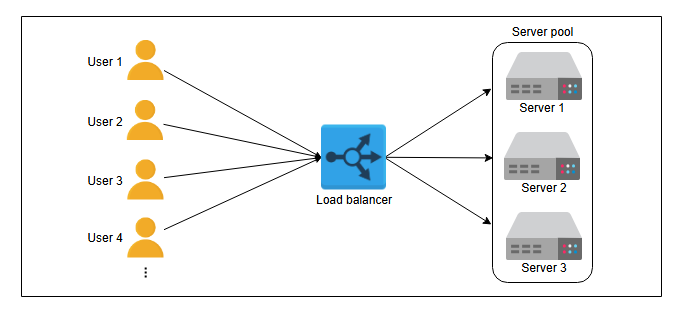
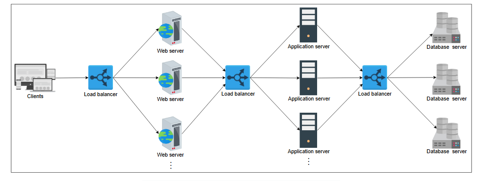

### Введение в балансировщики нагрузки

Узнайте об основах работы балансировщиков нагрузки и предлагаемых ими сервисах.

#### Что такое балансировка нагрузки?

В типичном центре обработки данных (ЦОД) могут поступать миллионы запросов в секунду. Для их обслуживания тысячи (или даже сотни тысяч) серверов работают вместе, распределяя нагрузку от входящих запросов.

**Примечание:** Здесь важно рассмотреть, как входящие запросы будут распределяться между всеми доступными серверами.

Балансировщик нагрузки (LB) — это ответ на этот вопрос. Задача балансировщика нагрузки — справедливо распределять все запросы клиентов между пулом доступных серверов. Балансировщики нагрузки выполняют эту задачу, чтобы избежать перегрузки или сбоя серверов.

Уровень балансировки нагрузки — это первая точка контакта в центре обработки данных после межсетевого экрана (файрвола). Балансировщик нагрузки может не потребоваться, если сервис обрабатывает несколько сотен или даже тысяч запросов в секунду. Однако при увеличении количества клиентских запросов балансировщики нагрузки предоставляют следующие возможности:

*   **Масштабируемость (Scalability):** Добавляя серверы, можно бесшовно увеличивать мощность приложения/сервиса. Балансировщики нагрузки делают такое горизонтальное масштабирование (увеличение или уменьшение количества серверов) прозрачным для конечных пользователей.
*   **Доступность (Availability):** Даже если некоторые серверы выходят из строя или отказывают, система все равно остается доступной. Одна из задач балансировщиков нагрузки — скрывать отказы и сбои серверов.
*   **Производительность (Performance):** Балансировщики нагрузки могут направлять запросы на серверы с меньшей нагрузкой, чтобы пользователь мог получить ответ быстрее. Это не только улучшает производительность, но и оптимизирует использование ресурсов.

Вот абстрактное изображение того, как работают балансировщики нагрузки:

*Упрощенная схема работы балансировщика нагрузки*

#### Размещение балансировщиков нагрузки
Обычно LB располагаются между клиентами и серверами. Запросы проходят через уровень балансировки нагрузки к серверам и обратно к клиентам. Однако это не единственное место, где используются балансировщики нагрузки.

Рассмотрим три известные группы серверов: веб-серверы, серверы приложений и серверы баз данных. Чтобы распределить нагрузку трафика между доступными серверами, балансировщики нагрузки можно использовать между экземплярами (instances) этих трех сервисов следующим образом:

*   Разместить LB между конечными пользователями приложения и веб-серверами/шлюзом приложений.
*   Разместить LB между веб-серверами и серверами приложений, на которых выполняется бизнес-логика/логика приложения.
*   Разместить LB между серверами приложений и серверами баз данных.

*Возможное использование балансировщиков нагрузки в трехуровневой архитектуре*

На практике балансировщики нагрузки потенциально могут использоваться между любыми двумя сервисами с несколькими экземплярами в рамках архитектуры системы.

#### Услуги, предлагаемые балансировщиками нагрузки
LB не только обеспечивают масштабируемость, доступность и высокую производительность сервисов, но и предлагают некоторые ключевые услуги, такие как:

*   **Проверка работоспособности (health checking):** LB используют heartbeat-протокол для мониторинга состояния и, следовательно, надежности конечных серверов. Еще одно преимущество проверки работоспособности — улучшение пользовательского опыта.
*   **Терминирование TLS:** LB снижают нагрузку на конечные серверы, обрабатывая терминирование TLS-соединений с клиентом.
*   **Прогнозная аналитика:** LB могут прогнозировать шаблоны трафика с помощью аналитики, проводимой над проходящим через них трафиком, или используя статистику трафика, собранную с течением времени.
*   **Снижение человеческого вмешательства:** Благодаря автоматизации LB требуется меньше усилий системных администраторов для обработки сбоев.
*   **Обнаружение сервисов:** Преимущество LB в том, что запросы клиентов перенаправляются на соответствующие хост-серверы путем обращения к реестру сервисов.
*   **Безопасность:** LB также могут повысить безопасность, смягчая атаки типа «отказ в обслуживании» (DoS) на разных уровнях модели OSI (уровни 3, 4 и 7).

В целом, балансировщики нагрузки обеспечивают гибкость, надежность, избыточность и эффективность всей архитектуры системы.

---
**Пища для размышлений**

1.  **Что, если балансировщики нагрузки откажут? Разве они не являются единой точкой отказа (SPOF)?**

    

      
Скрыть ответ

      Балансировщики нагрузки обычно развертываются парами в качестве средства аварийного восстановления. Если один балансировщик откажет, и не будет резерва для переключения (failover), весь сервис выйдет из строя. Как правило, для поддержания высокой доступности предприятия используют кластеры балансировщиков нагрузки, которые применяют heartbeat-протокол для постоянной проверки их состояния. При отказе основного LB его может заменить резервный. Но если откажет весь кластер, в экстренных случаях можно выполнить ручную перемаршрутизацию.
    

2. **Представьте, что вы разрабатываете балансировщик нагрузки для пользовательских сессий. Как бы вы обеспечили согласованную маршрутизацию, чтобы все запросы от одного и того же пользователя поступали на один и тот же сервер?**

    

      
Скрыть ответ

        Для обеспечения согласованной маршрутизации (consistent routing) в балансировщике нагрузки, чтобы все запросы от одного пользователя направлялись на один и тот же сервер, можно использовать следующие подходы:

   1. **Хэширование идентификатора сессии**:
       - Используйте уникальный идентификатор пользователя (например, session ID, user ID или cookie), который присутствует в каждом запросе.
       - Примените хэш-функцию (например, SHA-256 или MD5) к этому идентификатору.
       - Вычислите индекс сервера с помощью операции модуля: `server_index = hash(session_id) % number_of_servers`.
       - Это гарантирует, что запросы с одним и тем же идентификатором всегда будут направляться на один сервер, если количество серверов не меняется.

   2. **Сохранение состояния сессии (Sticky Sessions)**:
       - Настройте балансировщик нагрузки для использования "липких сессий" (sticky sessions). После того как пользователь впервые направляется на сервер, балансировщик сохраняет соответствие между идентификатором сессии и сервером (например, в памяти или базе данных).
       - Пример реализации: в HTTP-запросах использовать cookie (например, `JSESSIONID` в Java-приложениях), который балансировщик проверяет и направляет запрос на соответствующий сервер.

   3. **Хранилище соответствия**:
       - Храните маппинг сессий и серверов в централизованном хранилище (например, Redis или Memcached).
       - При поступлении запроса балансировщик проверяет хранилище, чтобы определить, на какой сервер направить запрос. Если записи нет, выбирается новый сервер, и соответствие сохраняется.

   4. **IP-хэширование**:
       - В случаях, когда идентификатор сессии недоступен, можно использовать IP-адрес клиента для хэширования.
       - Однако этот метод менее надежен, так как IP-адреса могут меняться (например, при использовании мобильных сетей или NAT).

   5. **Обработка изменения топологии серверов**:
       - Если количество серверов меняется (добавляются или удаляются), хэширование может привести к переназначению сессий. Для минимизации этого эффекта можно использовать **консистентное хэширование** (consistent hashing):
           - Сессии распределяются по кольцу хэшей, где каждый сервер отвечает за определенный диапазон.
           - При добавлении или удалении сервера перемещается только часть сессий, что минимизирует сбои.

   6. **Резервирование и отказоустойчивость**:
       - Если сервер выходит из строя, балансировщик должен перенаправить запросы на другой сервер. Для сохранения согласованности можно:
           - Использовать вторичный сервер для сессии (репликацию).
           - Хранить состояние сессии в распределенном хранилище, чтобы любой сервер мог обработать запрос.

