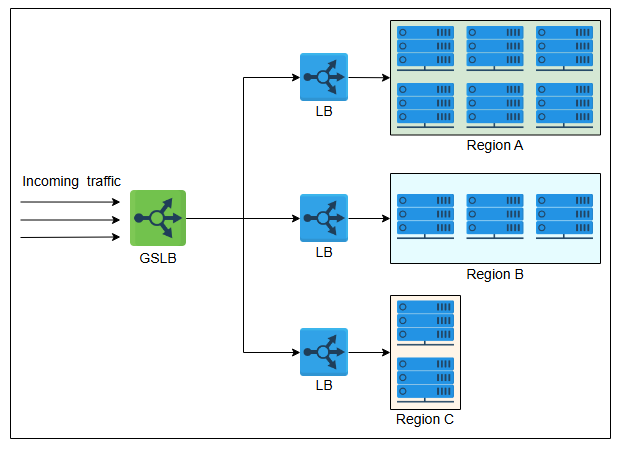
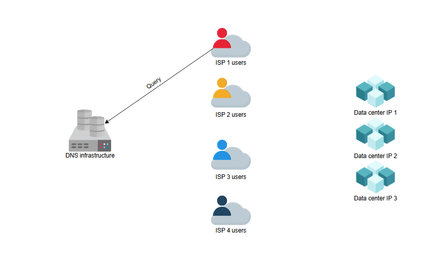
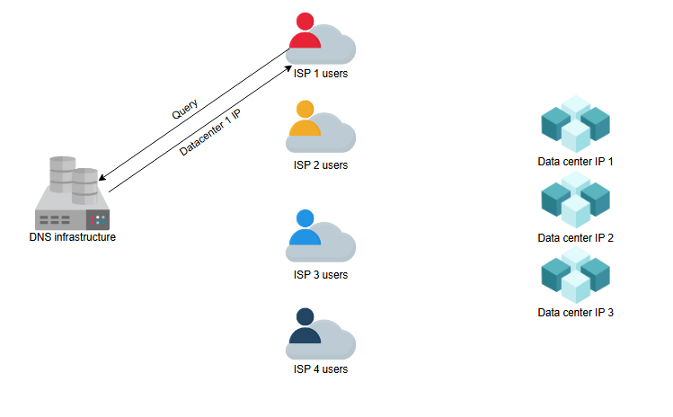
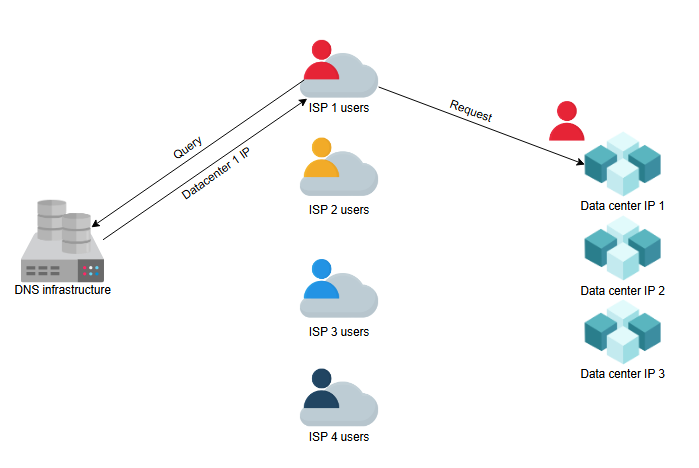
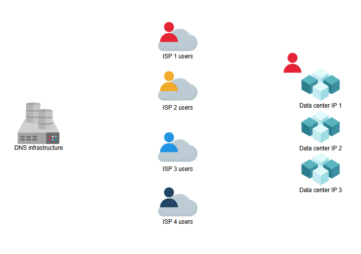
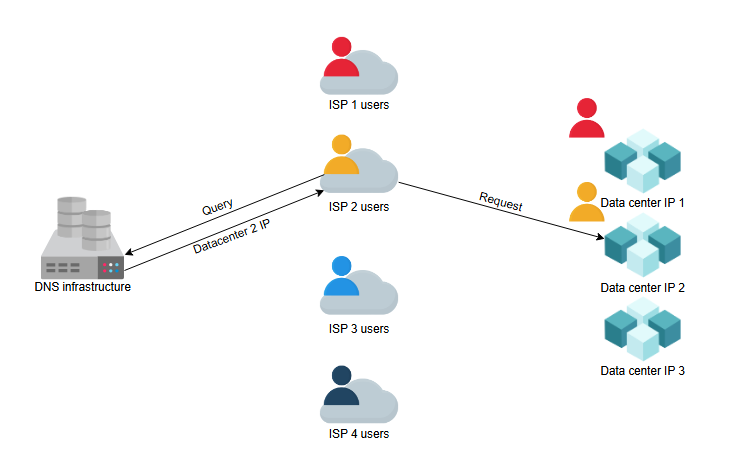
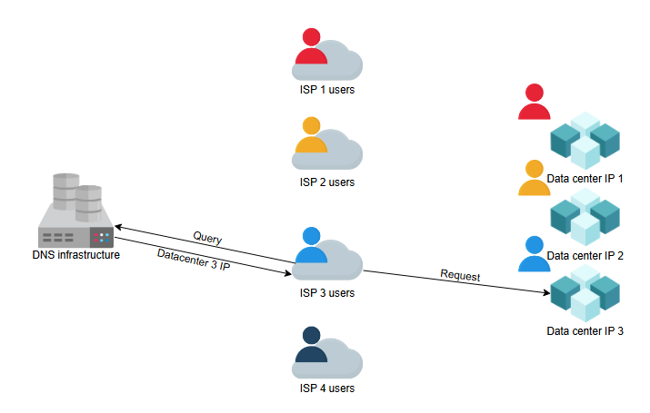
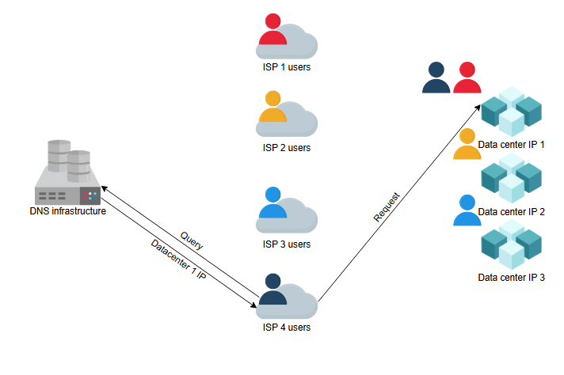

**Глобальная и локальная балансировка нагрузки**

Понимание того, как выполняется глобальная и локальная балансировка нагрузки.

**Введение**

Из предыдущего урока может показаться, что балансировка нагрузки выполняется только в пределах дата-центра. Однако балансировка нагрузки
требуется как на глобальном, так и на локальном уровне. Давайте разберемся в функциях каждого из этих двух типов:

* **Глобальная балансировка нагрузки на серверы (GSLB):** GSLB включает в себя распределение трафика между несколькими географическими
  регионами.
* **Локальная балансировка нагрузки:** Это относится к балансировке нагрузки в пределах одного дата-центра. Этот тип балансировки нагрузки
  направлен на повышение эффективности и лучшее использование ресурсов хостинговых серверов в дата-центре.

Давайте разберем каждый из этих двух методов ниже.

**Глобальная балансировка нагрузки на серверы**

GSLB обеспечивает интеллектуальную переадресацию глобального входящего трафика в нужный дата-центр. Например, сбой питания или сети в
дата-центре требует, чтобы весь трафик был перенаправлен в другой дата-центр. GSLB принимает решения о перенаправлении на основе
географического положения пользователей, количества хостинговых серверов в разных местах, работоспособности дата-центров и так далее.

В следующем уроке мы также узнаем, как GSLB обеспечивает автоматическое переключение при сбоях в зоне (automatic zonal failover). Сервис
GSLB может быть установлен локально (on-premises) или получен через «Балансировку нагрузки как услугу» (Load Balancing as a Service, LBaaS).

Иллюстрация ниже показывает, что GSLB может перенаправлять запросы в три разных дата-центра. Каждый уровень локальной балансировки нагрузки
в дата-центре будет поддерживать соединение с плоскостью управления (control plane) GSLB, предоставляя информацию о работоспособности
локальных балансировщиков (LB) и фермы серверов (server farm). GSLB использует эту информацию для принятия решений о маршрутизации трафика и
его перенаправления на основе конфигурации и данных мониторинга каждого региона.

*Использование глобальной балансировки нагрузки для отправки запросов пользователей в разные регионы*

Теперь мы обсудим, как система доменных имен (DNS) может выполнять GSLB.

**Балансировка нагрузки в DNS**

Мы знаем, что DNS может возвращать несколько IP-адресов в ответ на DNS-запрос. В уроке о DNS мы обсуждали, что балансировку нагрузки можно
осуществлять через DNS, рассматривая вывод команды `nslookup`. DNS использует простой метод изменения порядка списка IP-адресов в ответе на
каждый DNS-запрос. Таким образом, разные пользователи получают список IP-адресов в измененном порядке. Это приводит к тому, что пользователи
обращаются к разным серверам для обработки своих запросов. Таким образом, DNS распределяет нагрузку от запросов между разными дата-центрами.
Это и есть выполнение GSLB. В частности, DNS использует метод циклического перебора (round-robin) для выполнения балансировки нагрузки, как
показано ниже:

1) Пользователь от провайдера 1 запрашивает у инфраструктуры DNS IP-адрес службы
   
2) DNS responds with the IP address of data center 1
   
3) В ответ DNS сообщает IP-адрес центра обработки данных 1
   
4) Пользователь от провайдера 1 обслуживается в центре обработки данных 1
   
5) Пользователь от провайдера 2 запрашивает у инфраструктуры DNS IP-адрес той же службы.
   DNS отвечает IP-адресом центра обработки данных 2 и выполняет GSLB.Пользователь отправляет запрос в центр обработки данных 2.Пользователь
   от провайдера 2 получает обслуживание в центре обработки данных 2
   
6) Пользователь из ISP 3 запрашивает у инфраструктуры DNS IP-адрес той же службы. DNS отвечает IP-адресом данных
   центр 3 и выполняет GSLB. Пользователь отправляет запрос в центр обработки данных 3. Пользователь из интернет-провайдера 3 обслуживается
   в дата-центре
   3
7) Пользователь из ISP 4 запрашивает у инфраструктуры DNS IP-адрес той же службы. DNS отвечает IP-адресом данных
   центр 1 и выполняет GSLB по кругу. Пользователь отправляет запрос в центр обработки данных 1. Пользователь из ISP 4 обслуживается в
   центре обработки данных
   1 

Как показано выше, метод round-robin в DNS направляет клиентов в дата-центры в строгом циклическом порядке. Однако round-robin имеет
следующие ограничения:

* У разных интернет-провайдеров (ISP) разное количество пользователей. Провайдер, обслуживающий множество клиентов, будет предоставлять один
  и тот же кэшированный IP-адрес своим клиентам, что приводит к неравномерному распределению нагрузки на конечные серверы.
* Поскольку алгоритм балансировки round-robin не учитывает сбои конечных серверов, он продолжает раздавать IP-адрес вышедшего из строя
  сервера до тех пор, пока не истечет время жизни (TTL) кэшированных записей. В этом случае доступность сервиса может пострадать из-за
  балансировки нагрузки на уровне DNS.

Несмотря на эти ограничения, round-robin по-прежнему широко используется многими провайдерами DNS-услуг. Более того, для эффективной
балансировки нагрузки между различными дата-центрами DNS использует короткое время жизни (TTL) для кэшированных записей.

**Примечание:** DNS — не единственная форма GSLB. Контроллеры доставки приложений (ADC) и облачная балансировка нагрузки (обсуждается далее)
являются более совершенными способами выполнения GSLB.

**Что такое контроллеры доставки приложений (ADC) или система балансировки нагрузки?**

Anycast — это сетевая технология, при которой один и тот же IP-адрес назначается нескольким серверам в разных местах. Затем трафик
направляется на ближайший сервер на основе таблицы маршрутизации сети, что улучшает время отклика. Учитывая это, объясните роль Anycast в
глобальной балансировке нагрузки и его преимущества по сравнению с традиционными механизмами глобальной балансировки нагрузки на серверы (
GSLB).

**Необходимость в локальных балансировщиках нагрузки**
DNS играет ключевую роль в балансировке нагрузки, но имеет следующие ограничения:

* Небольшого размера DNS-пакета (512 байт) недостаточно, чтобы включить в него все возможные IP-адреса серверов.
* Контроль над поведением клиента ограничен. Клиенты могут произвольно выбирать из полученного набора IP-адресов. Некоторые из полученных
  IP-адресов могут принадлежать перегруженным дата-центрам.
* Клиенты не могут определить ближайший адрес для установления соединения. Хотя решения, подобные геолокации DNS и Anycast, могут быть
  реализованы, они не являются тривиальными.
* В случае сбоев восстановление через DNS может быть медленным из-за механизма кэширования, особенно при больших значениях TTL.

Для решения некоторых из вышеперечисленных проблем нам нужен еще один уровень балансировки нагрузки в виде локального балансировщика (local
LB). В следующем уроке мы обсудим различные детали, касающиеся локальных балансировщиков нагрузки.

**Что такое локальная балансировка нагрузки?**

Локальные балансировщики нагрузки располагаются внутри дата-центра. Они действуют как обратный прокси-сервер.

Обратный прокси-сервер (reverse proxy) - это компонент на границе серверной сети, который находится между сервером и внешним миром. Он может
обеспечивать такие функции, как конфиденциальность, безопасность, кэширование и т.д.)

И прилагают все усилия, чтобы распределить входящие запросы между пулом доступных серверов. Входящие клиентские запросы беспрепятственно
подключаются к
балансировщику нагрузки (LB), который использует виртуальный IP-адрес (VIP).

Виртуальный IP-адрес (VIP) — это IP-адрес, который не привязан к конкретному физическому устройству, а используется балансировщиком нагрузки
или кластером для распределения входящих запросов между несколькими серверами. VIP обеспечивает единый входной адрес для клиентов, скрывая
внутреннюю структуру серверов, и поддерживает отказоустойчивость и масштабируемость.

**Вопрос на размышление**

1. Можно ли считать DNS глобальным балансировщиком нагрузки на серверы (GSLB)?

    

      
Скрыть ответ

   Да, на самом деле существует два способа глобального управления трафиком (GTM):

   GTM с помощью ADC: Некоторые ADC реализуют GSLB. В этом случае ADC просматривают серверы хостинга в режиме реального времени и
   перенаправляют запросы в зависимости от состояния и пропускной способности центра обработки данных.

   GTM через DNS: DNS выполняет GSLB, анализируя IP-адрес клиента. Для каждого пользователя, запрашивающего IP-адрес для доменного имени (
   например, www.educative.io), GSLB на основе DNS пересылает IP-адрес центра обработки данных, географически расположенного ближе к
   запрашиваемому IP-адресу.

   
