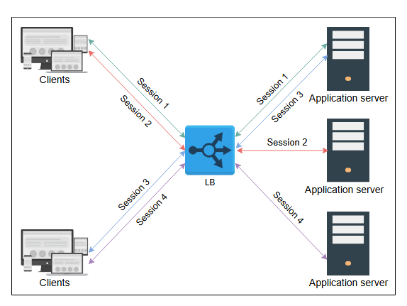
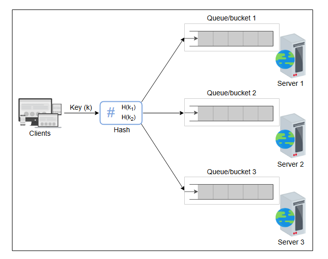
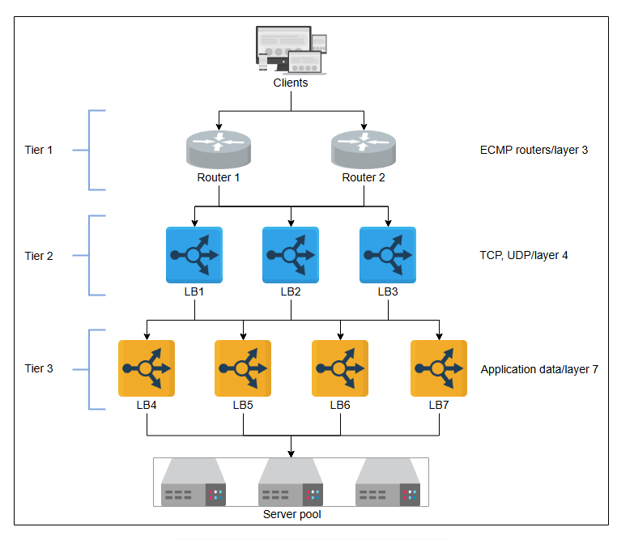
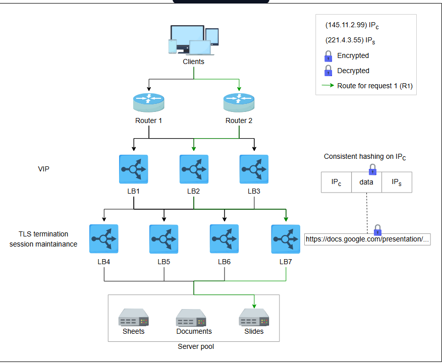
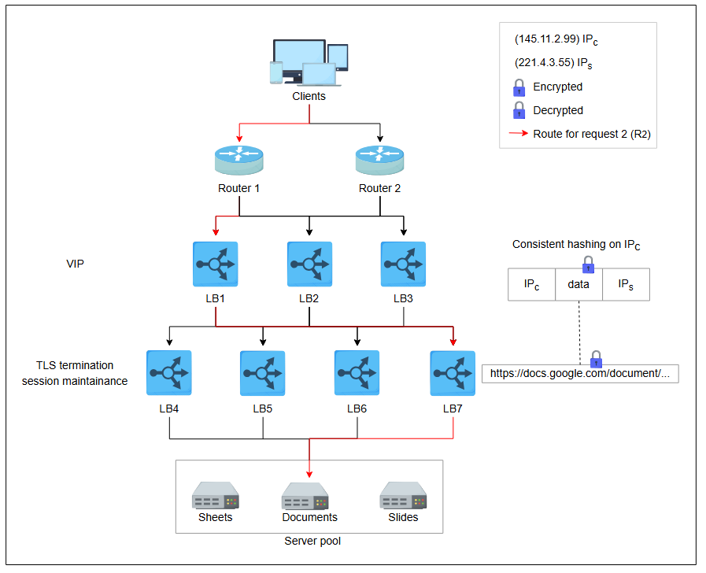
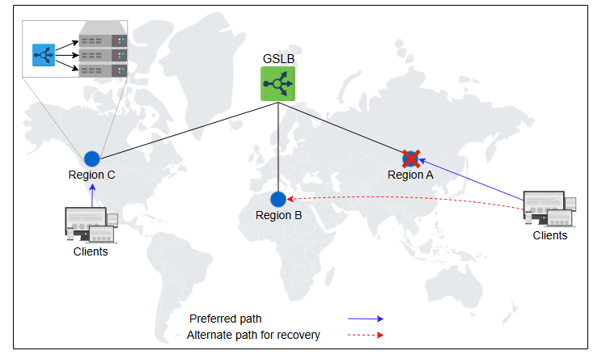

**Продвинутые детали балансировщиков нагрузки**

Понимание балансировщиков нагрузки и их использования в системе.

Этот урок будет посвящен некоторым из хорошо известных алгоритмов, используемых в локальных балансировщиках нагрузки. Мы также разберемся,
как балансировщики нагрузки соединяются для формирования иерархии, распределяя работу между различными уровнями балансировщиков.

**Алгоритмы балансировщиков нагрузки**

Балансировщики нагрузки распределяют клиентские запросы в соответствии с определенным алгоритмом. Ниже приведены некоторые из наиболее
известных алгоритмов:

* **Циклическое планирование (Round-robin):** В этом алгоритме каждый запрос последовательно перенаправляется на следующий сервер в пуле в
  циклическом порядке.
* **Взвешенный циклический перебор (Weighted round-robin):** Если некоторые серверы обладают большей мощностью для обслуживания клиентских
  запросов, предпочтительнее использовать взвешенный алгоритм. В этом алгоритме каждому узлу присваивается "вес". Балансировщики нагрузки
  перенаправляют клиентские запросы в соответствии с весом узла. Чем выше вес, тем больше запросов будет направлено на этот узел.
* **Наименьшее количество соединений (Least connections):** В некоторых случаях, даже если все серверы имеют одинаковую производительность,
  нагрузка на них все равно может быть неравномерной. Например, обработка запроса от некоторых клиентов может занимать больше времени. Или
  некоторые клиенты могут делать последующие запросы в рамках одного и того же соединения. В этом случае мы можем использовать алгоритмы,
  такие как "наименьшее количество соединений", где новые входящие запросы назначаются серверам с наименьшим числом существующих соединений.
  Для этого балансировщики нагрузки хранят информацию о количестве и сопоставлении существующих соединений. Мы обсудим поддержание
  состояния (state) позже в этом уроке.
* **Наименьшее время отклика (Least response time):** В сервисах, чувствительных к производительности, требуются такие алгоритмы, как "
  наименьшее время отклика". Этот алгоритм гарантирует, что для обслуживания клиентов будет выбран сервер с наименьшим временем отклика.
* **IP-хэш:** Некоторые приложения предоставляют разный уровень обслуживания пользователям в зависимости от их IP-адресов. В этом случае для
  назначения запросов пользователей серверам выполняется хэширование IP-адреса.
* **URL-хэш:** Возможно, что некоторые услуги в рамках приложения предоставляются только определенными серверами. В этом случае клиент,
  запрашивающий сервис по определенному URL, направляется на определенный кластер или набор серверов. В таких сценариях используется
  алгоритм хэширования URL.

Существуют и другие алгоритмы, например, случайный (randomized) или взвешенный алгоритм наименьшего количества соединений (weighted least
connections).

**Статические и динамические алгоритмы**

Алгоритмы могут быть статическими или динамическими в зависимости от того, учитывают ли они состояние машины. Давайте рассмотрим каждую из
этих категорий:

**Статические алгоритмы** не учитывают изменяющееся состояние серверов. Поэтому назначение задач выполняется на основе имеющихся знаний о
конфигурации сервера. Естественно, эти алгоритмы несложны и реализуются в одном маршрутизаторе или на обычном оборудовании, куда поступают
все запросы.

**Динамические алгоритмы** — это алгоритмы, которые учитывают текущее или недавнее состояние серверов. Динамические алгоритмы поддерживают
состояние путем обмена данными с сервером, что добавляет накладные расходы на коммуникацию. Поддержание состояния значительно усложняет
разработку алгоритма.

Динамические алгоритмы требуют, чтобы разные серверы балансировки нагрузки обменивались информацией друг с другом. Поэтому динамические
алгоритмы могут быть модульными, так как ни одна сущность не принимает решение в одиночку. Хотя это усложняет динамические алгоритмы, это
приводит к улучшению решений о перенаправлении. Наконец, динамические алгоритмы отслеживают работоспособность серверов и направляют запросы
только на активные серверы.

**Примечание:** На практике динамические алгоритмы дают гораздо лучшие результаты, поскольку они поддерживают состояние обслуживающих хостов
и, следовательно, стоят затраченных усилий и сложности.

**Stateful и Stateless балансировщики нагрузки**

В то время как статические и динамические алгоритмы должны учитывать работоспособность хостинговых серверов, состояние (state) также
поддерживается для хранения информации о сессиях различных клиентов с этими серверами.

Если информация о сессии не хранится на более низком уровне (например, в распределенном кэше или базе данных), для ее хранения используются
балансировщики нагрузки. Ниже мы описываем два способа управления сессиями через балансировщики:

* **Stateful (с сохранением состояния)**
* **Stateless (без сохранения состояния)**

**Балансировка нагрузки с сохранением состояния (Stateful)**

Как следует из названия, stateful-балансировка включает в себя поддержание состояния сессий, установленных между клиентами и хостинговыми
серверами. Stateful-балансировщик учитывает информацию о состоянии в своем алгоритме для выполнения балансировки.

По сути, stateful-балансировщики хранят структуру данных, которая сопоставляет входящих клиентов с хостинговыми серверами.
Stateful-балансировщики увеличивают сложность и ограничивают масштабируемость, поскольку информация о сессиях всех клиентов поддерживается
на всех балансировщиках нагрузки. То есть балансировщики обмениваются информацией о состоянии друг с другом для принятия решений о
перенаправлении.

*Балансировка нагрузки с сохранением состояния*

**Балансировка нагрузки без сохранения состояния (Stateless)**

Stateless-балансировка не хранит состояние и, следовательно, является более быстрой и легковесной. Stateless-балансировщики используют
консистентное хэширование для принятия решений о перенаправлении. Однако, если инфраструктура меняется (например, добавляется новый сервер
приложений), stateless-балансировщики могут быть не такими отказоустойчивыми, как stateful, поскольку одного лишь консистентного хэширования
недостаточно для маршрутизации запроса на правильный сервер приложений. Поэтому может потребоваться локальное состояние в дополнение к
консистентному хэшированию.

*Stateless-балансировщики, использующие хэш-сегменты (hash buckets) для сопоставления запросов с конечными
серверами*

Таким образом, состояние, поддерживаемое *между* различными балансировщиками нагрузки, считается **stateful** (с сохранением состояния). В
то время как состояние, поддерживаемое *внутри* одного балансировщика нагрузки для внутреннего использования, считается **stateless** (без
сохранения состояния).

*Ознакомившись с балансировщиками нагрузки, представьте себе сценарий, в котором вы развертываете веб-сайт, предоставляющий статический
контент, такой как текст и изображения. Вы бы выбрали stateful или stateless балансировщик нагрузки и почему?*

      
Скрыть ответ

    Для статического контента лучше использовать Stateless балансировщик, так как он не нуждается в отслеживании сессий. Это действительно делает систему проще, быстрее и легче масштабируемой.
    Это особенно важно для сайтов с большим количеством однородных запросов, где каждый запрос можно обрабатывать независимо.

**Типы балансировщиков нагрузки**
В зависимости от требований, балансировка нагрузки может выполняться на сетевом/транспортном и прикладном уровнях модели взаимодействия
открытых систем (OSI).

* **Балансировщики нагрузки 4-го уровня (Layer 4):** L4-балансировка выполняется на основе транспортных протоколов, таких как TCP и UDP. Эти
  типы балансировщиков поддерживают соединение/сессию с клиентами и гарантируют, что все пакеты в рамках одной и той же (TCP/UDP)
  коммуникации направляются на один и тот же бэкенд-сервер. Хотя терминирование TLS обычно выполняется на балансировщиках 7-го уровня,
  некоторые балансировщики 4-го уровня также его поддерживают.
* **Балансировщики нагрузки 7-го уровня (Layer 7):** L7-балансировщики работают на основе данных протоколов прикладного уровня. Они могут
  принимать решения о перенаправлении, основываясь на данных приложения, таких как HTTP-заголовки, URL, cookie и другие специфичные для
  приложения данные, например, ID пользователя. Помимо терминирования TLS, эти балансировщики могут брать на себя такие задачи, как
  ограничение скорости запросов от пользователей (rate limiting), HTTP-маршрутизация и перезапись заголовков.

**Примечание:** Балансировщики 7-го уровня более "умные" в плане анализа данных. Однако балансировщики 4-го уровня быстрее в плане
обработки.

**Развертывание балансировщиков нагрузки**
Ф
Мы обсудили компромиссы балансировки нагрузки на разных уровнях OSI. Однако на практике одного уровня балансировки недостаточно для большого
дата-центра. Фактически, несколько уровней балансировщиков координируют свою работу для принятия обоснованных решений о перенаправлении.
Традиционный дата-центр может иметь трехуровневую систему балансировки, как показано ниже:

*Трехуровневый балансировщик нагрузки в типичном дата-центре*

**Балансировщики нагрузки 0-го и 1-го уровней (Tier-0 и Tier-1)**
Если DNS можно считать балансировщиком 0-го уровня, то маршрутизаторы ECMP (Equal-Cost Multi-Path) являются балансировщиками 1-го уровня. Из
названия ECMP очевидно, что этот уровень распределяет входящий трафик на основе IP или другого алгоритма, такого как round-robin или
weighted round-robin. Балансировщики 1-го уровня распределяют нагрузку по разным путям к более высоким уровням балансировщиков.

Маршрутизаторы ECMP играют жизненно важную роль в горизонтальной масштабируемости балансировщиков более высоких уровней.

**Балансировщики нагрузки 2-го уровня (Tier-2)**
Второй уровень балансировщиков включает в себя балансировщики 4-го уровня OSI. Балансировщики 2-го уровня гарантируют, что для любого
соединения
все входящие пакеты будут перенаправлены на один и тот же балансировщик 3-го уровня. Для достижения этой цели может использоваться такая
техника, как консистентное хэширование. Но в случае изменений в инфраструктуре одного консистентного хэширования может быть недостаточно.
Поэтому необходимо поддерживать локальное или глобальное состояние, как мы увидим в следующих разделах урока.

Балансировщики 2-го уровня можно считать "связующим звеном" между балансировщиками 1-го и 3-го уровней. Исключение балансировщиков 2-го
уровня может привести к ошибочным решениям о перенаправлении в случае сбоев или динамического масштабирования балансировщиков.

**Балансировщики нагрузки 3-го уровня (Tier-3)**
Балансировщики 7-го уровня OSI предоставляют услуги на 3-м уровне. Поскольку эти балансировщики находятся в прямом контакте с
бэкенд-серверами,
они выполняют проверку их работоспособности на уровне HTTP. Этот уровень обеспечивает масштабируемость, равномерно распределяя запросы между
набором работоспособных бэкенд-серверов, и обеспечивает высокую доступность, напрямую отслеживая состояние серверов. Этот уровень также
снижает нагрузку на конечные серверы, обрабатывая низкоуровневые детали, такие как протоколы контроля перегрузки TCP, обнаружение Path MTU (
максимальной единицы передачи), различия в протоколе приложения между клиентом и бэкенд-серверами и так далее. Идея заключается в том, чтобы
оставить вычисления и предоставление данных серверам приложений, а для тривиальных задач эффективно использовать стандартные машины для
балансировки нагрузки. В некоторых случаях балансировщики 7-го уровня находятся на том же уровне, что и хосты сервисов.

Подводя итог, 1-й уровень балансирует нагрузку между самими балансировщиками. 2-й уровень обеспечивает плавный переход с 1-го на 3-й уровень
в случае сбоев, тогда как 3-й уровень выполняет фактическую балансировку нагрузки между бэкенд-серверами. Каждый уровень выполняет и другие
задачи для снижения нагрузки на конечные серверы.

**Практический пример**
Давайте рассмотрим пример, где запросы от клиента поступают и перенаправляются на разные серверы приложений на основе данных приложения
внутри сетевых пакетов клиента.

*Запрос R1 маршрутизируется на сервер со слайдами*

Давайте рассмотрим иллюстрацию выше по шагам:

1. **R₁** обозначает запрос 1, поступающий через один из ECMP-маршрутизаторов (балансировщики 1-го уровня).
2. ECMP-маршрутизаторы перенаправляют **R₁** на любой из трех доступных балансировщиков 2-го уровня с помощью алгоритма round-robin.
   Балансировщик 2-го уровня вычисляет хэш от IP-адреса источника (**IPs**) и перенаправляет пакет на следующий уровень балансировщиков.
3. 3-й уровень, получив пакет, снимает с него нагрузку по обработке TLS и читает данные HTTP(S). Проанализировав запрошенный URL, он
   перенаправляет запрос на сервер, обрабатывающий запросы для слайдов.
4. **R₂** проходит тот же путь, но попадает на другой конечный сервер, поскольку запрошенный URL содержит "document" вместо "slides".
   Балансировщики 3-го уровня предварительно сконфигурированы для перенаправления запросов на серверы приложений на основе данных
   приложения. Например, типичный сервер HAProxy может иметь следующую конфигурацию на 3-м уровне:

**Квиз**

1. После того как запрос достиг бэкенд-сервера, должен ли ответ маршрутизироваться обратно через каждый уровень балансировщиков нагрузки?

      
Ответ

    Нет, сервер может отправлять ответ непосредственно маршрутизаторам (LBs уровня 1) через LBs уровня 3, которые могут перенаправлять ответ из центра обработки данных. Такой ответ называется прямой маршрутизацией (DR) или прямым возвратом сервера (DSR).
    DR/DSR обычно используется для трафика, отличного от HTTPS, поскольку при завершении работы по протоколу TLS ответы должны быть зашифрованы до того, как они дойдут до клиента, что требует их обратной передачи через балансировщик нагрузки уровня 7 для шифрования.

2. Почему серверы напрямую не отправляют ответ на маршрутизаторы (LBs уровня 1) вместо LBs уровня 3?

      
Ответ

    LBS уровня 3 поддерживает определенное состояние соединения — например, шифрование/дешифрование по протоколу SSL. Это необходимо для обеспечения бесперебойной работы клиентов.

3.  По вашему мнению, какой уровень LBs более подвержен ошибкам?

      
Ответ

    Уровень 3 имеет большую сложность, что делает его более подверженным ошибкам.

4. На рисунке выше показано большее количество балансировщиков нагрузки уровня 3, чем на уровне 2. Как вы думаете, в чем причина такого представления?

      
Ответ

    Уровень 3 выполняет анализ конкретных приложений и значительно более сложные вычисления. Таким образом, для обработки того же количества запросов, что и уровень 2, требуется большее количество компьютеров. Кроме того, LBs уровня 3 поддерживают состояние большого количества серверов приложений, что может быть невозможно при использовании того же количества LBs уровня 2.

---

**Реализация балансировщиков нагрузки**

В зависимости от количества входящих запросов, организации и специфических требований приложения могут быть реализованы различные виды
балансировщиков нагрузки:

**Аппаратные балансировщики нагрузки**

Балансировщики нагрузки появились в 1990-х годах как аппаратные устройства. Аппаратные балансировщики работают как автономные устройства и
довольно дороги. Тем не менее, у них есть преимущества в производительности, и они способны обрабатывать большое количество одновременных
пользователей. Конфигурация аппаратных решений проблематична, так как требует дополнительных человеческих ресурсов. Поэтому они не являются
предпочтительным решением даже для крупных предприятий, которые могут себе их позволить. Доступность может быть проблемой для аппаратных
балансировщиков, поскольку для переключения в случае сбоев потребуется дополнительное оборудование. Наконец, аппаратные балансировщики могут
иметь более высокие затраты на обслуживание/эксплуатацию и проблемы совместимости, что делает их менее гибкими. Не говоря уже о том, что
аппаратные балансировщики также имеют привязку к поставщику (vendor lock).

**Программные балансировщики нагрузки**

Программные балансировщики нагрузки становятся все более популярными благодаря своей гибкости, программируемости и экономической
эффективности. Все это возможно потому, что они реализуются на стандартном (commodity) оборудовании. Программные балансировщики хорошо
масштабируются по мере роста требований. Доступность не будет проблемой для программных балансировщиков, поскольку для реализации
резервных (shadow) балансировщиков на стандартном оборудовании требуются небольшие дополнительные затраты. Кроме того, программные
балансировщики могут предоставлять предиктивный анализ, который может помочь подготовиться к будущим паттернам трафика.

**Облачные балансировщики нагрузки**

С развитием облачных вычислений появились "Балансировщики нагрузки как услуга" (LBaaS). В этом случае владельцы облаков предоставляют услуги
по балансировке нагрузки. Пользователи платят в соответствии с их использованием или соглашением об уровне обслуживания (SLA) с облачным
провайдером. Облачные балансировщики не обязательно заменяют локальную (on-premise) инфраструктуру балансировки нагрузки, но они могут
выполнять глобальное управление трафиком между различными зонами. Основные преимущества таких балансировщиков включают простоту
использования, управления, оплату по мере использования, гибкость в плане использования, аудит и услуги мониторинга для улучшения
бизнес-решений. Пример того, как облачные балансировщики могут обеспечивать GSLB, приведен ниже:

*GSLB предоставляется через LBaaS, а регионы содержат дата-центры, которые являются собственностью поставщиков приложений*

**Примечание:** Еще одна интересная реализация балансировщиков нагрузки — это балансировка на стороне клиента (client-side load balancing).
Балансировка на стороне клиента подходит там, где существует множество сервисов, каждый из которых имеет много экземпляров (например,
балансировка нагрузки в Twitter). Однако наше внимание сосредоточено на традиционных балансировщиках нагрузки, поскольку большинство
трехуровневых приложений используют их в своей архитектуре.

**Заключение**
Балансировщики нагрузки прошли долгий путь от своего появления в виде аппаратных устройств до превращения в услугу, предлагаемую в облаке.
Они являются ключевым компонентом любого сервиса корпоративного уровня. Горизонтальная масштабируемость хостинговых серверов всегда будет
требовать хорошего уровня балансировки, способного обеспечивать распределение нагрузки, поддержание сессий, снятие нагрузки по обработке
TLS, обнаружение сервисов и многое другое.

---
*В этой главе мы рассмотрели различные функции балансировки нагрузки. В дополнение к разным ролям, балансировщики нагрузки часто отвечают за
смягчение распределенных атак типа «отказ в обслуживании» (DDoS). Как они могут различать легитимный и вредоносный трафик во время таких
инцидентов?*

    
Скрыть ответ

        Во время DDoS-атаки средства балансировки нагрузки различают законный и вредоносный трафик с помощью нескольких методов:

Они анализируют структуру трафика на предмет аномалий, таких как внезапные всплески или необычное поведение запросов.
        
Они реализуют ограничение скорости, чтобы ограничить количество запросов из одного источника.

Они используют протоколы реагирования на запросы, такие как CAPTCHA, для проверки пользователей-людей.

Они используют информацию об угрозах, чтобы блокировать трафик с известных вредоносных IP-адресов или регионов.
        
Они используют поведенческую аналитику и модели машинного обучения для выявления шаблонов атак.
        
Стоит отметить, что злоумышленники могут использовать подмену IP-адресов, прокси-серверы или ботнеты, чтобы избежать обнаружения по IP-адресу, поэтому сочетание этих методов обеспечивает более надежную защиту. Продолжайте изучать!

